# Red-black 트리의 등장 배경

이진 트리의 개념은 컴퓨터 과학 초기부터 존재했다. 대략 1950년 후반에서 1960년대 초반에 걸쳐 널리 연구되기 시작했다.

클래식 이진 트리는 균형 상태일 때에는 O(logN)의 시간 복잡도를 가지지만, 노드의 삽입과 삭제가 빈번할 때 최악의 경우 리스트 형태가 되어서 O(N)의 시간 복잡도를 가지게 된다는 문제점이 있었다.

이진 트리의 이러한 문제를 해결하고자 노드의 삽입과 삭제가 빈번한 상황에서도 균형 잡힌 트리 구조를 유지할 수 있는 균형 이진 트리(Balanced Binary Search Tree)가 등장하게 되었다.

균형 이진 트리의 대표적인 예시

- AVL 트리

[AED2-10-avl-paper.pdf](attachment:53c403b7-1d40-4807-aebc-c08e11b432de:AED2-10-avl-paper.pdf)

- Red-black 트리

[guibas1978.pdf](attachment:5fc41b23-7f4e-4d5a-8427-615b2affd868:guibas1978.pdf)

이진 트리의 시간 복잡도 문제를 개선하기 위해 AVL 트리가 등장하였고, AVL 트리의 단점을 개선하기 위해 Red-black 트리가 고안되었다.

---

# AVL(Adelson-Velsky, Landis) 트리

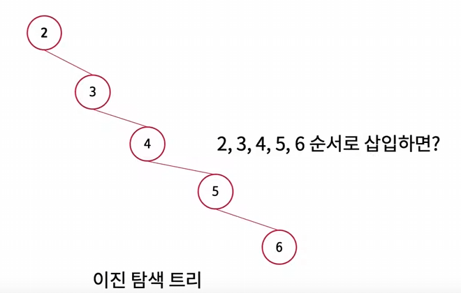

그림 1. 이진 탐색 트리 최악의 경우 예시

AVL 트리는 이진 탐색 트리가 최악의 경우 O(N)의 시간 복잡도를 가지게 되는 문제를 해결하기 위해 등장하였다.

예를 들어, 이진 탐색 트리는 2, 3, 4, 5, 6 순서로 삽입하면 위 그림처럼 일직선의 리스트 같은 형태가 된다.

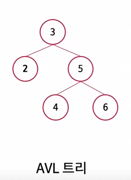

그림 2. AVL 트리 예시

하지만 AVL 트리는 2, 3, 4, 5, 6 순서로 삽입하면 위와 같이 높이가 2인 트리 형태가 되어 O(logN)의 시간 복잡도를 가지게 된다.

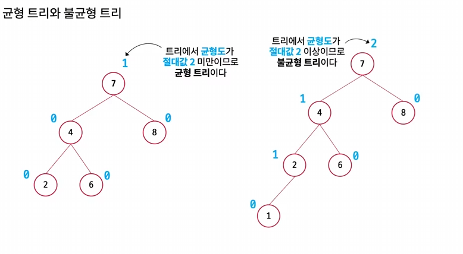

그림 3. AVL 트리 구조. 균형 트리(좌), 불균형 트리(우)

AVL 트리는 균형도(Balance Factor)를 통해 삽입과 삭제 시 트리의 균형을 맞춘다.

트리의 각 노드가 균형도를 가지며, 이 균형도의 절대값이 모두 2 미만이면 균형 트리, 2 이상이면 불균형 트리 구조라 정의한다.

AVL 트리는 균형도의 절대값이 2 이상인 노드가 있으면 해당 노드를 중심으로 회전 연산(rotation)을 수행하여 트리의 균형을 맞춘다.

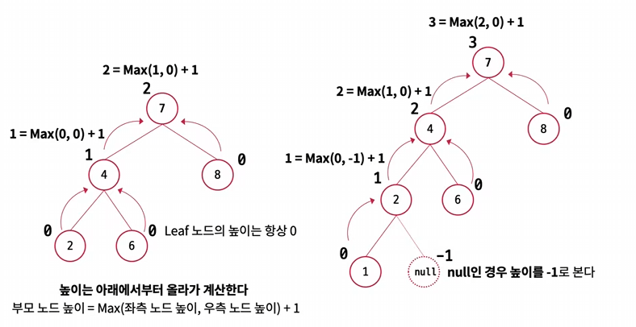

그림 4. AVL 트리 높이 계산 예시

AVL 트리에서 각 노드의 균형도를 계산하기 위해서는 먼저 노드의 높이를 계산해야 한다.

각 노드의 높이는 Leaf 노드의 높이는 0, null은 -1로 간주하고, 부모 노드는 왼쪽 자식 노드와 오른쪽 자식 노드의 높이 중 큰 값 + 1로 계산한다.

$$
부모 노드 높이 = max(좌측 자식 노드 높이, 우측 자식 노드 높이) + 1
$$

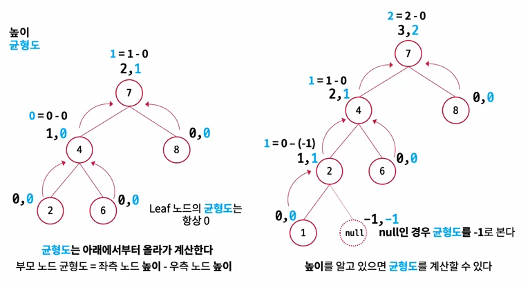

그림 5. AVL 트리 균형도 계산 예시

각 노드의 균형도는 AVL 트리에서 각 노드의 균형 상태를 나타내는 지표가 된다. Leaf 노드의 균형도는 0, null은 -1로 간주한다. 부모 노드의 균형도는 ‘좌측 노드 높이 - 우측 노드 높이’로 계산된다.

$$
부모 노드 균형도 = 좌측 노드 높이 - 우측 노드 높이
$$

계산 결과가 양수면 좌측 자식 방향으로, 음수면 우측 자식 방향으로 트리가 기울어져 있음을 나타낸다.

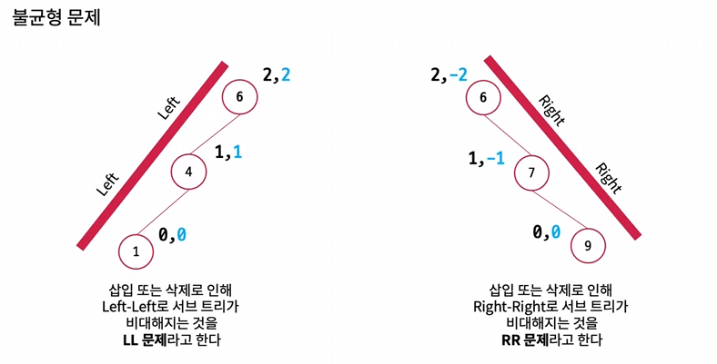

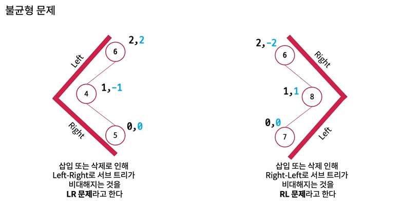

그림 6. AVL 트리 불균형 상태 종류

AVL 트리에서 불균형 상태는 총 4종류가 있다.

1. LL 문제 : 현재 노드의 균형도가 2 이상의 양수이고(왼쪽으로 기울어짐), 자식 노드의 균형도도 양수인 상태(왼쪽으로 기울어짐)
2. RR 문제 : 현재 노드의 균형도가 -2 이하의 음수이고(오른쪽으로 기울어짐), 자식 노드의 균형도도 음수인 상태(오른쪽으로 기울어짐)
3. LR 문제 : 현재 노드의 균형도가 2 이상의 양수이고(왼쪽으로 기울어짐), 자식 노드의 균형도는 음수인 상태(오른쪽으로 기울어짐)
4. RL 문제 : 현재 노드의 균형도가 -2 이하의 음수이고(오른쪽으로 기울어짐), 자식 노드의 균형도는 양수인 상태(왼쪽으로 기울어짐)

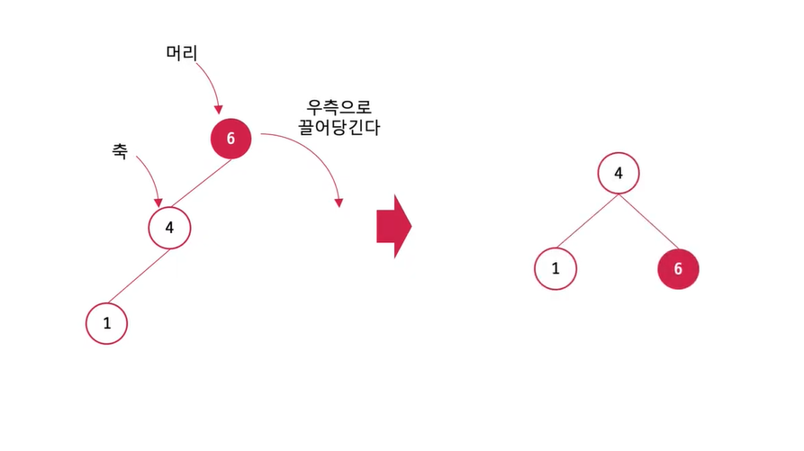

그림 7. AVL 트리 불균형 문제 해결 방법

AVL 트리는 불균형 문제를 해결하기 위해서 회전(Rotation)을 사용한다. 회전이란 자식 노드를 기준으로 부모 노드를 기울어진 방향의 반대 방향으로 회전시키는 것을 의미한다.

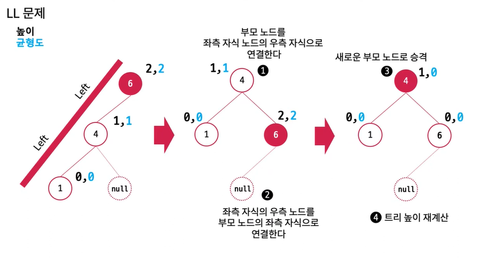

그림 8. AVL 트리 불균형 문제 예시 (LL 문제)

예를 들어, 만약 좌측으로 기울어져 있다면 부모 노드를 자식 노드의 우측 자식 노드로 만들고, 기존의 자식 노드를 부모 노드로 만들어 버린다. 즉, 부모 노드를 우측(시계 방향)으로 회전시킨다.

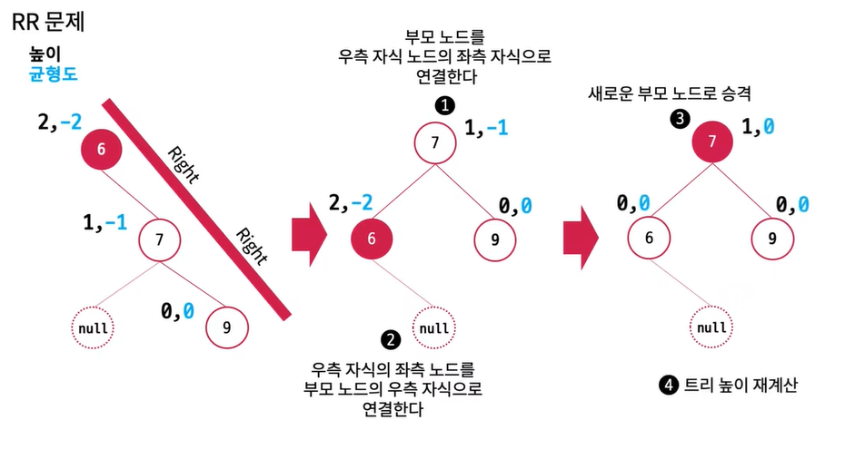

그림 9. AVL 트리 불균형 문제 예시 (RR 문제)

반대로 우측으로 기울어져 있다면 부모 노드를 자식 노드의 좌측 자식 노드로 만들고, 기존의 자식 노드를 부모 노드로 만들어 버린다. 즉, 부모 노드를 좌측(반시계 방향)으로 회전시킨다.

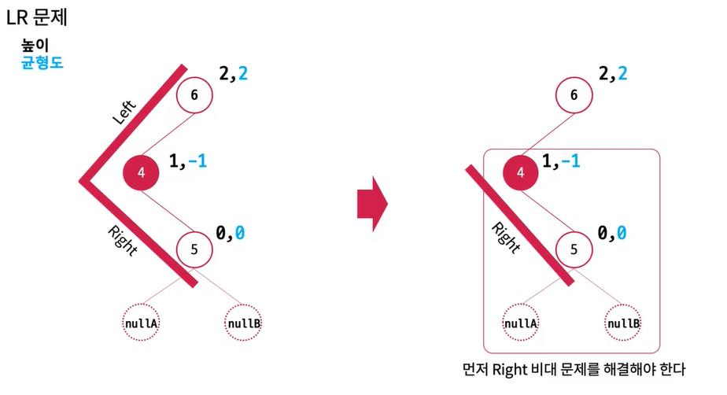

그림 10. AVL 트리 불균형 문제 예시 (LR 문제)

LR 문제와 RL 문제도 기본 메커니즘은 동일하다.

먼저 밑의 노드를 회전시킨 다음, 위의 노드를 회전시킨다.

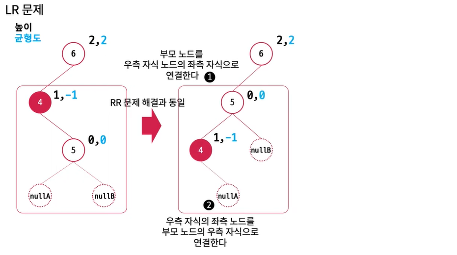
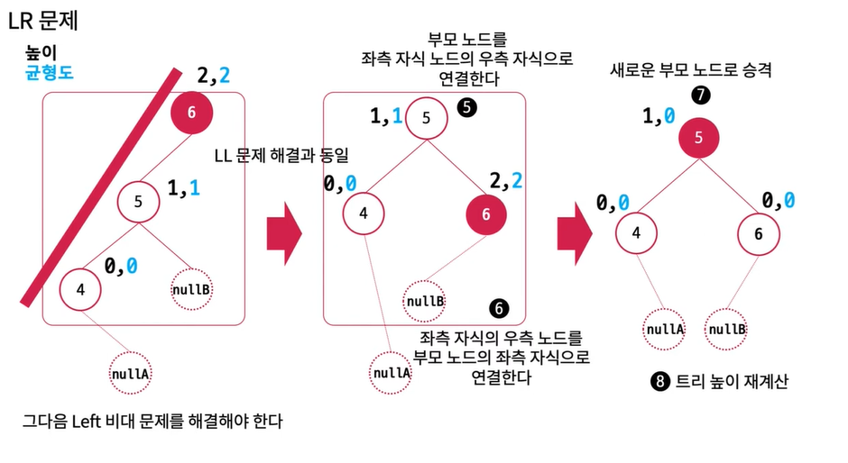

그림 11. AVL 트리 불균형 문제 예시 (LR 문제)

예를 들어, LR 문제의 경우 밑단의 노드를 RR 문제와 동일하게 해결한다.

그 다음, 윗단의 노드를 LL 문제와 동일하게 해결한다.

RL 문제도 동일한 메커니즘으로 해결한다.

---

# Red-black 트리

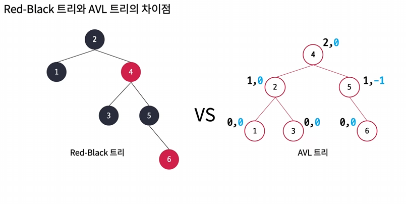

그림 12. Red-Black 트리와 AVL 트리

AVL 트리는 균형도를 통해 노드의 삽입과 삭제가 빈번한 경우에도 균형 트리 형태를 유지하여 노드 탐색 시 항상 O(logN)의 시간 복잡도를 가질 수 있게 만들어졌다.

하지만 AVL 트리의 경우 트리의 높이가 높아질수록 복잡성과 오버헤드가 기하급수적으로 증가한다는 문제점이 있다.

이 문제를 해결하고자 AVL 트리의 균형 유지 조건을 완화하고 노드의 삽입과 삭제 시 더 적은 회전 작업을 수행하는 Red-black 트리가 제안되었다.

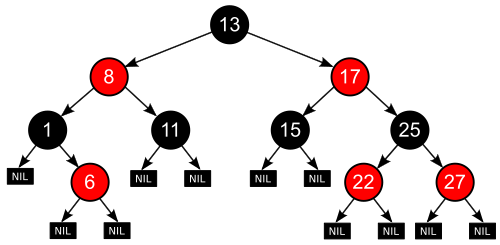

그림 12. Red-black 트리

Red-black 트리는 모든 노드를 빨강(Red)와 검정(Black)으로 구분해놓은 균형 이진 트리이다.

## Red-black 트리의 규칙

Red-black 트리는 5가지의 규칙을 가진다.

1. 모든 노드는 red 노드 혹은 black 노드이다.
2. 루트 노드는 항상 black노드여야 한다.
3. 모든 NIL 노드는 black 이다.
4. red 노드의 자식은 black 노드여야 한다. 즉, red 노드는 연속될 수 없다. (black 노드는 연속 가능)
5. 임의의 한 노드에서 NIL 노드로 도달하는 모든 경로의 black 노드의 갯수는 같다.

## Red 노드와 Black 노드

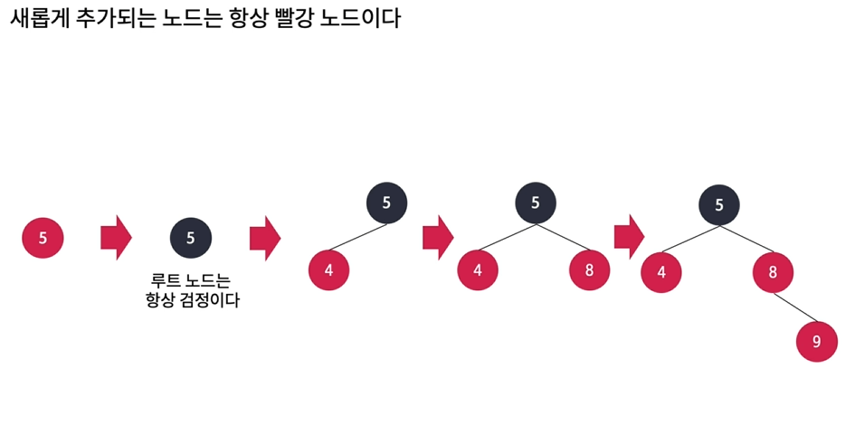

그림 13. Red-black 노드의 삽입

red 노드와 black 노드란 Red-black 트리에서 노드의 Recoloring과 Restructuring 필요성을 판단하기 위해 각 노드에 부여한 속성이다.

새로 추가되는 노드는 기본적으로 red 노드이며, 특정 조건에 따라 black 노드로 변경될 수 있다. 만약 새로 추가된 red 노드가 red-black 트리의 규칙을 위반하지 않는다면, 그대로 red 노드로 유지된다.

## Red-black 트리의 삽입

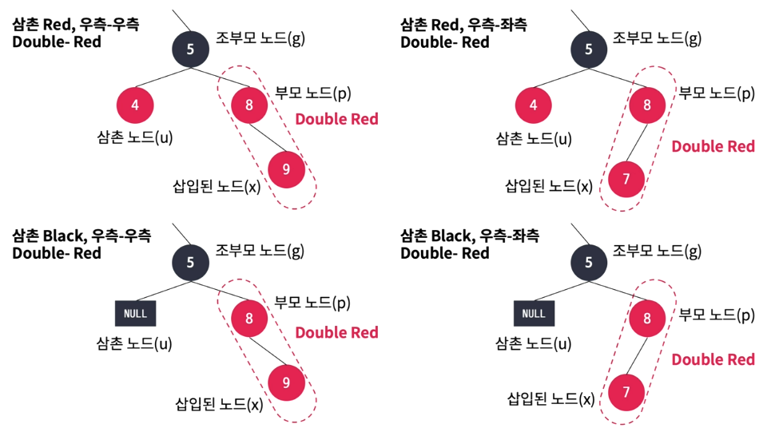

그림 14. Double red 예시

노드를 삽입하다보면 red 노드 밑에 red 노드가 추가되는 등, Red-black 트리의 규칙에 위배되는 상황이 발생할 수 있다.

특히, red 노드의 자식이 red 노드가 되는 double red 가 발생할 수 있는다(4번 조건 위배).

double red 상황은 8가지 상황이 발생할 수 있다.

1. 추가된 노드를 기준으로 삼촌 노드가 red 이고, RR double red 인 경우
2. 추가된 노드를 기준으로 삼촌 노드가 red 이고, RL double red 인 경우
3. 추가된 노드를 기준으로 삼촌 노드가 black 이고, RR double red 인 경우
4. 추가된 노드를 기준으로 삼촌 노드가 black 이고, RL double red 인 경우

그리고 위 경우와 좌우로 대칭일 경우 4가지가 있다.

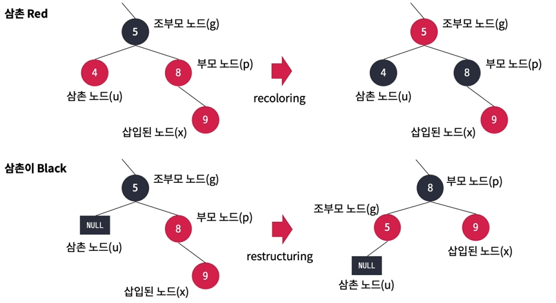

그림 15. Double red 문제 해결 방안

노드를 삽입하고 double red 가 발생했을 경우, 해결 방법은 2가지가 있다.

- Recoloring
- Restructuring

삽입된 노드를 기준으로 삼촌 노드가 red일 경우에는 Recoloring을, black 일 경우에는 Restructuring을 수행한다.

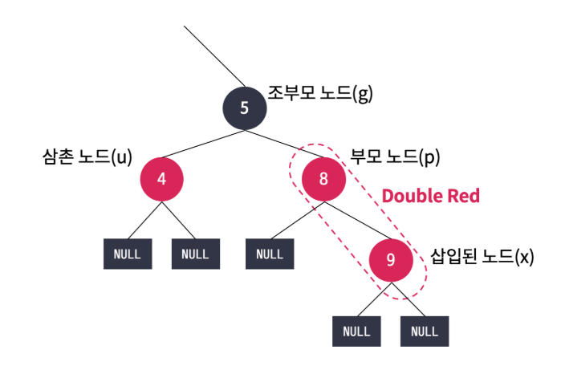

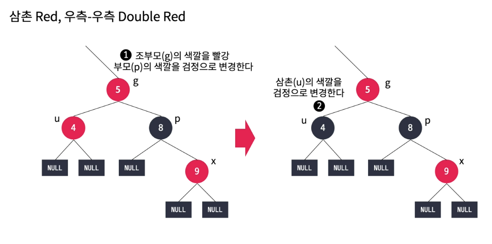

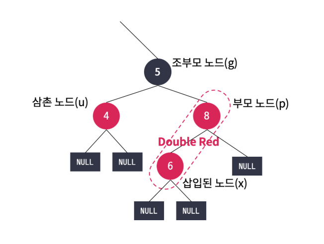

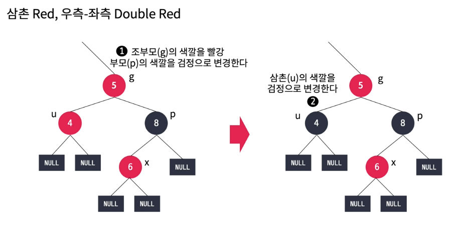

그림 16. Double Red 해결 - Recoloring

double red 가 발생했을 때, 새로 삽입된 노드의 삼촌 노드가 red 노드일 경우에는 recoloring 을 수행한다.

recoloring이란 부모 노드와 삼촌 노드를 black 으로, 조부모 노드를 red 로 재색칠(recoloring)을 해주는 것이다.

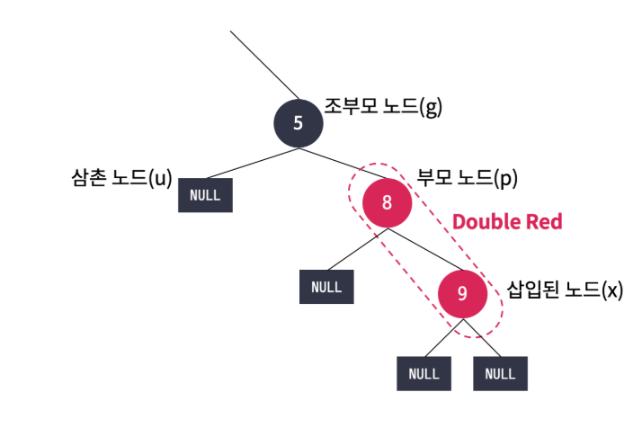

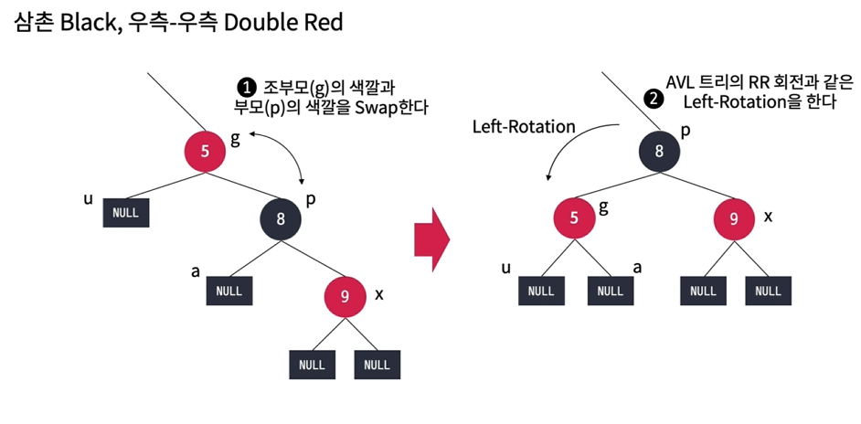

그림 17. Double Red 해결 - Restructuring (RR)

double red가 발생했을 때, 새로 삽입된 노드의 삼촌 노드가 black 노드일 경우에는 Restructuring 을 수행한다.

삼촌 노드가 black 이고 RR double red 일 경우, 먼저 조부모 노드와 부모 노드의 색깔을 스왑한다(5번 노드(black → red), 8번 노드(red→black)).

그리고 AVL 트리의 RR 회전과 동일하게 회전시킨다.

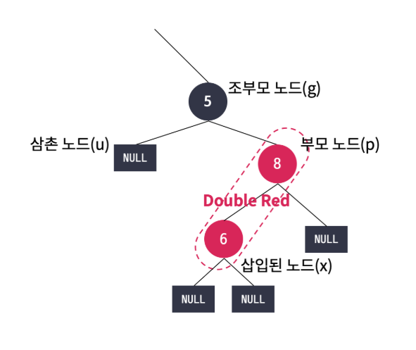

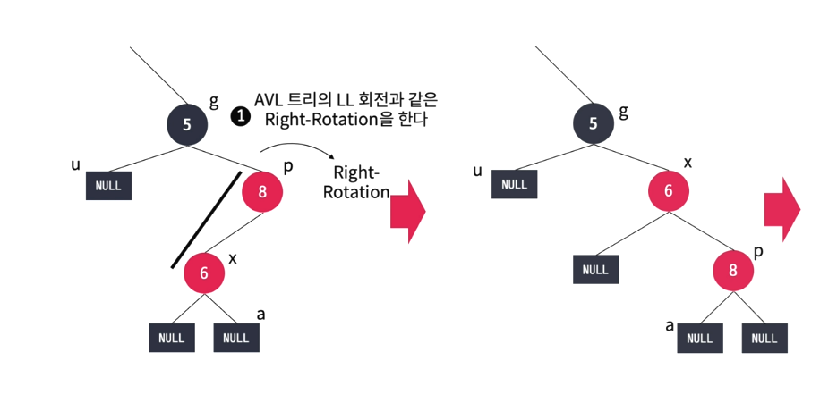

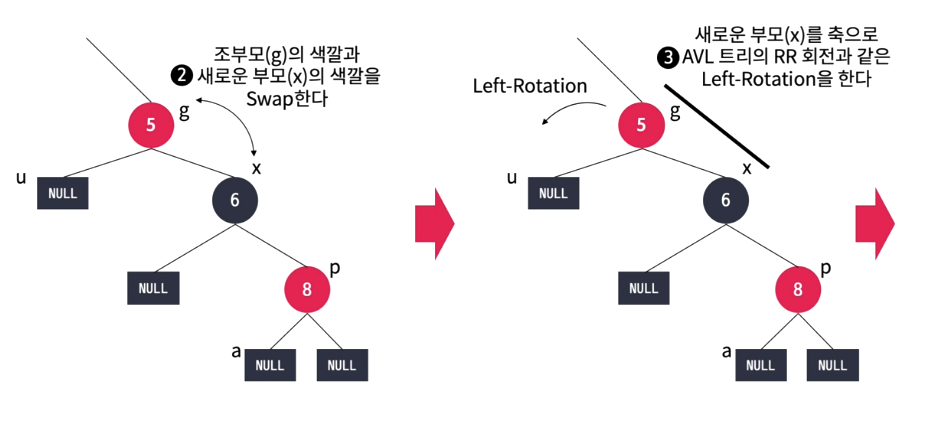

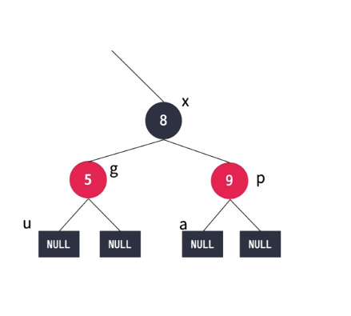

그림 18. Double Red 해결 - Restructuring (RL)

RL일 경우에는 AVL의 RL 문제와 동일하게 2번 회전시켜야 한다.

먼저 새로 삽입된 노드와 부모 노드를 LL 문제일 경우와 동일하게 회전을 시킨다. 그리고 RR과 동일한 연산을 수행한다.

## Red-black 트리의 삭제

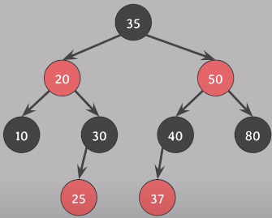

그림 19. Red-black 트리 노드 삭제

Red-black 트리에서 노드가 삭제될 때, 기본 메커니즘은 클래식한 이진 트리와 동일하다.

삭제하려는 노드의 자식 노드가 없거나 1개인 경우에는 삭제할 노드 자신이 실제로 삭제된다. 이 경우, 해당 노드의 자식 노드(있다면)가 삭제된 노드의 위치로 승격된다.

예를 들어, 25가 삭제되면 그냥 25가 삭제되고 끝난다.

40이 삭제된 경우, 37이 40의 자리를 대체한다. 이때 37의 색은 원래 자신의 색인 red를 유지한다.

자식 노드가 없거나 1개인 경우에는 삭제 후에도 트리의 균형이 꺠지지 않을 가능성이 높다. 따라서 자식 노드의 색깔을 변경하지 않고 원래 색깔을 유지함으로써 불필요한 조정 과정을 회피한다.

삭제하려는 노드의 자식 노드가 2개인 경우에는 삭제할 노드의 successor(해당 노드의 우측 트리 중 가장 좌측에 있는 노드. 즉, 삭제할 노드 다음으로 큰 노드)가 삭제할 노드 자리에 위치하게 된다. 이 경우, Successor가 삭제된 노드의 색을 물려받는다.

예를 들어, 20이 삭제되면 25가 그 자리를 물려받는데, 삭제된 노드의 색인 red 를 승계받는다.

50이 삭제된 경우, 80이 그 자리를 물려받고 50의 색인 red를 물려받는다.

자식 노드가 2개인 경우에는 삭제 후 트리의 균형이 깨질 가능성이 높다. 따라서 successor 가 삭제되는 노드의 색깔을 물려받아 색깔을 조정함으로써 트리의 균형을 유지한다.

노드를 삭제할 경우에 삭제되는 노드의 색을 알아야 하는 이유는 삭제 시 Red-Black 트리의 5번 규칙(임의의 한 노드에서 NIL 노드로 도달하는 모든 경로의 black 노드의 갯수는 같다)에 위배될 가능성이 있기 때문이다.

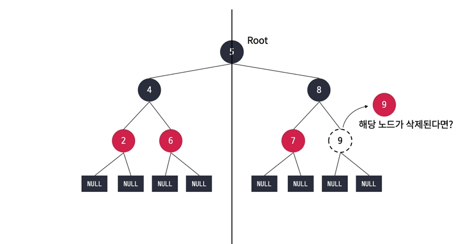

그림 20. Red-black 트리 노드 삭제 (Red 노드의 경우)

삭제하려는 노드가 Red 노드일 경우에는 Red-black 트리의 규칙이 무너지지 않는다. 예를 들어, 9번 노드가 삭제된 경우 8번 노드에서 봤을 때 Nil 노드까지 가는 black 노드의 수는 1개, 5번 노드에서 봤을 때는 2개를 유지한다.

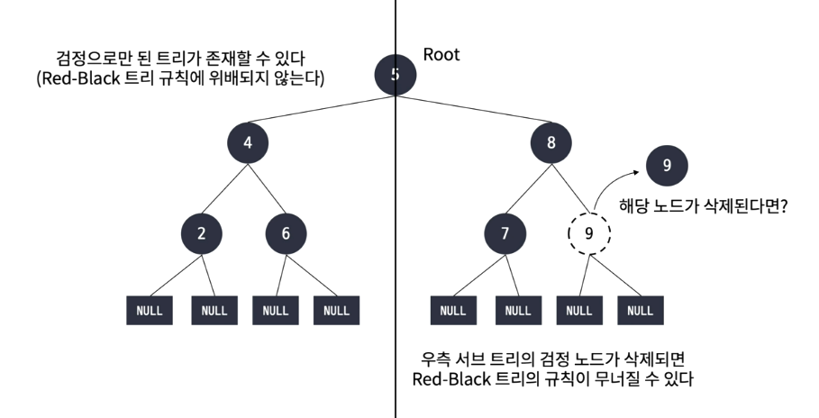

그림 21. Red-black 트리 노드 삭제 (Black 노드의 경우)

하지만 삭제하려는 노드가 black 노드일 경우에는 Red-black 트리의 규칙이 무너질 수 있다. 예를 들어, 9번 노드가 삭제될 경우를 보자. 8번 노드에서 봤을 때 좌측으로는 2개의 black 노드가 있지만 우측으로는 1개의 black 노드(NIL 노드) 밖에 없어. 5번 규칙에 위배되게 된다.

black 노드를 삭제할 경우에는 전체 트리 관점에서 경로상 검정 노드의 개수 불일치 문제가 발생할 수 있기 때문에 재조정을 통해 균형을 다시 맞춰주어야 한다.

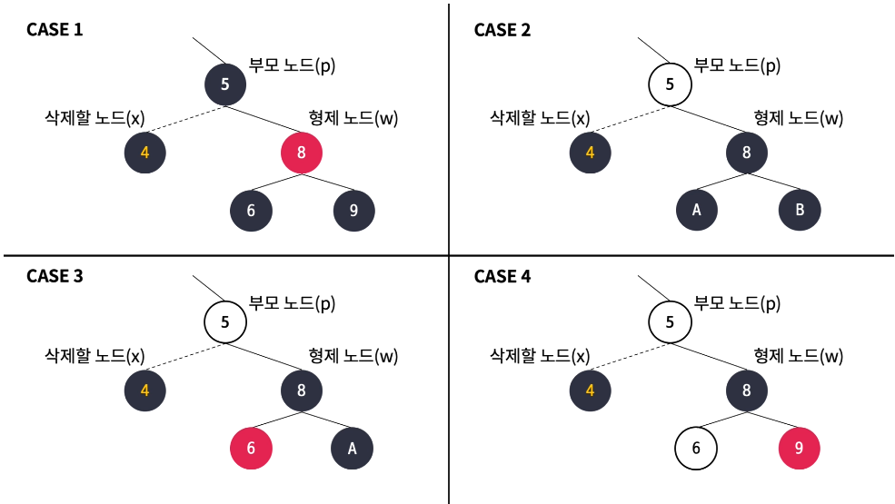

그림 22. black 노드 삭제 시 트리의 상황

black 노드를 삭제할 시 트리의 상황은 위 4가지 경우가 있다.

1. 삭제할 노드의 형제 노드가 red 노드일 경우
2. 삭제할 노드의 형제 노드가 black이고 형제 노드의 자식 노드도 black 인 경우
3. 삭제할 노드의 형제 노드가 black이고 형제 노드의 좌측 자식 노드는 red, 우측 자식 노드는 black 인 경우
4. 삭제할 노드의 형제 노드가 black이고 형제 노드의 우측 자식 노드가 red 일 경우

삭제할 노드가 우측 노드일 경우에는 대칭적으로 진행하면 된다.

black 노드가 삭제되었을 시, 5번 규칙을 지키기 위해서 수행해야 할 재작업 행위는 2가지 이다.

1. 우측 서브 트리의 black 노드 갯수를 줄인다. (2번)
2. 좌측 서브 트리의 black 노드 갯수를 늘린다. (1, 3, 4 번)

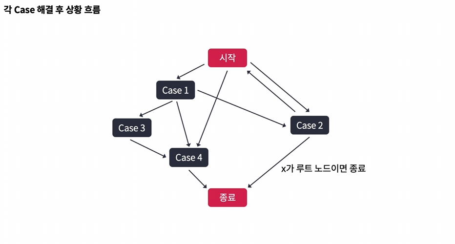

그림 23. 각 case 해결 후 상황 흐름

각 case를 해결하면 위 상황도와 같이 재귀적으로 흐름이 진행될 수 있다.

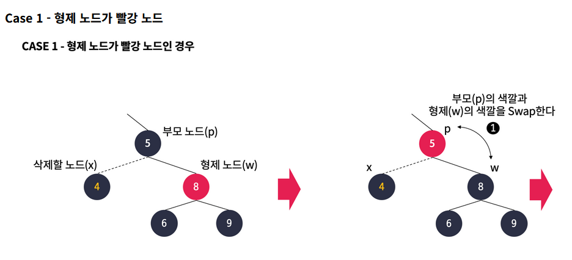

그림 24. Case 1 (1)

삭제할 노드(4번)의 형제 노드(8번)이 red 노드인 경우에는 먼저 부모 노드와 형제 노드의 색깔을 바꾼다.

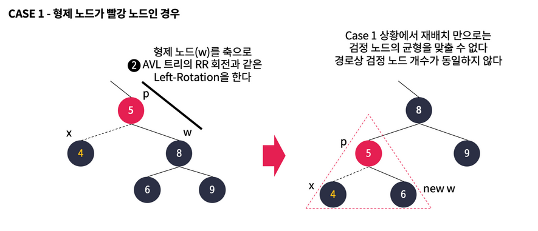

그림 25. Case 1 (2)

형제 노드(8번)을 기준으로 부모 노드를 RR 회전을 진행한다. 현재 그림 상으로는 트리의 균형이 맞지만 여기서 4번 노드를 삭제하면 black 노드의 갯수가 맞지 않게 된다. 즉, 1번 case 연산만으로는 재배치가 종료되지 않는다.

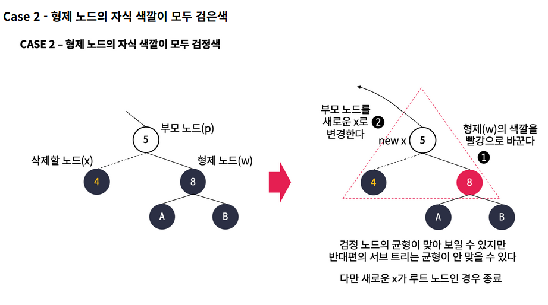

그림 26. Case 2 (1)

형제 노드(8번)의 자식 노드 색깔이 모두 black 인 경우는 NIL 노드 혹은 데이터가 존재하는 black 노드인 경우이다. Case 2 문제에서는 우측 서브 트리의 검정 노드 갯수를 줄이기 위해 형제 노드의 색깔을 red 로 변경한다. 그러나 반대편의 서브 트리는 균형이 안 맞을 수 있으므로 상위 노드로 올라가 다시 Case 1, 2, 3, 4 문제를 해결해야 할 수 있다(해당 상위 노드가 루트 노드인 경우에는 종료된다).

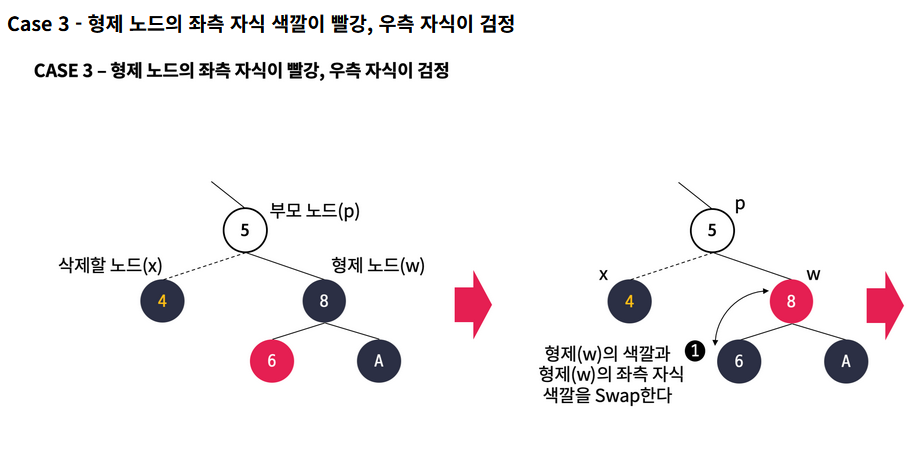

그림 27. Case 3 (1)

3번 경우는 형제 노드의 좌측 자식이 red, 우측 자식이 black 인 경우이다.

먼저 형제의 색과 좌측 자식의 색깔을 교환한다.

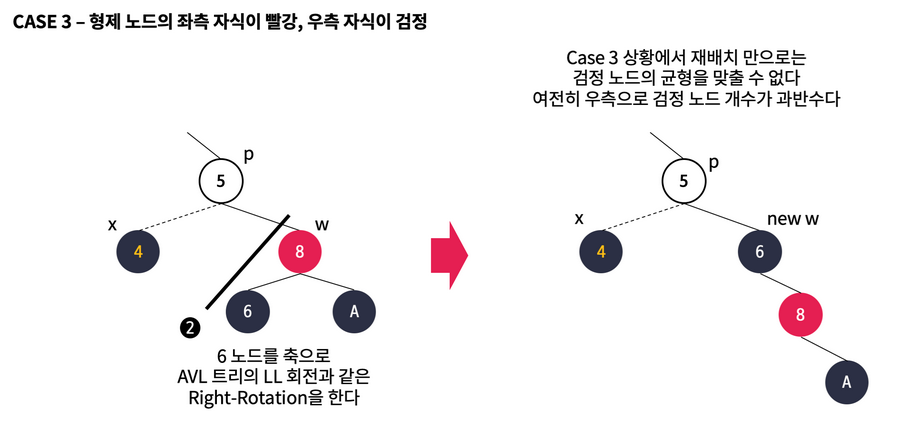

그림 28. Case 3 (2)

그 뒤, 6번 노드를 기준으로 LL 회전을 진행하고 Case 3의 연산을 종료한다.

Case 3의 연산이 종료되면 반드시 Case 4 연산으로 넘어간다.

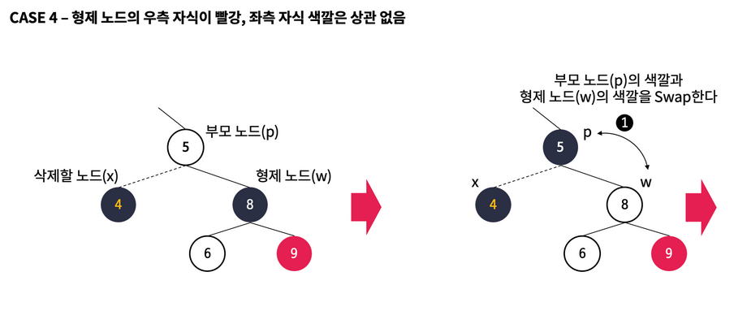

그림 29. Case 4 (1)

4번 경우는 형제 노드의 우측 자식이 red 인 경우이다.

먼저 형제 노드(8번)과 부모 노드(5번)의 색깔을 교환한다.

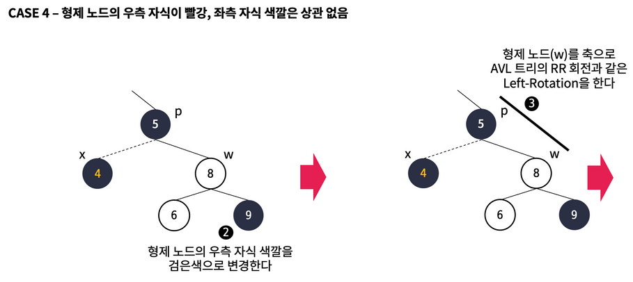

그림 30. Case 4 (2)

그리고 형제 노드의 우측 자식 노드의 색깔을 black 으로 변경하고 RR 회전을 수행한다.

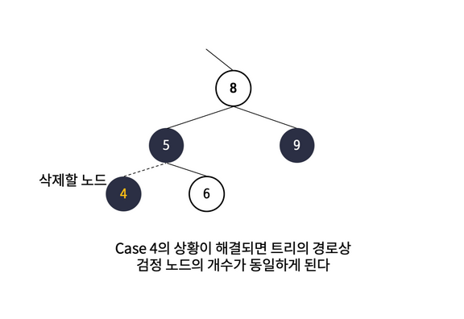
그림 31. Case 4 (3)

Case 4의 상황이 해결되면 트리의 경로상 black 노드의 개수가 동일하게 된다.

## Red-black 트리 노드 삭제 예제

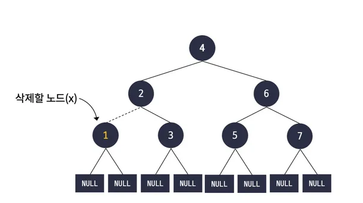
그림 32. Red-black 트리 삭제 예제 초기 모델

맨 처음 위와 같은 상태에 Red-black 트리가 있고, 1번 노드를 삭제한다고 가정해보자.

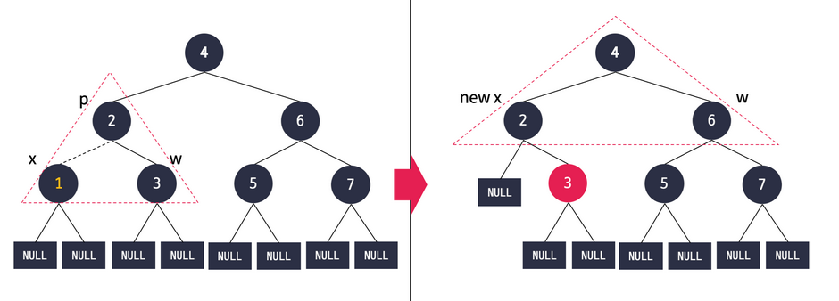

그림 33. 예제 1번 Case 2 연산

1번 노드를 삭제할 때, 형제 노드(3번)와 형제 노드의 자식 노드들이 모두 black 이므로 Case 2 연산을 수행해야 한다.

형제 노드(3번)의 색깔을 red 로 변경하고 1번 노드를 삭제한다.

그리고 삭제한 노드(1번, x)의 부모인 2번 노드를 다시 기준점으로 본다.

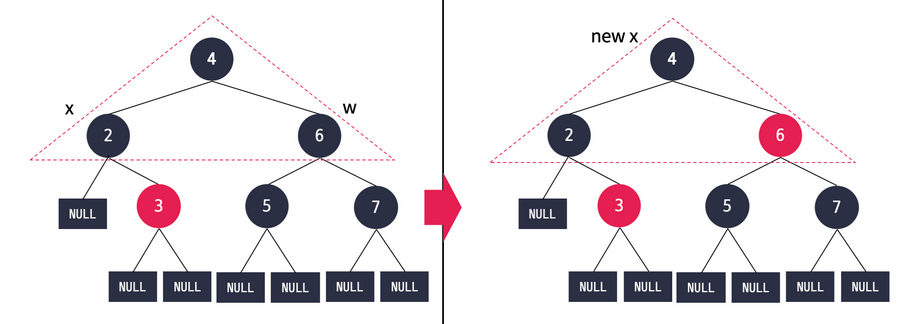

그림 34. 예제 1번 연산 Case 2 연산

현재 2번 노드를 기준으로 보았을 때, NIL 노드까지 도달하는 데 거친 black 노드의 갯수는 좌측, 우측 모두 1개이다.

하지만 4번 노드를 기준으로 보았을 때, 좌측으로는 2개이지만 우측으로는 3개가 있으므로 5번 기준에 부합하지 않는다.

그럼 다시 형제 노드(6번)과 그 자식 노드들이 모두 black 이므로 또 Case 2 연산을 수행한다.

형제 노드(6번)의 색깔을 red 로 변경하고 현재 x노드의 부모인 4번을 기준으로 다시 본다. 하지만 현재 새로운 x 노드가 루트 노드이므로 연산을 종료한다.

| **연산** | AVL 트리 | Red-Black 트리 |
| -------- | -------- | -------------- |
| 삽입     | O(log n) | O(log n)       |
| 삭제     | O(log n) | O(log n)       |
| 탐색     | O(log n) | O(log n)       |

AVL 트리와 Red-black 트리 모두 노드의 삽입과 삭제, 탐색에서 O(log n)의 시간복잡도를 가진다. 단, 탐색 면에서는 AVL 트리가 약간 빠르고, 노드의 삽입과 삭제 면에서는 Red-Black 트리가 좀 더 빠르다. 그리고 Red-black 트리가 상대적으로 낮은 회전 연산을 수행하기 때문에 더 낮은 오버헤드를 가진다.

# 퀴즈 문제

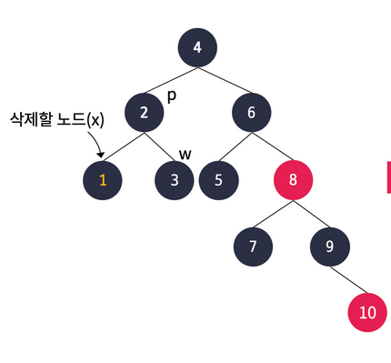

그림 35. 퀴즈 문제

위와 같은 형태의 Red-black 트리가 있고 1번 노드를 삭제하려고 할 때, 최종적으로 균형잡힌 Red-black 트리를 완성해오세요.

출처
http://xn--codelatte-9n69a.io/courses/java_data_structure/1QO410DZV2P3J17O
https://www.codelatte.io/courses/java_data_structure/W2P3YI9KRPEIY4IL
https://github.com/devSquad-study/2023-CS-Study/blob/main/Algorithm/algorithm_red_black_tree.md
