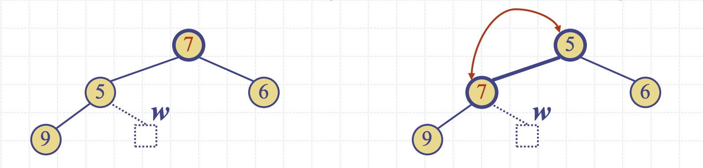

## 힙(Heap)

힙은 노드에 키 값을 저장하는 <b>이진 트리(Binary Tree)</b>로, 다음 두 가지 특성을 만족한다.

### 1. 힙 순서 속성(Heap-Order Property)
- 루트 노드를 제외한 모든 내부 노드 `v`에 대해:
    **key(v) ≥ key(parent(v))**
- 즉, 각 부모 노드는 자식 노드보다 작거나 같다. (**최소 힙 기준, 최대 힙은 반대**)

### 2. 완전 이진 트리(Complete Binary Tree)
힙의 높이를 `h`라고 할 때:
- 깊이 `i`에 있는 노드 수는 $2^i$ 개이다.
    $(i = 0, 1, ..., h-1)$
- 가장 마지막 레벨(`h-1`)에서는 **internal node**(자식을 가진 노드)가 **external node**(자식이 없는 노드)의 **왼쪽**에 위치해야 한다.
    → 노드를 삽입할 때에는 좌측부터 삽입해야 한다.
- 힙의 **마지막 노드**는 최대 깊이의 가장 오른쪽 노드를 의미한다.


---

<br>

## 힙의 높이 (Height of a Heap)

**Theorem**: 힙에 `n`개의 키를 저장할 때, 힙의 높이는 $O(\log n)$이다.

### 증명

1. **힙의 높이를 h**라고 할 때, **n개의 키**를 저장하는 힙이 존재한다고 가정한다.
   
2. 깊이 `i`에 있는 키의 수는 $2^i$개이고, **i = 0, 1, ..., h-1**까지 존재한다.
    - 마지막 깊이 `h`에는 적어도 **1개**의 키가 존재한다.
  
3. 힙에 저장된 키의 수는 다음과 같이 표현할 수 있다:
    - 깊이 `0`에서 `h-1`까지는 각각 $1, 2, 4, ..., 2^{h-1}$개의 키가 있다.
    - 마지막 깊이 `h`에는 최소 **1개**의 키가 존재한다.

4. 따라서 키의 수 `n`은 다음과 같은 부등식을 만족한다:
    - $n \geq 1 + 2 + 4 + \dots + 2^{h-1} + 1$
    - $n \geq 2^{h}$

5. h의 값을 구하면: $h \leq \log n$

### 결론
힙의 높이는 <b>O(log n)<b>이다.  


---

<br>

## 힙과 우선순위 큐 (Heaps and Priority Queues)

<b>힙(Heap)</b>을 사용하여 <b>우선순위 큐(Priority Queue)</b>를 구현할 수 있다.

### 힙에서의 우선순위 큐 구현 방식:
1. **각 내부 노드**에 **(key, element)** 형식의 아이템을 저장한다.
    - 여기서 **key**는 우선순위를 나타내고, **element**는 실제 데이터를 나타낸다.
2. **마지막 노드의 위치**를 추적한다.
    - 힙에서 새로운 요소를 삽입할 때, 마지막 노드를 추적하여 효율적으로 삽입 작업을 수행할 수 있다.


---

<br>

## 힙에 항목 삽입 (Insertion into a Heap)

### 삽입 알고리즘
1. 새로 삽입될 마지막 노드를 찾는다.
2. `z` 노드에 키 `k`를 저장한다.
3. 힙 순서 속성(Heap-order property)을 복원한다.


---

<br>

## Upheap 알고리즘

- 새로운 키 `k`를 삽입한 후, 힙 순서 속성이 위반될 수 있다.
- **Upheap** 알고리즘은 키 `k`를 삽입 노드에서 **위쪽 경로를 따라 부모와 비교하며 교환**하여 힙 순서 속성을 복원한다.

### Upheap 알고리즘의 동작
1. **Upheap**은 `k`가 **루트**에 도달하거나 `k`의 부모가 `k`보다 작거나 같을 때까지 계속된다.
2. 이 과정은 <b>힙의 높이가 O(log n)</b>이므로, **Upheap은 O(log n)** 시간 복잡도를 가진다.

### Upheap 종료 조건:
- **루트에 도달**하거나,
- **부모 노드의 키가 삽입된 키 `k`보다 작거나 같을 때** 종료


---
<br>

## 힙에서 항목 제거 (Removal from a Heap)

### 제거 알고리즘
1. 루트 노드를 마지막 노드(`w`)의 키로 교체한다.
2. 마지막 노드 `w`를 힙에서 제거한다.
3. 힙 순서 속성(Heap-order property)을 복원한다.


---

<br>

## Downheap 알고리즘

- 루트 키를 마지막 노드 `w`의 키로 교체한 후, 힙 순서 속성이 위반될 수 있다.
- **Downheap** 알고리즘은 **루트에서부터 아래로 내려가며 교환**하여 힙 순서 속성을 복원한다.

### Downheap 알고리즘의 동작
1. **Downheap**은 <b>키 `k`</b>가 **리프 노드에 도달**하거나 **자식 노드의 키가 `k`보다 크거나 같은 노드**에 도달할 때까지 계속된다.
2. 이 과정은 <b>힙의 높이가 O(log n)</b>이므로, **Downheap은 O(log n)** 시간 복잡도를 가진다.

### Downheap 종료 조건:
- **리프 노드에 도달**하거나,
- **자식 노드들의 키가 `k`보다 크거나 같은 경우** 종료된다.




---

<br>

## 벡터 기반 힙 구현 (Vector-based Heap Implementation)

### 힙을 벡터로 표현
- **n개의 키**를 저장하는 힙을 <b>길이 `n + 1`</b>인 벡터로 표현할 수 있다.

### 노드의 인덱스 구조:
- **i**번 순위(rank)의 노드에 대해:
  - **왼쪽 자식**은 순위 `2i`에 위치한다.
  - **오른쪽 자식**은 순위 `2i + 1`에 위치한다.


<br>

```cpp
    
    void upHeap(int idx) { // 올라가면서 힙을 재구성 (보통 삽입한 후 수행)
				if(idx == indexOfRoot) return; // 새로운 노드가 루트 노드면 리턴
				else { // 새로운 노드가 루트 노드가 아닐 때
						int parent = idx/2;
						if(v[idx] > v[parent]) { // 부모 노드보다 우선순위가 높다면 위치 바꿈
								swap(parent, idx);
								upHeap(parent); // 재귀적으로 upHeap 호출하면서 계속해서 힙 올바르게 재구성
						}
			  }
		}
		
		void downHeap(int idx) { // 내려가면서 힙을 재구성 (보통 삭제한 후 수행)

				int left = idx*2; // 왼쪽 자식
				int right = idx*2+1; // 오른쪽 자식
				int maxIndex = idx; // 가장 우선순위가 높은(최대값) 노드의 위치를 저장할 변수
    
			  if (left <= sizeOfHeap && v[left] > v[maxIndex]) { // 1)왼쪽 자식 노드와 비교 후 업뎃
		        maxIndex = left;
		    }
		    if (right <= sizeOfHeap && v[right] > v[maxIndex]) { // 2)오른쪽 자식 노드와 비교 후 업뎃
		        maxIndex = right;
		    }

		    // 최대값이 부모 노드가 아니라면 위치 바꿈
				if (maxIndex != idx) {
		        swap(idx, maxIndex);
		        downHeap(maxIndex);
		    }
		}

```
--- 

<br>

## 문제 

### 1. 힙을 배열로 구현한다고 가정하면, 어떻게 값을 저장할 수 있을까요?

### 2. 힙 정렬의 시간복잡도는 어떻게 되나요? 

---

<br>

### 출처
https://github.com/devSquad-study/2023-CS-Study/blob/main/Algorithm/algorithm_heap.md


https://github.com/Landvibe-DataStructure-2023Study/Prob/blob/main/%EC%8A%A4%ED%84%B0%EB%94%94%20%EC%9E%90%EB%A3%8C/%ED%9E%99.pdf

Data Structures and Algorithms in C++