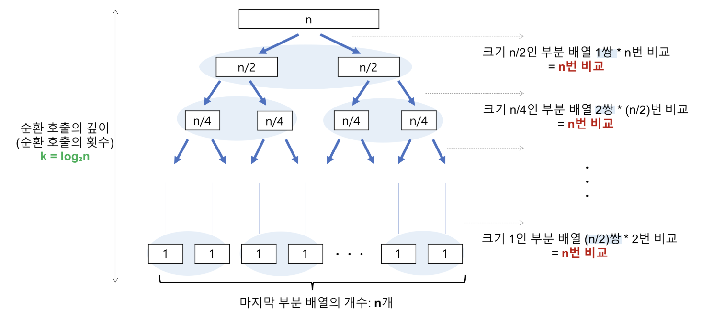
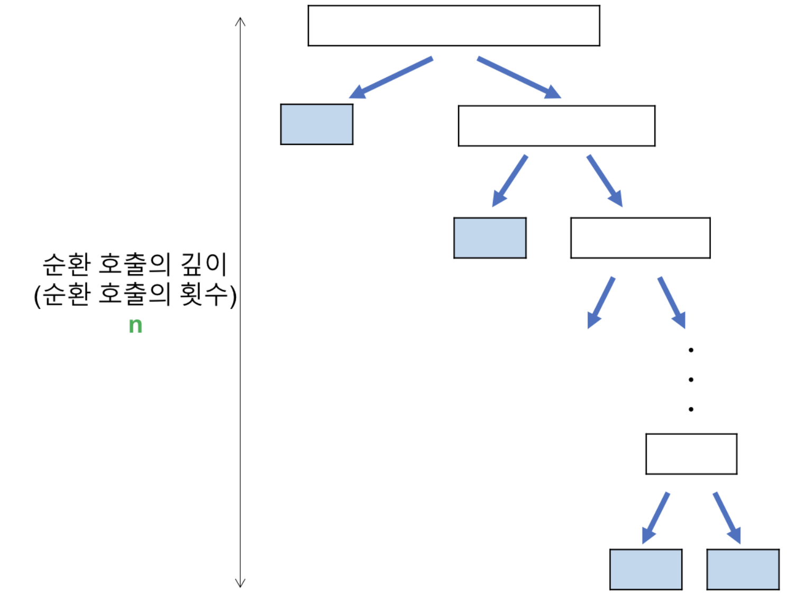

## Sort
- [Sort](#sort)
- [Bubble Sort](#bubble-sort)
  - [🌱 예시](#-예시)
  - [⏰ 시간 복잡도](#-시간-복잡도)
- [Selection Sort](#selection-sort)
  - [⏰ 시간 복잡도](#-시간-복잡도-1)
  - [✅ 안정 정렬 vs 불안정 정렬](#-안정-정렬-vs-불안정-정렬)
- [Insertion Sort](#insertion-sort)
  - [⏰ 시간 복잡도](#-시간-복잡도-2)
- [Quick Sort](#quick-sort)
  - [⏰ 시간 복잡도](#-시간-복잡도-3)
- [Merge Sort](#merge-sort)
  - [⏰ 시간 복잡도](#-시간-복잡도-4)
- [🚀 Quiz](#-quiz)
- [✈️ 출처](#️-출처)

> 대표적인 정렬 Bubble Sort, Selection Sort, Insertion Sort, Merge Sort, Quick Sort를 다뤘다.

 

## Bubble Sort

- 정렬되는 모습이 거품이 수면으로 올라오는 듯한 모습을 보이기 때문에 지어진 이름
- Bubble Sort는 Selection Sort와 유사한 알고리즘으로 `서로 인접한 두 원소의 대소를 비교하고, 조건에 맞지 않다면 자리를 교환하며 정렬`하는 알고리즘이다.

### 🌱 예시

1. 1회전에 첫 번째 원소와 두 번째 원소를, 두 번째 원소와 세 번째 원소를, 세 번째 원소와 네 번째 원소를, … 이런 식으로 (마지막-1)번째 원소와 마지막 원소를 비교하여 조건에 맞지 않는다면 서로 교환한다.

2. 1회전을 수행하고 나면 가장 큰 원소가 맨 뒤로 이동하므로 2회전에서는 맨 끝에 있는 원소는 정렬에서 제외되고, 2회전을 수행하고 나면 끝에서 두 번째 원소까지는 정렬에서 제외된다. 이렇게 정렬을 1회전 수행할 때마다 정렬에서 제외되는 데이터가 하나씩 늘어난다.

 

### ⏰ 시간 복잡도

시간복잡도를 계산하면, (n-1) + (n-2) + (n-3) + .... + 2 + 1 => n(n-1)/2이므로, `O(n^2)` 이다. 또한, 정렬이 안되어있더라도 2개의 원소를 비교하기 때문에 최선, 평균, 최악의 경우 모두 시간복잡도가 `O(n^2)` 으로 동일함

| 장점                                                                                                        | 단점                                                                                    |
| :---------------------------------------------------------------------------------------------------------- | :-------------------------------------------------------------------------------------- |
| 구현이 매우 간단하고, 소스코드가 직관적임                                                                   | 시간복잡도가 최악, 최선, 평균 모두 O(n^2)으로, 비효율적임                               |
| 정렬하고자 하는 배열 안에서 교환하는 방식이므로, 다른 메모리 공간 필요없음 => 제자리 정렬(in-place sorting) | 정렬 돼있지 않은 원소가 정렬 됐을때의 자리로 가기 위해서, 교환 연산(swap)이 많이 일어남 |
| 안정 정렬(Stable Sort)임                                                                                    |                                                                                         |

 

## Selection Sort

- Selection Sort는 Bubble Sort과 유사한 알고리즘으로, `해당 순서에 원소를 넣을 위치는 이미 정해져 있고, 어떤 원소를 넣을지 선택`하는 알고리즘이다.

 

1. 주어진 배열 중에 최소값을 찾음
2. 그 값을 맨 앞에 위치한 값과 교체
3. 맨 처음 위치를 뺀 나머지 배열을 같은 방법으로 교체

 

### ⏰ 시간 복잡도

n개의 주어진 배열을 정렬하는데 `O(n^2)` 만큼의 시간이 걸린다. 최선, 평균, 최악의 경우 시간복잡도는 `O(n^2)` 으로 동일함

 

| 장점                                                                                                                                     | 단점                               |
| :--------------------------------------------------------------------------------------------------------------------------------------- | :--------------------------------- |
| 알고리즘이 단순함                                                                                                                        | 시간복잡도가 O(n^2)으로 비효율적임 |
| 정렬을 위한 비교 횟수는 많지만, Bubble Sort에 비해 실제로 교환하는 횟수는 적기 때문에 많은 교환이 일어나야 하는 곳에서는 비교적 효율적임 | 불안정 정렬임                      |
| 정렬하고자 하는 배열 안에서 교환하는 방식이므로, 다른 메모리 공간이 필요없음 => 제자리 정렬(in-place sorting)                            |                                    |

 

### ✅ 안정 정렬 vs 불안정 정렬

- 정렬이 일어나는 동안 중복된 값들의 상대적인 순서가 유지되면 안정 정렬, 유지되지 않으면 불안정 정렬이라고 함

🫧 Bubble Sort 예시
**정렬전**
|값|원래 위치|
|:--|:--|
|A1(3)|1번째|
|B1(2)|2번째|
|C1(3)|3번째|
|D1(1)|4번째|

**첫번째 정렬후**
|값|원래 위치|
|:--|:--|
|D1(1)|4번째|
|B1(2)|2번째|
|A1(3)|1번째|
|C1(3)|3번째|

**🧩 A1와 C1의 상대적인 위치가 유지됨 -> 안정 정렬**

 

## Insertion Sort

- `2번째 원소부터 시작하여 그 앞(왼쪽)의 원소들과 비교하여 삽입할 위치를 지정한 후, 원소를 뒤로 옮기고 지정된 자리에 자료를 삽입 하여 정렬`하는 알고리즘
- 최선의 경우 `O(N)`이라는 엄청나게 빠른 효율성을 가지고 있어, 다른 정렬 알고리즘의 일부로 사용될 만큼 좋은 정렬 알고리즘이다.

 

1. 정렬은 2번째 위치(index)의 값을 temp에 저장
2. temp와 이전에 있는 원소들과 비교하며 삽입
3. 1번으로 돌아가 다음 위치(index)의 값을 temp에 저장하고, 반복

 

### ⏰ 시간 복잡도

- 최악의 경우(역으로 정렬되어 있을 경우) Selection Sort와 마찬가지로, (n-1) + (n-2) + .... + 2 + 1 => n(n-1)/2 즉, `O(n^2)` 이다.
- 모두 정렬이 되어있는 경우, 한번씩 밖에 비교를 안하므로 `O(n)` 의 시간복잡도를 가짐
  > 정렬된 배열에 자료를 하나씩 삽입/제거하는 경우에는, 현실적으로 최고의 정렬 알고리즘이 되는데, 탐색을 제외하고는 다른 작업으로 인한 오버헤드가 작음
- 최선의 경우는 `O(n)` 의 시간복잡도를 갖고, 평균과 최악의 경우 `O(n^2)` 의 시간복잡도를 가짐

 

| 장점                                                   | 단점                                |
| :----------------------------------------------------- | :---------------------------------- |
| 알고리즘이 단순함                                      | 배열의 길이가 길어질수록 비효율적임 |
| 대부분의 원소가 이미 정렬되어 있는 경우, 매우 효율적임 |                                     |
| 안정 정렬임                                            |                                     |

 

## Quick Sort

- 분할 정복(divide and conquer) 방법 을 통해 주어진 배열을 정렬
  > 문제를 작은 2개의 문제로 분리하고 각각을 해결한 다음, 결과를 모아서 원래의 문제를 해결하는 전략
- Quick Sort은 `불안정 정렬`에 속하며, 다른 원소와의 비교만으로 정렬을 수행하는 `비교 정렬`에 속한다. 또한 Merge Sort와 달리 Quick Sort는 배열을 `비균등하게 분할`

 

1. 배열 가운데서 하나의 원소를 고른다. 이렇게 고른 원소를 `피벗(pivot)` 이라고 한다. -> 피벗은 기준같은 느낌
2. 피벗 앞에는 피벗보다 `값이 작은 모든 원소`들이 오고, 피벗 뒤에는 피벗보다 `값이 큰 모든 원소`들이 오도록 피벗을 기준으로 배열을 둘로 나눈다. 이렇게 배열을 둘로 나누는 것을 `분할(Divide)` 이라고 한다. 분할을 마친 뒤에 피벗은 더 이상 움직이지 않는다.
3. 분할된 두 개의 작은 배열에 대해 `재귀(Recursion)`적으로 이 과정을 반복
> [!NOTE] 재귀 호출이 한번 진행될 때마다 최소한 하나의 원소는 최종적으로 위치가 정해지므로, 이 알고리즘은 반드시 끝난다는 것을 보장할 수 있다.

 

### ⏰ 시간 복잡도
> 레코드: 정렬해야 할 데이터

✨ **평균, 최선의 경우** : `O(nlog₂n)`

- 비교 횟수 `(log₂n)`: 레코드의 개수 n이 2의 거듭제곱이라고 가정(n=2^k) 했을 때, n=2^3의 경우, 2^3 -> 2^2 -> 2^1 -> 2^0 순으로 줄어든다. 이를 일반화하면 `log₂n`이 됨
- 각 순환 호출에서는 전체 리스트의 대부분의 레코드를 비교해야 하므로 평균 `n번` 정도의 비교가 이루어진다.
- 이동 횟수는 비교적 적으므로 무시해도 됨

 

🚨 **최악의 경우** : `O(n^2)`
> 최악의 경우는 정렬하고자 하는 배열이 오름차순 정렬되어있거나 내림차순 정렬되어있는 경우

- 비교 횟수 `(n)`: 레코드의 개수 n이 2의 거듭제곱이라고 가정(n=2^k)했을 때, 순환 호출의 깊이는 n
- 각 순환 호출에서는 전체 리스트의 대부분의 레코드를 비교해야 하므로 평균 `n번` 정도의 비교가 이루어진다.
- 이동 횟수는 비교적 적으므로 무시해도 됨

 

|장점|단점
|:---|:---|
|불필요한 데이터의 이동을 줄이고 먼 거리의 데이터를 교환할 뿐만 아니라, 한 번 결정된 피벗들이 추후 연산에서 제외되는 특성 때문에, 시간 복잡도가 O(nlog₂n)를 가지는 다른 정렬 알고리즘과 비교했을 때도 가장 빠르다.|불안정 정렬(Unstable Sort)임|
|정렬하고자 하는 배열 안에서 교환하는 방식이므로, 다른 메모리 공간을 필요없음|정렬된 배열의 경우 불균형 분할에 의해 오히려 더 오래 걸림|

 

## Merge Sort

- 합병 정렬이라고도 부르며, 분할 정복 방법을 통해 구현
- n개의 요소를 가진 리스트를 n개의 부분리스트로 분할한 후, 가까운 요소끼리 비교하여 병합함

 

1. 정렬되지 않은 리스트를 각각 하나의 원소만 포함하는 n개의 부분리스트로 분할한다. (한 원소만 든 리스트는 정렬된 것과 같으므로)
2. 부분리스트가 하나만 남을 때까지 반복해서 병합하며 정렬된 부분리스트를 생성한다. 마지막 남은 부분리스트가 정렬된 리스트이다.

 

### ⏰ 시간 복잡도

- 최악, 평균, 최선 모두 `O(nlogn)`으로 동일함
  - 원소가 한 개만 남을때까지 분할 -> `logn`
  - 병합하는 동안 n개의 데이터를 모두 비교 -> `n`

 

|장점|단점
|:---|:---|
|안전 정렬임|추가적인 메모리 사용함|
|합병정렬은 순차적인 비교로 정렬을 진행하므로, LinkedList의 정렬이 필요할 때 사용하면 효율적임|작은 배열에서는 오버헤드가 커서 비효율적임|

 

## 🚀 Quiz
- Quick Sort와 Merge Sort를 비교해 주세요.
- Bubble, Selection, Insertion Sort의 속도를 비교해주세요.

 

## ✈️ 출처

- https://github.com/devSquad-study/2023-CS-Study/blob/main/Algorithm/algorithm_sort.md
- https://gyoogle.dev/blog/algorithm/Bubble%20Sort.html
- https://gyoogle.dev/blog/algorithm/Selection%20Sort.html
- https://gyoogle.dev/blog/algorithm/Insertion%20Sort.html
- https://gyoogle.dev/blog/algorithm/Merge%20Sort.html
- https://gyoogle.dev/blog/algorithm/Quick%20Sort.html
