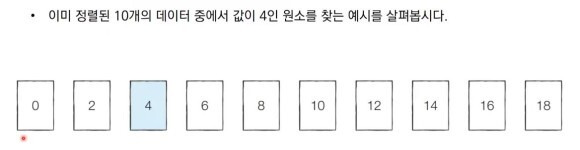
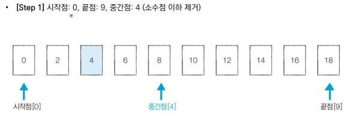
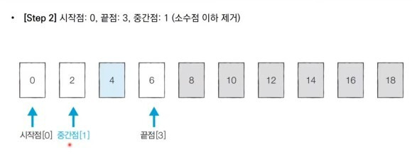
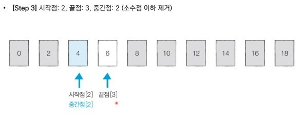
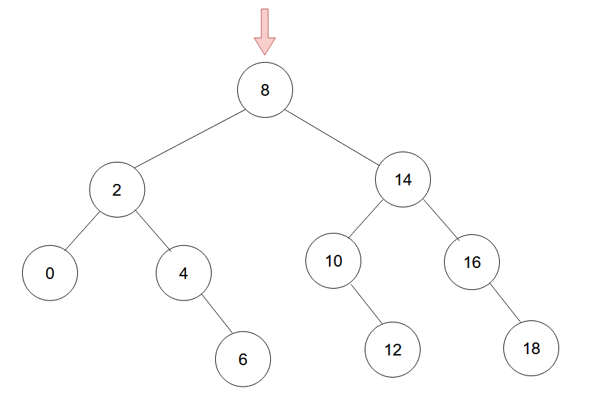
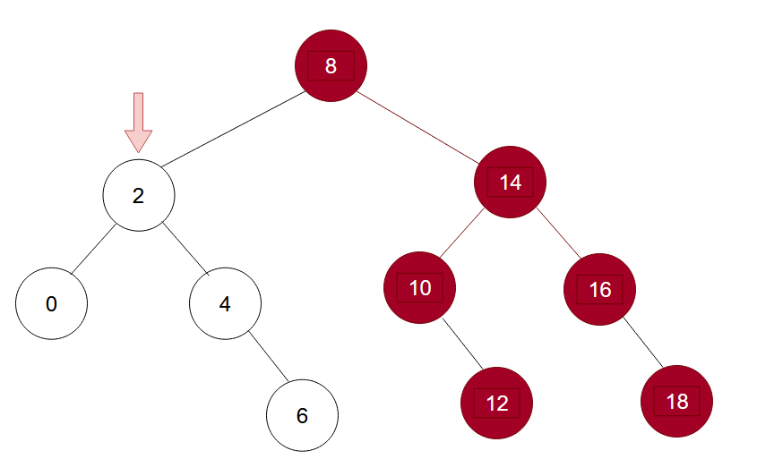
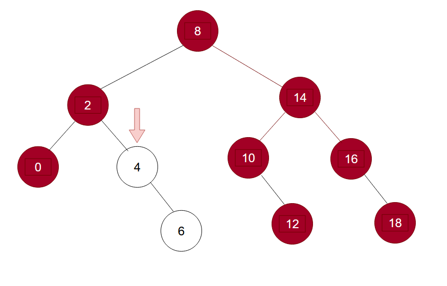
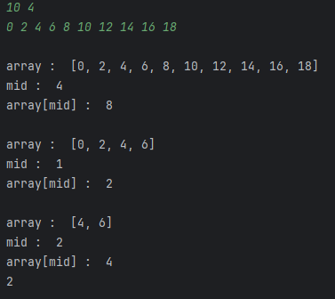

## 이진 탐색의 정의

- 순차 탐색 : 리스트 안에 있는 특정한 데이터를 찾기 위해 **앞에서부터 데이터를 하나씩 확인**하는 방법
- 이진 탐색 : **정렬되어 있는 리스트**에서 **탐색 범위를 절반씩 좁혀가며** 데이터를 탐색하는 방법
- 시작점, 끝점, 중간점을 이용하여 탐색 범위를 설정한다.
  <br>

|             | 순차 탐색 | 이진 탐색 |
| ----------- | --------- | --------- |
| 시간 복잡도 | O(N)      | O(logN)   |

<br>



- 이미 정렬된 10개의 데이터([0, 2, 4, 6, 8, 10, 12, 14, 16, 18]) 중에서 값이 4인 원소를 찾아보자.

<br>



- 먼저 시작점은 제일 왼쪽에 있는 0번째 인덱스(0), 끝점은 가장 오른쪽에 있는 9번째 인덱스(18) 그리고 중간점은 가운데 4번째 인덱스(8)로 설정한다.
- 만약 중간값이 2개가 있으면 소수점을 제거한 값이 된다. ex) (0+9)/ 2 = 4.5 이므로 소수점을 날린 4번째 인덱스(8)가 중간점이 된다.

- 처음에는 중간점의 값인 '8'과 찾고자 하는 값 '4'를 비교하여 어떤 값이 더 큰지를 비교한다.
- 만약 찾고자하는 값보다 중간점의 값이 더 크다면 중간점부터 오른쪽에 있는 값은 전부 확인할 필요가 없어진다. 그러므로 끝점을 중간점의 왼쪽(6)으로 옮긴다.

<br>



- 끝점을 옮긴 뒤, 다시 중간점을 설정한다( (0+3)/2 = 1.5 → 1 ). 그 뒤, 다시 중간점의 값(2)과 찾고자 하는 값(4)을 비교한다.
- 중간점의 값이 더 작으므로 중간점을 포함해서 왼쪽에 있는 값들은 확인할 필요가 없어지므로 시작점을 중간점의 오른쪽(4)으로 이동시킨다.

<br>



- 시작점을 옮기면 위와 같이 시작점이 2번째 인덱스, 끝점이 3번째 인덱스가 되어 위와 같은 탐색 범위를 가지게 된다.
- 이때 중간점 '4'가 우리가 찾고자 하는 값이 되기 때문에 탐색을 마친다.

<br>



- 리스트 형태가 복잡해 보인다면 이진 트리 구조를 생각해보면 훨씬 쉽다.
- 위 예시와 마찬가지로 우리가 4인 원소를 찾는다고 생각해보자.
- 먼저 중간값인 루트 노드의 값(8)과 우리가 찾고자 하는 값(4)를 비교한다.
- 우리가 찾고자 하는 값이 현재 루트 노드의 값보다 작으므로 8부터 우측 자식 노드의 값들은 고려할 필요가 없어진다.

<br>



- 좌측 자식 노드를 루트 노드로 바라보고 현재의 루트 노드의 값(2)과 우리가 찾고자 하는 값(4)을 비교한다.
- 우리가 찾고자 하는 값이 현재 루트 노드의 값보다 크므로 2부터 좌측 자식 노드의 값들은 고려할 필요가 없어진다.

<br>



- 우측 자식 노드를 루트 노드로 바라보고 현재의 루트 노드의 값(4)과 우리가 찾고자 하는 값(4)을 비교한다.
- 현재 루트 노드의 값과 우리가 찾고자 하는 값이 일치하므로 탐색을 종료한다.

<br>

## 이진 탐색 파이썬 코드

```python
def binary_search(array, target, start, end):
    if start > end:
        return None
    print()
    print("array : ", array[start:end + 1])
    mid = (start + end) // 2
    print("mid : ", mid)
    print("array[mid] : ", array[mid])

    # 목표값을 찾은 경우 해당 인덱스값 반환
    if array[mid] == target:
        return mid
    elif array[mid] > target:
        return binary_search(array, target, start, mid - 1)
    else:
        return binary_search(array, target, mid + 1, end)

n, target = list(map(int, input().split()))
array = list(map(int, input().split()))
result = binary_search(array, target, 0, n - 1)

if result == None:
    print("원소가 존재하지 않습니다.")
else:
    print(result)
```



<br>

```python
def binary_search(array, target, start, end):
    while start <= end:
        mid = (start + end) // 2
        print()
        print("array : ", array[start:end + 1])
        print("mid : ", mid)
        print("array[mid] : ", array[mid])
        if array[mid] == target:
            return mid
        elif array[mid] > target:
            end = mid - 1
        else:
            start = mid + 1
    return None

n, target = list(map(int, input().split()))
array = list(map(int, input().split()))

result = binary_search(array, target, 0, n - 1)
if result == None:
    print("원소가 존재하지 않습니다.")
else:
    print(result)
```


<br>

## 퀴즈

1. 이진 탐색을 수행하기 위한 리스트의 조건은?
2. 이진 탐색 트리에서 이진 탐색을 수행하는 과정은?

<br>

## 출처

https://www.youtube.com/watch?v=94RC-DsGMLo&list=PLRx0vPvlEmdAghTr5mXQxGpHjWqSz0dgC&index=5
<br>
