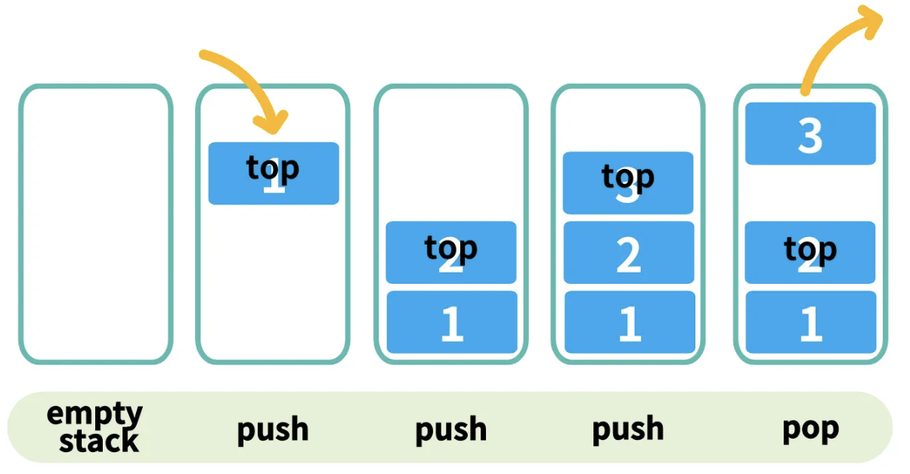
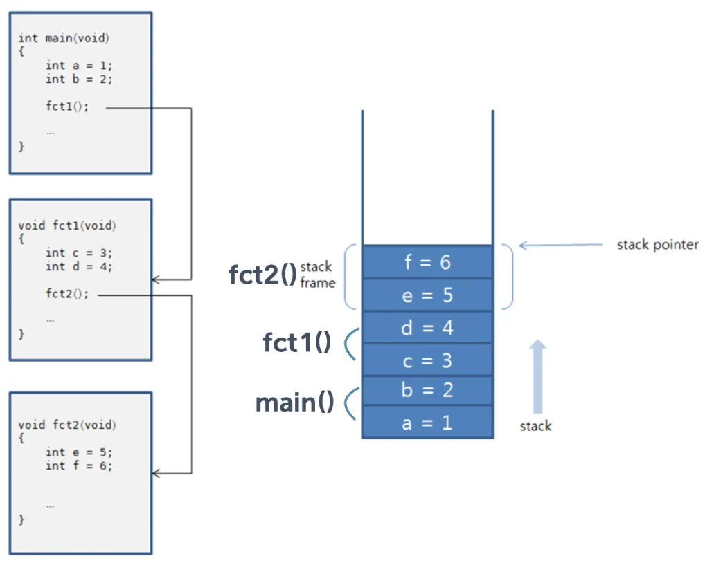
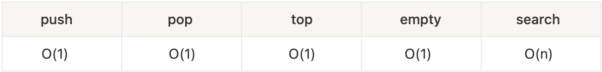
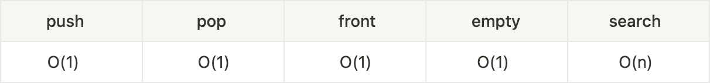
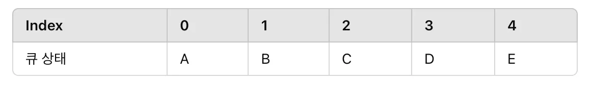
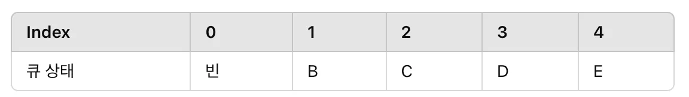
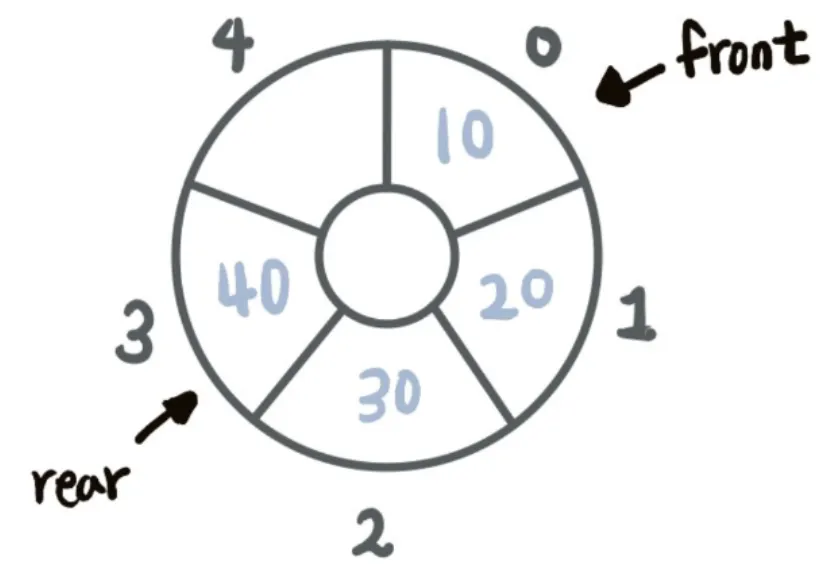
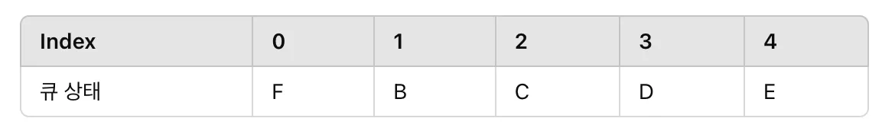
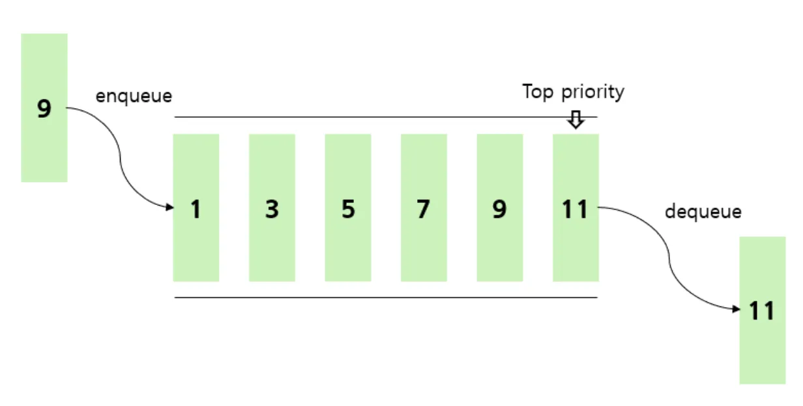
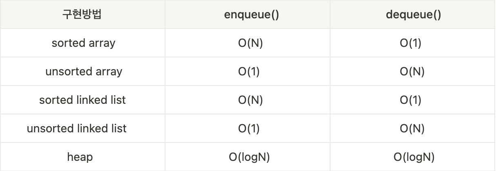

# 스택 (Stack)

 

## 스택이란 ?

> Last In First Out (LIFO 후입 선출) : 나중에 들어간 자료가 먼저 나오는 자료구조 (책을 쌓아 올리듯이)

한 쪽 끝에서만 자료를 넣고 뺄 수 있는 자료구조로 데이터가 들어오고 나가는 방향이 하나이며 같다.

 

## 스택 Operation

### push(object) : 스택의 <u>맨 위에</u> 데이터를 삽입

### object pop() : 마지막으로 삽입된 데이터 삭제(<u>맨 위에</u> 있는 데이터)

### object top() : <u>삭제 없이</u> 마지막으로 삽입된 데이터를 리턴

### boolean empty() : 해당 스택이 비었는지 여부를 리턴

 

## 스택 활용

- 웹 브라우저에서 방문한 페이지 기록
- 수식의 후위 표기법 계산
- 함수 호출의 재귀적 구현

 

## 스택 시간복잡도

## 

 
 

# 큐 (Queue)
 

##  큐란 ?

> First In First Out (FIFO 선입선출) : 맨 뒤부터 자료를 넣고 뺄 수 있는 자료구조, 즉 먼저 들어간 자료가 먼저 나온다. (은행 대기열)

한 쪽 끝에서만 자료를 넣고 뺄 수 있는 자료구조로 데이터가 들어오고 나가는 방향이 다르다.

 

## 큐 Operation

### enqueue(object) : 큐의 <u>맨 뒤에</u> 데이터를 삽입
### dequeue() : 큐의 <u>맨 앞에</u> 있는 데이터 삭제
### object front() : <u>삭제 없이</u> 맨 앞에 있는 데이터를 리턴
### boolean empty() : 해당 큐가 비었는지 여부를 리턴

 

## 큐 시간복잡도

 

## 큐의 종류

 

### 선형 큐 (Linear Queue)

   데이터를 FIFO 순서로 처리하는 가장 기본적인 큐로 일반적으로 고정 크기의 배열로 구현된다.

    장점

    - 구현이 간단하다.

    단점

    - 큐가 가득 찬 경우 데이터 공간이 남아 있어도(앞부분에 빈 공간이 있어도) 더 이상 데이터를 삽입할 수 없다.

 

### 환형(원형) 큐 (Circular Queue)

   큐의 마지막 요소가 첫 요소와 연결된 큐로, 원형으로 순환한다.

    장점

    - 메모리 공간을 효율적으로 사용할 수 있다.
    - 선형 큐의 문제인 “공간 낭비” 해결

    단점

    - 구현이 복잡하다 (포인터 or 배열 인덱스 계산이 필요)
    - 큐가 가득 찼는지 혹은 비어 있는지 구분하기 위해 size 변수가 필요

 

### 우선순위 큐 (Priority Queue)

   큐에 들어간 순서와 상관없이, 우선순위에 따라 데이터를 처리하는 큐

    장점

    - 높은 우선순위의 데이터를 빠르게 처리할 수 있다

    단점

    - 우선순위에 따라 정렬 작업이 추가로 필요하다.
    - 삽입이나 삭제 연산이 일반 큐보다 복잡하다.

     시간복잡도

 

### 데크 (DeQue : Double-Ended Queue)

    양쪽에서 삽입, 삭제가 가능한 구조

    장점

         - 양쪽 끝에서 데이터 처리가 가능해 큐와 스택의 장점을 모두 가진다.

    단점

         - 배열 기반 데크는 크기 재조정이 필요할 수 있다.
         - 원형 데크로 구현 시 모듈러 연산이 필수이다.

 
 

---
 

## 문제

### Stack과 Queue의 차이점은 무엇인가요?

### PriorityQueue의 동작 원리가 어떻게 되나요?

 

---

**출처**

[https://velog.io/@rik963/자료-구조-Stack-Queue-Priority-Queue](https://velog.io/@rik963/%EC%9E%90%EB%A3%8C-%EA%B5%AC%EC%A1%B0-Stack-Queue-Priority-Queue)

[https://velog.io/@mic050r/자료구조-Tree-Graph이란](https://velog.io/@mic050r/%EC%9E%90%EB%A3%8C%EA%B5%AC%EC%A1%B0-Tree-Graph%EC%9D%B4%EB%9E%80)

https://yoongrammer.tistory.com/81
