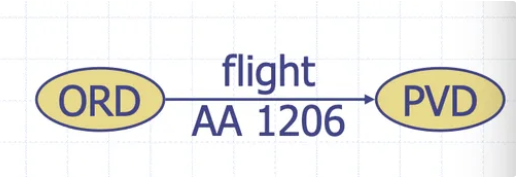
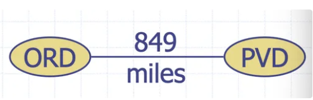
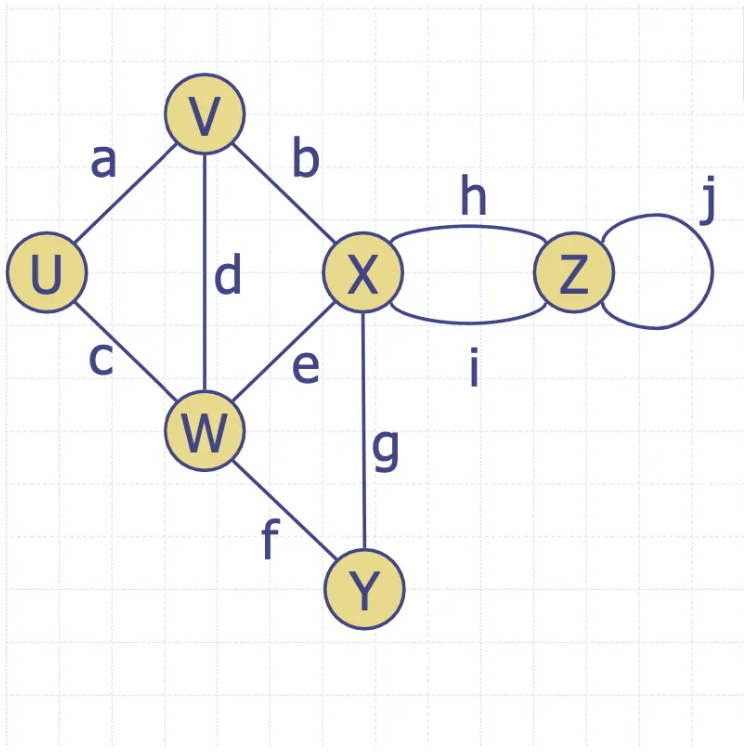
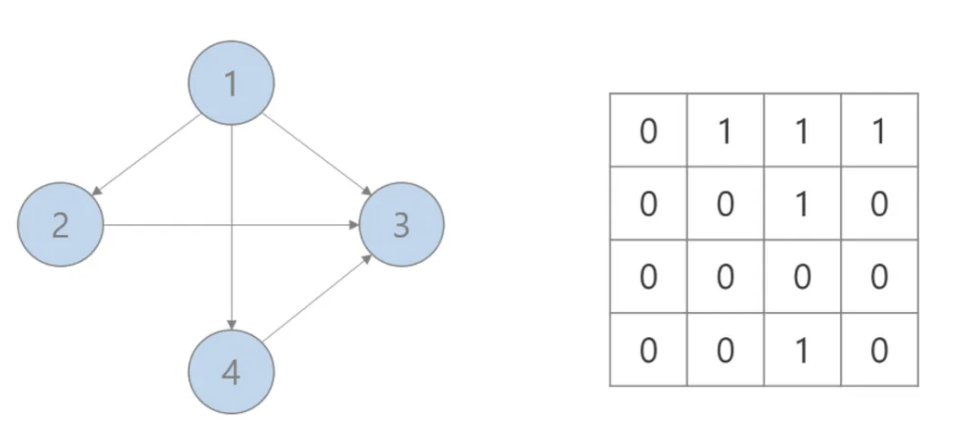
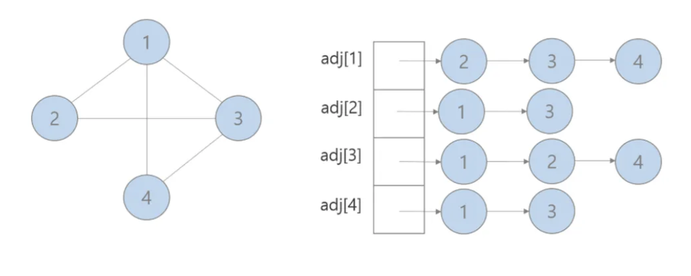
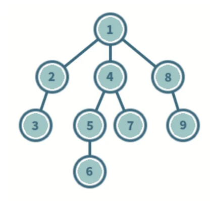

---

## 그래프(Graph)란?

- 정점(Vertex)과 간선(Edge)의 집합

---

## 그래프(Graph)  종류

간선에 방향 유무에 따라 그래프의 종류가 결정된다.

### 유향 그래프

- 모든 간선이 Directed edge인 그래프
- **Directed edge**
    - 방향성을 가지고 있는 간선, 화살표로 표기해서 edge의 방향성 나타낸다.
    - <> 를 이용해서 간선을 정의
      ex) <ORD,PVD> , <PVD,ORD>는 다른 간선이다.
      
  


### 무향 그래프

- 모든 간선이 Undirected edge인 그래프
- **Undirected edge**
    - 무 방향성을 가지고 있는 간선
    - () 를 이용해서 간선을 정의
      ex) (ORD,PVD)
      
  


---

## 그래프(Graph) 용어



### **인접(adjacent)**

- 간선의 의해 직접적으로 연결되어있는 정점

  ex) U의 인접한 정점은 V,W


### 부속(incident)

- 노드의 직접적으로 연결되어있는 간선

  ex) a,b,d는 V에 부속(incident)되어 있다.


### 차수(Degree)

- 정점에서 인접한 정점의수
    - X의 degree는 5
- **진입차수(indegree)** : 외부에서 오는 간선의 개수
- **진출차수(outdegree)** : 외부로 향하는 간선의 개수

### Parallel edges

- 두 정점사이 2개이상 존재하는 간선
    - h와 i는 parallel edges이다.

### Self-loop

- 시작과 끝이 자기 정점으로 이루어진 간선
    - 무방향 그래프일때는 self-loop는 정의 되지 않는다.
    - j는 self loop이다.

### Path

- 한정점에서 다른 정점까지 가는 경로
- **단순 경로(Simple Path):** 경로 중에서 반복되는 정점이 없는 경우

### Cycle

- 단순경로의 시작 정점과 종료 정점이 동일한 경우
- 단순 사이클(Simple cycle) : Simple path를 가지는 cycle
- **비순환 그래프(Acyclic Graph)** : ****사이클이 없는 그래프

---

## 그래프(Graph) 구현 방법

### 인접 행렬(**Adjacency Matrix)**

- 인접 행렬은 그래프의 연결 관계를 이차원 배열로 나타내는 방식
- **구조**
    - 정점이 N개라면 N×N 크기의 2차원 배열을 사용
    - 행과 열의 값이 1이면 연결됨, 0이면 연결되지 않음을 의미
- **특징**
    - 구현이 간단하고 직관적
    - 간선(Edge)의 존재 여부를 O(1)의 시간복잡도로 확인 가능
- **단점**
    - 메모리 사용량이 O(N^2)으로 비효율적



### 인접 리스트(**Adjacency List**)

- 각 정점에 연결된 정점들을 리스트(Linked List, 배열, 해시맵 등)로 저장하는 방식입니다.
- **구조**
    - 각 정점이 리스트를 갖고 있으며, 해당 리스트에 연결된 정점들을 저장
- **특징**
    - 메모리 사용이 O(V + E)로 효율적
    - 특정 간선이 존재하는지 확인하는 데는 O(V)의 시간이 걸릴 수 있음
    - 탐색 및 순회에 적합한 구조



---

## 그래프 탐색

그래프 탐색은 그래프 내의 모든 정점을 방문하는 과정입니다.

대표적인 방법

- **DFS(깊이 우선 탐색)**
- **BFS(너비 우선 탐색)** : 최단 경로 탐색(비가중 그래프)
- **다익스트라 :** 최단 경로 탐색(가중 그래프)
- **벨만-포드 :** 최단 경로 탐색(음수 가중 그래프)
- **플로이드-워셜 :** 모든 경로 계산
- **클루스칼 :** MST(최소 비용 트리)
- **프림 :**  MST(최소 비용 트리)
- **위상정렬** : 순서가 있는 문제에 적용

### DFS (Depth-First Search, 깊이 우선 탐색)

DFS는 **한 정점에서 시작하여 최대한 깊이 탐색한 후, 다시 돌아와 다음 분기를 탐색하는 방식**

- **특징**
    - 스택(Stack) 또는 재귀(Recursion)로 구현 가능
    - 한 경로를 끝까지 탐색한 후 백트래킹(backtracking) 수행
- 시간복잡도: (O(V + E)) (V: 정점 개수, E: 간선 개수)
- **공간복잡도**: (O(V)) (재귀 호출 시 깊이가 최대 (V))


### **구현 (C++)**

```cpp
#include <iostream>
#include <vector>

using namespace std;

void dfs(vector<vector<int>>& graph, vector<bool>& visited, int node) {
    visited[node] = true;
    cout << node << " ";

    for (int neighbor : graph[node]) {
        if (!visited[neighbor]) {
            dfs(graph, visited, neighbor);
        }
    }
}

int main() {
    int V = 6; // 정점 개수
     vector<vector<int>> graph(V);
    
    // 무방향 그래프 (인접 리스트 방식)
    graph[0] = {1, 2}; // A(0) → B(1), C(2)
    graph[1] = {0, 3, 4}; // B(1) → A(0), D(3), E(4)
    graph[2] = {0, 5}; // C(2) → A(0), F(5)
    graph[3] = {1}; // D(3) → B(1)
    graph[4] = {1, 5}; // E(4) → B(1), F(5)
    graph[5] = {2, 4}; // F(5) → C(2), E(4)

    vector<bool> visited(V, false);
    
    cout << "DFS 탐색 결과: ";
    dfs(graph, visited, 0); // A(0)에서 시작
    cout << endl;

    return 0;
}
```

### BFS (Breadth-First Search, 너비 우선 탐색)

BFS는 **시작 정점에서 가까운 노드부터 탐색하는 방식**입니다.

- **특징**
    - 큐(Queue) 자료구조를 사용하여 구현
    - 최단 경로(Shortest Path) 문제에 유리
- **시간복잡도**: O(V+E) (V: 정점 개수, E: 간선 개수)
- **공간복잡도**: O(V) (큐에 최대 V개의 정점이 저장될 수 있음)
  
### **구현 (C++)**

```cpp
#include <iostream>
#include <vector>
#include <queue>

using namespace std;

void bfs(vector<vector<int>>& graph, int start) {
    vector<bool> visited(graph.size(), false);
    queue<int> q;
    
    visited[start] = true;
    q.push(start);

    while (!q.empty()) {
        int node = q.front();
        q.pop();
        cout << node << " ";

        for (int neighbor : graph[node]) {
            if (!visited[neighbor]) {
                visited[neighbor] = true;
                q.push(neighbor);
            }
        }
    }
}

int main() {
    int V = 6; // 정점 개수
    vector<vector<int>> graph(V);
    
    // 무방향 그래프 (인접 리스트 방식)
    graph[0] = {1, 2}; // A(0) → B(1), C(2)
    graph[1] = {0, 3, 4}; // B(1) → A(0), D(3), E(4)
    graph[2] = {0, 5}; // C(2) → A(0), F(5)
    graph[3] = {1}; // D(3) → B(1)
    graph[4] = {1, 5}; // E(4) → B(1), F(5)
    graph[5] = {2, 4}; // F(5) → C(2), E(4)

    cout << "BFS 탐색 결과: ";
    bfs(graph, 0); // A(0)에서 시작
    cout << endl;

    return 0;
}

```

|  | **DFS (깊이 우선 탐색)** | **BFS (너비 우선 탐색)** |
| --- | --- | --- |
| **탐색 방식** | 한 경로를 끝까지 탐색 후 백트래킹 | 가까운 노드부터 탐색 |
| **사용 자료구조** | 스택(Stack) / 재귀(Recursion) | 큐(Queue) |
| **최단 경로 찾기** | 최단 경로 보장 ❌ | 최단 경로 보장 ✅ |
| **시간복잡도** | O(V+E) | O(V+E) |
| **공간복잡도** | O(V) (재귀 호출 깊이) | O(V) (큐 저장 공간) |
| **추천 상황** | 경로가 깊거나 백트래킹이 필요한 경우 | 최단 경로 탐색이 중요한 경우 |


### **다익스트라 알고리즘 (Dijkstra's Algorithm)**

**가중치가 있는 그래프에서 한 정점에서 모든 정점까지의 최단 경로 확인 알고리즘**

- **음수 가중치가 없는 그래프**에서 최적의 해를 보장
  - 음수 가중치가 있는 경우 벨만포드, 플로이드 워셜 알고리즘을 사용
- 우선순위 큐(Heap, Priority Queue)를 사용하면 효율적으로 구현
- **시간 복잡도**:
  - O((V + E) log V) (우선순위 큐 사용 시, 일반적으로 Heap을 사용하여 개선 가능)

**다익스트라 알고리즘 동작 과정**

1. **출발 노드 선택**: 시작 노드를 정하고, 해당 노드의 거리를 0으로 설정.
2. **거리 초기화**: 모든 다른 노드는 거리를 INF(무한대)로 설정.
3.  **최단 거리 갱신**
- 방문하지 않은 노드 중 **가장 가까운 노드**를 선택.
- 해당 노드를 통해 다른 노드로 가는 거리 갱신.
4. **반복**: 모든 노드에 대해 위 과정을 반복.
5. **최종 결과**: 시작 노드에서 모든 노드까지의 **최단 거리**를 찾음.


## 퀴즈

### 1번

```cpp
1 - 2 - 3
|   |   |
4 - 5 - 6

다음과 같은 무향 그래프가 주어진다.

1번 정점에서 DFS(깊이 우선 탐색)와 BFS(너비 우선 탐색)를 수행할 때 방문 순서를 출력 하시오.

- 정점 번호가 작은 것을 먼저 방문한다.
- 그래프는 인접 리스트로 표현되어 주어진다.
```

### 2번

**어떤 그래프가 주어졌을 때, 다익스트라 알고리즘을 사용하여 최단 경로를 구하려고 한다.**

**그래프의 일부 간선에는 음수 가중치가 포함될 수도 있다. 다음 중 다익스트라 알고리즘을 사용할 수 있는 경우를 모두 고르시오.**

**(다익스트라 알고리즘을 사용 못한다면 사용 할수있는 최단경로 알고리즘을 작성 하시오)**

**(1) 모든 간선의 가중치가 0 이상이다.**

**(2) 일부 간선의 가중치가 음수이지만, 음수 가중치를 가지는 간선이 사이클을 형성하지 않는다.**

**(3) 일부 간선의 가중치가 음수이며, 음수 가중치를 가지는 간선이 사이클을 형성한다.**

**(4) 모든 간선의 가중치가 음수이다.**