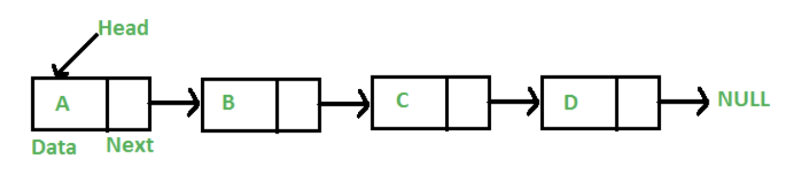
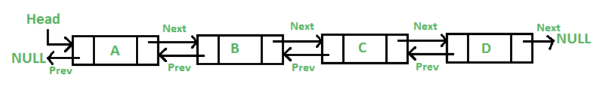
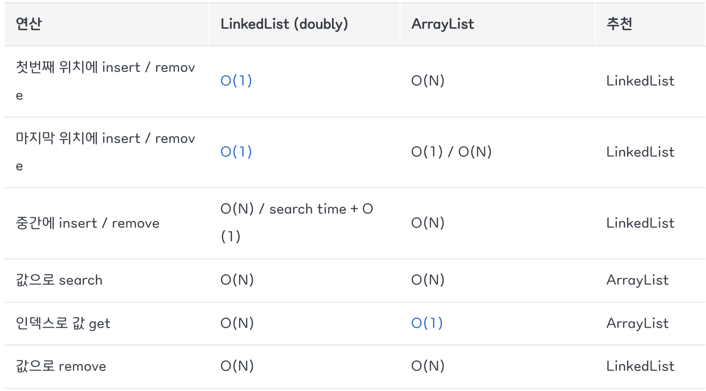
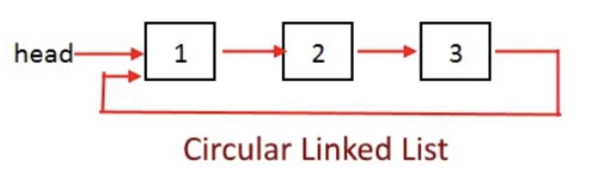

# [링크드 리스트]
- [\[링크드 리스트\]](#링크드-리스트)
  - [🔗 단일 연결 리스트(singly-linked list)](#단일-연결-리스트singly-linked-list)
    - [🌱 `링크드 리스트 왜 사용해?`](#링크드-리스트-왜-사용해)
    - [`장점`](#장점)
    - [`단점`](#단점)
  - [🔗 이중 연결 리스트(doubly-linked list)](#이중-연결-리스트doubly-linked-list)
    - [`장점`](#장점-1)
    - [`단점`](#단점-1)
    - [이중 연결 리스트 vs ArrayList](#이중-연결-리스트-vs-arraylist)
  - [🔗 원형 연결 리스트(circular-linked list)](#원형-연결-리스트circular-linked-list)
    - [`장점`](#장점-2)
    - [`단점`](#단점-2)
  - [🔗 각 연결 리스트의 시간 복잡도 비교](#각-연결-리스트의-시간-복잡도-비교)
  - [🔗 문제](#문제)
  - [🔗 출처](#출처)

## 🔗 단일 연결 리스트(singly-linked list)

- 연속적인 메모리 위치에 저장되지 않는 선형 데이터 구조로, 포인터를 사용해서 연결됨
- 각 노드는 데이터 필드와 다음 노드를 가리키는 포인터로 구성됨
  - 첫 번째 노드는 머리(head), 마지막 노드는 꼬리(tail)라고 부름
- 삽입은 특정 노드 A를 찾았다고 했을때 해당 노드가 새로 생성된 노드를 가리키게 하고, 새로 생성한 노드는 노드 A가 가리키고 있던 B 노드를 가리키면 됨
- 삭제는 삭제하고자 하는 노드 C의 바로 이전 노드를 찾아 C가 가리키고 있던 노드 D를 가리키게 하면 됨. 이때 노드 C의 포인터는 할당 해제를 해줘야 메모리가 낭비되지않음

### 🌱 `링크드 리스트 왜 사용해?`

일반적인 배열은 아래와 같은 문제점들이 있었음

1. 배열의 크기가 고정되어 있어 미리 요소의 수에 대해 할당 받아야 함
2. 새로운 요소를 삽입하는 것은 비용이 많이 듬
   1. 공간을 만들고, 기존 요소들을 이동시켜야 하기 때문

### `장점`

- 크기가 고정되어 있지 않음
- 삽입/삭제가 편리함

### `단점`

- 반드시 머리 노드부터 순차적으로 접근해야 함. → 바로 중간 노드로 접근 불가능
- 다음 노드를 가리키는 포인터를 위한 추가적인 메모리 공간이 필요함

**\*주로, 단일 연결 리스트가 면접 질문으로 나옴**

 

## 🔗 이중 연결 리스트(doubly-linked list)

- 단일 연결 리스트와는 다르게 각 노드가 앞뒤로 연결된 링크드 리스트임
- prev 포인터가 추가된 덕분에 단일 연결 리스트보다 노드 삭제가 더 빨라짐
- 어떤 노드에서 출발하든 모든 노드로 이동할 수 있음

### `장점`

- 양방향 이동이 가능해서 탐색에 더 유연함
- 스택/큐/데크 구현에 유리함

### `단점`

- 이전 노드를 가리키는 포인터가 추가되면서 추가적인 메모리가 필요해짐
- 구현이 복잡함

**\*이중 연결리스트를 쓰면 불필요하게 복잡해지고, 메모리 낭비가 발생하기 때문에 잘 쓰이지는 않는다.**

### 이중 연결 리스트 vs ArrayList

 

## 🔗 원형 연결 리스트(circular-linked list)

- 다른 연결 리스트와는 다르게 끝이 없이 때문에 머리 또는 꼬리가 없음
- 반드시, 모든 노드가 가리키는 다음 노드는 널이 아닌 값이 있는 노드가 들어와야 함
- 노드가 하나밖에 없는 경우 자기 자신을 가리키면 됨

### `장점`

- 하나의 노드에서 모든 노드로 접근 가능하며, 다시 자기 자신에게로 돌아올 수 있음
- 헤드 포인터가 마지막 노드를 가리키도록 구성하면 리스트의 처음과 끝에 노드를 삽입하고 삭제할 때 용이함
- 큐 구현에 용이함

### `단점`

- 종료되는 시점을 처리해주지 않으면 무한 루프에 빠질 수 있음
- 리스트의 끝 노드를 찾기가 까다로움

 

## 🔗 각 연결 리스트의 시간 복잡도 비교

| **연산**             | **단일 연결 리스트 (SLL)**                            | **이중 연결 리스트 (DLL)**                    | **원형 연결 리스트 (CLL)**          |
| -------------------- | ----------------------------------------------------- | --------------------------------------------- | ----------------------------------- |
| **머리에 삽입**      | O(1)                                                  | O(1)                                          | O(1)                                |
| **꼬리에 삽입**      | O(n)(tail 포인터 없을 때) / O(1)(tail 포인터 있을 때) | O(1)                                          | O(n)(단일 원형) / O(1)(이중 원형)   |
| **중간 삽입**        | O(n)                                                  | O(n)                                          | O(n)                                |
| **머리 삭제**        | O(1)                                                  | O(1)                                          | O(1)                                |
| **꼬리 삭제**        | O(n)(이전 노드 탐색 필요)                             | O(1)                                          | O(n) (단일 원형) / O(1) (이중 원형) |
| **중간 삭제**        | O(n) (이전 노드 탐색 필요)                            | O(1)(노드만 주어졌다면) / O(n)(탐색 필요하면) | O(n)                                |
| **탐색 (노드 찾기)** | O(n)                                                  | O(n)                                          | O(n)                                |
| **순회 (전체 출력)** | O(n)                                                  | O(n)                                          | O(n)                                |

 

## 🔗 문제

- 일반 배열과, 링크드 리스트를 비교해 주세요.
- 링크드 리스트를 사용해서 구현할 수 있는 다른 자료구조에 대해 설명해 주세요.

 

## 🔗 출처

- https://github.com/devSquad-study/2023-CS-Study/blob/main/Algorithm/algorithm_linkedlist.md
- https://gyoogle.dev/blog/computer-science/data-structure/Linked%20List.html
- https://inpa.tistory.com/entry/JCF-%F0%9F%A7%B1-ArrayList-vs-LinkedList-%ED%8A%B9%EC%A7%95-%EC%84%B1%EB%8A%A5-%EB%B9%84%EA%B5%90
- https://dream-and-develop.tistory.com/112
