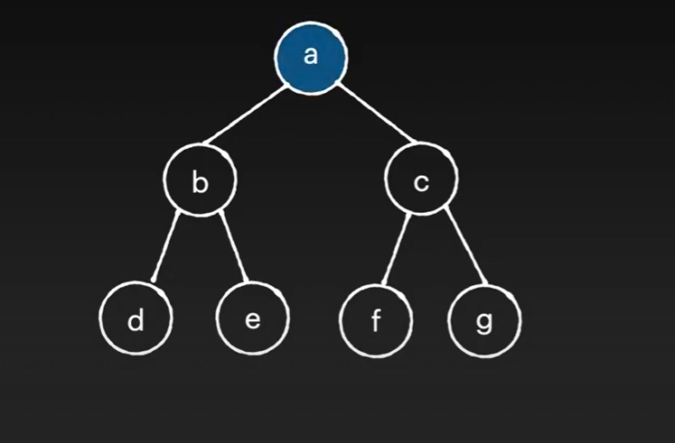

# [트리]

## 트리(Tree)

선형 자료구조인 (ex. 배열, 연결리스트, 스택, 큐)와 달리 <br>
비선형 계층적 구조 (ex. 트리)

노드의 앞 뒤 관계가 1:N 또는 N:N
즉, 하나의 노드가 다수의 하위(또는 상위) 노드들을 참조할 수 있음.


root(루트) : 트리 최상위 노드

edge(간선): 노드와 노드사이 연결선

parent(부모):자식 노드가 있는 노드

child(자식): 부모 노드의 하위 노드

leaf(리프): 트리 최하단 노드

```javascript
<title>트리 구현하기</title>
  <script>
    //node에 데이터와 자식 노드 저장
    class TreeNode{
      constructor(data){
        this.data=data;
        this.children=[];
      }
      //자식을 추가하는 매서드, 매서드 정의
      addChild(childNode){
        this.children.push(childNode);
      }
    }
   //부모 노드와 자식 노드 지정
    const root=new TreeNode("A");
    const node2=new TreeNode("B");
    const node3=new TreeNode("C");
    //자식 노드를 추가하는 매서드 사용 ,매서드 호출
    root.addChild(node2);
    root.addChild(node3);

    console.log(root); //트리 구조 확인
 </script>
</head>
<body></body>

```

### Tree의 구조


Tree 하나는 다수의 sub tree로 구성되어 있음.

부모 노드(parent): 상위 노드

자식 노드(child) : 하위 노드

형제 노드(sibling): 같은 부모를 가지고 있는 노드들

<br>
size(크기): root포함 모든 node의 수 ex. 현재 size=8

depth(깊이): node에서 root까지의 거리 ex. ‘a’ depth=0 ‘c’ depth=1 ‘h’ depth=3

height(높이): 노드 깊이의 최대값
root 노드를 기준으로 가장 깊숙히 위치한 노드까지 도착할 때 필요한 간선의 갯수

ex. ‘a’에서 ‘h’까지의 height=3

### binary tree 이진 트리

각 노드가 0에서 최대 2개까지 child 노드를 가짐.

항상 루트 노드-최상위에 있는 노드가 존재함

루트 노드는 삽입된 항목이 없을 시 null로 초기화되어 있음.

```javascript
<script>
      class Node {
        constructor(data) {
          this.data = data;
          this.left = null;
          this.right = null;
        }
      }

      class BinaryTree {
        constructor() {
          this.root = null;
        }


</script>
```

<br>

**이진 트리의 레벨(Level)**

level: 루트 노드로부터 특정 노드까지의 경로 길이 시작 레벨은 보통 1 또는 0으로 정의

레벨 i번째의 최대 노드 개수 구하는 식 : **2^(i -1)**

레벨 1 :루트 노드 하나만 존재 2^(1-1)=1

레벨 2: 2^(2-1)=2

### 이진 검색 트리

-조건

**왼쪽 자식 노드값 < 부모 노드 값**

**오른쪽 자식 노드값> 부모 노드 값**

ex. 5<10<17


### 트리 순회

**중위 순회**(in-order traversal)

왼쪽, 루트(현재 노드), 오른쪽 순으로 방문함.

left →visit →right


‘a’ 에서 시작

d 출력 →b(현재 노드 출력) →e→a→f →c(현재 노드 출력)→g(출력)

```javascript
 <script>
      class TreeNode {
    constructor(value) {
        this.value = value;
        this.left = null;
        this.right = null;
    }
}

class BinaryTree {
    constructor() {
        this.root = null;
    }

    insert(value) {
        const newNode = new TreeNode(value);
        if (this.root === null) {
            this.root = newNode;
        } else {
            this.insertNode(this.root, newNode);
        }
    }

    insertNode(node, newNode) {
        if (newNode.value < node.value) {
            if (node.left === null) {
                node.left = newNode;
            } else {
                this.insertNode(node.left, newNode);
            }
        } else {
            if (node.right === null) {
                node.right = newNode;
            } else {
                this.insertNode(node.right, newNode);
            }
        }
    }

    inOrderTraversal(node = this.root) {
        if (node !== null) {
            this.inOrderTraversal(node.left);
            console.log(node.value);
            this.inOrderTraversal(node.right);
        }
    }
}

// 트리 생성 및 데이터 삽입 (forEach 활용)
const tree = new BinaryTree();
[10, 5, 1, 6, 17, 14, 21].forEach(value => tree.insert(value));

console.log("이진 트리 중위 순회 결과:");
tree.inOrderTraversal(); // 출력: 1, 5, 6, 10, 14, 17, 21

    </script>
```

**전위 순회** (pre-order traversal)

현재 노드, 왼쪽, 오른쪽 순으로 방문함

visit → left → right



```javascript

<script>
    class TreeNode {
    constructor(value) {
        this.value = value;
        this.left = null;
        this.right = null;
    }
}

class BinaryTree {
    constructor() {
        this.root = null;
    }

    insert(value) {
        const newNode = new TreeNode(value);
        if (this.root === null) {
            this.root = newNode;
        } else {
            this.insertNode(this.root, newNode);
        }
    }

    insertNode(node, newNode) {
        if (newNode.value < node.value) {
            if (node.left === null) {
                node.left = newNode;
            } else {
                this.insertNode(node.left, newNode);
            }
        } else {
            if (node.right === null) {
                node.right = newNode;
            } else {
                this.insertNode(node.right, newNode);
            }
        }
    }

    // 전위 순회 (Preorder Traversal)
    preOrderTraversal(node = this.root) {
        if (node !== null) {
            console.log(node.value); // 루트 방문
            this.preOrderTraversal(node.left); // 왼쪽 서브트리 방문
            this.preOrderTraversal(node.right); // 오른쪽 서브트리 방문
        }
    }
}

// 트리 생성 및 데이터 삽입 (forEach 활용)
const tree = new BinaryTree();
[10, 5, 1, 6, 17, 14, 21].forEach(value => tree.insert(value));

console.log("이진 트리 전위 순회 결과:");
tree.preOrderTraversal(); // 출력: 10, 5, 1, 6, 17, 14, 21

  </script>

```

<br>

**후위 순회**

왼쪽 → 오른쪽 → 현재 노드 순으로 방문함

left →right → visit


d → e → b (visit 출력) → f → g→ c

```javascript
java script
 <script>
    class TreeNode {
    constructor(value) {
        this.value = value;
        this.left = null;
        this.right = null;
    }
}

class BinaryTree {
    constructor() {
        this.root = null;
    }

    insert(value) {
        const newNode = new TreeNode(value);
        if (this.root === null) {
            this.root = newNode;
        } else {
            this.insertNode(this.root, newNode);
        }
    }

    insertNode(node, newNode) {
        if (newNode.value < node.value) {
            if (node.left === null) {
                node.left = newNode;
            } else {
                this.insertNode(node.left, newNode);
            }
        } else {
            if (node.right === null) {
                node.right = newNode;
            } else {
                this.insertNode(node.right, newNode);
            }
        }
    }

    // 후위 순회 (Postorder Traversal)
    postOrderTraversal(node = this.root) {
        if (node !== null) {
            this.postOrderTraversal(node.left); // 왼쪽 서브트리 방문
            this.postOrderTraversal(node.right); // 오른쪽 서브트리 방문
            console.log(node.value); // 루트 방문
        }
    }
}

// 트리 생성 및 데이터 삽입 (forEach 활용)
const tree = new BinaryTree();
[10, 5, 1, 6, 17, 14, 21].forEach(value => tree.insert(value));

console.log("이진 트리 후위 순회 결과:");
tree.postOrderTraversal(); // 출력: 1, 6, 5, 14, 21, 17, 10

  </script>
```

### 일반적인 검색 방법

이진 검색은 정렬된 배열에서만 사용이 가능함.
<br>
시간 복잡도: O(log n) 탐색 범위를 절반으로 줄이므로 빠름.

### 깊이 우선 탐색 (DFS) & 너비 우선 탐색 (BFS)

**깊이 우선 탐색(Depth-First Search)**

원하는 노드를 찾거나 끝까지 다다를때 까지 한쪽 방향으로 깊이 내려가 탐색한 후 돌아오는 방식

재귀 함수나 스택을 활용함

**너비 우선 탐색(Breath-First Search)**

가까운 노드부터 탐색하는 방식

루트에서 시작하여 둘째 층을 왼쪽에서 오른쪽으로 훑어나가고, 그 다음 층 역시 왼쪽에서 오른쪽으로 훑어나가는 방식

원하는 노드를 찾거나 모든 노드를 다 확인하면 검색이 끝나는 검색(=탐색) 기법

큐 (Queue) 활용


**BFS(너비 우선 탐색)이 유리한 경우**

1. 트리가 깊고 좁은 경우(메모리 관점)
   - 각 레벨에서 처리할 노드가 적어 큐의 크기가 작게 유지됨
   - 한 번에 저장되는 노드의 수가 적음
2. 최단 경로 찾기
   - 출발지에서 가장 가까운 노드부터 탐색
   - ex. 최단거리, 최소 이동 횟수 문제제
3. 레벨 단위의 처리가 필요한 경우
   - 트리의 각 층을 순서대로 처리해야 할 때
   - ex. 조직도에서 각 직급별 처리

 <br>

**BFS(너비 우선 탐색)이 유리한 경우**

1. 트리가 넓은 경우(메모리 관점)

- 형제 노드가 많은 경우
- 현재 경로의 노드만 스택에 저장하므로 메모리 효율적

2. 경로 탐색이 필요한 경우

- 특정 경로의 존재 여부 확인
- ex. 미로 찾기, 경로 존재 확인

3. 트리의 모든 노드를 방문해야 할 때

- ex. 파일 시스템 탐색, 모든 하위 디렉토리 검색

### 활용 사례

- 전위 순회: 트리 구조 복사, 디렉토리 구조 출력
- 중위 순회: 이진 탐색 트리에서 데이터를 정렬된 순서로 출력 , 수식 트리에서 중위 표기식 생성
- 후위 순회: 디렉토리 삭제와 같은 재귀적 작업에 유용(하위 항목부터 계산)

<br>

### 기술면접 대비

- 이진트리는 계층적 데이터를 표현하는 가장 기본적인 자료구조입니다.
  각 노드가 최대 두 개의 자식을 가질 수 있어 구현이 간단하면서도 활용도가 높습니다. <br>
  -"트리 순회"는 모든 노드를 방문하는 방법을 정의합니다. 전위, 중위, 후위 순회는
  재귀적으로 구현되며, 각각 다른 순서로 노드를 방문하여 서로 다른 용도로 활용됩니다.<br> -실무에서는 주로 이진 탐색 트리나 힙과 같은 특수한 형태의 이진 트리를 많이 사용하며
  이는 데이터베이스 인덱싱이나 우선순위 큐 구현에 활용됩니다.

<br>

**퀴즈**

이진 트리를 입력받아 전위 순회(preorder traversal), 중위 순회(inorder traversal), 후위 순회(postorder traversal)한

결과를 출력하는 프로그램을 작성하시오.

```
7
A B C
B D .
C E F
E . .
F . G
D . .
G . .
```

## 🔗 출처

- https://www.youtube.com/watch?v=QXuvE0Pon4g&t=498s

- https://artien.tistory.com/entry/%EC%9D%B4%EC%A7%84-%ED%8A%B8%EB%A6%ACBinary-Tree%EC%9D%98-%EA%B5%AC%EC%A1%B0%EC%99%80-%EC%88%9C%ED%9A%8C
- https://catnails.tistory.com/536
