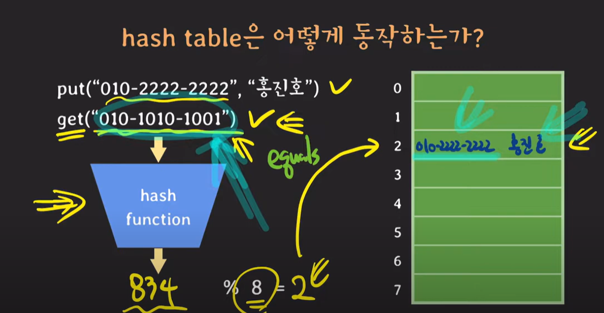
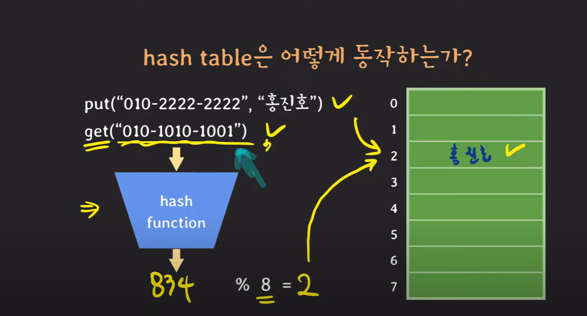
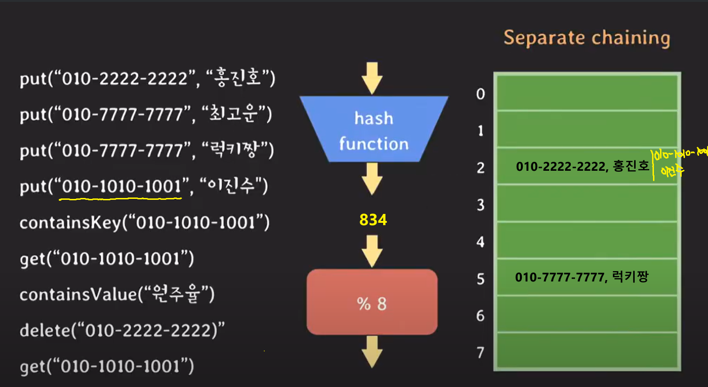
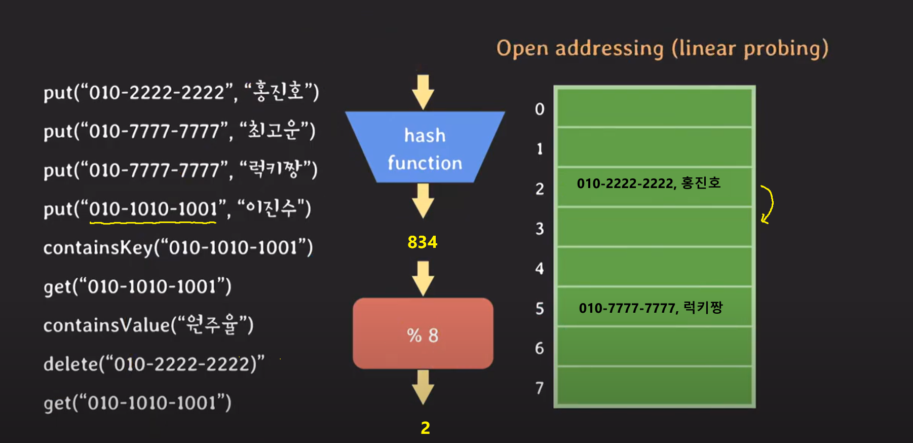
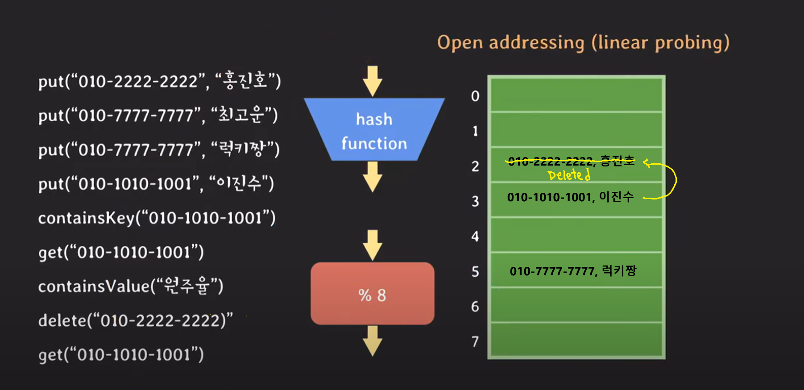

# [해시]

## 해시(Hash)

### 맵(Map)

key- value쌍을 저장하는 자료구조

associative array, dictionary 라고 불리기도 함

같은 key를 가지는 pair(key-value 한 쌍)는 최대 한 개만 존재 (즉, key는 중복되지 않음 , value는 중복이 됨)

### Map 구현체

-**hash table**

-tree-based

### Hash table(해시 테이블)

key(키)-value(값) 의 대응으로 이루어진 표(테이블)와 같은 형태의 자료구조들

- `장점`

**상수 시간으로 데이터에 접근**하기 때문에 검색 속도가 "빠름"

입력과 무관하게 항상 일정한 속도를 보장함.  
**시간복잡도 : O(1)**

- `단점`

많은 메모리 공간을 소모함

**해시 테이블의 구조**

키를 얻고자 하는 데이터는 버킷에 저장되어 있음 
  버킷들을 통해 배열을 형성하고 해시 함수는 키를 인자로 활용해 인덱스를 반환함 

키를 해시 함수에 통과시켜 원하는 버킷에 접근하는 구조로 되어있음

### 해시 함수란?  

임의의 크기를 가지는 type의 데이터를 고정된 크기를 가지는 type의 데이터로 변환하는 단방향 함수

단방향 함수이기에 특정 입력 데이터를 고정된 길이의 해시 값으로 변환할 수는 있지만 
반대로, 해시 값을 토대로 어떤 데이터가 입력되었는지 도출하기는 어려움이 존재함

해시 값은 문자열이 한 글자만 달라져도 완전히 다른 결과를 도출함  

**Hash Function**  
 
put(”key”, “value”)  
put("010-2222-2222","홍진호")

 hash = 834 % 8 =2 

**Hash collision(해시 충돌)**

- key는 다른데 hash가 같을 때

- key도 hash도 다른데 hash% map_capa 결과가 같을 때
   

**Hash collision 해결 방법**

- separate chaining

- 
open addressing 
  

**separate chaining(체이닝)** 
충돌이 발생한 데이터를 연결 리스트로 추가하는 방법 

- 다른 value 값이 존재할 때
   
   
  37 mod 8 = 5  
  value가 동일한 지 equal test 하고 동일하면 새로운 value를 저장함
   
- 다른 key 값, value 값이 존재할 때 (즉, Hash collision)
   
  각 버킷을 링크드 리스트로 다음 노드에 추가됨 
- `containskey("010-1010-1001")` 

   
  찾는 키가 있을 시, True 리턴

- `get("010-1010-1001")`  
  저장된 value 값인 "이진수"를 리턴
- `delete("010-2222-2222")`  
  해당 key 값을 찾아서 삭제하라는 의미

  ### open addressing  

  충돌이 발생했을 때 충돌이 발생한 버킷의 인덱스가 아닌 다른 인덱스에 데이터를 저장하는 방법 

**linear probing(선형 조사법)**
   
 다른 key 값이 존재할 때(Hash collision)   충돌이 발생한 인덱스의 다음 인덱스 slot을 찾아서 저장 

- `containsKey("010-1010-1001")`  
  동일한 key가 나올 때까지 다음 버킷을 확인한 후, 동일한 key가 나오면 True 반환  
- ` get("010-1010-1001")` 
  저장된 value값인 "이진수" 반환  
- `delete("010-2222-2222")` 
  2번에 저장되어 있는 key,value 값을 제거한 후 다음 인덱스 값을 가져오거나 더미 값(deleted)을 넣어줘야함  
   

  **
 단점** 
  해시 충돌이 발생하는 인덱스 인근에 충돌이 발생한 여러 데이터가 몰려 저장될 수 있음(군집화 현상)  

**
 double hashing(이중 해상)** 
2 개의 해시 함수를 사용하는 방법으로,  
충돌이 발생했을 때 다른 해시 함수에
대한 해시 값만큼 떨어진 거리에 위치한 인덱스를 찾는 방법

- `장점` 
  무작위로 인덱스가 생성되어 선형 조사법의 군집화 문제를 피할 수 있음  
- `단점`  
  연산 속도 저하  
  테이블 크기가 소수여야 최적의 성능 발휘  
   

### 퀴즈

- 
해시값이 충돌했을 때, 어떤 방식으로 처리할 수 있을까요?
- Double Hashing 의 장점과 단점에 대해서 설명하고, 단점을 어떻게 해결할 수 있을지 설명해 주세요.

### 
출처  

- https://www.youtube.com/watch?v=ZBu_slSH5Sk&t=598s(쉬운코드)  
- 도서 [이것이 취업을 위한 컴퓨터 과학이다 with CS 기술면접]
