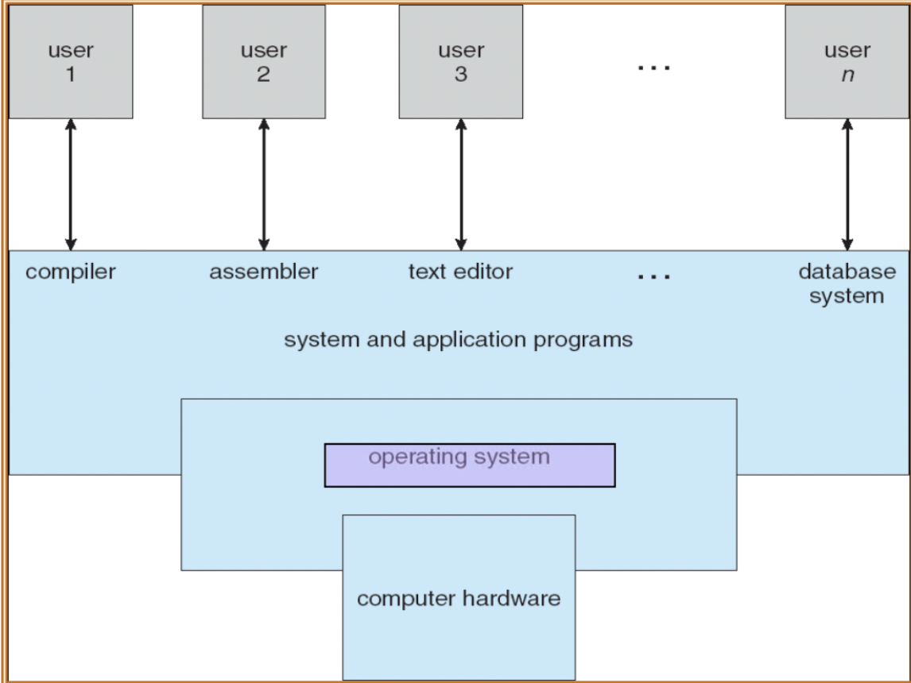

# 운영체제와 컴퓨터

## 정의

> 운영 체제(Operating System)는 컴퓨터 하드웨어를 관리하고 프로그램의 실행을 제어하는 프로그램이다.

 

OS가 사용하는 언어

- OS는 low-level의 system을 관리하기 위해 어셈블리어까지 포함된 language를 쓴다.
- high-level language는 쓰이지 않는다.
  - 하드웨어를 제어하고 빠른 response time이 중요하기 때문이다.
  - ex) Linux의 소스코드는 대부분 c코드고 중간에 가끔 어셈블리어로 작성되어 있다.
    ( Linux 또한 main 함수가 존재하는 프로그램이다.)

 

## **computer hardware 구성요소**

- CPU
- memory
- I/O Device (마우스, 키보드 등) < Device Drivers
- Storage (SSD, HDD, USB 등 데이터 저장 공간) < File System
  - OS가 관리 ( Device Drivers, File System 등은 OS 내에 있는 프로그램이다.)
  - OS가 없으면 프로그램 실행 불가능

 

## **OS의 역할**

- Hardware management (하드웨어 관리)

  - Access to I/O devices
  - Access to files (file은 storage에 있다.)
  - Accounting : 하드웨어를 어떻게 쓰는 지에 대한 통계 정보
    - ex) Windows : 작업관리자, 장치관리자 | Linux : /proc (디렉토리)
  - Error detection : 하드웨어를 잘못쓸 때 검열
    - ex) 프로그램에서 array 사용 시 잘못 접근 했다면 segmentation fault 발생

- Program execution (프로그램 실행)
  - Scheduling : task, process를 어떻게 쓸 것 인가 결정
    - process : 현재 수행하고 있는 프로그램 (사용자가 더블 클릭하여 실행하지만 백그라운드에서도 존재한다.)
    - ex) 39개의 process 중 1개를 선택하는 것이 scheduling이다.
  - Error reporting

 

## **OS의 위치**

> OS는 application program (응용 프로그램)과 computer hardware 사이에 위치한다. 만약 응용 프로그램이 직접 하드웨어에 접근하면 하드웨어가 망가진다.

User level program : OS 코드에 존재하지 않는다 <-> kernel level

- 응용 프로그램
  - 앱 (ex. 게임, 인터넷 브라우저, ppt 등 특정 일을 하기 위한 목적이 있다.)
  - 직접적인 하드웨어 접근이 불가능
  - OS가 제공하는 API(system call)를 응용 프로그램이 호출한다.
    ex) read/write (하드웨어인 디바이스를 읽고 쓰기), fork 등
- 시스템 프로그램
  - 시스템을 관리하기 위한 프로그램
  - ex) 윈도우 탐색기, 작업관리자, 장치관리자

 

## **OS의 목적**

- user program을 실행 및 user problem 해결 용이성 제공
  - user program을 실행하고 사용자가 발생하는 문제를 해결하기 위해 필요한 도구와 환경을 제공한다.
- computer system의 편리한 사용
  - 사용자가 시스템을 쉽게 조작하고, 파일을 관리하고, 프로그램을 실행하는 등의 작업을 수행할 수 있도록 한다.
- 컴퓨터 하드웨어의 효율적인 활용
  - 자원 할당 및 관리를 최적화하여 시스템의 성능을 향상시키고, 자원의 낭비를 방지한다.

DOS -> windows -> iPAD 점점 사용하기 편리하도록 발전하고 있다.

 

## **kernel**

컴퓨터에서 항상 실행되는 하나의 프로그램은 **kernel** 또는 OS이다.
그 외의 모든 것은 system program 또는 application program이다.

- kernel : OS의 핵심이며 computer system의 모든 기능을 관리하고 제어한다.
- system program : OS와 함께 제공되는 프로그램으로, computer system의 운영을 지원하고 보조 기능을 제공한다.
- application program : 사용자가 직접 실행하는 프로그램으로, 특정 작업을 수행하기 위해 설계되었다.

OS를 설치할 때 kernel, system program, application program이 포함된 distribution (배포판)이 설치된다.

 

 

## Resources

-> 모든 computer system은 위와 같은 동일한 형태를 가지고 있다.

- 모든 device들은 controller가 존재한다.
- DMA, interrupt를 통해 서로 상호작용한다.
- 중요한 것은 memory!
  - disk나 device에서 data를 읽으면 물리적으로 memory로 올린다.
  - CPU는 memory에 있는 프로그램을 실행한다.
    - CPU가 직접적으로 interaction할 수 있는 장치는 memory이다.
- 하나 이상의 CPU (중앙 처리 장치)와 device controllers가 common bus를 통해 연결되어 shared memory에 접근할 수 있다.
- CPU와 device가 memory cycle을 경쟁하며 동시에 실행된다.

 

## Computer system의 기본적인 동작

- 네 가지 기본 원칙
  - Computer system I/O operation
  - I/O structure
  - Interrupt
  - Storage structure

 

### 1. Computer-system I/O operation

- 각 device controller는 특정한 device type을 담당한다. (각 장치마다 controller가 존재)
  - device controller는 local buffer를 가진다.
- I/O (입출력)는 data를 main memory와 local buffer 간에 이동시키는 것을 말한다.
- DMA (Directly Memory Access)를 통해 I/O device와 CPU는 동시에 실행될 수 있다.
- Device controller는 작업이 완료되었음을 interrupt를 발생시킴으로써 CPU에게 알린다.

이러한 과정을 통해 computer system은 I/O device와 CPU가 효율적으로 작동하여 작업을 수행할 수 있다.

 

### 2-1. I/O structure

- I/O transaction은 I/O device에게 명령을 내려 데이터를 읽거나 쓰는 연산으로, bus를 통해 수행된다.
  - I/O transaction은 연산 버스를 거쳐야 하기 때문에 bus transaction이라고도 한다.
  - bus는 address, data, control signal을 전송하는 와이어의 집합이다.
    - A system bus : CPU와 I/O bridge 연결
    - A memory bus : I/O bridge와 memory 연결
    - I/O bus : 일반적으로 여러 device들이 공유한다.
-
- 일반적으로 DMA가 사용된다.
  - device가 CPU의 개입 없이 자체적으로 I/O transaction을 수행하는 과정이다.
  - DMA를 사용하면 CPU가 처음에 initiate를 한 이후로 전송이 진행되는 동안 다른 작업을 수행할 수 있다.

 

### 2-2. DMA operation (Directly Memory Access)

- DMA operation의 수행 단계
  - CPU가 Disk controller에게 data, file을 읽으라는 명령을 날린다.
  - 읽은 data, file들이 memory로 이동한다.
  - I/O가 끝났을 경우, device controller에서 CPU에게 interrupt를 하여 일이 끝났다는 것을 알려준다.

> DMA operation은 CPU가 처음에만 initiate를 한 후 그 이후에는 동작에 관여하지 않는 것이다. 즉, I/O transaction을 CPU의 간섭 없이 하는 것을 말한다. (원칙적으로 I/O transaction은 CPU가 하는 역할이다.)

- DMA가 중요한 이유
  - CPU가 첫 명령 이후 다른 일을 수행할 수 있게 된다.
    - ex) process a,b,c 중 a에서 read 함수를 호출했을 때 CPU는 처음에만 명령을 내린 후 process b,c 중 하나를 선택하여 수행할 수 있게 된다.
      ( 물리적으로 I/O transaction은 일어나고 있다.)
  - 효과적으로 멀티태스킹이 가능하게 되고 한정되어있는 CPU를 효과적으로 사용할 수 있다.

 

### 3-1. Interrupt (hardware)

- I/O transaction이 끝났음을 device controller(I/O 담당, hardware interrupt 유발)가 CPU에게 알려주는 것을 말한다.
  - CPU가 signal을 받고 일이 끝났다는 것을 확인 하면 unconditionally, immediately ISR(interrupt service routine)을 수행한다.
  - I/O transaction 수행 중에 CPU는 다른 process 중 하나를 수행하는데 line by line으로 수행하다가 만약 I/O가 끝났다는 interrupt를 받으면 다른 process 수행을 잠깐 멈추고 ISR을 수행한다.
- interrupt는 interrupt vector를 통해 ISR에 제어를 전달한다.
  - ISR의 address를 알기 위해서는 interrupt vector를 look up 해야한다.
    - interrupt vector는 interrupt number와 해당 ISR의 address로 이루어진 table이다.
    - interrupt vector는 모든 ISR의 address를 포함하고 있다.
- interrupt architecture은 interrupt가 발생하기 전 수행하던 명령어의 address를 저장해야 한다.
  - ISR 완료 후 복귀할 때 interrupt 발생 전 수행하던 process가 다시 수행되기 위해서이다.
    - 하지만, scheduling으로 인해 다른 process를 수행할 수도 있다. ISR이 끝날 때 scheduling decision이 내려진다.
- OS는 interrupt 기반으로 동작한다.
  - ex) time interrupt
    - interrupt source 중 time device controller가 존재하고 주기적으로 10ms마다 interrupt를 발생시킨다.

 

#### program counter register로 표현한 Interrupt의 과정

- 빨간색 화살표는 Program counter register를 나타낸다.
  - program counter는 CPU 안에 있는 register이다.
  - 다음에 수행될 명령어의 주소를 나타낸다.
- process A의 interrupt가 발생했을 때 program counter register의 순서

  - '0' : interrupt vector를 look up하며 ISR A의 주소를 찾는다.
  - '1000' : ISR A를 수행한다.
  - '100' : interrupt 발생 전 수행하던 program을 수행한다.

   

### 3-2. Interrupt-driven I/O

1. device driver가 I/O를 initiate한다. CPU는 처음 첫 initiate후에는 다른 일을 수행한다.
2. I/O transaction을 수행한다.
3. input ready, output complete, 혹은 error 발생은 interrupt를 발생시킨다.
4. CPU가 interrupt를 받으면 interrupt handler에게 제어를 전달한다.
   - interrupt handler는 ISR과 동일한 개념이다.
   - 수행하고 있던 다른 task는 중단된다.
5. interrupt handler가 data를 처리하고 interrupt에서 return한다.
   - 이때 interrupt vector를 look up하고 ISR을 수행한다는 뜻이다.
6. CPU가 중단된 task의 처리를 다시 시작한다.

 

### 4. Storage structure

storage : data가 저장될 수 있는 하드웨어

1. Primary storage
   - CPU가 직접 interaction하는 data 저장 공간
   - Main memory : 프로그램 실행 중에 필요한 데이터와 명령어를 보관하며, CPU가 이에 직접 접근하여 작업을 처리한다.
   - ex) DRAM (Dynamic Random Access Memory)
   - volatile (전원을 끄면 데이터가 사라진다. file 저장 불가)
2. Secondary storage
   - data 저장소
   - Data storage
   - ex) SSD,HDD,Flash(NAND)
   - non-volatile
3. Tertiary storage
   - Backup
   - ex) Tape
   - non-volatile

이러한 저장 구조는 컴퓨터 시스템에서 데이터를 효율적으로 보관하고 관리하는 데 사용되며 main memory는 빠른 액세스 속도를 제공하여 프로그램 실행을 지원하고, secondary storage는 대용량의 데이터를 영구적으로 보관하여 필요할 때에 접근할 수 있도록 한다.

-> 계층적으로 구성되어 있으며 위로 갈수록 빠르고 가격이 비싸다.

- Caching

  - 컴퓨터 시스템에서 매우 중요한 개념으로 주로 데이터나 명령어의 읽기 작업을 가속화하기 위해 사용된다.
  - ex) 만약에 storage를 SSD+HDD로 구성한다면 (SSD가 데이터 접근이 빠르고 더욱 비싸다.) 1TB의 SSD, 9TB의 HDD로 구성하여 자주 접근하는 data를 SSD에 보관하고 그렇지 않은 것들은 HDD에 보관한다. -> cost 측면에서 중요 !

- storage에 access하는 방법
  - 빠른 storage (cache) 우선 접근
    - 빠른 storage인 캐시를 먼저 확인하여 정보가 있는지 여부를 결정한다.
    - 정보가 캐시에 있다면, 해당 정보는 캐시에서 직접 사용되고 이는 매우 빠른 access를 제공한다.
    - 정보가 캐시에 없다면, 데이터가 캐시로 복사되고 거기서 사용된다.
  - cache가 storage보다 작다.
    - 캐시는 보통 storage (ex.main memory) 보다 작다. 이는 캐시에 저장될 수 있는 데이터 양이 제한되어 있음을 의미하고 따라서 캐시 관리가 중요하다.
    - 캐시 size, 교체 정책이 필요하다.

* storage에 I/O하여 파일의 크기가 아주 큰 파일을 저장할 때의 2가지 방법
  - prefatching : DRAM에 미리 저장하는 것이다.
  - caching

 

## Computer system 종류

- 3가지의 system
  - multi-processors systems : 여러개의 cpu 존재
  - multi-core systems : 한개의 cpu 칩에 여러개의 core가 존재 (여러개의 연산 유닛)
    - process가 여러 개 있어도 각각 매칭하여 동시에 실행이 가능하다 (load balancing)
  - single-core systems
    - 성능을 향상시키기 위해서 frequency를 올리려고 했지만 발열과 전력 소모가 심하여 멀티 코어 시스템이 대세가 되었다.

 

## 추가 개념

- CPU scheduling

  - CPU가 하나일 때 동시에 실행할 준비가 된 여러 job들 중에 하나를 선택하는 것

- Job scheduling

  - 메모리에 가져올 준비가 된 여러 job이 있고 메모리 공간이 부족한 경우

- swapping in/out

  - 만약 프로세스가 메모리에 들어가지 않는다면 swapping을 통해 프로세스를 메모리로 이동시킨다.
    ex) 내가 요청한 job이 메모리에 없다면 secondary storage에 있는 job을 메모리에 swapping in을 한다. 그렇다면 메모리에 있던 다른 job이 swapping out된다.

- virtual memory

  - 완전히 메모리에 올라와 있지 않은 프로세스도 실행할 수 있다.
  - 만약 현재 프로그램 100개를 실행 중이어도 physical memory 공간은 더 적다. 하지만 사용자가 쓰는 공간은 virtual memory 공간으로 인해 100이라고 말한다.
  - ex) int a[4] / printf(&a[0]) 을 했을 때 출력되는 주소는 virtual address이다. (0x00000000 ~ 0xffffffff)

- 실행 중인 프로그램을 process (task, job) 라고 한다.

- 프로그램이 수행되기 위해서는 반드시 memory에 올려야 한다.
- 만약 100개의 프로세스가 존재할 때 메모리에 담을 수 있는 공간이 4개 밖에 없다면 OS는 올릴 프로세스들을 선택해야 한다. <- job scheduling
- 실제로는 프로세스를 page 단위로 쪼개어 특정 프로세스의 특정 page만 메모리에 올린다. <- page scheduling

 

## 질문

### 인터럽트가 무엇인지 설명해 주세요.

 

## 출처

도서 Operating System Concepts - Abraham Silberschatz , Peter Baer Galvin , Greg Gagne
