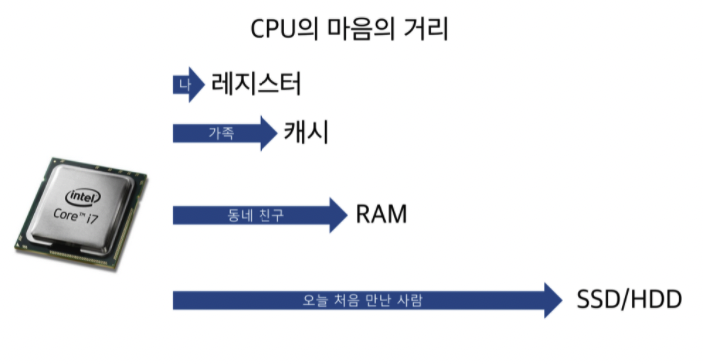
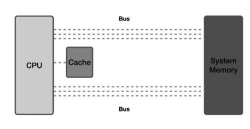
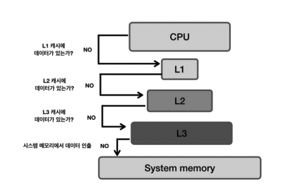

- [⚙️ 메모리](#️-메모리)
  - [\[메모리의 특징\]](#메모리의-특징)
- [🔗 레지스터(Register)](#-레지스터register)
  - [\[CPU 내부 레지스터 종류\]](#cpu-내부-레지스터-종류)
- [🔗 캐시(Cache)](#-캐시cache)
  - [\[사용 목적\]](#사용-목적)
  - [\[캐시 종류\]](#캐시-종류)
- [🔗 메인 메모리](#-메인-메모리)
- [🚀 퀴즈](#-퀴즈)
- [✈️ 출처](#️-출처)

## ⚙️ 메모리

- CPU가 **직접 접근**할 수 있는 기억장치
- 프로세스가 실행되려면 프로그램이 **메모리에 올라와야함**
- 프로그램 실행 시 필요한 주소, 정보들을 저장하고 가져다 사용할 수 있게 만드는 공간

 

### [메모리의 특징]

1. 지역성(locality): 데이터 접근이 시간적, 혹은 공간적으로 가깝게 일어나는것
   - 시간적 지역성(Temporal locality): 액세스 된 기억장소와 인접한 기억장소가 액세스 될 가능성이 높음
   - 공간적 지역성(Spatial locality): 액세스 된 기억장소와 인접한 기억장소가 액세스 될 가능성이 높음
2. 지역성 원리를 이용하여 계층으로 구성됨
   - 위로 갈수록 `접근 시간 감소`, `속도 증가`, `비용 증가`, `용량 감소`
     
3. 성능 결정 요인: `용량`, `접근 시간`, `사이클 시간`, `가격`, etc...
4. 메모리를 필요에 따라 여러 종류로 나누면 CPU가 메모리에 더 빨리 접근 가능
   
   > 각각의 특징이 있는 서로 다른 종류의 저장 장치를 함께 사용하여 최적의 효율을 낼 수 있음
   > |명칭|위치|접근속도|기억용량|휘발성여부|
   > |------|---|---|---|---|
   > |레지스터|CPU 내부|가장 빠름|가장 적음|휘발성|
   > |캐시|CPU 내부|빠름|적음|휘발성|
   > |메모리(주기억장치)|CPU 외부|보통|보통|휘발성|
   > |하드 디스크(보조기억장치)|CPU 직접 접근 불가|느림|많음|비휘발성|

 

## 🔗 레지스터(Register)

- CPU가 요청을 처리하는 데 필요한 데이터를 일시적으로 저장하는 기억장치
  - CPU는 자체적으로 데이터 저장 X -> 메모리로 직접 데이터 전송 못함
  - 연산을 위해서 반드시 레지스터를 거쳐야 하며, 레지스터는 특정 주소를 가리키거나 값을 읽어올 수 있음

 

### [CPU 내부 레지스터 종류]

| 종류                                               | 설명                                                                          |
| -------------------------------------------------- | ----------------------------------------------------------------------------- |
| 프로그램 계수기(PC, Program Counter)               | 다음에 실행할 명령어(instruction)의 주소를 가지고 있는 레지스터               |
| 누산기(AC, ACcumulator)                            | 연산 결과 데이터를 일시적으로 저장하는 레지스터                               |
| 명령어 레지스터(IR, Instruction Register)          | 현재 수행 중인 명령어를 가지고 있는 레지스터                                  |
| 상태 레지스터(SR, Status Register)                 | 현재 CPU의 상태를 가지고 있는 레지스터                                        |
| 메모리 주소 레지스터(MAR, Memory Address Register) | 메모리로부터 읽어오거나 메모리에 쓰기 위한 주소를 가지고 있는 레지스터        |
| 메모리 버퍼 레지스터(MBR, Memory Buffer Register)  | 메모리로부터 읽어온 데이터 또는 메모리에 써야할 데이터를 가지고 있는 레지스터 |
| 입출력 주소 레지스터(I/O AR, I/O Address Register) | 입출력 장치에 따른 입출력 모듈의 주소를 가지고 있는 레지스터                  |
| 입출력 버퍼 레지스터(I/O BR, I/O Buffer Register)  | 입출력 모듈과 프로세서 간의 데이터 교환을 위해 사용되는 레지스터              |

 

## 🔗 캐시(Cache)

- 사용되었던 데이터는 다시 사용될 가능성이 높다는 개념을 이용하여 데이터나 값을 미리 복사해둔 임시 저장소
- 캐싱(Caching): 캐시라고 하는 더 빠른 메모리 영역으로 데이터를 가져와 접근하는 방식
  

 

### [사용 목적]

1. CPU와 메모리 간의 속도 차이 개선
2. 시스템의 효율성 향상
   - 기존 데이터 접근 시간 단축
   - 값을 다시 계산하는 시간 절약
3. 속도가 빠른 장치와 느린 장치 사이에서 속도차에 따른 병목 현상을 완화기 위한 범용 메모리

 

### [캐시 종류]

1. CPU 캐시
> 대용량의 메인 메모리 접근을 빠르게 하기 위해 CPU 칩 내부나 바로 옆에 탑재하는 작은 메모리로, 하드웨어를 통해 관리함
  

|종류|설명|CPU 성능에 직접적인 영향|
|---|---|------|
|L1 캐시|일반적으로 CPU 칩안에 내장되어 데이터 사용 및 참조에 가장 먼저 사용되는 캐시 메모리|O|
|L2 캐시|- L1 캐시 메모리와 용도와 역할이 비슷  - 속도 : L1 캐시 > L2 캐시 > 일반메모리(RAM)| O|
|L3 캐시|- L1 캐시, L2 캐시와 동일한 원리로 작동  - 대부분 CPU가 아닌 메인보드에 내장|X|

 

2. 디스크 캐시(=디스크 버퍼)
> 하드 디스크에 내장된 HDD 컨트롤러가 작업을 처리할 때 RAM, DRAM, NAND 플래시 등의 메모리를 활용하며, 이러한 메모리들이 디스크 캐시 역할을 함

 

`캐시가 효율적으로 동작하기 위해서는 캐시가 저장할 데이터가 지역성을 가져야 함`
1. 캐시 히트(Cache Hit)
- CPU나 프로그램이 필요한 데이터가 캐시 메모리에 이미 존재하는 경우, 메모리까지 접근할 필요 없이 캐시에서 바로 데이터를 가져옴

> **캐시 히트의 장점**
> 1. CPU의 연산 속도를 유지할 수 있음
> 2. 메모리(RAM) 접근을 최소화하여 시스템 성능 향상

 

2. 캐시 미스(Cache Miss)
- CPU가 원하는 데이터가 캐시 메모리에 없는 경우, 데이터를 RAM이나 보조 기억 장치(HDD, SSD)에서 가져와야하므로 속도가 느려짐
- 데이터를 가져오는 과정에서 시스템 버스를 통해 전송되므로 성능 저하 발생

> **캐시 미스 유형**
> 1. Compulsory Miss: 처음 접근하는 데이터인 경우
> 2. Capacity Miss: 캐시 용량이 작아 데이터를 담지 못하는 경우
> 3. Conflict Miss: 캐시 슬롯을 공유해야 하는 경우처럼 매핑 방식의 한계로 인해 실제 데이터가 캐시에 있는데도 불구하고 히트 되지 않는 경우'

 

3. 캐시 매핑(Cache Mapping)

|매핑 방식|특징|장점|단점|
|---|---|---|---|
|직접 매핑 (Direct Mapping)|한 번에 한 위치에만 저장 가능|구현이 간단하고 빠름|컨플릭트 미스 발생 가능|
|연관 매핑 (Fully Associative Mapping)|캐시의 모든 블록 중 어디든 저장 가능|캐시 활용도가 높음|탐색 속도가 느림|
|집합 연관 매핑 (Set Associative Mapping)|캐시를 여러 개의 집합으로 나누어 저장|직접 매핑과 연관 매핑을 섞어 균형을 맞춤|하드웨어 복잡성 증가|

 

## 🔗 메인 메모리
- 주기억장치로, 컴퓨터에서 다양한 데이터를 기억하는 컴퓨터 하드웨어 장치
- RAM(Random Access Memory): `휘발성` 기억 장치
  - 빠른 액세스를 위해 데이터를 단기간 저장하는 장치
  - 사용자가 요청하는 프로그램이나 문서를 스토리지 디스크에서 메모리로 로드하여 각각의 정보에 접근
  - CPU의 연산 및 동작에 필요한 모든 데이터를 저장하는데, 휘발성이므로 컴퓨터가 종료되면 모든 데이터가 삭제됨
  - DRAM, SRAM이 존재하는데 주기억장치로는 주로 DRAM, 캐시나 레지스터로는 SRAM 사용
> ### [DRAM vs SRAM]
> **DRAM - Dynamic RAM**
> - 동적 메모리로, 주로 대용량의 기억장치에 사용되며 가격이 저렴함
> - 전원이 계속 공급되더라도 주기적으로 재충전되어야 기억된 내용을 유지할 수 있음
> 
> **SRAM - Static RAM**
> - 정적 메모리로, 접근 속도가 빠르고 가격이 비싸기 때문에 주로 캐시 메모리나 레지스터로 사용됨

 

- ROM(Read Only Memory): 고정 기억 장치
  - 컴퓨터에 데이터를 영구적으로 저장하는 `비휘발성` 메모리
  - 컴퓨터가 종료되도 기억된 내용이 사라지지 않음
  - ROM은 주로, 기본 입출력 시스템(BIOS), 자가 진단 프로그램 같은 변경 가능성이 희박한 시스템 소프트웨어를 기억시키는데 이용함

- 보조 기억 장치(Secondary Memory)
  - 물리적 디스크가 연결되어 있는 기억장치
  - HDD, SSD가 보조 기억 장치에 해당하며, 컴퓨터가 종료되도 데이터가 사라지지 않음(`비휘발성`)
  - CPU와 직접적인 자료 교환 불가능 -> 메모리를 통해 교환
  - 접근 시간이 오래 걸림
  - 일반적으로, CPU에 데이터를 저장할 때는 DMA(Direct Memory Access) 방식 이용

 

## 🚀 퀴즈
- L1, L2 캐시에 대해 설명해 주세요.
- 캐시 메모리의 Mapping 방식에 대해 설명해 주세요.

 

## ✈️ 출처

[출처1](https://github.com/devSquad-study/2023-CS-Study/blob/main/OS/os_memory_hierarchy.md)