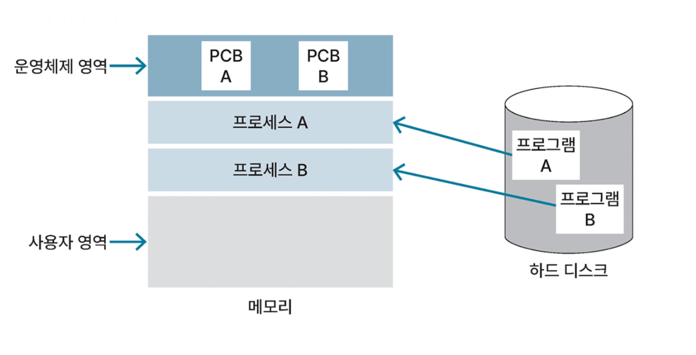
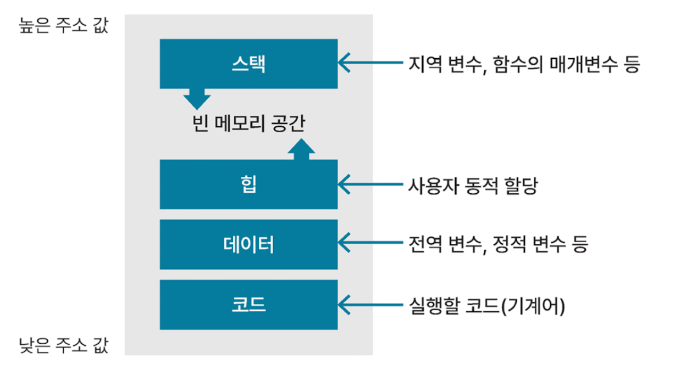
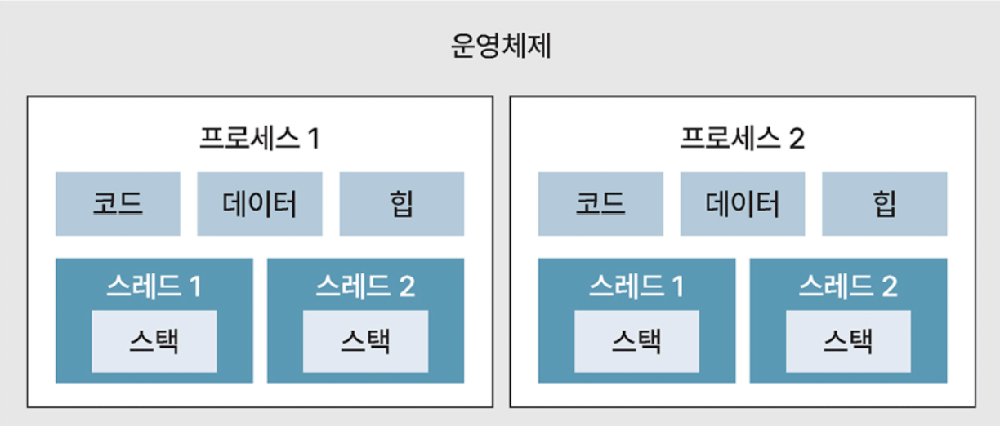
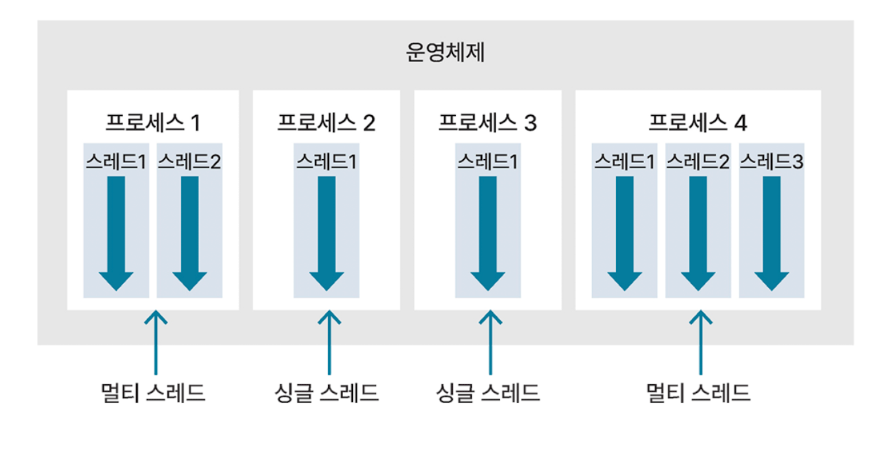

# [프로세스와 스레드]

##  프로세스(Process)

컴퓨터에서 실행 중인 하나의 프로그램

 

**실행중인 프로그램**

- 커널에 등록되고 커널의 관리하에 있는 작업
- 각종 자원들을 요청하고 할당 받을 수 있는 개체

  

OS는 프로그램을 실행하면서 디스크에 저장된 데이터를 메모리로 로드함

프로세스는 OS로부터 독립된 메모리 영역을 할당받으며, 다른 프로세스의 메모리 영역에 접근할 수 없음

**프로세스 메모리 영역 구조**

**스택(stack)** : 지역 변수, 함수의 매개변수(parameter),
반환되는 주소 값 등이 저장되는 영역
높은 주소값에서 낮은 주소 값으로 메모리가 할당되며,
영역 크기는 컴파일 때 결정됨

**힙 (heap)** : 사용자에 의해 동적 메모리 할당이 일어나는 영역  
낮은 주소값에서 높은 주소 값으로 메모리가 할당되며 영역 크기는 런타임 때 결정됨

**데이터(data)** : 전역 변수, 정적 변수, 배열, 구조체 등이 저장되는 영역

세부적으로는 BSS(Block Stated Symbol) 영역과 데이터 영역으로 다시 나눌 수 있음 BSS 영역은 초기하하지 않은 변수를, 데이터 영역은 초기화한 변수를 저장함

**코드(code)** : 실행할 코드가 기계어로 컴파일되어 저장되는 영역 , 텍스트(text) 영역이라고도 함

 
코드 영역과 데이터 영역은 선언할 때, 그 크기가 결정되는 정적 영역이지만, 스택 영역과 힙 영역은 프로세스가 실행되는 동안 크기가 늘어났다 줄어들기도 하는 동적 영역임
 또한, 서로 다른 프로세스 간의 메모리 공간 접근은 허용되지 않음

##  스레드(thread)

프로세스에서 실제로 실행되는 흐름의 단위

프로세스 메모리 공간을 이용하고, 지역 변수를 저장하는 스택 영역을 할당받음

같은 프로세스에 속한 다른 스레드와 코드, 데이터 섹션, 그리고 열린 파일이나 신호와 같은 운영체제 자원들을 공유함

## 멀티 프로세스

하나의 어플리케이션을 여러 프로세스로 구성하여 하나의 작업을 처리하도록 하는 것

### `특징`

- 프로세스 여러 개로 구성하여 안정적임

- 독립적인 메모리를 할당받음

- 프로세스 간에 통신을 하기위해 IPC(Inter Process Communication)를 통해 공유해야함

- 메모리를 많이 사용함.

- 스케줄링에 따른 Context Switching이 많아지고, 성능 저하의 우려가 있음

 

## 멀티 스레드

하나의 프로그램을 여러 스레드로 구성하여 하나의 스레드가 각자 다른 작업을 처리하는 것

### `특징`

- 스레드 간에 힙, 데이터, 코드 영역을 공유함

  →콘텍스트 스위칭할 때 오버헤드가 적게 발생하고 IPC를 사용하지 않아 멀티 프로세스의 단점을 보완할 수 있음

- 자원 공유가 쉬움  
  → 시스템 처리 비용이 적고 프로그램 응답 시간도 단축됨

- 멀티프로세스 구조에서 각각의 스레드가 다른 프로세스에서 병렬로 수행될 수 있음

- 자식 스레드 중 하나에 문제가 생긴 경우, 전체 프로세스에 영향을 줄 수 있음

 

### 콘텍스트 스위칭이란?

멀티 프로세스 환경에서 CPU가 처리 중인 프로세스 정보를 바꾸는 것

**인터럽트(interrupt)**

프로세스를 처리하다가 입출력 관련 이벤트가 발생하거나 예외 상황이 발생할 때 이에 대응할 수 있게 CPU에 처리를 요청하는 것

인터럽트가 발생하는 경우는 입출력이 발생할 때, CPU 사용시간이 만료되었을 때, 자식 프로세스를 생성할 때가 있음

CPU가 멀티 프로세스를 처리하기 위해 CPU 스케쥴러에 의해 인터럽트가 발생하면서 콘텍스트 스위칭이 이루어짐

콘텍스트(context): 처리 중인 프로세스의 정보

그림에서 처리 중인 프로세스는 P1이고, 처리해야 할 프로세스는 P2

- CPU가 P1을 처리하던 중 OS에 의해 인터럽트가 발생
- P1은 유휴상태로 변하고 스케줄러는 처리 중인 작업 정보를 P1의 PCB에 저장함
- P2의 PCB에 있는 정보를 가져와 레지스터에 로드하고 CPU가 P2를 처리하기 시작함
- P1의 정보를 P1의 PCB에 저장하고 P2의 상태를 P2의 PCB에 저장된 정보를 레지스터에 로드하는 동안 CPU는 휴식하게 됨

→ 해당 처리를 하는데 드는 처리 시간과 메모리 소요되는 경우 "오버헤드"라고 말함

 

### 퀴즈

1. Process와 Thread의 차이를 설명하세요.
2. 멀티 프로세스와 멀티 스레드의 장점과 단점을 설명하세요.

 

## 🔗 출처

- https://sangyunpark99.tistory.com/entry/%ED%94%84%EB%A1%9C%EC%84%B8%EC%8A%A4%EC%99%80-%EC%8A%A4%EB%A0%88%EB%93%9C
- [도서] 기술면접대비 CS전공 핵심요약집
- [도서] 이것이 취업을 위한 컴퓨터 과학이다 with CS 기술 면접
