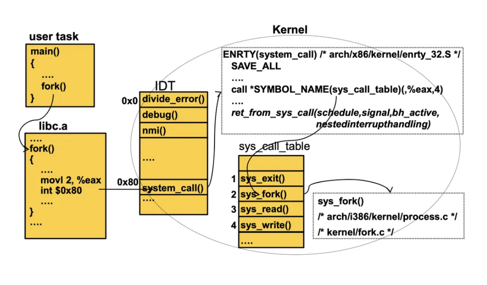

## **인터럽트(Interrupt)란?**

CPU가 현재 실행 중인 작업을 잠시 멈추고, 중요한 이벤트를 처리한 후 다시 원래 작업으로 돌아가도록 하는 메커니즘

운영체제(OS)는 인터럽트를 활용하여 하드웨어 및 소프트웨어 이벤트를 효율적으로 처리합니다.

1. CPU의 효율적인 활용

- 인터럽트가 없으면 CPU는 I/O 작업이 끝날 때까지 대기
- 인터럽트를 사용하면 CPU는 다른 작업을 수행하다가, 필요할 때만 인터럽트를 받아 해당 작업을 처리
- 예: 키보드 입력을 받을 때, CPU가 계속해서 키 입력을 확인하는 것이 아니라, 키가 눌렸을 때만 인터럽트가 발생하여 처리

2. 빠른 응답성 (Real-time Processing)

- 긴급한 이벤트(예: 하드웨어 장애, 실시간 시스템의 센서 입력)를 빠르게 처리
- 예: 자동차의 ABS 시스템에서 바퀴가 미끄러지는 경우 즉시 제동을 제어

3. 다중 작업 (Multitasking) 지원

- 운영체제는 인터럽트를 활용하여 여러 프로세스를 동시에 실행하는 것처럼 보이게 만듦.
- 타이머 인터럽트를 사용하여 CPU 시간을 여러 프로세스에 공평하게 배분

4. 입출력 장치와의 효율적인 통신

- CPU가 직접 I/O 장치를 폴링(polling)하는 것은 비효율적이므로, 인터럽트를 활용하여 데이터가 준비될 때만 CPU가 작업을 수행
- 예: 네트워크 패킷이 도착했을 때 인터럽트가 발생하여 데이터를 수신

5. 예외 처리 (Exception Handling)

- 잘못된 명령 실행, 0으로 나누기, 메모리 접근 오류 등의 예외 상황이 발생했을 때 즉시 처리 가능.

---

## **인터럽트의 종류**

### **하드웨어 인터럽트 (Hardware Interrupt)**

- 외부 장치(하드웨어)가 CPU에 신호를 보내는 것.
- CPU 외부에서 발생하며, 키보드 입력, 마우스 클릭, 하드디스크 입출력 등이 포함

**ex)**

- 키보드 입력 (`키를 누르면 CPU가 입력을 처리함`)
- 마우스 클릭 (`마우스를 클릭하면 CPU가 화면을 업데이트함`)
- 타이머 인터럽트 (`OS가 특정 시간마다 CPU를 점검함`)
- 하드디스크 데이터 요청 (`파일을 저장하거나 불러올 때`)

### **소프트웨어 인터럽트 (Software Interrupt)**

- 소프트웨어(프로그램)가 CPU에게 직접 인터럽트를 발생시키는 것.
- 프로그램이 특정 작업을 요청할 때 사용

**Exception (예외)**

- CPU 내부에서 실행 중인 프로그램이 오류를 일으킬 때 발생
- 동기적(Synchronous) 인터럽트 (명령어 실행 중 발생)

**ex)**

- 0으로 나누기 (Divide by Zero)→ `int a = 1 / 0;` 같은 코드 실행 시 발생
- 잘못된 명령어 실행 (Illegal Machine Code, Invalid Opcode)→ CPU가 해석할 수 없는 명령어 실행 시 발생
- 메모리 접근 오류 (Segmentation Fault, Page Fault)→ 잘못된 주소를 접근할 때 발생 (`NULL` 포인터 참조 등)

**System call(시스템 콜)**

- 사용자 프로그램이 커널에게 서비스를 요청하는 유일한 방법
- 동기적(Synchronous) 인터럽트 (TRAP 인터럽트의 일종)

**ex)**

- `read()`, `write()` → 파일 입출력
- `fork()` → 프로세스 생성
- `exec()` → 새로운 프로그램 실행
- `exit()` → 프로그램 종료

---

### 인터럽트 실행과정

인터럽트 발생

- 외부 하드웨어(키보드, 타이머 등) 또는 소프트웨어(System Call, Exception 등) 에 의해 인터럽트가 발생함.

CPU는 현재 작업을 멈추고, 현재 상태를 저장

- 실행 중인 프로그램의 레지스터 값과 프로그램 카운터(PC) 를 저장 (나중에 원래 작업으로 돌아가기 위해 필요함).

인터럽트 벡터 테이블(Interrupt Vector Table, IVT) 확인

- CPU는 인터럽트 벡터(Interrupt Vector) 테이블을 조회하여,해당 인터럽트에 맞는 ISR(Interrupt Service Routine)의 주소를 찾음.

ISR 실행

- 찾은 ISR(Interrupt Service Routine)을 실행하여,인터럽트가 요구한 작업(예: 키보드 입력 처리, 네트워크 패킷 수신 등)을 처리함.

ISR 실행이 끝나면, 원래 프로그램으로 복귀

- 저장했던 레지스터 값과 프로그램 카운터(PC)를 복원하고, 원래 수행 중이던 작업을 다시 진행함.

  

---

## System call의 종류

|  | **기능** | **예제** |
| --- | --- | --- |
| **Process Control** | 프로세스 생성, 종료, 실행 | `fork()`, `exit()`, `wait()`, `exec()` |
| **File Management** | 파일 생성, 읽기, 쓰기 | `open()`, `read()`, `write()`, `close()` |
| **Device Management** | 하드웨어 장치와 상호작용 | `ioctl()`, `read()`, `write()` |
| **Information Maintenance** | 시스템 정보 및 상태 조회 | `getpid()`, `gettimeofday()` |
| **Communications** | 프로세스 간 메시지 송수신 | `pipe()`, `send()`, `recv()`, `socket()` |

---

## 퀴즈
**OS가 인터럽트를 수행하는 주요과정은?**

 ## 출처

도서 Operating System Concepts - Abraham Silberschatz , Peter Baer Galvin , Greg Gagne
