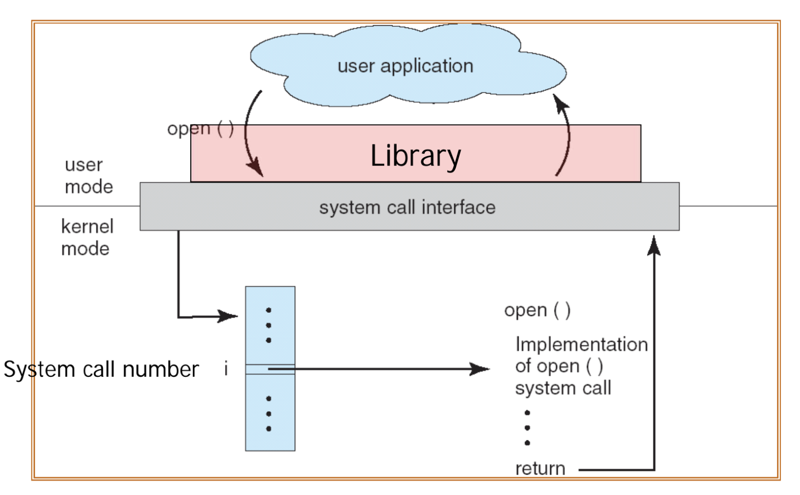

# Operating System Services

운영체제는 사용자 편의성과 프로세스 실행의 효율성을 높이기 위해 다양한 서비스를 제공한다.

## 1. For Users

### 1-1 사용자 인터페이스 (User Interface)

운영체제는 사용자와 상호작용할 수 있는 여러 가지 인터페이스를 제공한다.

- **Command Line Interface, CLI**  
  GUI(그래픽 사용자 인터페이스)와 대비되는 개념으로, Windows의 "명령 프롬프트"나 macOS의 "터미널"이 이에 해당한다. 이를 **쉘(Shell)** 이라고 하며, 사용자가 입력한 명령어를 해석, 실행한다.
  쉘은 명령어를 자체적으로 포함하지 않고, 명령어가 담긴 실행 파일을 디렉토리에서 찾아 실행하는 방식을 사용하여 공간 효율성을 높인다.

- **Batch Interface**  
  여러 개의 명령어를 모아 실행할 수 있도록 하는 인터페이스로 대표적으로 **Makefile**이 있으며, 여러 개의 파일을 한 번에 컴파일할 수 있도록 지원한다.

 

## 2. For Efficiency

### 2.1 Resource Allocation

운영체제는 한정된 자원(CPU 사이클, 메모리, 파일 저장소 등)을 다수의 프로세스에 효율적으로 분배해야 한다.

### 2.2 Accounting

운영체제는 CPU 및 기타 자원의 사용 통계를 기록하여, 어디서 어떻게 사용되었는지를 파악할 수 있도록 한다.

### 2.3 Protection and Security

허용되지 않은 접근을 막아 시스템의 안정성을 보장한다.

- **모드 비트 (Mode Bit)**  
  운영체제는 **사용자 모드(User Mode)** 와 **커널 모드(Kernel Mode)** 를 구분하여 보안을 강화한다.
  - **User Mode**: 일반 사용자 프로그램이 실행되는 모드
  - **Kernel Mode**: 운영체제의 핵심 기능이 실행되는 모드 (예: 시스템 콜 실행)
  - 사용자 모드에서 직접 커널 모드에 접근할 수 없으며, 시스템 콜을 통해서만 접근이 가능하다.

## 3. 시스템 콜 (System Calls)

운영체제가 제공하는 핵심 API로, 사용자 프로그램이 하드웨어에 접근하거나 운영체제의 기능을 사용할 때 호출된다.

### 3.1 커널 모드로 진입하는 방법

1. **하드웨어 인터럽트 (H/W Interrupt)**  
   프로그램이 의도하지 않은 외부 장치의 요청에 의해 발생한다.
2. **트랩 (Trap, S/W Interrupt)**  
   예외(Exception) 또는 시스템 콜(System Call)에 의해 발생한다.(예: 0으로 나누기 오류, 파일 읽기 요청 등)

### 3.2 시스템 콜 간접 호출 (Indirect Calling)

운영체제는 보안과 이식성을 위해 시스템 콜을 직접 호출하는 대신, **라이브러리 함수**를 통해 간접 호출하는 방식을 사용한다.

- **장점**
  - **이식성 (Portability)**: 기기마다 시스템 콜이 다를 수 있는데, 공통된 API를 사용하면 기기 간 호환성이 증가한다.
  - **프로그래밍 편의성 (Ease of Programming)**: 개발자가 시스템 콜의 세부 구현을 몰라도 쉽게 사용할 수 있다.

### 3.3 시스템 콜 인터페이스 (System Call Interface)

운영체제는 **System Call Number** 를 부여하여 효율적으로 시스템 콜을 관리한다.

- **System Call Interface**는 시스템 콜 번호와 해당하는 커널 함수를 매핑하는 테이블이다.
- 프로그램이 시스템 콜을 호출하면, 인터페이스가 해당 번호를 조회하여 커널 함수를 실행한다.

### 3.4 시스템 콜의 매개변수 전달 (Passing Parameters in System Calls)

시스템 콜을 사용할 때 커널에 필요한 인자를 전달해야 하는데 방법은 아래와 같다.

1. **레지스터(Register)에 직접 저장**
   - 빠르고 간단하지만, 사용할 수 있는 레지스터 개수가 제한적
2. **메모리 블록(Block) 사용**
   - 특정 메모리 공간에 인자를 저장하고, 레지스터에는 해당 블록의 주소만 저장하는 방식
   - 더 많은 인자를 전달할 수 있지만 추가적인 연산이 필요

**Linux에서는 두 가지 방법을 혼합하여 사용한다.**

- 인자가 **6개 이하**일 경우: 레지스터 사용
- 인자가 **6개 이상**일 경우: 메모리 블록 사용

## 4. Linux에서의 시스템 콜 실행 과정

1. 사용자 프로그램에서 **fork()** 같은 시스템 콜을 호출
2. **라이브러리 함수**를 호출하여 간접적으로 시스템 콜을 요청
   - 이 과정에서 특정 레지스터에 시스템 콜 번호를 저장
3. 시스템 콜을 호출하기 위해 **인터럽트 (Interrupt) 발생**
   - Linux에서는 **IDT (Interrupt Descriptor Table)** 의 **0x80** 위치에서 시스템 콜을 처리한다.
4. **시스템 콜 핸들러**가 호출된다.
   - 시스템 콜 인터페이스에서 전달된 **System Call Number**를 조회하여 해당 커널 함수를 실행
5. **커널 함수 실행 (sys_fork() 등)**
   - fork() 시스템 콜에 해당하는 커널 함수가 실행되고, 그 결과가 사용자 프로그램으로 반환된다.

## 5.시스템 콜의 종류

### 1. 프로세스 관리 (Process Control)

프로세스의 생성, 실행, 종료 등을 관리하는 시스템 콜

| 시스템 콜   | 설명                               |
| ----------- | ---------------------------------- |
| `fork()`    | 새로운 프로세스를 생성             |
| `exec()`    | 새로운 프로그램을 실행             |
| `exit()`    | 현재 프로세스를 종료               |
| `wait()`    | 자식 프로세스가 종료될 때까지 대기 |
| `kill()`    | 특정 프로세스를 종료               |
| `getpid()`  | 현재 프로세스 ID 반환              |
| `getppid()` | 부모 프로세스 ID 반환              |

### 2. 파일 관리 (File Management)

파일을 생성, 삭제, 읽기, 쓰기, 닫기 등을 수행하는 시스템 콜

| 시스템 콜  | 설명                    |
| ---------- | ----------------------- |
| `open()`   | 파일을 열기             |
| `close()`  | 파일을 닫기             |
| `read()`   | 파일에서 데이터를 읽기  |
| `write()`  | 파일에 데이터를 쓰기    |
| `lseek()`  | 파일의 특정 위치로 이동 |
| `unlink()` | 파일을 삭제             |

### 3. 장치 관리 (Device Management)

입출력 장치를 제어하는 시스템 콜

| 시스템 콜 | 설명                 |
| --------- | -------------------- |
| `ioctl()` | 장치의 속성을 설정   |
| `read()`  | 장치에서 데이터 읽기 |
| `write()` | 장치에 데이터 쓰기   |

### 4. 정보 유지 (Information Maintenance)

시스템 정보를 얻거나 설정하는 시스템 콜

| 시스템 콜        | 설명                      |
| ---------------- | ------------------------- |
| `gettimeofday()` | 현재 시간 가져오기        |
| `settimeofday()` | 현재 시간 설정            |
| `uname()`        | 시스템 정보 가져오기      |
| `sysinfo()`      | 시스템 상태 정보 가져오기 |

### 5. 통신 (Communication)

프로세스 간 통신(IPC)을 위한 시스템 콜

| 시스템 콜   | 설명                                |
| ----------- | ----------------------------------- |
| `pipe()`    | 프로세스 간 통신을 위한 파이프 생성 |
| `shmget()`  | 공유 메모리 생성                    |
| `shmat()`   | 공유 메모리를 프로세스에 연결       |
| `msgget()`  | 메시지 큐 생성                      |
| `msgsnd()`  | 메시지 큐에 메시지 전송             |
| `msgrcv()`  | 메시지 큐에서 메시지 수신           |
| `socket()`  | 네트워크 소켓 생성                  |
| `bind()`    | 소켓에 주소 할당                    |
| `listen()`  | 연결 요청 대기                      |
| `accept()`  | 클라이언트의 연결 요청 수락         |
| `connect()` | 서버에 연결 요청                    |

---

## 질문

### 1. 왜 유저모드와 커널모드를 구분해야 하나요?

### 2. 시스템 콜이, 운영체제에서 어떤 과정으로 실행되는지 설명해 주세요.

---

## 출처

도서 Operating System Concepts - Abraham Silberschatz , Peter Baer Galvin , Greg Gagne

https://github.com/devSquad-study/2023-CS-Study/blob/main/Interview/os_expected_question.md