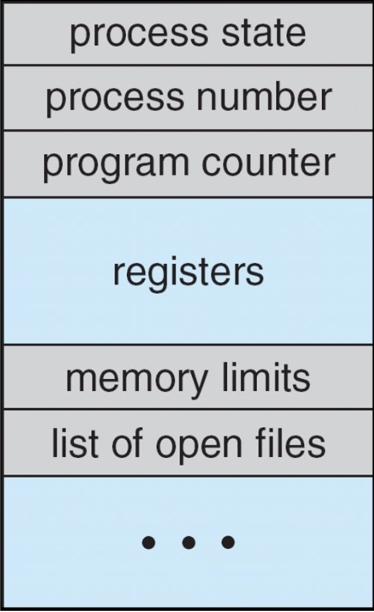
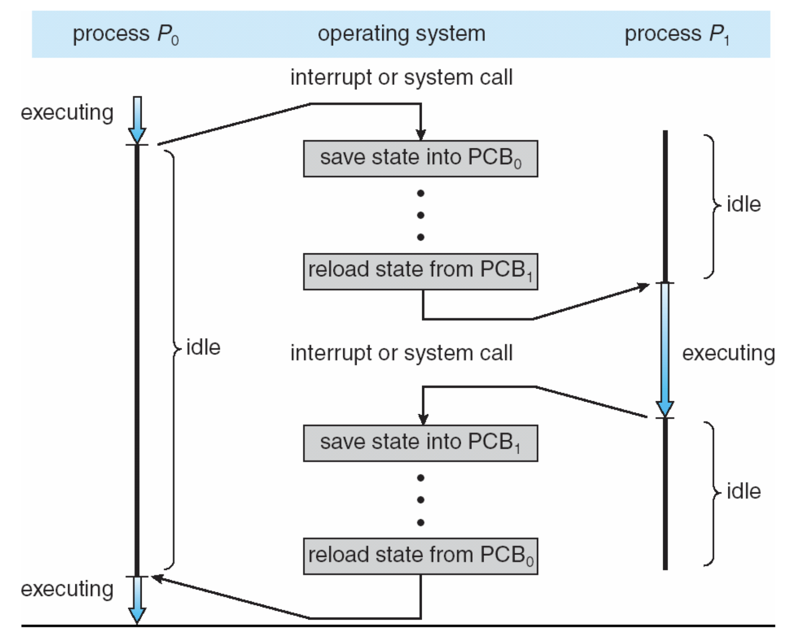

# PCB와 Context Switching

## PCB(Process Control Block)

### CPU에서 내려온 프로세스가 다시 CPU 위에 올라갈 때 필요한 모든 정보를 담고 있는 구조체

> #### ✨ 특징
>
> 1. 커널에서 관리
> 2. 각 프로세스마다 하나씩 가지고 있음
> 3. 주기억 장치에 저장됨
> 4. PCB 정보를 가지고 스케줄링을 함
> 5. 모든 프로세스들은 PCB를 기반으로 관리됨

  
  

    <h3>PCB에 있는 정보들</h3>
    <ol>
    <li>프로세스 식별자(PID) - 프로세스를 식별하는 용도</li>
    <li>프로세스 상태 - ready, wait, running 등의 상태를 가짐</li>
    <li>프로그램 카운터 - CPU 내려오기 직전에 어디까지 실행되었는지를 말하며, 프로세스가 다음에 실행할 명령어의 시작 주소를 가리킴</li>
    <li>CPU 레지스터</li>
    <li>CPU 스케줄링 관련 정보 - 우선 순위, 최종 실행시각, CPU 점유 시간</li>
    <li>메모리 관리 정보 - 메모리를 어떻게 관리할지</li>
    <li>어카운팅 정보 - CPU를 얼마나 사용했는지</li>
    <li>I/O 상태 정보 - 연결되어 있는 I/O 장치나 파일에 대한 정보</li>
    </ol>
  

 

## Context Switching (=CPU Switching)

### CPU가 이전의 프로세스 상태를 PCB에 저장하고, 또 다른 프로세스의 정보를 PCB로부터 읽어 레지스터에 올리는 과정

### 🌱 탄생 배경

- Batch System은 하나의 동작이 끝날 때까지 다른 동작을 하지 못해 CPU의 활용도가 떨어짐 -> 이를 해결하기 위해 나온 개념이 Context Switching임

- idle - CPU나 시스템이 현재 수행할 작업이 없어서 대기하고 있는 상태(유휴 상태)
- executing - 실행중인 상태

> ### Context Switching 과정
>
> 1. 프로세스 p0에서 인터럽트나 시스템 콜이 발생하면 PCB0에 프로세스 정보가 저장됨
> 2. 다음으로 수행할 프로세스 p1의 정보를 PCB1으로부터 가져온 후, 상태를 변경하여 cpu에 올림
> 3. 프로세스 p1이 수행되다가 인터럽트나 시스템 콜이 발생하면 PCB1에 프로세스 정보가 저장됨
> 4. PCB0에서 프로세스 p0에 대한 정보를 가져와 cpu에 올림

 

### Context Switching의 단점

- Context Switching을 위해 PCB에 계속해서 프로세스 정보를 저장하는 작업을 해야 하기 때문에 오버헤드가 발생함 -> 하지만 이런 오버헤드를 감수하고도 효율적이기 때문에 사용
- Context Switching이 자주 발생하면 오버헤드 비용이 커져 성능이 떨어짐

  -> 실행할 프로세스의 정보를 PCB에서 가지고 올 동안 CPU에 할당된 프로세스가 없어서 아무일도 하지 못하게 된다.

  -> PCB는 주기억 장치에 저장되기 때문에 context switching은 하드웨어 의존적이며, 오버헤드를 줄이기 위해서는 하드웨어적으로 처리해줘야 함

 

> 🫛 깨알 정보
> 1. 일반적으로 1초에 100~1000번 Context Switch가 발생
> 2. Thread의 경우, 메모리 공간을 공유하고 있기 때문에 스택만 정리하면 되서 프로세스보다 비용이 적게 듬

 

## 퀴즈
- Context Switching이란?
- Context Switching으로 인해 발생하는 오버헤드를 줄일 수 있는 방법은?

 

## ✈️출처
- 공룡책
- https://github.com/devSquad-study/2023-CS-Study/blob/main/OS/os_pcb_and_context_switching.md