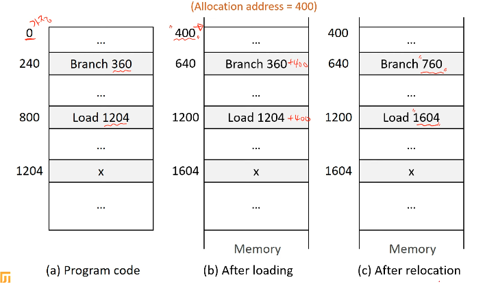
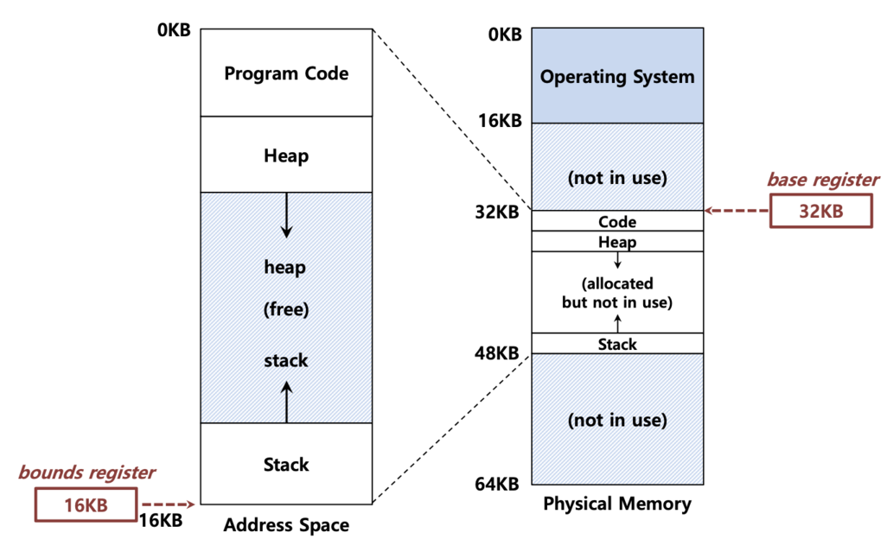

## 가상 메모리 할당

 

- 연속 할당(continuous allocation)

그림 1. 연속 할당

연속 할당이란 프로세스가 메모리에 할당될 때, 하나의 연속된 공간에 할당되는 것을 의미한다.

단점 : 60KB인 프로세스 A 가 있고 빈 메모리 공간 A가 30KB, 공간 B가 35KB인 공간이 있다고 가정해보자. 총 사용 가능한 메모리 공간은 65KB로 충분하지만, 연속 할당에서는 프로세스 A를 담을 수 있는 60KB의 연속된 공간이 없기 때문에 프로세스를 메모리에 올리지 못한다는 문제가 발생한다. 이를 외부 단편화(External Fragmentation)이라 한다.

 

- 비연속 할당 (non-continuous allocation)

 

연속 할당이 가진 문제점을 해결하고자 비연속 할당이 등장하게 된다.

비연속 할당이란 프로세스를 여러 개의 페이지 혹은 세그멘트와 같은 단위의 block으로 분할해서 메모리에 연속되지 않게 적재하는 메모리 할당 기법이다.

필요한 블록들만 메모리에 적재하고, 현재 사용하지 않는 블록들은 swap device로 빼놔서 메모리를 효율적으로 사용한다. 이런 기법들을 사용하는 것이 페이징 시스템과 세그멘테이션 시스템이다.

 

## 주소 변환

비연속 할당으로 인해 메모리를 효율적으로 사용할 수 있게 된 대신, 새로운 문제가 발생했다.

프로세스는 자신이 사용하는 메모리 공간이 연속적이라고 생각하고 코드를 작성한다. 하지만 실제로는 프로세스의 데이터가 메모리에 비연속적으로 흩어져 저장되어있다.

만약 프로세스가 100번에 접근하려고 하면, 실제로 물리 메모리의 어디에 접근해야 할까?

이러한 문제를 해결하기 위해 주소 변환 기술이 등장하게 되었다.

주소 변환이란 프로세스가 사용하는 가상 주소(Virtual Address 혹은 Logical Address)를 실제 물리 메모리의 물리 주소(Physical Address 혹은 Real Address)로 변환해주는 역할을 한다.

 

## 동적 재배치 (Dynamic Relocation)

동적 재배치는 프로세스가 실행되는 동안 메모리 내에서 위치를 변경할 수 있도록 하는 메모리 관리 기술이다.

즉, 프로세스를 메모리의 다른 위치로 이동시켜 연속적인 메모리 공간을 확보해서 외부 단편화 문제를 해결하자 는 메커니즘이다.

페이징과 세그멘테이션 시스템이 등장하면서 현대 운영체제에서는 잘 사용되지 않는다고 한다.

동적 재배치는 일반적으로 다음과 같은 구성 요소를 사용한다.

 

그림 2. Base 레지스터와 Bound 레지스터터

1. Base 레지스터 : 프로세스가 메모리에 로드된 시작 주소를 저장. 즉, 실제 메모리의 시작 주소
2. Bound 레지스터 : 프로세스가 사용할 수 있는 메모리 공간의 크기를 저장. 즉, 가상 주소 공간의 크기
3. MMU(Memory Management Unit) : CPU가 메모리에 접근할 때마다 가상 주소를 물리 주소로 변환하고, 메모리 접근 권한을 확인

 

가상 주소를 실제 주소로 변환하는 과정은 다음과 같다.

1. CPU가 가상 주소를 생성하여 메모리에 접근을 시도한다.
2. MMU는 가상 주소를 받아 Base 레지스터에 저장된 값을 더하여 실제 물리 주소를 계산한다. (물리주소 = 가상 주소 + base 레지스터)
3. MMU는 Bound 레지스터를 사용하여 가상 주소가 프로세스에게 할당된 메모리 공간 내에 있는지 확인한다. 만약 가상 주소가 Bound 레지스터의 값을 초과하면, 메모리 접근 오류를 발생시킨다.
4. MMU는 변환된 물리 주소를 메모리 컨트롤러로 보내 CPU가 실제 메모리 주소에 접근한다.

 

동적 재배치와 관련된 운영체제의 역할

1. 프로세스 생성 시
   1. 운영체제는 새로운 프로세스를 위해 물리 메모리 공간을 할당해야 한다.
   2. 운영 체제는 새로운 프로세스에게 할당할 충분한 크기의 연속적인 메모리 공간을 Free List에서 찾는다. (Free List는 사용 가능한 각 메모리 블록의 위치[시작 주소]와 크기를 저장한 자료구조)
   3. Free List에서 적절한 크기의 메모리 블록을 찾으면, 해당 블록을 새로운 프로세스에게 할당한다.
   4. 할당된 메모리 블록을 Free List에서 제거하거나, 블록의 크기를 조절한다.

 

2. 프로세스 종료 시
   1. 프로세스가 종료되면, 운영 체제는 프로세스가 사용하던 메모리 공간을 회수하여 Free List에 반환한다.

 

3. Context Switch 발생 시
   1. 현재 프로세스 상태 저장 : 운영 체제는 현재 실행 중인 프로세스의 Base 레지스터 값, Bound 레지스터 값, PC 등을 PCB에 저장한다.
   2. 프로세스 상태 복원 : PCB에서 저장된 레지스터 값들을 불러와 다시 실행한다.

 

## 퀴즈

1. 동적 재배치에서 운영 체제의 역할 3가지에 대해 설명하시오.
