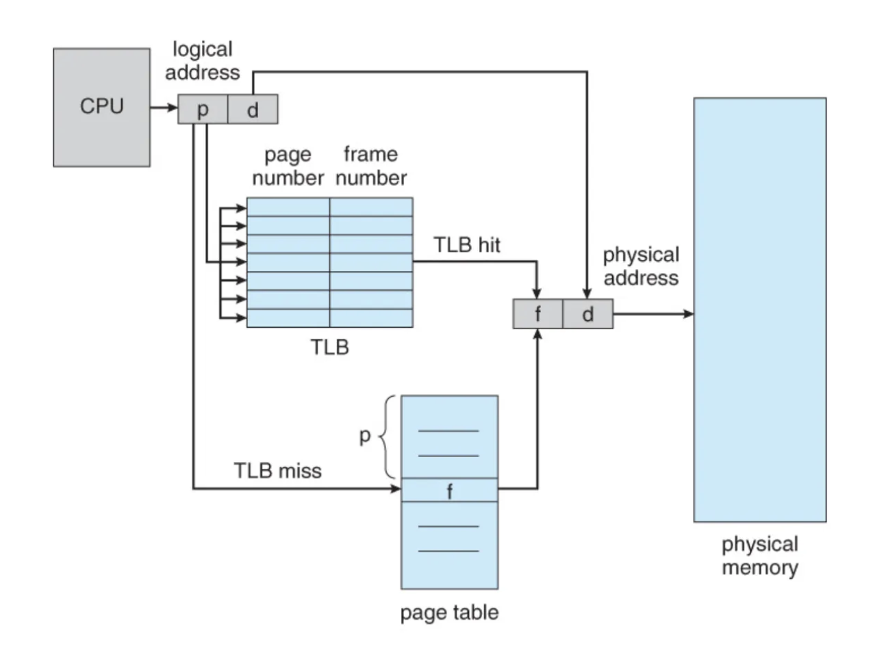
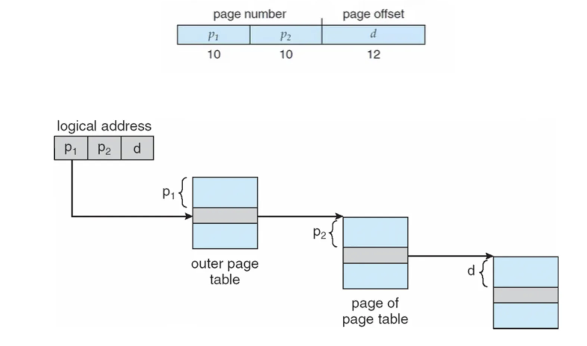
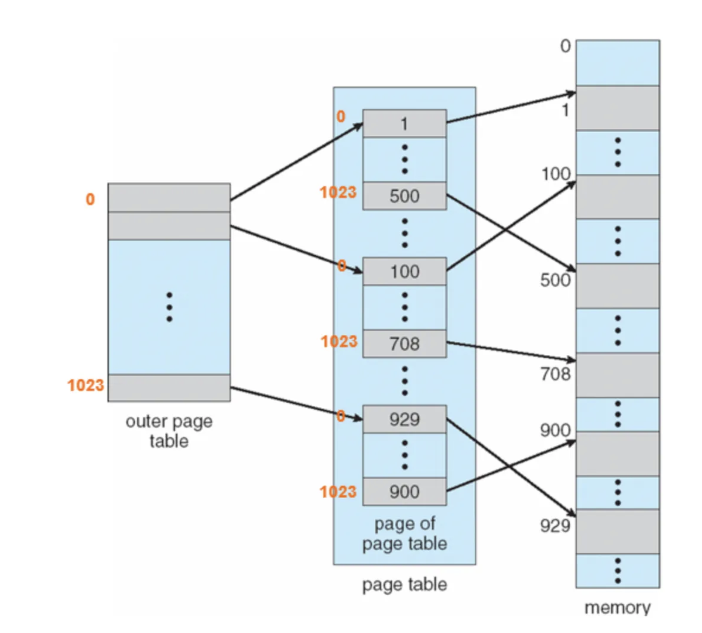

## Paging이란

- paging은 프로세스의 가상 주소 공간을 **고정적인 크기(fixed-sized)로 나누어서 메모리에 할당**하는 방식이다. 이때 고정적인 크기 단위를 page라고 부른다.
- 그리고 이러한 가상공간의 page 를 실제 메모리에 할당할 때 이를 page frame이라고 부른다.
- 즉 가상 메모리(주소 공간)에서는 page, 실제 메모리(주소 공간)에서는 frame 이라고 불리는 고정 크기의 공간으로 프로세스를 실행하겠다는 의미이다.

---

## 주소 변환 (Address Translation)

**Paging table**

- Paging 기법을 사용하기 위해서 가상 주소 공간에 있는 프로세스의 page들이 실제 메모리의 어디에 위치를 하는 지를 기억하는 page table을 가지고 있어야 한다.
- **page table** 이란 가상 주소 공간의 page가 실제 메모리(주소 공간)에 어디에 위치해 있는 지를 기록한다.
  - Per-process structure(프로세스별 구조)
  - OS 메모리의 영역에 저장된다.

**주소 변환하는 방법**

- 가상 주소 공간에는 두 가지 요소가 있다.
  - VPN : **V**irtual **P**age **N**umber -> 상위 2개의 bit이 Page를 표현한다.
  - Offset : page 안에 있는 offset -> 나머지 4개의 bit이 offset을 표현한다.

- Example: virtual address **21** in 64-byte address space

A Simple 64-byte Address Space

- Page table을 통해서 Virtual Page, Physical Page frame 의 i번째를 찾는다.
  - VPN 에서 상위 2개의 bit 값이 1이므로 page 1에 해당한다.
- Offset을 통해 그 Page 안에 몇번째 메모리 주소인지 찾는다.
  - offset 값이 5이므로 16부터 시작해서 5번째인 21를 의미한다.

## Paging 특징

### 외부 단편화(External Fragmentation)

Paging에서는 연속적인 공간 할당이 필요하지 않아 외부 단편화가 발생하지 않는다.

### 내부 단편화(Internal Fragmentation)

Paging에서는 고정된 크기의 frame을 사용하기 때문에, 일부 frame에서 공간 낭비가 발생할 수 있다. 해결 방법으로 page size를 작게 설정할 수 있지만, page의 개수가 증가하면서 Page Table 크기도 커지는 문제가 발생한다.

# TLB(Translation Lookaside Buffer)

TLB는 빠른 메모리로, 페이지 테이블을 위한 소형의 하드웨어 캐시이다.

address translation을 위한 Page Table look-up을 최적화하기 위해 사용된다. TLB에는 Page Table의 일부가 저장되며, 이를 이용해 빠른 frame number 검색이 가능하다.

TLB Look-up 과정:

1. TLB에서 해당 page number를 찾아 frame number를 반환한다.
2. 만약 찾지 못하면 PTBR(Page Table Base Register : Page Table의 시작 주소를 저장하는 레지스터)를 사용하여 Page Table에서 frame number를 찾는다.

---

# Page Table 구조

**실제 페이지 테이블의 구조**

페이지 테이블의 크기가 꽤 크기 때문에 페이지 테이블을 연속된 메모리 공간에 배치하기가 어렵다. 앞서 연속 메모리 할당에서 나왔던 문제처럼 비효율적인 메모리 공간 배치가 될 수 있다. 그래서 이렇게 큰 페이지 테이블을 메모리 상에 어떻게 저장할지에 대해 구현하는 것도 꽤 중요하다

→ 페이지 테이블의 크기를 줄이자

### 1. 계층적 페이징 (Hierarchical Paging)

페이지 테이블을 계층적으로 나누어 저장하는 방식으로, 32-bit 주소에서 하위 12-bit를 offset으로, 상위 20-bit를 10-bit씩 나누어 two-level page table을 구성한다.

**장점**: 사용하지 않는 Invalid page를 저장하지 않아 Page Table 크기를 줄일 수 있다.

**단점**: Look-up 시간이 증가한다.

### 2. 해싱 페이지 테이블 (Hashed Page Table)

- 논리 주소의 페이지 번호를 해시 값으로 사용
- 32비트 이상의 논리 주소 공간을 위한 페이지 테이블 구성방법
- Hash collision이 발생하면 체인 형태로 해당 hash 값에 대한 list를 관리한다.

 

## 질문

### 1.TLB를 쓰면 왜 빨라지나요?

### 2. 페이지와 프레임의 차이에 대해 설명해 주세요.

 

## 출처

도서 Operating System Concepts - Abraham Silberschatz , Peter Baer Galvin , Greg Gagne
