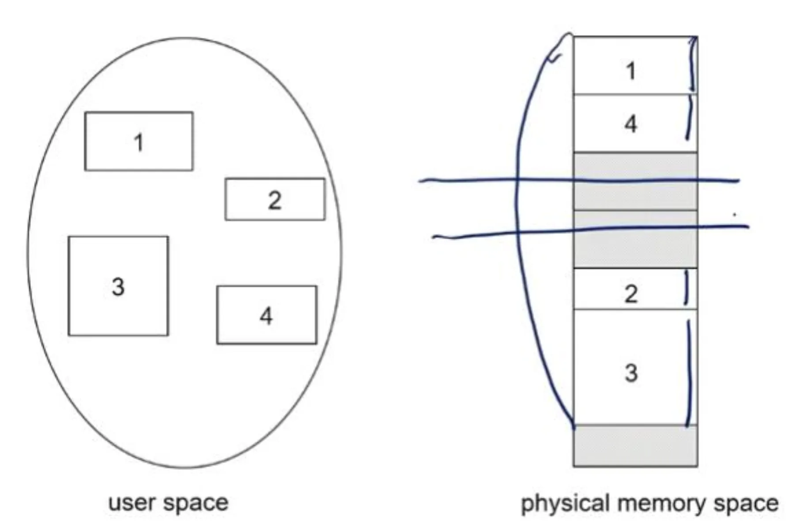
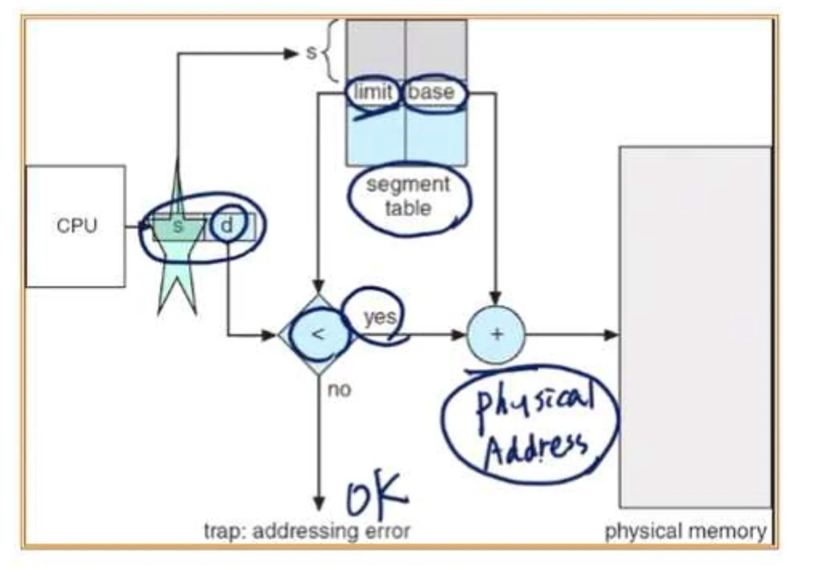
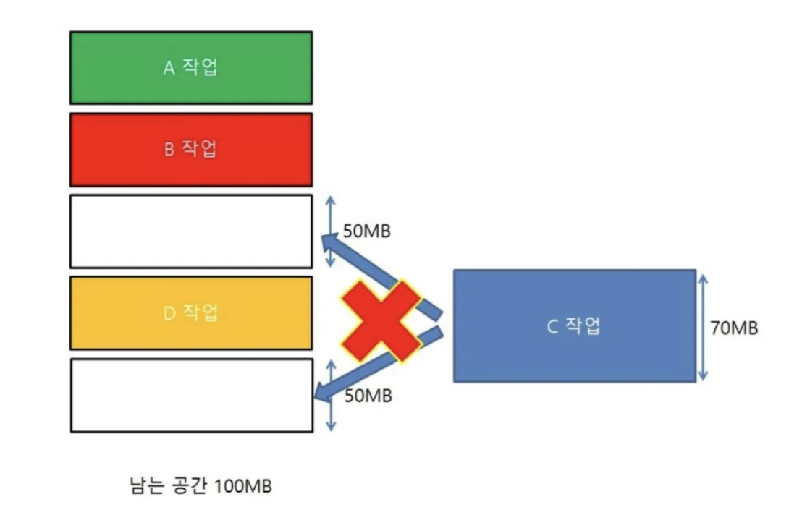

## 세그멘테이션이란?

- 세그멘테이션(Segmentation)은 메모리 관리를 위한 기법으로, 프로그램을 논리적인 세그먼트(Segment, 단위 블록)로 나누어 메모리에 할당하는 방식입니다.

이를 통해 프로그램의 논리적인 구조를 반영하며, 가변 크기의 메모리 블록을 할당할 수 있습니다.

---

## 세그멘테이션의 구조

- 프로세스는 여러 개의 세그먼트로 나뉘며, 각 세그먼트는 논리적인 역할을 가짐
- 세그먼트를 논리적 역할로서 어떻게 나누어지는지는 메모리 관리정책에 의해 나누어짐.
    
    →이는 상황에 따라 달라질 수 있음
    
- 각각의 segment는 contiguous하게 저장되어있음(segment마다)
- 전체 process봐서는 연속적이진 않다 (non-contiguous)
    
    
    

### **세그먼트 종류 예시**

1. **코드 세그먼트 (Code Segment, CS)**: 실행할 코드 저장
2. **데이터 세그먼트 (Data Segment, DS)**: 전역변수 저장
3. **스택 세그먼트 (Stack Segment, SS)**: 함수 호출 및 지역변수 관리

### **세그먼트 테이블 (Segment Table)**

운영체제는 **세그먼트 테이블**을 사용하여 각 세그먼트의 정보를 관리합니다.

세그먼트 테이블의 주요 요소:

- **Base (기본 주소)**: 해당 세그먼트의 시작 주소
- **Limit (한계값)**: 세그먼트의 크기
- **Segment Number (세그먼트 번호)**

### 주소 변환(Adress Translation)

1. CPU가 세그먼트 번호 + 오프셋(Offset)을 사용하여 논리 주소 생성
2. 세그먼트 테이블에서 해당 세그먼트의 Base(기본 주소)를 가져옴
3. 물리주소 = Base + Offset을 계산하여 실제 메모리 주소 참조
    
    ![스크린샷 2025-03-17 오후 12.45.47.png]
    

---

## 세그멘테이션의 장단점

**장점**

- **논리적 메모리 구조 반영**: 코드, 데이터, 스택을 독립적으로 관리 가능
- **효율적인 메모리 할당**: 가변 크기 할당으로 메모리 낭비 최소화
- **보안 및 보호 기능 강화**: 각 세그먼트마다 접근 권한 설정 가능

**단점**

- **외부 단편화(External Fragmentation) 발생** → 연속된 메모리 공간이 부족하면 세그먼트 이동 필요
- **주소 변환 비용 증가** → 세그먼트 테이블을 참조하는 추가 연산 발생

---

## 세그멘테이션과 페이징을 결합한 기법: **세그먼트 페이징(Segmentation with Paging)**

![스크린샷 2025-03-17 오후 2.37.46.png]

- 세그먼테이션은 논리적인 단위로 나누기 때문에 세그먼트의 크기가 다양하다. 이로 인해 다양한 크기의 hole이 발생하므로 같은 문제가 발생한다.
- 세그멘테이션은 외부 단편화 문제가 있고, 페이징은 내부 단편화 문제가 있음
- 이를 해결하기 위해 세그먼트 내부를 다시 페이지로 분할하여 사용하는 방식
- Intel x86 아키텍처에서 사용됨 (세그먼테이션을 사용하지만 페이지 단위로 메모리 관리)

---
## 퀴즈
Segmentation Adress Translation 과정을 설명하시오.

---

## 출처

https://doh-an.tistory.com/24

도서 Operating System Concepts - Abraham Silberschatz , Peter Baer Galvin , Greg Gagne