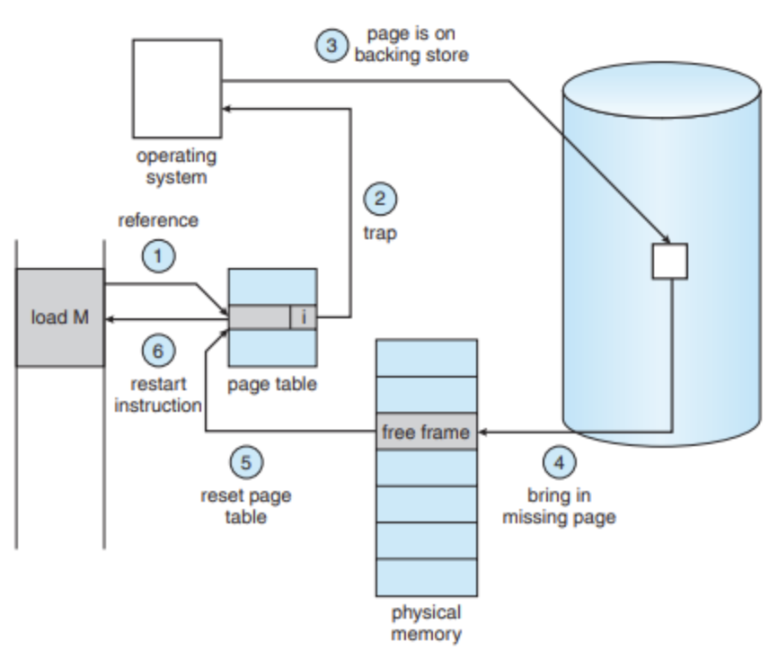

# 가상메모리와 요구 페이징, 페이지 교체

- [가상메모리와 요구 페이징, 페이지 교체](#가상메모리와-요구-페이징-페이지-교체)
  - [🔗 가상메모리](#-가상메모리)
    - [🚀 가상메모리 구현을 위한 핵심 기술](#-가상메모리-구현을-위한-핵심-기술)
  - [🔗 요구 페이징(Demand Paging)](#-요구-페이징demand-paging)
    - [🚀 동작 원리](#-동작-원리)
    - [🌱 페이지 폴트(Page Fault)](#-페이지-폴트page-fault)
    - [장점](#장점)
    - [단점](#단점)
  - [🔗 페이지 교체(Page Replacement)](#-페이지-교체page-replacement)
    - [🚀 메모리 과할당(Over-allocation)](#-메모리-과할당over-allocation)
    - [🌱 페이지 교체 알고리즘](#-페이지-교체-알고리즘)
      - [1. FIFO (First In First Out)](#1-fifo-first-in-first-out)
      - [2. OPT (Optimal Page Replacement)](#2-opt-optimal-page-replacement)
      - [3. LRU (Least Recently Used)](#3-lru-least-recently-used)
      - [4. Counting 기반 알고리즘](#4-counting-기반-알고리즘)
  - [퀴즈](#퀴즈)
  - [✈️ 출처](#️-출처)

## 🔗 가상메모리

- 실제 메모리 용량보다 커보이게 하는 기술.
- 어떤 프로세스가 실행될 때 해당 프로세스 전체가 메모리에 올라가지 않아도 실행 할 수 있다는점에서 착안
- 참조 지역성과 관련이 깊음
  - 참조 지역성: 시간 지역성, 공간 지역성
- RAM과 디스크를 하나의 추상화된 메모리 영역으로 제공
- 운영체제는 가상메모리 기법을 통해 프로그램의 논리적 주소 영역에서 필요한 부분만 메모리에 적재하고 나머지 부분은 디스크에 저장

 

### 🚀 가상메모리 구현을 위한 핵심 기술

> ### 요구 페이징(Demand Paging)
>
> - 스왑된 페이지를 필요할 때 메모리에 적재
> - 기본적인 페이징 기법에 따라 주소 변환

> ### 페이지 교체(Page Replacement)
>
> - 메모리의 공간이 부족할 경우 페이지를 스왑해 교체.

---

 

## 🔗 요구 페이징(Demand Paging)

프로세스 실행에 실제 필요한 페이지만을 메모리에 적재하는 기법

### 🚀 동작 원리

1. 각 페이지는 메모리나 스왑 공간(디스크)에 위치할 수 있음
2. MMU(메모리 관리 장치)가 페이지의 위치를 추적
   - Valid/Invalid 비트를 통해 페이지 상태 관리
     - Valid(1): 해당 페이지가 메모리에 있음
     - Invalid(0): 해당 페이지가 스왑 공간에 있음

> ### invalid 상태 페이지를 참조하는 경우
>
> - 운영체제는 인터럽트로 페이지 폴트 트랩(page fault trap)을 발생시키고, 페이지를 스왑공간에서 가져와 메모리에 올리는 I/O 작업을 발생시킴
> - 해당 프로세스는 I/O 작업이 끝날때 까지 대기 상태

 

### 🌱 페이지 폴트(Page Fault)

1. 프로세스가 Invalid 상태의 페이지 접근 시도
2. MMU가 이를 감지하여 페이지 폴트 트랩(인터럽트) 발생
3. 운영체제는 다음 단계를 수행:
   - 해당 페이지를 스왑 공간에서 찾음
   - 메모리에 빈 프레임을 할당
   - 스왑 공간에서 페이지를 메모리로 읽어옴 (I/O 작업)
   - 페이지 테이블 갱신 (Invalid → Valid)
4. 프로세스는 I/O 작업 동안 대기 상태로 전환

 

### 장점

- 필요한 페이지만 메모리에 적재하여 메모리 효율성 향상
- 프로세스 전체가 메모리에 있지 않아도 실행 가능

### 단점

- 페이지 폴트 발생 시 I/O 작업으로 인한 지연 발생
- MMU와 같은 하드웨어 지원 필요

---

 

## 🔗 페이지 교체(Page Replacement)

메모리의 공간이 부족할 경우 페이지를 스왑해 교체하는 기법

### 🚀 메모리 과할당(Over-allocation)

- 물리 메모리의 모든 영역이 다른 프로세스에 할당되어 있는 상태
- 요구 페이징을 처리할 빈 메모리 프레임이 없는 상태
- 해결 방법:
  1. 프로세스 종료 (비권장: 메모리 관리 서비스의 목적에 위배)
  - 메모리 관리 서비스의 주요 목적은 여러 프로세스가 동시에 원활하게 실행될 수 있도록 메모리를 효율적으로 관리하는 것임
  2. 프로세스 스와핑 (비효율적: 재적재 비용이 큼)
  3. 일부 페이지 교체 (권장)

 

### 🌱 페이지 교체 알고리즘

요구 페이징의 핵심 요소로, 페이지 폴트를 최소화하는 것이 목표입니다.

#### 1. FIFO (First In First Out)

- 가장 오래된 페이지를 교체
- 특징:
  - Queue 형태로 페이지 관리
  - 구현이 간단하지만 성능 보장 어려움
  - Belady's Anomaly 발생 가능
    - 페이지 프레임 수를 늘렸는데도 페이지 폴트가 증가하는 현상
    - 예시:
      - 페이지 참조 순서: 1,2,3,4,1,2,5,1,2,3,4,5
      - 프레임이 3개인 경우: 9번의 페이지 폴트 발생
      - 프레임이 4개인 경우: 10번의 페이지 폴트 발생
    - FIFO 알고리즘에서 발생할 수 있는 심각한 문제점
    - 더 많은 메모리를 할당했는데 성능이 저하되는 비직관적 현상

#### 2. OPT (Optimal Page Replacement)

- 앞으로 가장 오래 사용되지 않을 페이지를 교체
- 특징:
  - 이론적으로 최적의 알고리즘
  - 미래의 페이지 참조를 알아야 하므로 `실제 구현 불가능`
  - 다른 알고리즘의 성능 비교 기준으로 사용

#### 3. LRU (Least Recently Used)

- 가장 오랫동안 사용되지 않은 페이지를 교체
- 특징:
  - OPT에 근접한 성능
  - 구현을 위한 하드웨어 지원 필요
    - 각 페이지 참조마다 시간 정보를 기록해야 하기 때문임
  - 동작 방식:
    - 페이지 참조 시간 정보 기록
    - 스택 구조로 관리 (최근 사용 페이지는 top으로 이동)

#### 4. Counting 기반 알고리즘

- 페이지 사용 횟수를 기준으로 교체
- 종류:
  - LFU (Least Frequently Used): 참조 횟수가 가장 적은 페이지 교체
    - 참조의 지역성이 강한 프로그램에 적합
  - MFU (Most Frequently Used): 참조 횟수가 가장 많은 페이지 교체
    - 한번 사용된 페이지가 재사용될 가능성이 낮은 프로그램에 적합
- 특징:
  - 구현이 복잡
  - 최적 알고리즘에 근접하기 어려움

---

## 퀴즈

- LRU 알고리즘의 단점을 설명해 주세요. 이를 해결할 수 있는 대안에 대해서도 설명해 주세요.

---

## ✈️ 출처

- [출처1](https://github.com/devSquad-study/2023-CS-Study/blob/main/OS/os_virtual_memory_and_demand_paging.md)
- [출처2](https://gyoogle.dev/blog/computer-science/operating-system/Page%20Replacement%20Algorithm.html)
