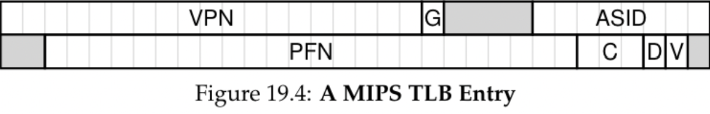
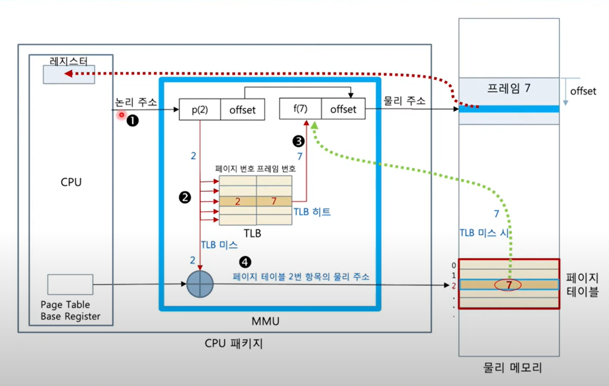

# TLB(Translation Lookaside Buffers)

## 🔗 TLB

- MMU의 일부분이자, 주소 변환의 하드웨어 캐시
- 최근에 접근한 VPN(Virtual Page Number)와 PFN(Physical Frame Number)쌍을 항목으로 가상 주소를 실제 주소로 변환하도록 도와줌

 

### TLB의 구성요소

- VPN(Virtual Page Number) : 가상 주소에서 추출한 페이지 번호
- PFN(Physical Frame Number) : 변환된 물리 페이지 번호
- Valid Bit : 해당 엔트리가 유효한지 여부
- Protection Bit : 페이지 접근 권한
- Dirty Bit : 해당 페이지가 수정되었는지 여부
- Reference Bit : 최근 페이지 참조 여부
- ASID(Address Space ID) : 다중 프로세스 환경에서 프로세스별 TLB 충돌 방지를 위한 ID

 

**Cf. ASID(Address-space Identifier)**
TLB에 매핑되어 있는 정보가 어디 프로세스로부터 온 정보인지 저장해두는 것
 Context Switching 발생 시 해결책으로 사용함

**과정**

- 각 항목에 고유한 ASID를 저장함
- TLB에서 해당 가상 주소를 변환할 때 현재 수행 중인 프로세스의 ASID가
  TLB항목의 ASID와 같은지 검사함

- ASID가 다르면 TLB 미스로 처리함

---

 

## 🔗 가상 주소 변환 과정

### TLB 히트

1. 해당 주소가 가상 페이지 번호(VPN) 2번에 저장되어 있다고 가정함
2. TLB 히트가 발생되어 즉시 프레임 7번에 저장된 정보를 알 수 있음
3. 프레임 번호와 Offset 값을 물리 주소로 변환하여 원하는 영역의 메모리에 접근할 수 있게됨

 

### TLB 미스

1. 해당 주소가 페이지 번호 내 존재하지 않는 상황을 가정함
2. TLB 미스가 발생되어 페이지 테이블 베이스 레지스터가 가진 값을 기반으로 하여 메모리 내 저장된 페이지 테이블에 접근해야 함

3. 페이지 테이블 내 2번 페이지를 저장하고 있는 7번 프레임에 접근해야 함

4. 이를 TLB에 저장하고 이후 동일한 페이지 접근 시 빠른 변환이 가능하도록 함

 

### TLB 교체 정책

TLB가 꽉 찬 경우 새로운 프로세스의 주소 변환 정보 추가를 위해선 기존 엔트리 중 하나를 제거해야 함

즉, 어떤 엔트리를 제거할 지 결정하는 알고리즘을 의미함

목표는 TLB 미스율을 최소화하기 위함

- LRU 방식: 최근에 사용하지 않은 항목을 제거하는 방식
- Random Policy : 랜덤하게 제거

 

### 장점

CPU의 MMU 안에서 해결되므로 속도가 빠름

### 단점

요청한 정보가 TLB에 없을 시 추가적인 메모리 접근 시간이 소요됨

### TLB 성능 최적화 방법

- 페이지 크기 증가: TLB에 더 큰 페이지를 저장할 경우, 같은 TLB 항목으로 더 많은 메모리 공간을 확보할 수 있음
   

- 2단계 TLB 사용: 1차 TLB에서 원하는 항목을 찾지 못할 경우 2차 TLB를 참조하는 방식으로, 메모리에 접근하지 않고도 빠른 주소 변환이 가능함
- 멀티스레딩 환경에서 TLB Flush 최소화
  Context Switching 발생 시 TLB를 강제로 비우는(Flush) 일이 많아 성능 저하가 발생하므로, 이를 최소화해야 하고 ASID(Address Space Identifier) 지원 CPU를 활용하는 것이 좋음

## 퀴즈

- TLB를 사용할 때 context switching이 발생한다면 어떻게 해결하는 지 설명해주세요.

---

## ✈️ 출처

- [출처1](https://ggomjiu.tistory.com/15)(TLB 심화)
- [출처2](https://namu-code.tistory.com/43)(페이징과 TLB)
- [출처3](https://sproutinghye.tistory.com/99)(TLB)
