## 동기화(Process Synchronization)

- 다중 프로그래밍 시스템
  - 여러 개의 프로세스들이 존재
  - 프로세스들은 서로 독립적으로 동작 (동시에 동작)
  - 공유 자원 또는 데이터가 있을 때, 문제 발생 가능
- 동기화 (Synchronization) : 대화
  - 프로세스들이 서로 동작을 맞추는 것
  - 프로세스들이 서로 정보를 공유하는 것

### Asynchronous and Concurrent P's

- 비동기적(Asynchronous)
  - 프로세스들이 서로에 대해 모름
- 병행적(Concurrent)
  - 여러 개의 프로세스들이 동시에 시스템에 존재
- 병행 수행중인 비동기적 프로세스들이 공유 자원에 동시에 접근 할 때 문제가 발생할 수 있음

### 용어(Terminologies)

- Shared data(공유 데이터) or Critical data
  - 여러 프로세스들이 공유하는 데이터
- Critical section(임계 영역)
  - 공유 데이터를 접근하는 코드 영역(code segment)
- **Mutual exclusion(상호 배제)**
  - 둘 이상의 프로세스가 동시에 critical section에 진입하는 것을 막는 것

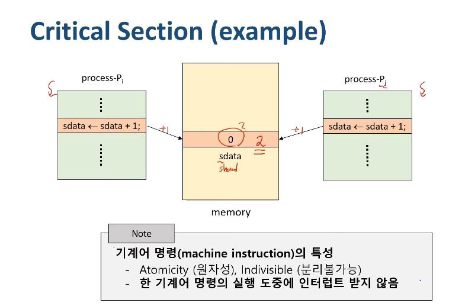

그림1. Critical Section 예시

기계의 명령의 특성

- Atomicity(원자성), Indivisible(분리 불가능) : 하나의 명령이 수행되고 있을 때에는 이 명령이
  끝날때까지는 반드시 수행이 되어야 한다, 중간에 누가 방해할 수 없다. = 한 기계어 명령의 실행 도중에 인터럽트를 받지 않는다.

Process Pi와 Process Pj가 동시에 shard data에 1을 더하는 연산을 수행한다고 해보자.

우리는 Pi가 1을 더하고 Pj가 1을 더했으므로 shared data는 0 -> 2가 될 것이라고 생각한다.

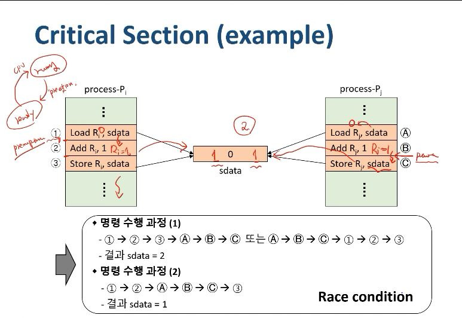

그림2. Critical Section 예시 2

하지만 상황에 따라서 값이 달라질 수 있다.

s = s + 1 이라는 과정은 machine instruction에 의해서 3개의 과정으로 이루어지게 된다.

1. 어떤 register Ri에 sdata 값을 읽어와라.
2. register Ri에 1을 더해라.
3. register Ri에 값을 shared data에 저장해라.

우리는 atomicity에 의해서 각 단계가 수행하는 동안에는 다른 명령을 수행할 수 없지만 각 단계가 끝났을 때에는 다른 명령을 수행할 수 있다.

만약 명령 수행 과정 (2)의 순서대로 진행된다면, Ri와 Rj에는 모두 0 + 1 = 1이 되어 shared data 가 2가 아닌 1이 될 수 있다.

이렇게 명령 수행 과정의 순서에 따라 결과가 달라지는 Race condition이 발생할 수 있다.

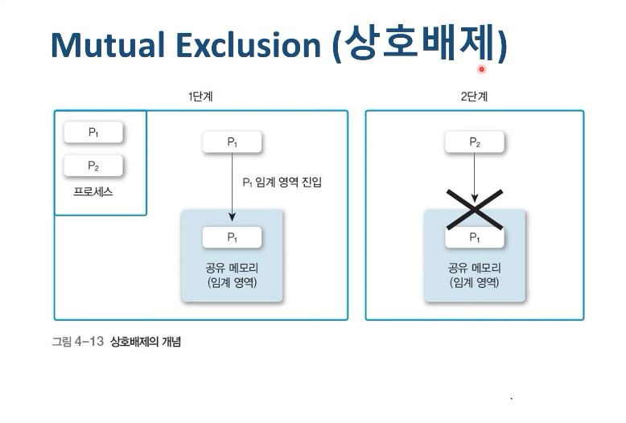

그림3. Mutual Exclusion

우리가 원하는 결과를 보장하기 위해서 Mutual Exclusion (상호 배제)가 등장하게 된다.

Mutual Exclusion이란 하나의 프로세스가 critical section에 들어와 있으면 다른 프로세스가 들어오지 않게 만드는 것이다. 즉, 위 예시에서 명령 수행 과정 (1)의 과정을 거치도록 만드는 것이다.

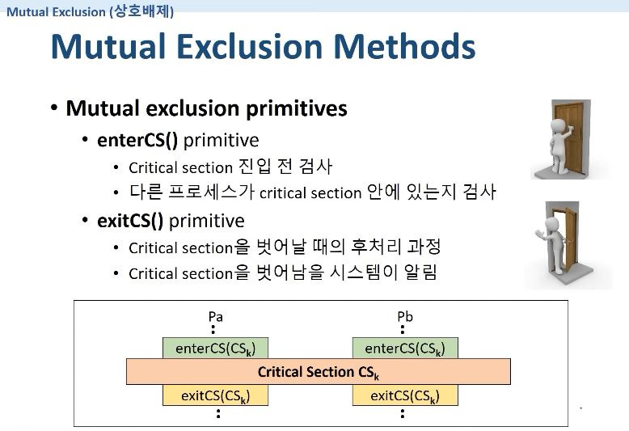

그림 4. Mutual Exclusion Primitives

### Mutual Exclusion Methods

- Mutual exclusion primitives (Mutual exclusion을 구현하기 위한 기본이 되는 연산)
  - enterCS() primitive : Critical Section에 들어가는 연산
    - Critical section 진입 전 검사
    - 다른 프로세스가 critical section 안에 있는지 검사
  - exitCS() primitive : Critical section에서 나오는 연산
    - Critical section을 벗어날 때의 후처리 과정
    - Critical section을 벗어남을 시스템이 알림

### Requirements for Mutual Exclusion primitives (Mutual Exclusion primitives를 만족하기 위한 요구 사항)

- Mutual exclusion (상호 배제)
  - Critical section(CS)에 프로세스가 있으면, 다른 프로세스의 진입을 금지
- Progress (진행)
  - CS 안에 있는 프로세스 외에는, 다른 프로세스가 CS에 진입하는 것을 방해하면 안됨
  - ex) CS가 비어있는데 프로세스 A가 프로세스 B가 CS에 못들어가도록 막는 상황은 발생해서는 안된다.
- Bounded waiting (한정 대기)
  - 프로세스의 CS 진입은 유한 시간 내에 허용되어야 함 (프로세스는 언젠가는 CS에 들어갈 수 있어야 한다)

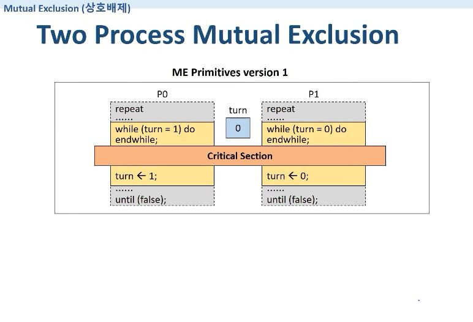

그림 5. Two Process Mutual Exclusion version 1

Turn을 만들어서 내 턴일 때 CS를 진입하는 방식을 생각해보자.

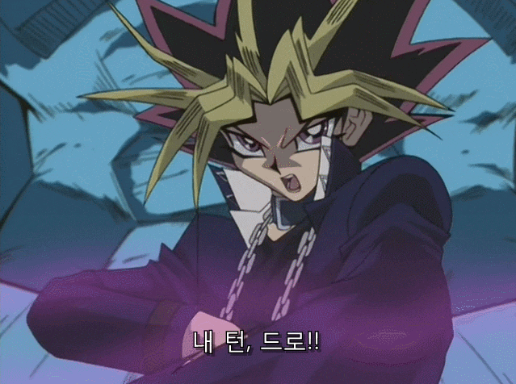

우리가 아는 그 턴 맞다.

상대방의 턴일 때에는 계속 기다리고 있다가 내 턴이 되면 CS에 진입하고, 나올 때 Turn을 상대방의 턴으로 넘겨준다.

이 방식의 경우의 문제점은 Progress 조건에 위배된다는 것이다.

만약의 최초의 Turn이 0번이라고 할 때, 프로세스 P0가 repeat 단계에서 죽어버리면, Turn은 계속 P0의 턴이 되어버린다. CS는 비어있는데 P1은 자신의 턴이 오지않아 CS에 진입을 할 수 없게 되어버린다.

혹은, P0가 CS에 진입한 후, 퇴장할 때 Turn을 P1에게 넘겨줬다. 그런데 아직 P1은 repeat 단계에 머물러있는데, P0가 한 바퀴 돌아서 enterCS 단계에 있다면, CS가 비어있는데 P1이 P0가 CS에 진입하지 못하도록 방해하는 꼴이 되어버린다.

그림 6. Two Process Mutual Exclusion version 2

P0와 P1에게 깃발을 만들어서 상대방의 깃발이 False 상태면 나의 깃발을 True 상태로 만든 뒤에 CS에 진입하고, CS에서 나올 때 자신의 깃발을 False 상태로 만드는 것이다.

이 경우의 문제점은 Mutual exclusion을 위배할 수 있다는 것이다.

만약 P0가 P1의 깃발이 false인것을 확인한 뒤에 자신의 깃발을 올리기 전에, 마찬가지로 P1가 P0의 깃발이 내려가 있는 것을 확인하고 자신의 깃발을 올려버리면 CS에 P0와 P1이 둘 다 들어가버리게 되는 경우가 발생할 수 있다.

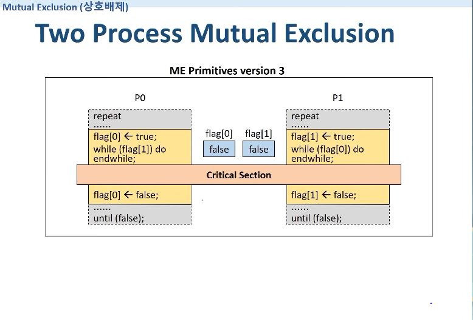

그림 7. Two Process Mutual Exclusion version 3

version 2에서 깃발을 먼저 True로 만든 뒤에 상대편의 깃발을 확인하는 방법이다.

이 경우의 문제점은 Progress, Bounded waiting을 위배하게 된다.

P0이 깃발을 True로 놓고, P1도 깃발을 True로 놓으면 P0와 P1 둘 다 반복문에서 탈출하지 못해 CS에 진입을 할 수 없는 상황에 놓이게 된다. 즉, CS는 비어있는데 상대편으로 인해 들어가지 못하고, 시간이 아무리 흘러도 아무도 들어가지 못하는 상황이 되어버린다.

## 스핀락(Spinlock)

이 문제들을 해결하고자 OS가 지원하는 SW 솔루션들이 등장하게 된다.

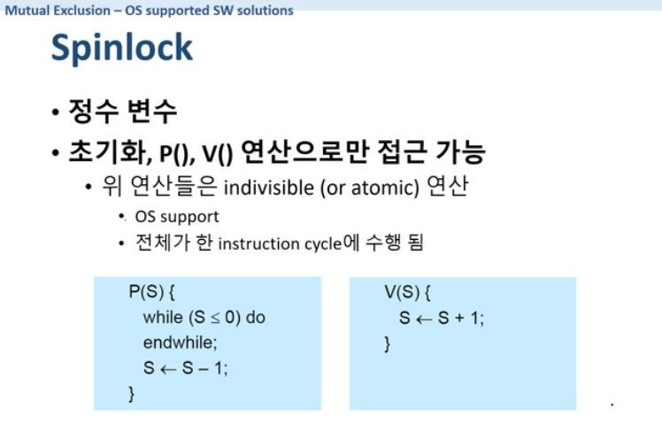

그림 8. Spinlock

- Spinlock은 정수형 변수(S)이다.
- 초기화, P(), V() 연산으로만 접근이 가능한 변수
  - 위 연산들은 indivisible (or atomic) 연산
    - OS가 보장해줌. 즉, P(), V() 연산이 한 번 실행되면 preemptive 되지 않고 끝까지 실행됨
    - 전체가 한 instruction cycle에 수행 됨
- P(S) 연산 : S는 물건의 갯수, P는 물건을 꺼내가는것
  - 물건(S)이 0 이하라면 물건이 생기기를(S가 0 이상이 되기를) 기다린다.
  - 물건(S)이 0보다 크다면 1개를 빼준다.
- V(S) 연산 : V는 물건을 집어넣는 것
  - 물건(S)를 1 더해준다.
- 혹은 P연산은 자물쇠를 거는 것, V연산은 자물쇠를 푸는 것이라고 이해해도 된다.

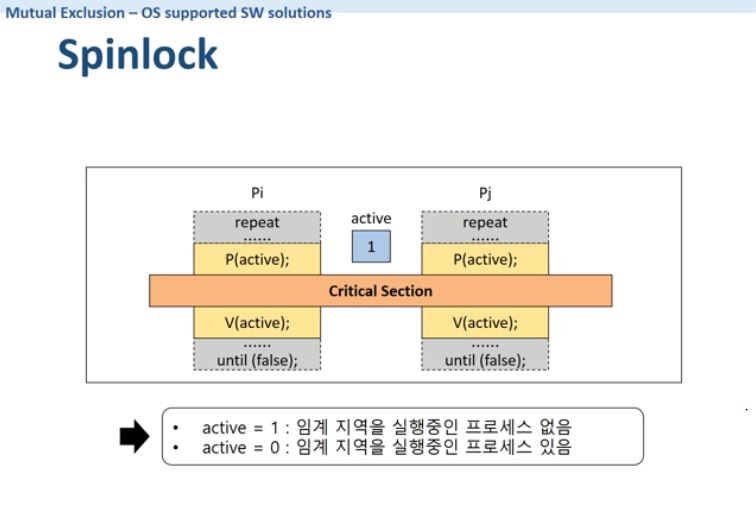

그림 9. Spinlock

Spinlock을 사용하면 ME 문제가 간단하게 해결된다.

들어가기 전에 P() 연산(자물쇠를 잠금), 나갈 때 V() 연산(자물쇠를 품)을 수행한다.

active라는 spinlock 변수가 존재하고, 초기값은 1이다. 즉, "물건이 있다" 를 의미한다.

Pi가 먼저 도착해서 P연산을 수행하고 active를 1 - 1 = 0 으로 만들고 CS에 진입한다. 그리고 CS에서 나가면서 V 연산을 통해 active를 다시 0 + 1 = 1 로 만든다.

Pj는 Pi가 CS에 있는 동안 active가 0이므로 P연산에서 반복문을 돌다가 Pi가 CS에서 나오고 V연산을 통해 active를 1로 만들면 CS에 진입한다.

Spinlock에서 P 연산과 V 연산은 중간에 preemptive 되지않고 한 번 실행되면 끝까지 수행하도록 보장되기 때문에 동시에 들어가거나 (Mutual Exclusion), 아무도 못들어가는 (Bounded waiting) 문제가 발생하지 않는다.

## 뮤텍스(MuTex)와 세마포어(Semaphore)

Spinlock에서 P() 연산과 V() 연산이 한 번에 동작하도록 보장해줌으로써 문제를 간단하게 해결할 수 있다는 것을 확인했다. 하지만 여전히 Busy waiting(반복문의 조건문에서 우리는 아무것도 안하고 기다리는 것과 같지만, 실제로는 계속 조건을 확인하면서 반복문을 도는 것) 문제가 여전히 남아있다.

즉, spinlock은 락이 해제될 때까지 계속 CPU 자원을 소비하면서 락 상태를 확인해야한다. → CPU 자원 낭비

이 문제를 해결하기 위해 등장한 개념이 뮤텍스와 세마포어다.

일단 뮤텍스와 세마포어에서 busy waiting 문제를 해결하기 위한 공통된 idea는 CS에 들어갈 수 있는지 반복문으로 계속 확인하는 것이 아니라 “wait queue라는 대기실을 만들고 거기에 대기할 프로세스/스레드들을 모아두고 자리가 나면 그 때 하나씩 호출하자”라는 것이다.

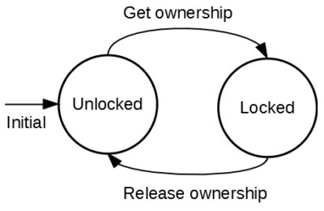

그림 10. 뮤텍스 동작방식

### 뮤텍스 동작방식

1. Lock 획득 시도 : 프로세스/스레드가 CS에 진입하기 위해 뮤텍스에 대한 lock을 시도한다.
   1. 뮤텍스 사용가능(unlocked) 상태 : 즉시 lock을 획득하고, CS에 진입한다. 이때 뮤텍스 상태는 locked로 변경된다.
   2. 뮤텍스 잠김(locked) 상태 : lock을 획득할 수 없으므로, 해당 프로세스/스레드는 뮤텍스와 관련된 wait queue에 들어간다. 이 프로세스/스레드는 blocked(asleep) 상태가 된다.
2. Lock 해제 : CS에서 작업을 마친 프로세스/스레드는 뮤텍스에 대한 lock을 해제한다.
   1. wait queue 확인 : 뮤텍스는 자신의 wait queue를 확인하여 기다리고 있는 프로세스/스레드가 있는지 확인한다.
   2. 프로세스/스레드 깨우기 : wait queue에 프로세스/스레드가 있다면, 그 중 하나를 선택해서 깨운다(ready 상태로 변경). 깨어난 프로세스/스레드는 이제 뮤텍스 lock을 획득하고 CS 에 진입한다.

## 세마포어

- 1965년 다익스트라가 제안
- Busy waiting 문제 해결
- **음이 아닌 정수형 변수(S), S >= 0**
  - 초기화 연산, P(), V() 로만 접근 가능
    - P : Probern (들어가기 전에 검사)
    - V : Verhogen (나올 때 돌려놔서 증가)
- **임의의 S 변수 하나에 ready queue 하나가 할당 됨**

### 세마포어 연산

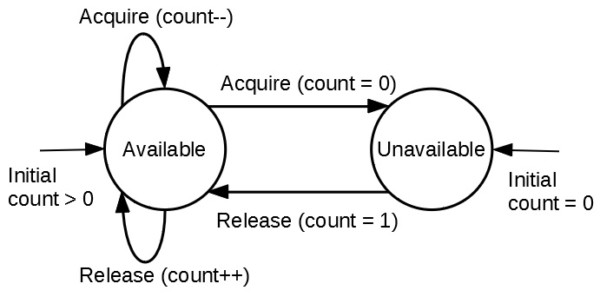

그림 11. 세마포어 동작방식

- 초기화 연산
  - S 변수에 초기값을 부여하는 연산
- P() 연산, V() 연산
  - P(S) : 자물쇠를 거는 연산. 물건이 있는지 확인한 다음(if S > 0), 물건이 있으면 꺼내가고(S = S - 1) 없으면 S에 할당된 queue에서 기다린다(wait on the queue Q). spinlock 에서는 while 문으로 계속 반복문을 돌면서 기다렸지만, semaphore에서는 S에 할당된 ready queue에서 기다린다.
  - V(S) : 자물쇠를 푸는 연산. ready queue에서 기다리는 프로세스가 있는지 확인한 다음(if waiting processes on Q), 있으면 그것들 중 하나를 불러오고(wakeup), 없으면 물건을 더해준다(S = S + 1).
- 모두 indivisible 연산
  - OS support
  - 전체가 한 instruction cycle에 수행 됨. 이전에는 반복문을 돌면서 CPU를 사용했는데 이제는 queue에서 대기만 하면 됨

### 뮤텍스와 세마포어의 차이점

1. 소유권

- 뮤텍스는 소유권 개념(key)이 있다. 즉, 뮤텍스를 잠금(lock) 프로세스/스레드만이 뮤텍스를 unlock 할 수 있다.
- 세마포어는 소유권 개념이 없다. 세마포어의 카운트를 증가시킨 후, wait queue에서 대기하고 있는 프로세스/스레드 호출은 CS에서 P연산을 했던 프로세스가 아니라 다른 프로세스/스레드가 호출할 수도 있다.

2. 카운터

- 뮤텍스는 잠금(unlock)과 해제(unlock) 두 가지 상태만 가진다.
- 세마포어는 정수형 카운터 (S ≥ 0) 를 가진다.

3. 사용 사례

- 뮤텍스는 한 번에 하나의 프로세스/스레드만 실행되어야 하는 코드 영역을 보호해야할 때(즉, 상호 배제만 필요할 때) 권장된다.
- 세마포어는 작업 간의 실행 순서 동기화가 필요할 때 권장된다.

### 세마포어 작업 실행 순서 동기화

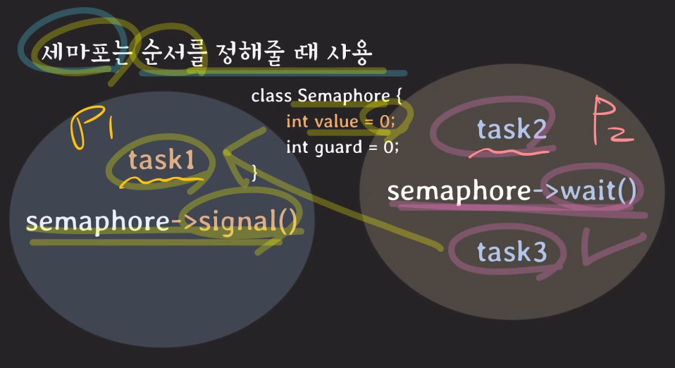

그림 12. 세마포어 작업 순서 동기화

2개의 프로세스(P1, P2)가 존재한다고 가정해보자.

P1은 task1 을 수행한 다음 signal 연산(V 연산. wait queue에 작업이 끝났다고 신호를 날려줌)을 수행하고, P2는 task2를 수행한 다음 wait 연산(wait queue로 들어감)을 수행하고 wait가 끝나면 task3 를 수행한다.

이때, task3는 P1의 task1가 완료되어야만 수행할 수 있는 작업이 되는 것이다.

예를 들어, 멀티 코어 환경에서 P1과 P2가 둘 다 코어를 할당받아서 작업을 수행했다고 해보자.

먼저, P1이 task1을 끝내고 V연산을 수행하고 signal을 날렸다고 해보자. 그럼 P2가 task2를 끝내고 wait 연산을 날렸을 때, S가 1이 되므로 바로 task3를 수행할 수 있게 된다.

반대로, P2가 task2를 끝내고 wait queue에 들어가 있다고 해보자. 그리고 P1이 task1을 끝내고 V 연산을 수행하고 signal 호출을 하면 S 는 0 → 1 이 되서 wait queue에 들어있는 P2가 신호를 받고 다시 P 연산을 수행해서 task3 를 수행할 수 있게 되는 것이다.

## 퀴즈

1. 스핀락이 가지는 단점은 무엇인가요?
2. 뮤텍스와 세마포어의 차이점은 무엇인가요?

## 출처

쉬운 코드 : https://www.youtube.com/watch?v=gTkvX2Awj6g

HPC Lab. KOREATECH : https://www.youtube.com/watch?v=CitsUz-Dx7A&list=PLBrGAFAIyf5rby7QylRc6JxU5lzQ9c4tN&index=17
