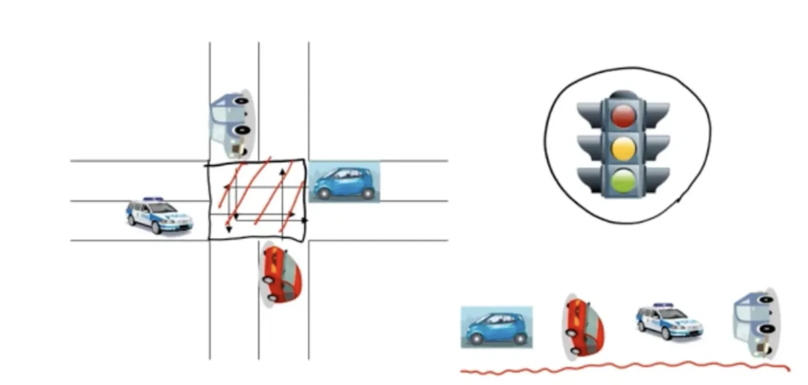

## 교착상태(Deadlock)이란

- 둘 이상의 프로세스가 서로의 자원을 점유한 채, 상대방이 점유한 자원의 해제를 기다리며 무한 대기 상태에 빠지는 현상
- 멀티태스킹 환경에서 자원 공유 시 발생 가능

  

---

## 교착상태(Deadlock) 발생 조건

1. **상호 배제(Mutual Exclusion)**
    - 매 순간 하나의 프로세스만이 자원을 사용할 수 있음
    - 자원을 공유해서 사용할 수 없다.
2. **점유 및 대기(Hold and Wait)**
    - 자원을 가진 프로세스가 다른 자원을 기다릴 때 보유 자원을 놓지 않고 계속 가지고 있음
    - 프로세스가 이미 하나 이상의 자원을 취득한(hold) 상태에서 다른 프로세스가 사용하고 있는 자원을 추가로 기다린다.(wait)
3. **비선점(No Preemption)**
    - 프로세스는 자원을 스스로 내어놓을 뿐 강제로 빼앗기지 않음
    - 자원 반환(release)은 오직 그 리소스를 취득한 프로세스만 할 수 있다.
4. **순환 대기(Circular Wait)**
    - 자원을 기다리는 프로세스 간에 **사이클**이 형성되어야 함
    - 프로세스들이 **순환(circular) 형태**로 서로의 리소스를 기다린다.

---

## 교착상태(Deadlock) 해결 방법

### 1) **예방 (Prevention)**

**데드락의 필요조건 중 하나 이상을 제거하여 데드락 발생을 차단**

---

**상호배제**

- 모든 리소스를 sharable 하게 만든다.

**→ 하드웨어적으로 CPU 등은 한번에 한 프로세스만 이용 가능 하기때문에 불가능**

---

**비선점**

- process가 어떤 자원을 기다려야 하는 경우 이미 보유한 자원이 선점(다른 프로세스가 선점 가능하도록 함)
1. 프로세스 Pb가 다른 프로세스 Pa가 사용중인 자원을 요청하면, Pb는 wait하지 않고 Pb가 사용중이던 모든 자원을 반납한다. 그리고 Pb는 처음부터 다시 시작하는 방법이다. 즉 wait하면 deadlock상태에 빠질 수 있으므로 wait하지 않기 위한 방법
2.  어떤 프로세스 Pb가 어떤 자원을 요청하는데 그 자원이 다른 프로세스 Pa에게 할당중인 상태라면, Pa로부터 빼앗아서 선점하는 방법이다. 이 경우 프로세스 Pa가 죽을 수 있는 방법

**→심각한 자원의 낭비를 초래하기 때문에 실용적이지 않다**

---

**점유 및 대기**

1. 프로세스 시작 시 모든 필요한 자원을 할당받게 하는 방법 (모든 것을 Hold하고 시작)

   → **단계마다 필요한 자원이 다를 텐데 지금 사용하지 않을 자원까지 hold하고 있으면 자원 효율이 떨어지고, 자원을 모두 확보되지 못한 경우 계속 wait하는 상황이 될 수 있다.**

2. 자원이 필요할 경우 보유 자원을 모두 놓고 다시 요청
   자원을 전혀 가지지 않은 상태에서만 자원을 요청할 수 있도록 제약조건을 줌

---

**순환 대기**

- 모든 자원 유형에 할당 순서를 정하여 정해진 순서(오름차순)대로만 자원 할당
- 가장 많이 사용

---

### 2) **회피 (Avoidance)**

- 시스템 상태를 모니터링하여 데드락이 발생하지 않도록 자원 할당을 조정
- 대표적인 알고리즘: **은행가 알고리즘(Banker's Algorithm)**
    - 은행에서 모든 고객의 요구가 충족되도록 현금을 할당하는데서 유래
    - 자원 요청을 허락해 줬을 때 데드락이 발생할 가능성이 있으면 자원을 할당해도 안전할 때까지 계속 요청을 거절하는 알고리즘

### 3) **탐지 (Detection) 및 복구 (Recovery)**

- 데드락이 발생했는지 검사(Detection)하고, 해결 방법(Recovery)을 적용
- 해결 방법: 프로세스 종료 또는 자원 회수
    1. 프로세스를 종료한다. (데드락에 빠진 프로세스 모두 강제 종료)(작업 중인 자료를 잃을 수 있어 risk가 큼)
    2. 자원의 일시적인 선점을 허용한다.

### **4) 무시 (Deadlock Ignorance)**

- Deadlock을 시스템이 책임지지 않음
- UNIX를 포함한 대부분의 OS가 채택

---

## 퀴즈

데드락은 어떤상태에 발생하고 해결하는 방법은?

---

## 출처

https://github.com/devSquad-study/2023-CS-Study/blob/main/OS/os_deadLock.md

도서 Operating System Concepts - Abraham Silberschatz , Peter Baer Galvin , Greg Gagne