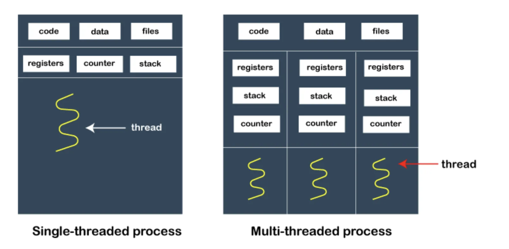
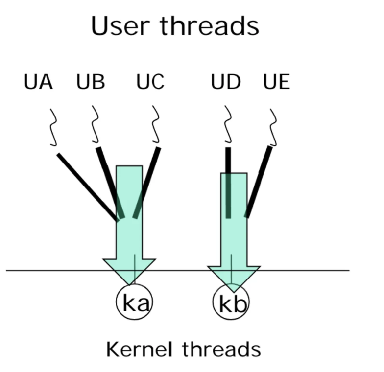
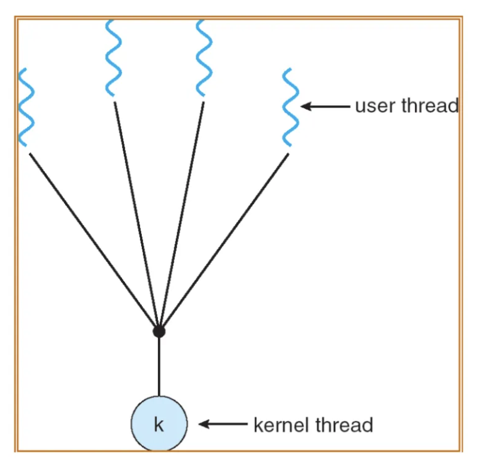
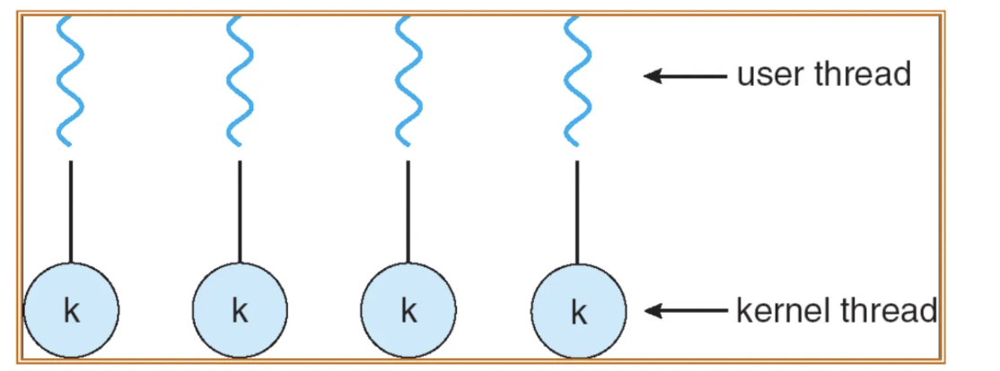
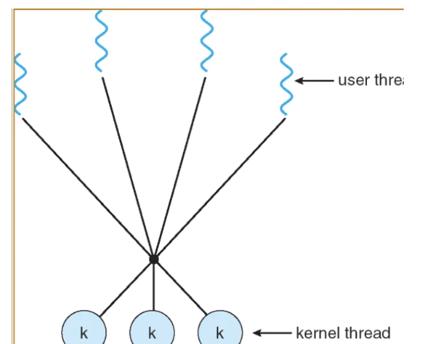

## 멀티프로세스, 스레드와 멀티스레딩

### 프로세스와 스레드

프로세스(Process)

- 운영체제에서 실행되는 하나의 독립적인 프로그램 단위
- 각 프로세스는 독립적인 메모리 공간을 가짐 (코드, 데이터, 힙, 스택)
- 프로세스 간의 데이터 공유가 어려우며 IPC(Inter-Process Communication) 사용 필요

→ 한 프로그램이 다수의 task 들을 병렬적으로 실행해야 하는 경우가 발생하기에 스레드의 개념이 도입!

스레드가 없을 시 : 각 task에 대해 각각 프로세스를 생성해야 하는데 이 때 fork() 연산을 사용해야 하지만 비싼 연산이기에 자원이 비효율적으로 이용된다.

 

스레드(Thread)

- 프로세스 내에서 실행되는 작업의 흐름 단위
- 동일한 프로세스 내의 스레드는 메모리(코드, 데이터, 힙)를 공유하지만 스택은 개별적으로 가짐
- 프로세스보다 가벼우며, 자원 공유가 용이하여 오버헤드가 적음

 

프로세스와 스레드의 관계

**프로세스는 하나의 독립적인 작업 단위**이고, **스레드는 그 안에서 실행되는 작은 실행 단위**이다.

예) 웹 브라우저를 실행 시 하나의 **프로세스**가 생성되고 그 안에서 여러 개의 **스레드**가 동작한다.

- 스레드 1 : 웹 페이지 로딩
- 스레드 2 : 동영상 재생
- 스레드 3 : 사용자의 입력을 처리

### 싱글스레드, 멀티스레드

---

스레드는 별도의 실행 객체이기 때문에 공유되지 않는 각자의 stack과 register 를 가지고 이외의 data, text, heap은 공유한다.

장점

- **응답성** : 하나의 스레드가 block되더라도, 같은 프로세스 내의 다른 스레드가 계속 실행될 수 있어 전체 프로그램의 실행이 멈추지 않는다.
- **효율적인 자원 공유** : 같은 프로세스 내의 스레드들은 메모리(코드, 데이터, 힙)를 공유하므로, 프로세스 간의 통신보다 빠르고 효율적이다.
- **경제성** : 스레드는 프로세스보다 생성과 관리 비용이 적으며, Context Switching 비용도 낮아 성능이 향상된다.
- **병렬성** : 멀티스레딩을 활용하면 여러 스레드를 각각 다른 CPU 코어에 할당하여 병렬 처리가 가능하다.

---

### 멀티프로세스

멀티프로세스 : 하나의 프로그램에서 여러 개의 프로세스를 생성하여 작업을 수행하는 방식

특징

- 각 프로세스는 독립적인 메모리 공간을 가짐
- 프로세스 간 통신이 어렵고 비용이 많이 듦
- 병렬 처리(멀티코어 활용) 가능

---

### 멀티스레딩

멀티스레딩 : 하나의 프로세스 내에서 여러 개의 스레드를 생성하여 작업을 수행하는 방식

특징

- 동일한 메모리 공간을 공유하므로 데이터 공유가 용이함
- 프로세스보다 가볍고 Context Switching 비용이 적음
- 동기화 문제가 발생할 수 있음 (Race Condition, Deadlock)

스레드의 종류

1. kernel 스레드 : OS 에 의해 관리되는 thread
2. user 스레드 : user space 의 thread library 에 의해 관리되며, OS 의 관여를 받지 않는다.

→ OS는 kernel 스레드에만 관여하기 때문에 kernel과 user 스레드 간 mapping 관계가 있어야 두 종류의 스레드가 동시에 실행 가능하다.

 

멀티스레딩의 원칙

1. scheduler 는 user스레드 존재 인식 불가

   → ka 가 scheduling 된 시점에 ud ue 는 실행 불가

2. kernel 스레드가 block 되면, 그에 mapping 된 user 스레드들도 같이 block 된다.

   → ka 를 block 해 waiting state 로 만들면, ua ub uc 도 block 된다.

3. kernel 스레드는 각자 다른 CPU 에 할당 가능하다

   → user 스레드는 CPU 에 할당할 수 없다.

 

| 비교 항목   | 멀티프로세스                | 멀티스레딩                                       |
| ----------- | --------------------------- | ------------------------------------------------ |
| 메모리 공유 | X (독립적)                  | O (공유)                                         |
| 생성 비용   | 높음 (새로운 프로세스)      | 낮음 (새로운 스레드)                             |
| 데이터 공유 | 어려움 (IPC 필요)           | 쉬움                                             |
| 병렬 처리   | 가능                        | 가능하지만 동기화 문제 발생                      |
| 안정성      | 높음 (프로세스 단위로 격리) | 낮음 (하나의 스레드 오류가 전체 프로세스에 영향) |

---

멀티스레딩의 종류

1. many to one

   

   - 하나의 kernel 스레드에 다수의 user 스레드가 mapping
   - 빠르고 overhead가 작다 (user 스레드는 라이브러리로 관리되기에 kernel의 개입이 필요없기 때문)
   - kernel 스레드가 block될 때 모든 user 스레드가 block 되어 idle한 cpu가 생긴다.

   

2. one to one

   

   - kernel 스레드와 user 스레드가 일대일로 mapping
   - 멀티프로세스의 장점을 가진다.
   - kernel 스레드의 생성은 비싼 연산이기에 user 스레드의 생성 갯수가 제한된다.

 

3. many to many

   

   - kernel 스레드와 user 스레드가 다대다로 mapping
   - 앞의 두 모델의 장점들을 모두 가진다.

---

### 질문

1. 스레드가 스택 공간을 별도로 가지는 이유에 대해서 설명해주세요.
2. 멀티 스레드(Multi Thread)를 사용하는 이유가 무엇인가요?

---

### 출처

도서 Operating System Concepts - Abraham Silberschatz , Peter Baer Galvin , Greg Gagne
