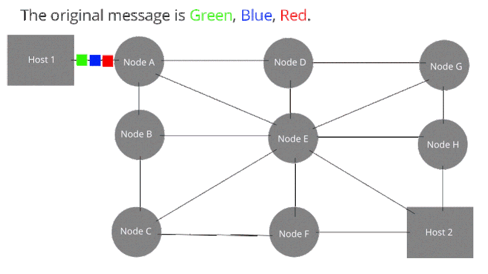
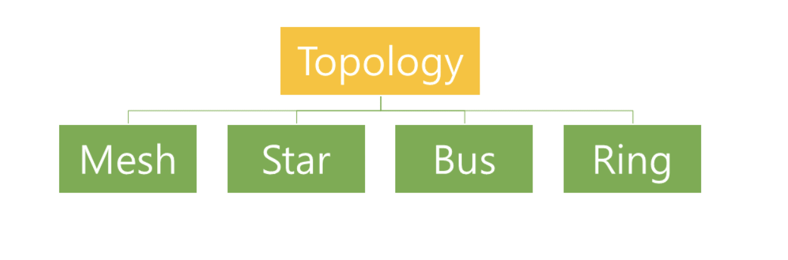
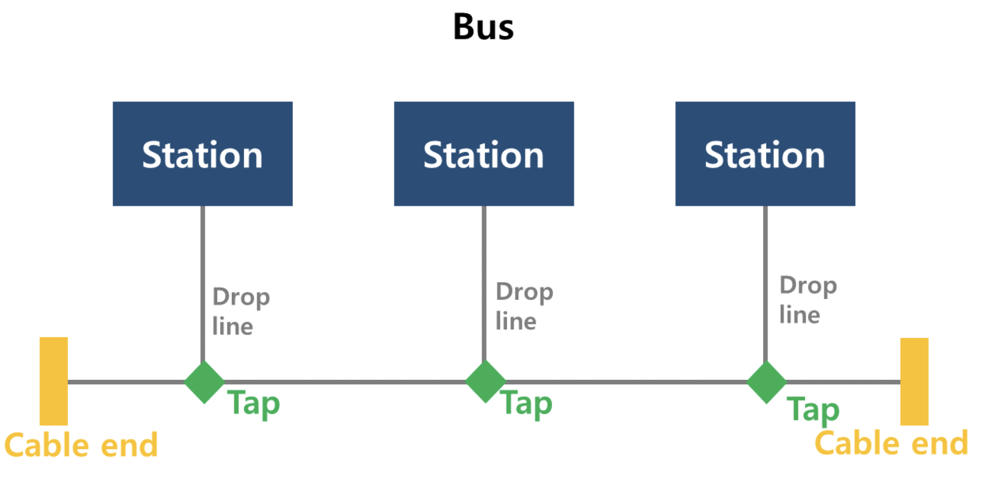
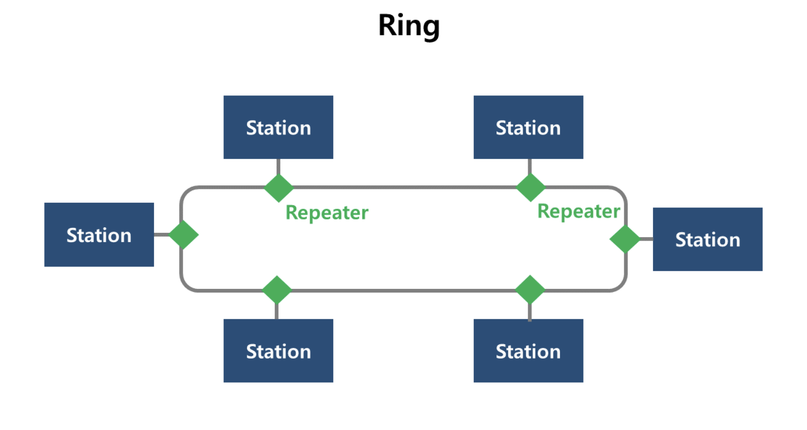

# 네트워크의 기초

## 네트워크란?

- 두 개 이상의 장치(컴퓨터, 스마트폰, 서버 등)가 데이터를 주고받을 수 있도록 연결된 시스템
- 정보 공유, 원격 제어, 인터넷 사용 등이 가능
- Node들이 Link를 통해 연결되어 있어 서로 데이터를 주고받을 수 있는 상태

 

## 네트워크의 구조

### 네트워크 토폴로지 (Topology)

- 네트워크 구성요소인 장치와 링크가 어떻게 배치되어 있는가를 의미

### 스타 형 (Star)

- 각 장치가 보통 허브라고 불리는 중앙의 장치로 일대일 연결되어있는 형태
- 허브라는 네트워크 연결장치로 케이블을 통해 컴퓨터를 일대일로 연결

### 버스형 (Bus)

- 하나의 긴 케이블에 여러 장치들이 멀티포인트 링크 형태로 연결되어있는 형태

### 링 형 (Ring)

- 장치와 링크들이 링 형태로 구성되어 있는 구조

### 그물형 (Mesh)

- 각 장치가 일대일 연결 링크로 아무 상관성없이 서로 연결 되어있는 형태
   

## 네트워크의 분류

- 크기와 영역에 따라 분류

### LAN(Local Area Network)

- 작은 지역(집, 사무실, 학교) 내에서 사용되는 네트워크.
- 높은 데이터 전송 속도를 제공한다.

### WAN(Wide Area Network)

- 도시, 국가, 대륙을 연결하는 광범위한 네트워크.
- 대표적인 WAN이 인터넷이다.

### MAN(Metropolitan Area Network)

- 도시 규모의 네트워크로, 여러 개의 LAN을 연결하는 역할을 한다.

### PAN(Personal Area Network)

- 개인 장치 간 네트워크(예: 블루투스, NFC)를 의미한다.

 

## 네트워크 프로토콜

### TCP/IP (Transmission Control Protocol / Internet Protocol)

- 인터넷의 기본 프로토콜로, 데이터를 패킷 단위로 전송하고 수신자가 이를 재조립할 수 있도록 한다.

### HTTP/HTTPS (HyperText Transfer Protocol / Secure HTTP)

- 웹 브라우저와 서버 간 통신을 담당하는 프로토콜로, HTTPS는 보안을 강화한 버전이다.

### FTP (File Transfer Protocol)

- 파일을 전송하기 위한 프로토콜로, 서버와 클라이언트 간 파일 업로드 및 다운로드를 가능하게 한다.

### DNS (Domain Name System)

- 도메인 주소(예: google.com)를 IP 주소(예: 142.250.72.206)로 변환해주는 서비스.

### DHCP (Dynamic Host Configuration Protocol)

- IP 주소를 자동으로 할당해주는 프로토콜.

 

## 네트워크 보안

### 방화벽(Firewall)

- 네트워크 트래픽을 감시하고 차단하여 보안을 강화하는 장치 또는 소프트웨어.

### VPN(Virtual Private Network)

- 인터넷을 통해 암호화된 터널을 생성하여 안전한 데이터 전송을 가능하게 한다.

### 암호화(Encryption)

- 데이터를 보호하기 위해 암호화 알고리즘을 사용하여 인가된 사용자만 접근할 수 있도록 한다.

 

## 네트워크 통신 과정

1. 사용자가 웹 브라우저에 `www.example.com` 입력
2. DNS 서버가 `www.example.com`의 IP 주소를 조회
3. 사용자의 장치가 해당 IP 주소로 HTTP 요청 전송
4. 웹 서버가 요청을 받아 응답 데이터 전송
5. 사용자의 브라우저가 웹 페이지를 렌더링하여 표시
