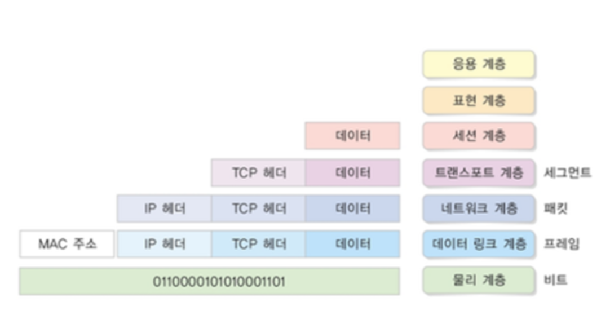
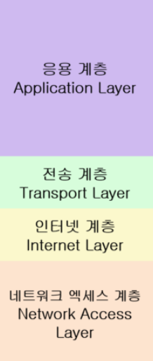

# OSI 7 계층

### 네트워크 기능

네트워크가 수행하는 기능은 5가지 정도로 볼 수 있음

- 애플리케이션 목적에 맞는 통신 방법 제공
- 신뢰할 수 있는 데이터 전송 방법 제공
- 네트워크 간의 최적의 통신 경로 결정
- 목적지로 데이터 전송
- 노드 사이의 데이터 전송

이 기능들은 네트워크 프로토콜을 통해서 동작하고 모든 기능을 단 하나의 프로토콜로 구현할 수 없기에 모듈화가 필요함
모듈화 : 기능별로 분리시켜 구현하는 것
 

## OSI 7계층

- 각 계층은 독립적이며 데이터를 송신할 떼 각 계층에서 필요한 정보를 추가해 데이터를 가공함
- 각 계층의 프로토콜은 하위 계층의 프로토콜이 제공하는 기능을 사용하여 동작함
- 데이터가 상위 계층에서 하위 계층으로 전달될 때에는 **캡슐화**가 진행되고, 하위 계층에서 상위 계층으로 올라올 때는 **역캡슐화**가 이루어짐

 

캡슐화(Encapsulation): 데이터를 전송하기 위해 각 계층에 헤더(Header)를 붙여 정보를 추가하는 과정 이 과정에서 데이터를 프로토콜 데이터 단위(PDU)로 변환함

역캡슐화(Decapsulation): 데이터를 수신한 측에서 각 계층별로 헤더(Header)를 제거해 본래의 데이터를 복원하는 과정 이때 헤더에 포함된 정보를 확인해 데이터가 올바르게 처리되었는지 검증함

 

## L1 - 물리 계층(Physical Layer)

디지털 데이터를 전기 신호, 광 신호 등으로 변환하여 비트 단위로 실제 물리 장비를 통해 전달하는 역할

 

**주요 프로토콜**

이더넷(Ethernet), USB

 

## L2 - 데이터 링크 계층 (Data Link Layer)

물리 계층에서 받은 데이터의 오류와 흐름을 관리하는 역할

### 주요 기능

- 직접 연결된 노드 간의 통신을 담당
- 네트워크 장치의 고유한 주소인 MAC 주소를 통해 데이터를 식별함
- 데이터를 일정한 구조로 정리하여 전달함 (→ 이를 프레임이라고 부름)

 

**프레임의 구조**

**헤더**: 송신자 MAC 주소, 수신자 MAC 주소, 데이터 길이

**페이로드**: 실질 데이터

**트레일러**: CRC 값(오류 검출 정보)

 

**주요 프로토콜**

ARP (IP 주소를 MAC 주소로 변환하는 프로토콜) 주소 기반 통신

 

## L3 - 네트워크 계층(Network Layer)

데이터가 목적지에 도달할 수 있도록 최적의 경로를 결정하고, 패킷 단위로 전달하는 역할

### 주요 기능

- IP 주소를 사용하여 데이터가 최적의 경로로 전달될 수 있도록 라우팅을 수행함
- 서로 다른 네트워크 간의 연결을 관리함
- 네트워크 전체의 과부하를 방지하는 혼잡 제어

 

**주요 프로토콜**

IP(Internet Protocol) , ICMP(Internet Control Message Protocol)

 

## L4 - 전송 계층(Transport Layer)

애플리케이션 간의 데이터 전송에서 신뢰성과 정확성을 보장하는 역할

데이터 단위는 세그먼트(Segment) 단위로 분할

### 주요 기능

- 데이터가 송신지에서 수신지까지 손실 없이 전달되도록 흐름 제어와 오류 제어를 수행하며 데이터의 전송을 관리함

 

**주요 프로토콜**

TCP(Transmission Control Protocol) , UDP(User Datagram Protocol)

- **TCP와 UDP의 차이점**

  TCP는 안정적이고 신뢰성 있는 데이터 전송을 보장하는 연결 지향 프로토콜

  UDP는 빠른 전송을 위한 위한 필수 기능만 제공하는 비연결 지향 프로토콜

 

## L5 - 세션 계층(Session Layer)

애플리케이션 간의 세션을 설정하고, 유지하며, 종료하는 역할

세션: 통신하는 두 장치 간의 연결 상태

### 주요 기능

- 통신 세션을 설정하고 종료함
- 통신 도중 연결이 끊기면 재연결하여 세션을 복구함
- 양방향 통신이 원활하게 이루어지도록 도움

 

**주요 프로토콜**

NetBIOS, PPTP(Point-to-Point Tunneling Protocol), RTCP

 

## L6 - 표현 계층(Presentation Layer)

데이터의 형식 변환, 압축, 암호화를 담당하는 역할

### 주요 기능

- 인코딩 ↔ 디코딩 : 데이터 형식을 변환하여 전송(인코딩)하고 다시 원래의 형태로 변환(디코딩)
- 암호화 ↔ 복호화 : 송신 측에서 보안을 위해 변형(암호화)했던 데이터를 수신 측에서 해독하여 복호화하여 읽음

- 압축 ↔ 압축 풀기

 

**주요 프로토콜**

SSL , TLS , MIME

 

## L7 - 응용 계층(**Application** Layer)

사용자와 직접 상호 작용하여 여러 네트워크 서비스를 제공하는 역할

### 주요 기능

- 다양한 응용 프로그램 프로토콜을 통해 사용자 요청을 처리하고 데이터의 송수신을 관리

**주요 프로토콜**

HTTP , HTTPS , DNS

 

## TCP/IP 모델

| **계층**        | **역할**                          | **OSI 7계층과의 연관성**                   |
| --------------- | --------------------------------- | ------------------------------------------ |
| 네트워크 엑세스 | 사용자와 직접 통신                | 물리 계층, 데이터 링크 계층                |
| 인터넷          | 데이터의 신뢰성 보장              | 네트워크 계층                              |
| 전송            | 라우팅 처리                       | 전송 계층                                  |
| 응용            | 데이터 전송 , 장비 간 물리적 통신 | 애플리케이션 계층 (응용, 표현, 세션 계층 ) |

## 퀴즈

- TCP와 UDP의 차이점에 대해 설명해보세요.
- 캡슐화가 무엇인지 설명해 보세요.
-

 

## ✈️ 출처

- [출처1](https://github.com/devSquad-study/2023-CS-Study/blob/main/Network/network_bandwidth.md)
