## Transport Layer Service

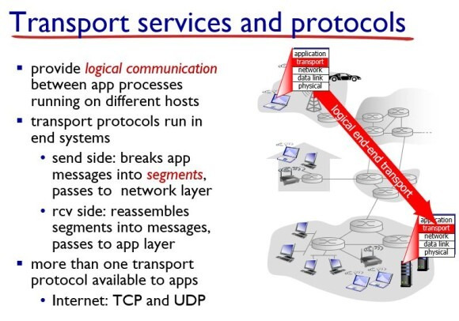

그림 1. Transport layer service

Transport Layer의 역할은 서로 다른 호스트들에서 동작하는 어플리케이션 프로세스 간의 논리적 통신(Logical Communication)을 제공하는 것이다.

논리적 통신 : 어플리케이션 관점에서 봤을 때 프로세스들이 동작하는 호스트들이 직접 연결된 것처럼 보이는 것을 의미

Transport layer 의 프로토콜은 end system에서 동작하는 데 송신단과 수신단이 서로 다르게 동작한다.

송신단(Send Side) : Application Layer에서 전달받은 메시지에 헤더를 추가하고 port #를 비롯한 여러가지 정보를 추가하고 캡슐화(Encapsulation)하고 Network Layer로 전달한다.

수신단(Receive Side) : Network Layer에서 전달받은 세그멘트를 디캡슐화(Decapsulation)해서 헤더를 제거하고, 재조립(Reassemble) 해서 메시지로 만들고 Application Layer로 전달한다.

이 Transport Layer에는 대표적으로 2가지 프로토콜(TCP, UDP)가 존재한다.

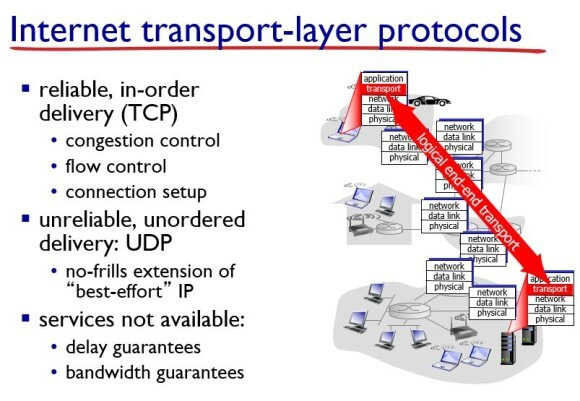

그림 2. Transport Layer Protocol

TCP는 혼잡 제어(Congestion Control)과 흐름 제어(Flow Control)이 가능한 프로토콜이다.

반면에 UDP는 신뢰성을 보장하지 않지만 TCP보다 빠르게 동작할 수 있다.

이 2가지 프로토콜은 둘 다 패킷 스위칭 기법을 사용하기 때문에 delay guarantee와 bandwidth guarantee를 보장하지 못한다는 공통점을 가진다.

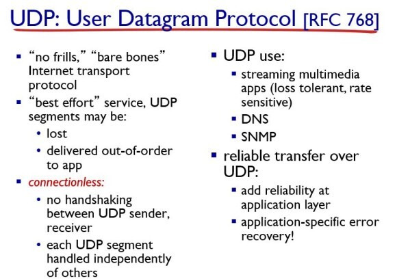

그림 3. UDP 프로토콜

UDP는 네트워크 송수신 시 송신자가 수신자에게 일방적으로 데이터를 전송하는 통신 방식으로 최소한의 필요한 기능(IP에 포트를 지정하는 것 등)만 수행한다.

packet lost가 일어날 수 있고, 메시지가 뒤섞여서 들어온다.

비연결성(connectionless)으로, 단순히 데이터를 던진다.

즉, 오류는 검출하지만 복구나 재전송이 없고, congestion control이나 flow control 을 수행하지 않는다.

구조가 단순한만큼 속도가 빨라 스트리밍 서비스에 사용된다.

최근 등장한 HTTP 3에서는 UDP 프로토콜을 기반으로 하는 QUIC 프로토콜이 사용되고 있다.

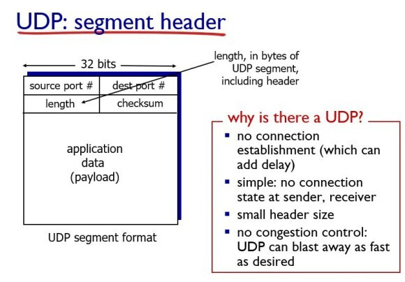

그림 4. UDP segment header

UDP 세그먼트는 위 사진과 같은 형태를 띄는데, Application data인 메시지에 header가 붙어서 segment가 되는데 가장 중요한 정보가 port number이다. 그 다음으로 중요한 것이 checksum이다. 여기서 checksum은 에러 체크를 할 때 사용된다.

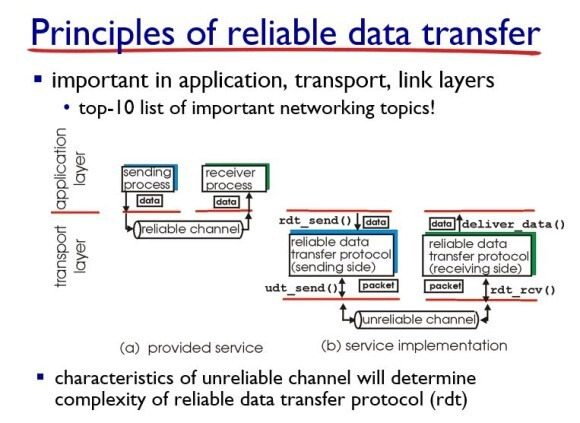

그림 5. reliable data transfer의 원칙

네트워크에서 중요한 토픽이 10개가 있는데 그 중 항상 들어가는 요소가 바로 신뢰성(Reliability)이다.

신뢰성이란 네트워크 환경에서 장애가 발생하더라도 데이터의 정확성, 완전성, 순서를 보장하여 데이터 손실이나 변조 없이 데이터를 목적지까지 안전하게 전달하는 능력을 의미한다.

신뢰성을 보장하는 데에는 DataLink Layer와 Transport Layer가 모두 관여하지만, end-to-end 신뢰성은 주로 transport layer가 담당한다. 여기서는 transport layer에 집중하여 살펴보자.

application layer는 일반적으로 transport layer가 TCP를 사용하는 경우 신뢰성 있는 채널을 제공한다고 가정한다. transport layer는 application layer로부터 데이터를 받으면 세그먼트로 만들어서 network layer로 내려 보내는데, 이 network layer는 best-effort delivery를 제공하므로 신뢰할 수 없는(unrelliable) 채널이라고 간주한다.

best-effort delivery : datagram의 전송을 위하여 최대의 노력(best effort)는 하지만, 데이터가 손실, 손상, 지연되거나 순서가 바뀌지 않는 것을 보장하지 않음.

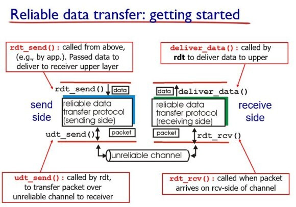

그림 6. Reliable data transfer 과정

Application Layer에서는 rdt_send(reliable data transfer) 라는 함수를 통해 메시지를 transport layer로 보낸다. 그러면 transport layer에서는 해당 메시지에 header 파일에 포트 넘버를 넣고 세그먼트를 만든다. 그 뒤, udt(unreliable data transfer)\_send 함수를 통해 밑의 계층(unreliable한 채널)로 보낸다.

수신측에서는 rdt_rcv 함수를 통해 패킷을 받아들인다. 그런데 unreliable한 채널에게 패킷을 받아드리므로 이 패킷이 오류가 없는지 체크를 해야한다. 체크를 하고 문제가 없으면 최종적으로 deliver_data 함수를 통해 세그먼트를 메시지로 만들어서 application layer로 올려준다.

## TCP Overview

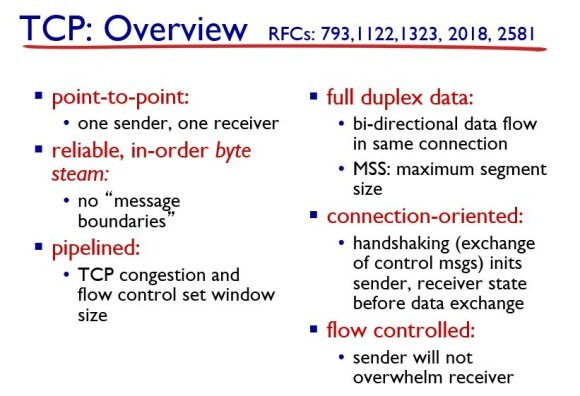

그림 7. TCP 개요

- TCP는 point-to-point 프로토콜이다. 여기서 point-to-point란 1대 1로 컴퓨터를 연결하는 프로토콜을 의미한다.
- reliable하고 데이터들이 순서대로 들어온다.

(no message boundaries : TCP는 데이터를 바이트 스트림(byte stream)으로 취급한다. 즉, 애플리케이션에서 보낸 메시지를 구분하지 않고 연속적인 바이트의 흐름으로 데이터를 전송한다.

예를들어, 애플리케이션이 다음과 같이 두 개의 메시지를 TCP 소켓을 통해 전송한다고 가정해보자.

메시지1 : “Hello” (5 bytes)

메시지2 : “World” (5 bytes)

TCP는 이 데이터를 하나의 세그먼트로 묶어서 전송할 수 있다.

세그먼트1 : “HelloWorld” (10 bytes)

혹은 여러 개의 세그먼트로 나누어 전송할 수도 있다.

세그먼트1 : “Hel” (3 bytes)

세그먼트2 : “loWo” (4 bytes)

세그먼트3 : “rld” (3 bytes)

즉, TCP는 reliable하고 데이터가 순서대로 들어오지만, 애플리케이션에게 메시지 경계를 제공하지 않는다.

)

- 파이프라인으로 전송하고, window size를 조절해서 flow control과 congestion control이 가능하게 한다.
- 양방향 통신이다.
- connection-oriented 방식이다.
- flow control이 가능하다. 즉, sender가 receiver의 상황을 보고 window size를 조절한다.

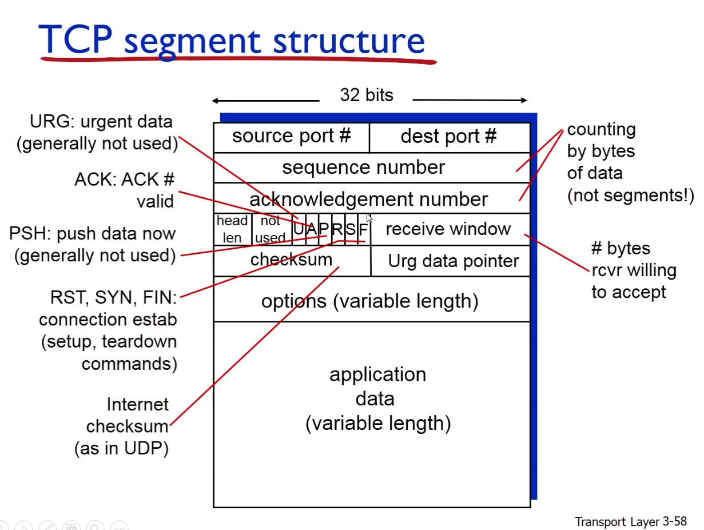

그림 8. TCP segment 구조

TCP는 UDP보다 헤더에 다양한 정보가 들어있다.

이것들을 다 외울 필요는 없고, port number와 sequence number, acknowledgement number, checksum 이 있다 정도만 기억하면 된다.

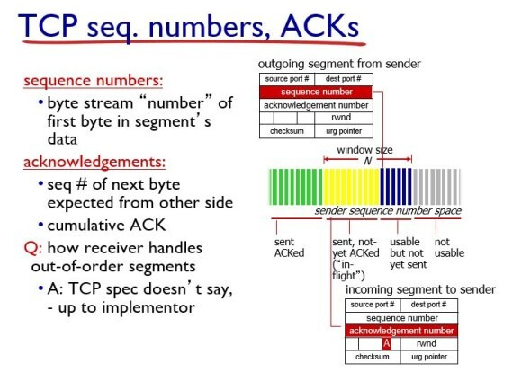

그림 9. TCP의 seq. ack number

TCP의 segment 에는 2개의 sequence number가 들어간다.

여기서 sequence number란 각 segment의 순서를 나타내는 번호이다. TCP는 데이터를 전송하기 전에 세그먼트로 나누는데, 이 시퀀스 넘버는 해당 세그먼트가 전체 데이터 스트림에서 몇 번째 바이트인지를 나타낸다.

시퀀스 번호를 통해 데이터를 순서대로 전송하고, 네트워크 문제로 인해 세그먼트가 순서 없이 도착하더라도 수신 측에서 올바른 순서로 재조립할 수 있다.

또한 수신 측은 예상되는 시퀀스 넘버와 실제 수신된 시퀀스 넘버를 비교해서 손실된 세그먼트를 감지하거나, 중복된 세그먼트를 식별할 수 있다.

ACK는 내가 보낸 패킷이 제대로 보냈졌을 때 받을 거라 예상되는 번호이다.

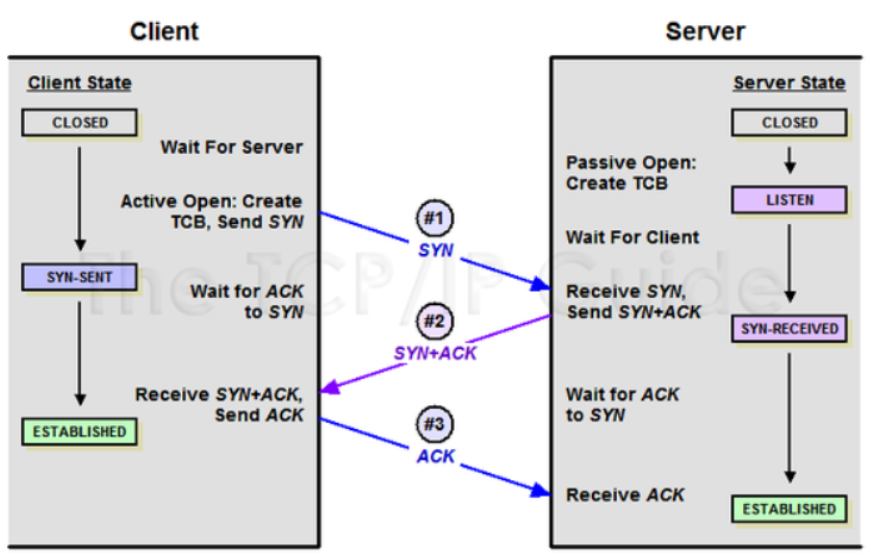

그림 10. TCP connect : 3-way handshaking

Sender와 Receiver 간의 TCP 연결을 시작하려면 TCP 3-way handshaking 과정을 거쳐야 된다.

3-handshaking이 필요한 이유 : TCP는 신뢰성 있는 연결 기반 프로토콜이다. 데이터를 보내기 전에 먼저 연결을 설정해서 서로에게 접속 가능한지 확인하는 거싱다.

3-handshaking 과정

1. SYN(Synchronize) 요청 : 클라이언트가 서버에 접속을 요청하는 패킷을 보낸다. 이 패킷에는 클라이언트가 선택한 임의의 초기 시퀀스 넘버(Initial Sequence Number)가 포함된다. 즉, 클라이언트가 서버에게 “나 접속해도 됨?” 하는 거라고 생각하면 된다.
2. SYN-ACK (Synchronize-Acknowledgement) 응답 : 서버가 클라이언트의 요청을 수락하고 클라이언트에게 응답하는 패킷을 보내는 것이다. 이 패킷에는 서버가 선택한 임의의 초기 시퀀스 넘버(ISN-Server)와 클라이언트의 시퀀스 넘버에 1을 더한 값(ISN-Client + 1)을 ACK 번호로 표시한다. 즉, 서버가 클라이언트에게 “알았어. 나도 접속해도 됨?”이라고 하는 거다.
3. ACK 응답 : 클라이언트가 서버의 응답을 확인하고 서버에게 확인 메시지를 보내는 것이다. 이 패킷에는 서버의 시퀀스 넘버에 +1 을 한 값(ISN-Server + 1)을 ACK 넘버로 표함한다. 즉, “연결 완료” 라고 말하는 것과 같다.

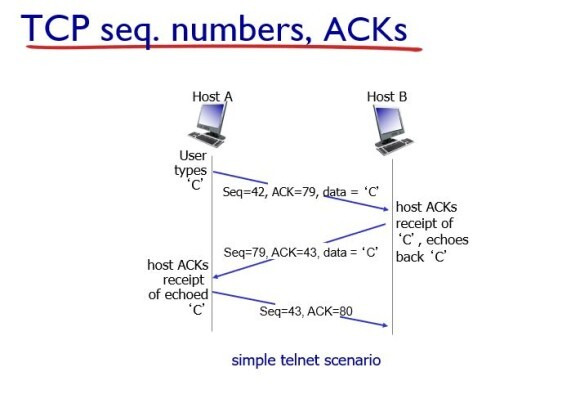

그림 11. TCP 데이터 전송

TCP 연결이 완료된 후, 클라이언트와 서버는 데이터를 자유롭게 주고받을 수 있게 된다.

Host A가 Host B에게 데이터 “C”를 전송하고, B가 다시 A에게 데이터를 돌려주는 echo telnet 시나리오를 예시로 봐보자.

1. Host A가 seq # 42, ACK # 79, data = “C”를 보낸다.
2. Host B는 그에 따라 ACK 신호로 받은 79를 seq # 로 보내고, 그 다음에 받을거라 예상되는 번호인 43을 보낸다.
3. Host A는 다시 seq 43, ACK 80 신호를 보낸다.

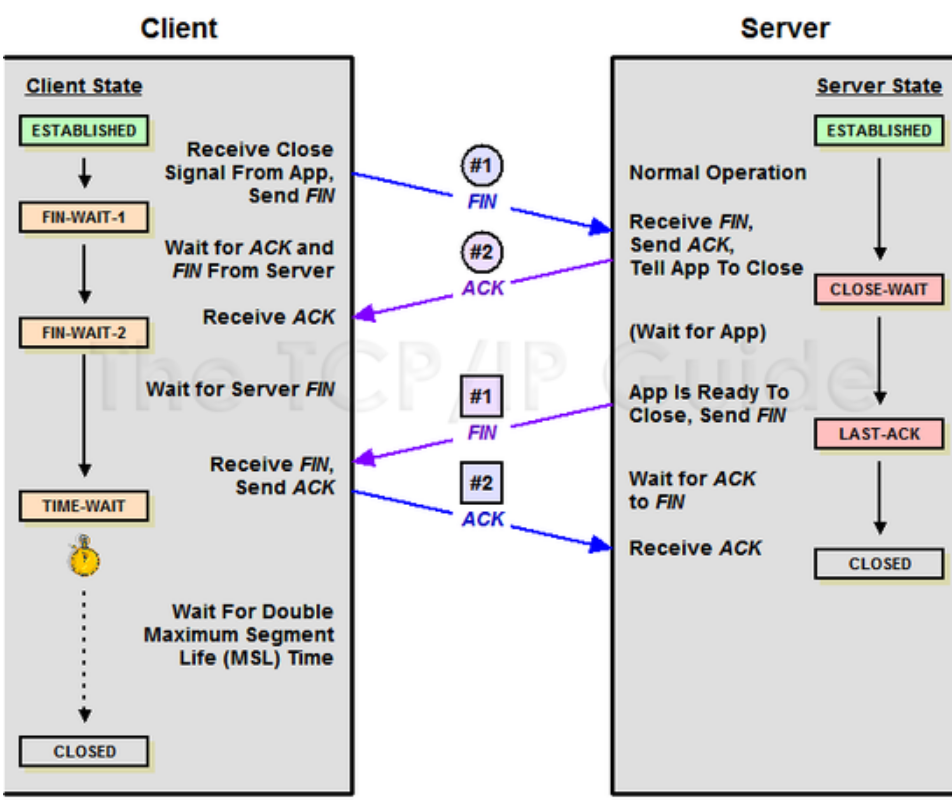

그림 12. TCP disconnect : 4-way handshaking

TCP 연결을 종료할 때에는 4-way handshaking 과정을 거친다.

종료할 때에는 4-way handshaking을 하는 이유 : TCP는 양방향 통신을 지원한다. 즉, 한쪽 방향의 연결만 끊는 것이 가능하다. 한쪽에서 연결 종료를 요청하더라도 다른 쪽에서는 아직 데이터를 전송해야 할 수도 있다. 그래서 4번의 과정을 거쳐 양쪽 모두 연결을 종료할 준비가 되었는지 확인하는 것이다.

4-way handshaking 과정

1. FIN(FINish) 요청 : 클라이언트 (또는 서버)가 연결을 종료하고 싶을 때, 서버(또는 클라이언트)에게 FIN 세그먼트를 보낸다. “나 이제 데이터 안 보낼 거임~”하는 거다.
2. ACK 응답 : 서버는 FIN 세그먼트를 받으면 클라이언트에게 ACK 세그먼트를 보낸다. 이 ACK은 “ㅇㅋ 알았음~” 이라는 의미다. 이제 서버는 클라이언트로부터 데이터를 받지는 않지만, 아직 클라이언트에게 데이터를 보낼 수 있다.
3. FIN 요청 : 서버가 클라이언트에게 보낼 데이터가 없으면, FIN 세그먼트를 클라이언트에게 보낸다. 이 FIN은 “나도 이제 데이터 안 보낼거임~” 이라는 의미다.
4. ACK 응답 : 클라이언트는 서버의 FIN 세그먼트를 받으면 ACK 세그먼트를 서버에게 보낸다. 이 ACK은 “ㅇㅋ 알았음” 이라는 의미다. 이제 클라이언트와 서버 모두 연결을 종료하게 된다.

## 퀴즈

1. TCP와 UDP의 차이점은 무엇인가요?
2. 왜 TCP 연결을 종료할 때에는 4-way shaking을 사용하는 건가요?

## 출처

내 블로그 : https://zangwoo.tistory.com/6

참고 깃허브 : https://github.com/devSquad-study/2023-CS-Study/blob/main/Network/network_tcp_and_udp.md
