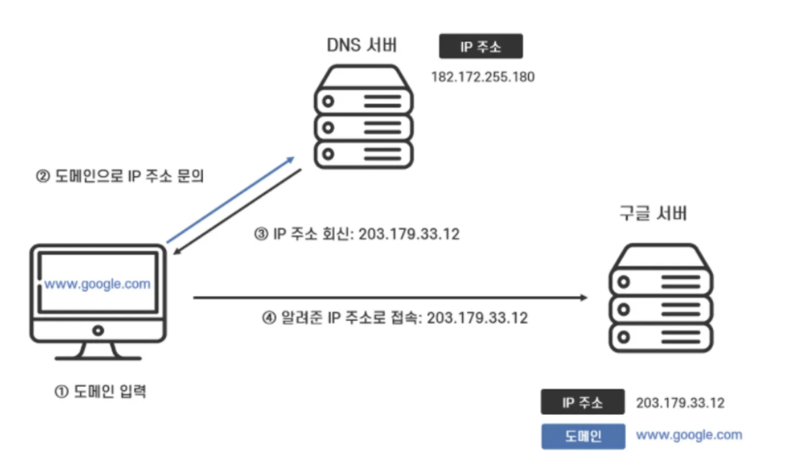
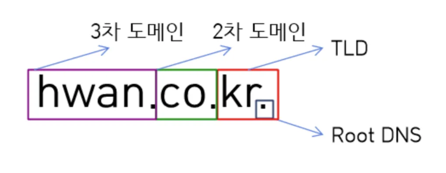
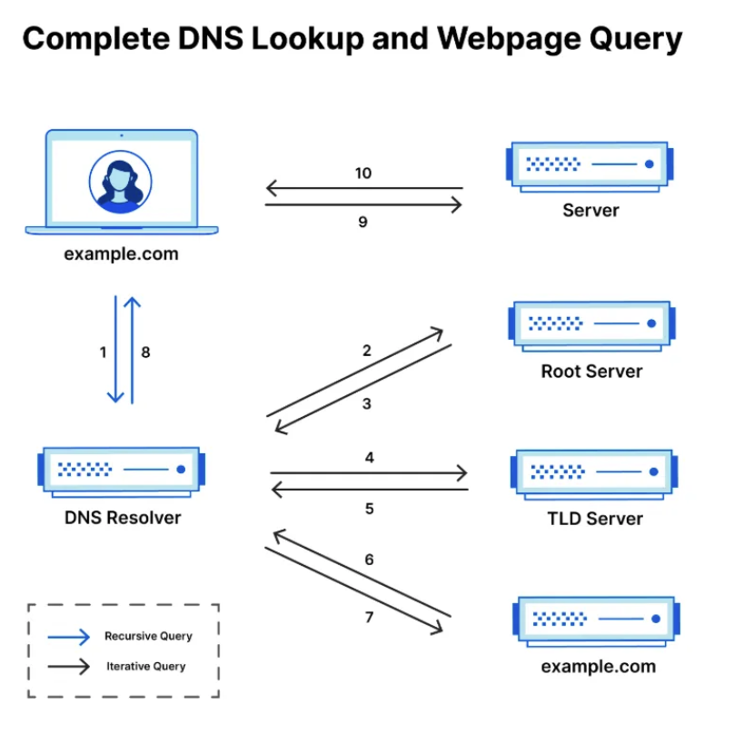

### DNS란?

- 도메인 네임을 IP 주소로 변환해주는 시스템
- 사람이 이해하기 쉬운 도메인([www.example.com](http://www.example.com/))을 컴퓨터가 이해할 수 있는 IP 주소(192.168.0.1)로 변환
- 전 세계적으로 분산된 계층적 네트워크 구조를 가짐

  

### DNS의 주요 개념

- **도메인(Domain)**: 사람이 읽을 수 있는 웹사이트 주소 (예: [www.google.com](http://www.google.com/))
- **IP 주소(Internet Protocol Address)**: 네트워크 상에서 장치를 식별하는 숫자 주소
- **DNS 서버**: 도메인과 IP 주소를 매핑하는 서버
- **DNS 레코드**: 도메인과 관련된 다양한 정보를 저장 (A, CNAME, MX, TXT 등)

### DNS 서버의 계층 구조

1. **루트 네임 서버(Root Name Server)**: 최상위 DNS 서버, TLD 네임 서버 정보를 제공
2. **TLD(Top-Level Domain) 네임 서버**: .com, .org, .net 등의 도메인을 관리
3. **SLD(Second-Level Domain) 네임 서버** : 실제 개인 도메인과 IP 주소의 관계가 기록(저장, 변경)되는 서버다.
4. **리졸버(Resolver) Or Local DNS 서버**: 사용자의 DNS 요청을 처리하고 응답을 반환하는 캐싱 DNS 서버

### **DNS Query**

- DNS Query(쿼리)는 사용자가 도메인 이름을 입력하고 IP 주소를 얻기 위해 DNS 서버에 보내는 요청
- 요청은 DNS Resolver가 사용자 컴퓨터에서 생성하고 DNS 서버에 전송한다.

### Resolver Vs Local

| 항목 | Local DNS | Resolver |
| --- | --- | --- |
| 역할 | DNS 요청을 받아 IP 주소를 반환하는 서버 | 사용자의 기기에서 DNS 요청을 생성하는 클라이언트 |
| 위치 | ISP, 기업, 네트워크 내부에 존재 | 사용자의 운영체제(OS)에 내장됨 |
| 기능 | 캐시 유지, 상위 DNS 서버에 질의 수행 | 캐시 유지, 상위 DNS 서버에 질의 수행 |

---

## 웹 통신 흐름

### 웹페이지 요청 과정

1. **DNS 조회 (Domain Name Resolution)**
    - 브라우저는 먼저 로컬 DNS 캐시에서 해당 도메인의 IP 주소를 확인
    - 캐시에 없으면 리졸버(Resolver) DNS 서버에 요청
    - 리졸버는 루트 네임 서버 → TLD 네임 서버 → 권한 네임 서버를 거쳐 최종 IP 주소를 획득
    - 브라우저는 해당 IP 주소를 사용해 웹 서버에 요청을 보냄
2. **TCP 3-way Handshake (연결 설정)**
    - 클라이언트(웹 브라우저)가 서버와 TCP 연결을 설정
3. **HTTP/HTTPS 요청 및 응답**
    - 클라이언트가 웹 서버에 HTTP(S) 요청을 전송 (예: GET /index.html)
    - 서버는 요청을 처리한 후 데이터를 응답
    - HTTPS의 경우 TLS Handshake 과정이 추가
4. **데이터 렌더링 및 웹페이지 표시**
    - 브라우저가 받은 HTML을 파싱하고 CSS, JavaScript 파일을 다운로드 및 실행
    - 웹페이지를 화면에 렌더링하여 최종적으로 사용자에게 표시

---

## 퀴즈

[**www.example.com](http://www.example.com) url을 입력했을때 동작과정을 설명해주세요.**

---

## 출처

https://velog.io/@eunnbi/DNS%EC%99%80-%EC%9E%91%EB%8F%99-%EC%9B%90%EB%A6%AC

https://velog.io/@zinukk/9kpyzbdt