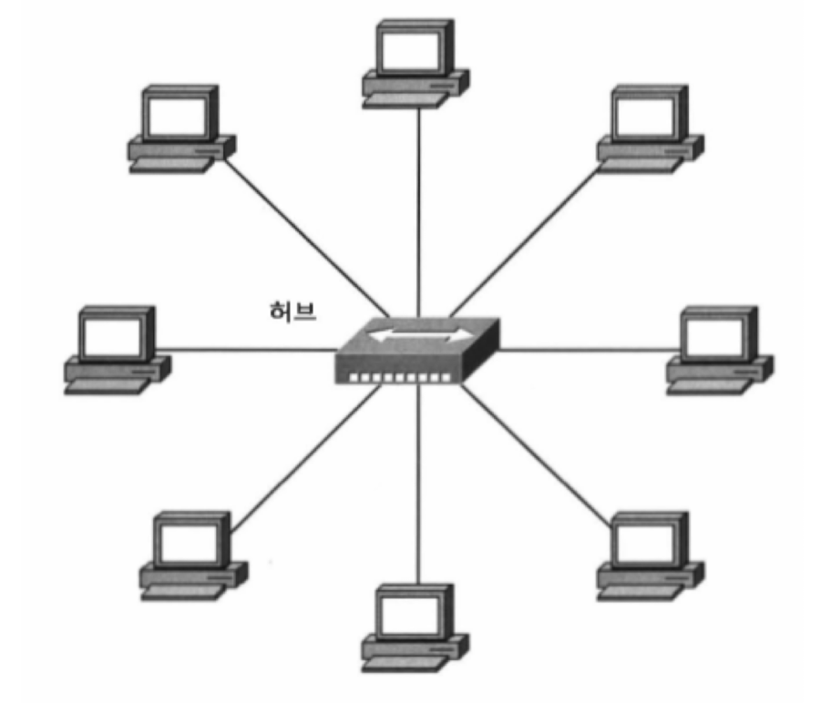
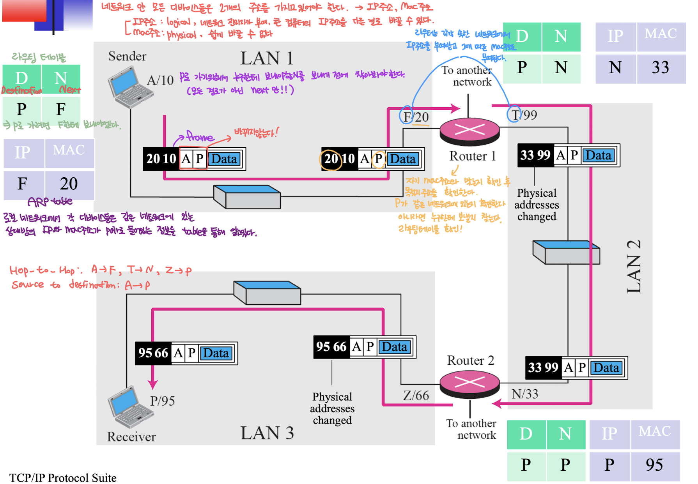
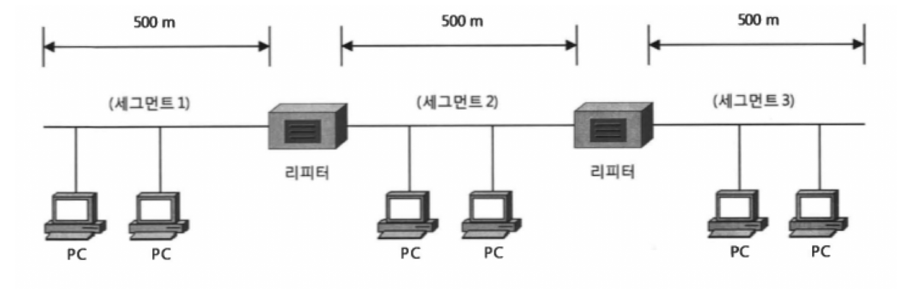

# 네트워크 기기(Network Devices)

---

## 1. 네트워크 기기란?

네트워크 기기(Network Device)란 컴퓨터, 서버, 프린터 등 다양한 장치들이 서로 통신할 수 있도록 도와주는 하드웨어 장비를 말한다. 네트워크 통신의 핵심적인 역할을 하며, 데이터의 전송과 수신을 관리하고 최적화한다.

---

## 2. 주요 네트워크 기기의 종류

### 2-1. 허브 (Hub)

- **역할**: 하나의 장치를 통해 모든 네트워크 장치와 데이터를 공유
- **동작 방식**: 수신된 데이터를 연결된 모든 포트로 전송 (브로드캐스트 방식)
- **단점**: 네트워크 효율이 낮고 충돌 발생 가능

### 2-2. 스위치 (Switch)

- **역할**: 각 장치 간 데이터를 효율적으로 전달
- **동작 방식**: 목적지 MAC 주소를 기반으로 해당 포트로만 데이터 전송
- **장점**: 네트워크 충돌 감소, 성능 향상

### 스위치 계층별 비교표

| 스위치 종류    | 계층 (OSI Layer)      | 기준 주소       | 주요 기능                                  | 사용 예시                         |
| -------------- | --------------------- | --------------- | ------------------------------------------ | --------------------------------- |
| Layer 2 스위치 | 데이터 링크 계층 (L2) | MAC 주소        | 프레임 전송, MAC 학습, VLAN 구성           | 일반 사무실, 가정용 네트워크      |
| Layer 3 스위치 | 네트워크 계층 (L3)    | IP 주소         | 라우팅 기능, VLAN 간 통신                  | 대기업, 캠퍼스 네트워크           |
| Layer 4 스위치 | 전송 계층 (L4)        | 포트 번호, 세션 | 로드 밸런싱, QoS, 보안 필터링 등 고급 제어 | 데이터 센터, 대규모 서비스 인프라 |

### 2-3. 라우터 (Router)

- **역할**: 서로 다른 네트워크를 연결
- **동작 방식**: IP 주소를 기반으로 최적 경로로 데이터 전송

### 2-4. 리피터 (Repeater)

- **역할**: 전송 거리를 늘리기 위해 약해진 신호를 재생성 및 증폭
- **동작 방식**: 수신한 신호를 동일하게 재생하여 다음 구간으로 전송
- **사용 예**: 장거리 유선 LAN, 무선 신호 증폭기(Extender) 등

### 2-5. 브리지 (Bridge)

- **역할**: 네트워크를 구간별로 나누어 트래픽을 분산하고 충돌 도메인을 줄임
- **동작 방식**: 수신된 프레임의 MAC 주소를 기반으로 전달 여부 결정
- **사용 예**: 두 개의 LAN을 연결하거나, 네트워크 구간 분리

### 네트워크 기기 간의 차이점

| 기기   | 주요 기능                    | 전송 방식    | 계층(Layer)                |
| ------ | ---------------------------- | ------------ | -------------------------- |
| 허브   | 단순 데이터 중계             | 브로드캐스트 | 물리 계층 (Layer 1)        |
| 리피터 | 신호 증폭 및 재생성          | 신호 재생    | 물리 계층 (Layer 1)        |
| 브리지 | 네트워크 분할 및 트래픽 제어 | 유니캐스트   | 데이터 링크 계층 (Layer 2) |
| 스위치 | MAC 기반 전송 제어           | 유니캐스트   | 데이터 링크 계층 (Layer 2) |
| 라우터 | 네트워크 간 연결             | 라우팅       | 네트워크 계층 (Layer 3)    |

---

## 질문

### 라우팅 테이블이 없으면 어떤 문제가 발생하나요?

### 허브를 사용한 네트워크와 스위치를 사용한 네트워크의 트래픽 차이는 무엇인가요?

---

## 출처

도서 TCP/IP Protocol Suite - Behrouz A. Forouzan
