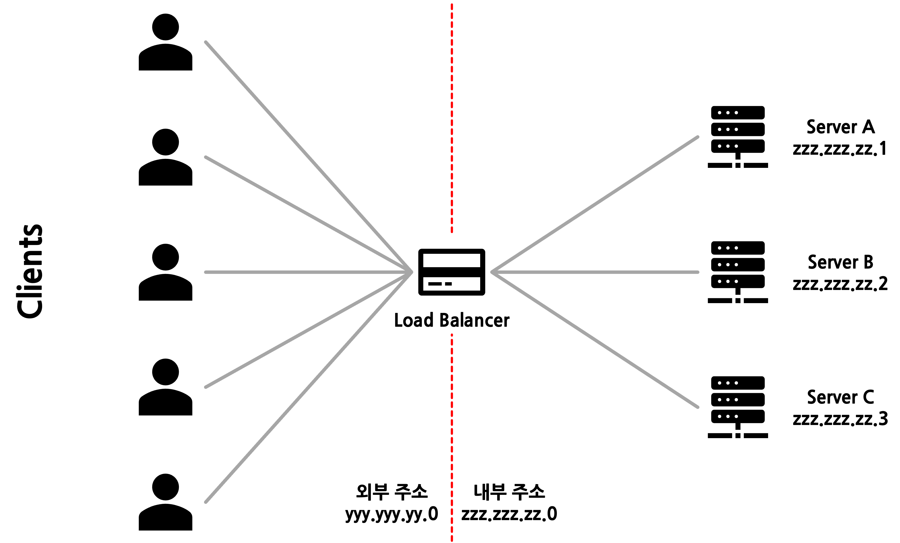
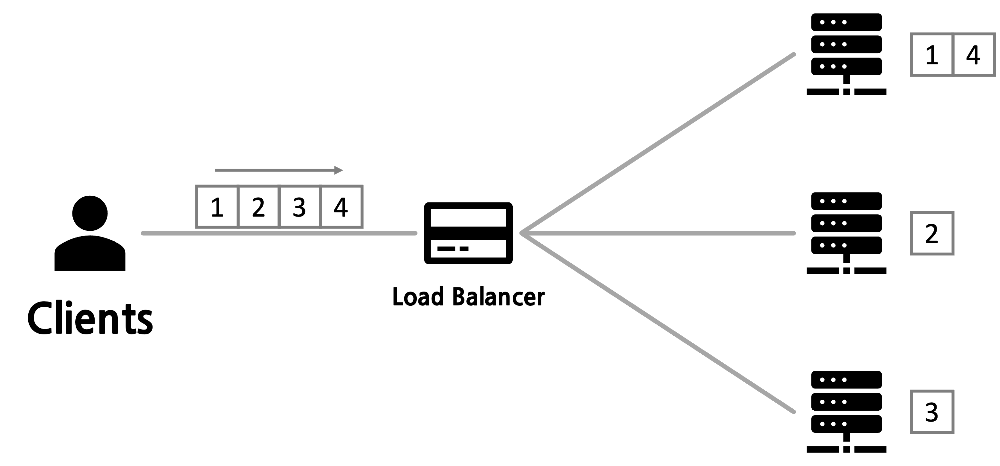
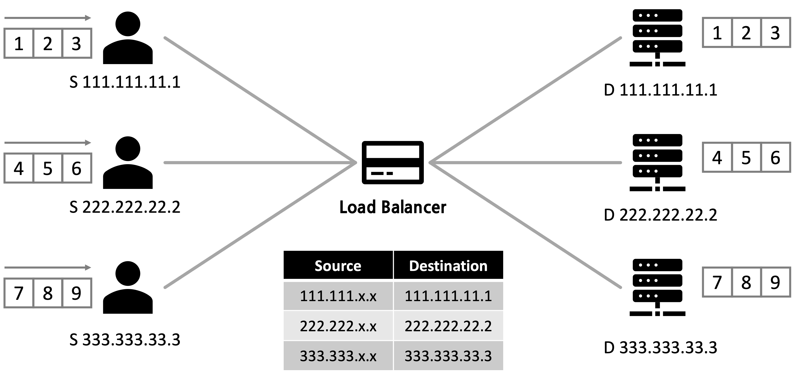
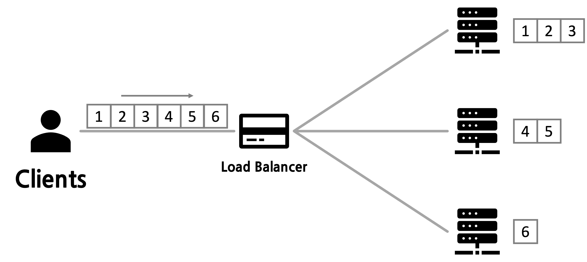

# L7/L4 스위치, 로드밸런싱

## 📍 L7/L4 스위치

### L4 스위치

- 전송 계층(Transport Layer)에서 작동하는 로드밸런서
- TCP/UDP 포트 정보를 기반으로 트래픽을 분산
- IP 주소와 포트 번호를 통해 서버의 부하를 분산
- 단순하고 빠른 처리가 가능하지만, 패킷의 내용을 이해하지 못함

> 클라이언트가 웹서버(80포트)에 접속 시도하면, L4 스위치는 단순히 "이건 80포트 요청이니까 웹서버들 중 하나로 보내자"라는 식으로 동작

### L7 스위치

- 응용 계층(Application Layer)에서 작동하는 로드밸런서
- HTTP, HTTPS, FTP 등 애플리케이션 프로토콜을 이해하고 분석
- URL, 쿠키, 헤더 등의 정보를 기반으로 트래픽을 분산
- 콘텐츠 기반 라우팅이 가능하며 보안 기능 제공
- L4보다 더 정교한 분산이 가능하지만 처리 속도가 상대적으로 느림

> /images/\* 요청 → 이미지 전용 서버로
>
> /api/\* 요청 → API 서버로
>
> 특정 국가에서 오는 트래픽 → 해당 지역 서버로

 

## 📍 로드밸런싱

### 개념

- 서버에 가해지는 부하를 분산시켜주는 기술
- 여러 대의 서버를 두고 트래픽을 균등하게 분배하여 서비스의 가용성을 높임

### 주요 로드밸런싱 알고리즘

> 개발자 김말랑은 자신의 웹 서버를 구축해 서비스를 제공했다. 얼마 뒤 서비스 사용자가 많아지고 접속량과 트래픽이 증가해 기존에 운용하던 서버 A(xxx.xxx.xx.1)만으로는 안정적인 서비스를 제공할 수 없게 됐다.
>
> 서버 자체의 성능개선(Scale-Up) 후에도 트래픽을 감당할 수 없게되자 추가로 서버 2대B(xxx.xxx.xx.2), C(xxx.xxx.xx.3)를 증설(Scale-Out)했다.
>
> 이 때 각각의 서버 url을 바꿔가며 클라이언트가 직접 서버 상태를 보고 요청하는것이 아닌 로드밸런서에 클라이언트 요청을 전달하게되고 로드밸런서는 하위 네트워크에 서버로 요청을 전달한다.

   

      <h3>로드밸런싱 전</h3>
      
   

   

      <h3>로드밸런싱 후</h3>
      
   

 

### 1. 라운드 로빈(Round Robin)

- 요청을 순차적으로 각 서버에 분배
- 가장 단순하고 널리 사용되는 방식
- 각 서버의 처리량이 비슷한 경우 사용

 

### 2. 최소 연결(Least Connection)

- 현재 연결이 가장 적은 서버에 새로운 요청을 분배
- 서버별 처리 능력이 다를 때 효과적

 

### 3. IP 해시(IP Hash)

- 클라이언트 IP를 해싱하여 특정 서버에 매핑
- 같은 사용자는 항상 같은 서버로 연결됨
- 캐시 효율 높임

 

### 4. 가중치 기반 라운드 로빈(Weighted Round Robin)

- 서버의 처리 능력에 따라 가중치를 부여
- 고성능 서버에 더 많은 요청을 분배
- 서버 간 성능 차이가 큰 경우 사용

 

### 로드밸런싱의 이점

- 고가용성 확보
- 서버 부하 분산
- 확장성(Scalability) 향상
- 장애 대응 가능

 

## 🔗 퀴즈

- 로드밸런싱 알고리즘 중 라운드 로빈(Round Robin)의 단점
- L4 로드밸런싱과 L7 로드밸런싱의 장단점?

## ✈️ 출처

- [출처1](https://github.com/devSquad-study/2023-CS-Study/blob/main/Network/network_l4_l7_switch_and_load_balancing.md)
