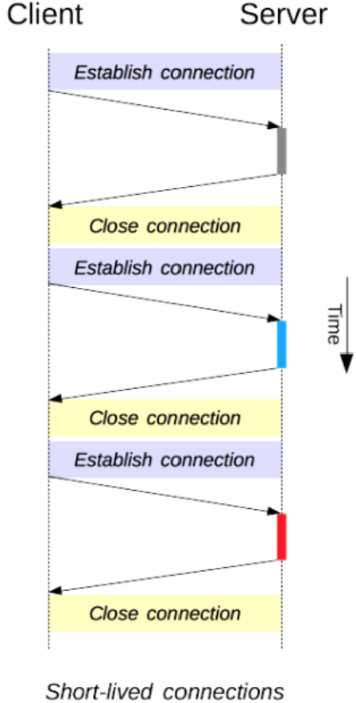
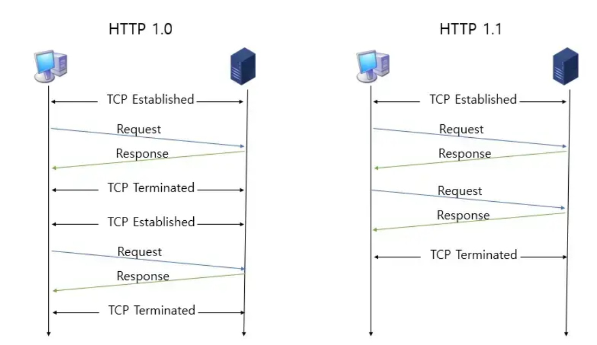
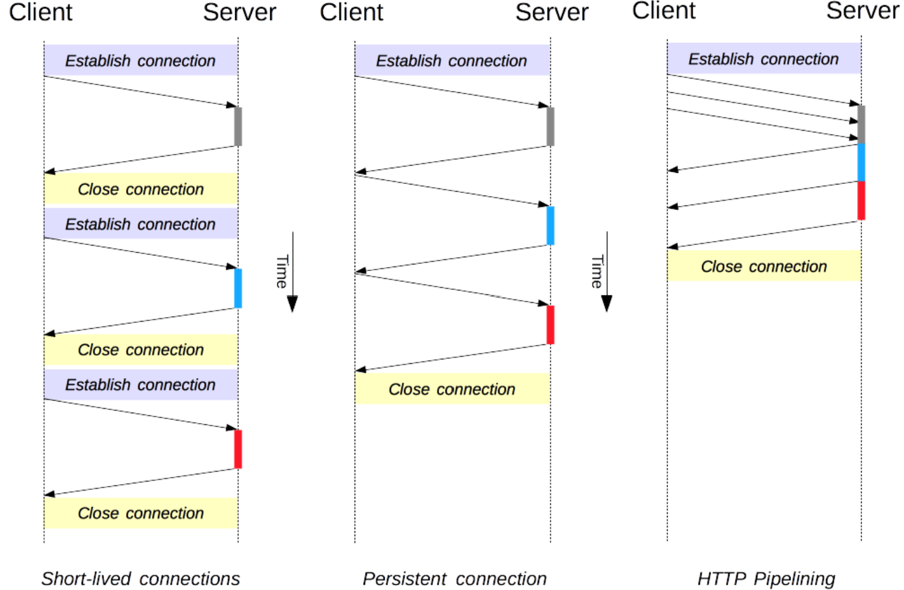
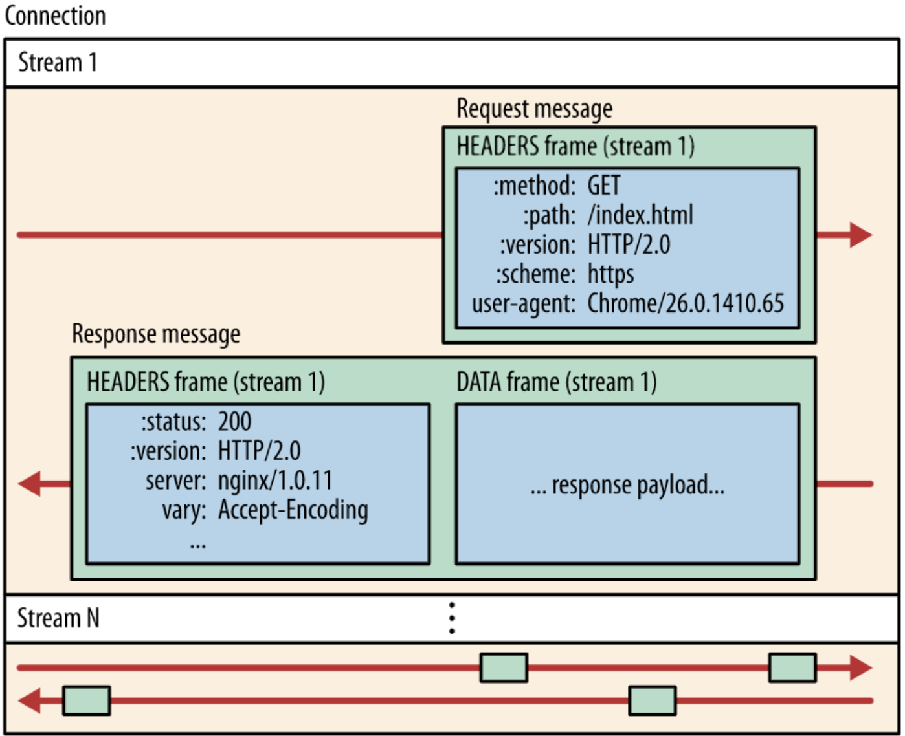
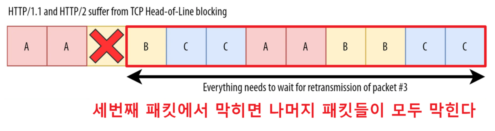
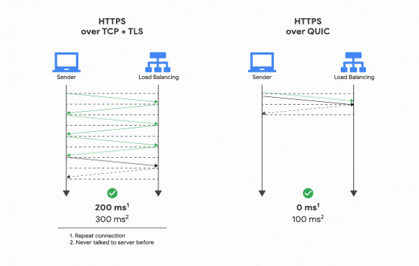

# HTTP 진화 과정

## HTTP(Hyper Text Transfer Protocol)

HTTP는 애플리케이션 계층으로서 웹 서비스 통신에 사용됨

- World Wide Web에 내재된 프로토콜로 클라이언트와
  서버의 요청(Request)과 응답(Response)의 형태로 이루어짐
- 미디어 독립적이며 이는 미디어 타입에 제한을 두지 않고 자원을 주고 받는 수단(인터페이스) 역할만 수행함
- 상태를 유지하지 않은 무상태(stateless)로 서버는 이전 요청과의 연결이나 상태를 기억하지 않음

 

Q. 무상태로 유지하는 이유는? 
클라이언트와 동시에 상호작용하는 과정에서 상태 정보를 공유해야하므로 매우 번거로워짐  
HTTP 서버가 지켜야 할 설계 목표인 확장성과 견고성을 지키기 위해 무상태를 유지함으로써 언제든 쉽게 서버를 추가(확장성)할 수 있고 문제가 생길 시 다른 서버(견고성)로 대체할 수 있게됨

## 🥚HTTP/0.9

GET이라는 단일 메서드만 가지고 있는 단순한 형태 

**특징**

- TCP/IP 링크 위에서 동작하는 프로토콜
- HTTP 바디만 존재, 상태 코드도 존재하지 않음
- 응답은 HTML 파일 자체로 고정
- 서버와 클라이언트 간의 연결은 모든 요청, 응답 후에 닫힘

 

> GET /mypage.html

> &lt;html&gt;  
> A very simple HTML page   > &lt;/html&gt;  

 

## 🥚HTTP/1.0

HTTP 헤더가 등장함 

**특징** 

- 요청 메서드가 GET,HEAD, POST로 메타데이터 전송이 가능해져 확장성이 높아짐 
- 상태 코드가 응답에 추가되어 브라우저가 요청에 대한 성공과 실패를 알 수 있음 
- Content-Type을 통해 HTML파일뿐만 아니라 다양한 문서들을 전송할 수 있음
- 단기커넥션(Short-lived Connections):Connections 하나당 1 Request & 1 Response 처리 가능  

 

> GET/mypage.html  
> User-Agent: NSCA_Mosaic/2.0 (Windows 3.1) 
>
> 200 OK  
> DATE: Tue, 15 Nov 1994 08:12:31 GMT
> Server: CERN/3.0 libwww/2.17 
> Content-Type:text/html  > &lt;HTML&gt;  
> A page with an image
>   > &lt;/HTML&gt;

 

> GET/ Myimage.gif HTTP/1.0
> User-Agent: NSCA_Mosaic/2.0 (Windows 3.1) 
>
> 200 OK
> Date: Tue,15 Nov 1994 08:12:32 GMT 
> Server: CERN/3.0 libwww/2.17  
> Content-Type:text/gif
> (image content)

### HTTP/1.0의 단점  

단일 커넥션으로 인해서 하나의 연결당 하나의 요청만 가질 수 있어 클라이언트가 서버에 필요한 자원이 있을때마다 매번 새로운 TCP 연결을 열고 닫기를 반복해야 함
 

ex. 5개의 이미지, 5개의 css 파일, 5개의 자바스크립트 파일이 필요한 페이지에 방문한다면,
총 15번의 개별 연결이 필요함(성능 저하로 이어짐)

 

## 🐣 HTTP / 1.1  

오늘날 많이 사용되는 표준화된 HTTP 

**특징**

- HOST 헤더가 추가됨

  - 동일한 IP에 여러 개의 도메인을 호스팅 하는 기능

- **지속 연결(persistent connection)** 
  HTTP/1.0에서는 쓰리 웨이 핸드셰이크를 통해 TCP 연결을 수립한 후 요청에 대한 응답을 받으면 바로 종료했음 

  - TCP 가상 회선 방식은 신뢰성을 보장하지만 속도가 느리라는 단점이 존재함
     

  그래서 기본적으로 하나의 연결 상에서 여러 개의 요청-응답을 주고받을 수 있게 함  
   **킵 얼라이브(Keep-alive)** 라고도 불림  
  **[keep-Alive Header]** 
  이때 연결을 유지하는 시간이 길어지면 서버에 부하가 생기기 때문에 연결을 유지하는 시간을 제한함 
  (HTTP/1.0에서도 있었지만 표준화된 시점은 HTTP/1.1부터 기본 옵션으로 설정됨)
  

 

- **파이프라이닝(Pipelining)** 
  여러 개의 요청을 보낼 때 이전 요청의 응답을 기다리지 않고
  요청을 한꺼번에 보내는 것  
  여러 요청을 한꺼번에 보내 응답을 받음으로써 서버 간 요청의 응답 속도를 개선시키고자 적용됨 
  단점은 **HOL Blocking** 문제가 발생함  
  **HOL(Head-of-Line) Blocking** : 컴퓨터 네트워킹에서 패킷 대기열이 존재할 때, 앞선 패킷이 지연될 때 발생하는 성능 저하 현상  
  서버는 요청 순서대로 응답을 처리하는 FIFO 방식을 활용해 처리하는데 요청 1의 응답이 지연되면 요청 2,요청3의 응답도 대기해야함 이로 인해 뒤에 있는 요청들이 불필요하게 지연됨

 

       ex. 이미지 파일을 여러 개 요청
       -  요청1 : 큰 이미지(5초 처리)
       -  요청2 : 작은 아이콘(0.1초 처리)
       -  요청3 : js 파일 (0.5초 처리)

       파이프라이닝에서는 요청1이 끝나야 요청2,3도 응답됨

 

 

## 🐣 HTTP / 2.0  

기존 HTTP/1.1의 성능 향상에 초첨을 맞춘 프로토콜 
구글에서 2009년에 발표한 SPDY 프로토콜 기반으로 탄생함

 

**특징**

- 바이너리 데이터 기반 송수신
- 여러 파일들을 병렬적으로 전송(멀티플렉싱 기법) 
  - 멀티플렉싱: 하나의 연결에서 stream을 통해 여러 요청/응답을 동시에 처리하는 기술
- 헤더를 압축하여 송수신하여 네트워크 이용 효율을 높임 
- 클라이언트가 요청하지 않았더라도 미래에 필요할 것으로 예상되는 자원을 미리 전송하는 기능인 서버 푸시(server push) 기능 

 

frame : HTTP/2에서 데이터를 나누는 가장 작은 단위  
stream : 연결된 connection 내에서 양방향으로 메세지를 주고받은 하나의 흐름 
message : 여러 개의 프레임이 모여 구성된 전체 http 요청 또는 응답 하나  

  
 
HTTP/2.0에는 메세지(Message),프레임(Frame), 스트림(Stream) 단위가 존재함 
최소 단위인 프레임이 모여 메세지가 되고 메세지는 특정 스트림에 속하며 여러 개의 스트림은 하나의 Connection 내에서 병렬적으로 처리되는 구조임 

 

### HTTP/2.0의 단점  

- TCP의 HOLB 문제  
  HTTP/1.0의 HOLB는 멀티플렉싱을 사용해 해소되었지만, TCP에서의 HOLB는 해소하지 못함
  

   

- RTT로 인한 지연 시간 발생 
  3 way handshake 및 tls handshake 과정이 있으므로 RTT로 인한 지연 시간이 발생함  

 

## 🐣 HTTP / 3.0  

UDP 기반으로 동작하는 프로토콜 

 

**특징** 

- QUIC(Quick UDP Internet)이라는 프로토콜을 기반으로 동작  
- 패킷 손실에 대한 빠른 대응과 사용자 IP가 변경되어도 연결이 유지됨  

 

UDP는 TCP에 비해 상대적으로 송수신 속도가 빠르기 때문에 속도 측면에서 큰 개선을 이룸

- QUIC  
  스트림별 독립 전송 여러 스트림을 하나의 연결로 묶되,
  패킷 손실이 발생한 스트림만 재전송하고 나머지 스트림은 계속 진행되도록 함 -> 다름 스트림들의 성능에 미치는 영향을 최소화할 수 있음  

## 🔗 퀴즈

- HTTP의 킵 얼라이브란 무엇인가요?
- HTTP/1.1과 HTTP/2.0의 차이점을 설명해보세요.

## ✈️ 출처

- [출처1][(https://github.com/devSquad-study/2023-CS-Study/blob/main/Network/network_l4_l7_switch_and_load_balancing.md)](https://chazae.tistory.com/36)
- [출처2][(https://devnk.tistory.com/21)]
- [출처3][도서] [이것이 취업을 위한 컴퓨터 과학이다]
