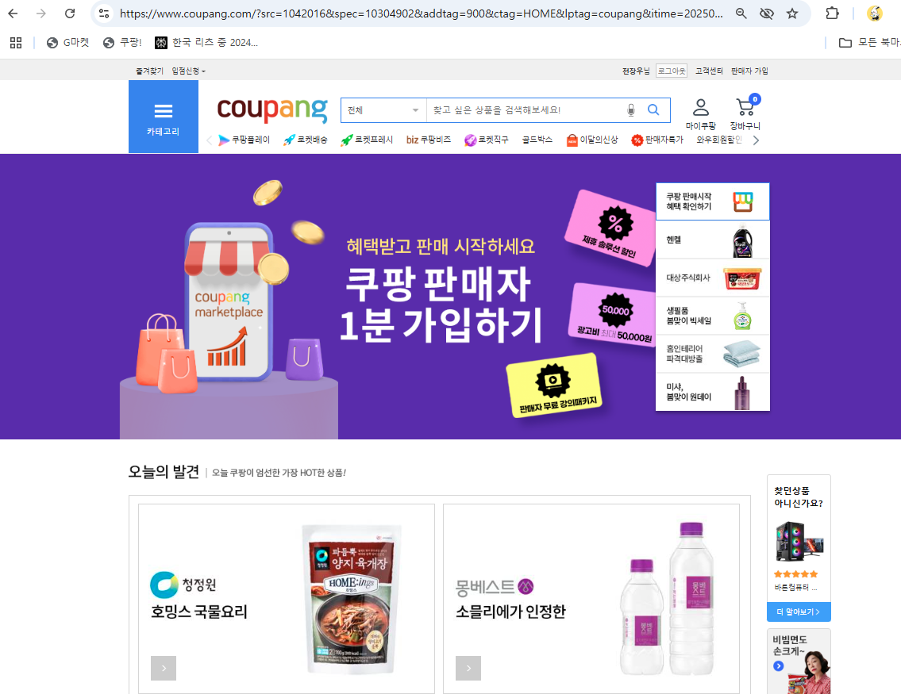

그림 1. 현대의 웹 사이트들

최근 우리는 웹으로 물건을 소비하거나, 돈을 벌거나, 투자를 하는 등 많은 일을 한다.

이때, 대부분에 사이트를 접속하면 http가 아닌 https 로 시작하는 것을 확인할 수 있다.

https 프로토콜은 무엇인지 알아보자.

## HTTPS(HyperText Transfer Protocol Secure) 등장

그림 2. HTTP와 HTTPS

https와 http는 작동 원리는 동일하다. 단지 전송하는 메시지를 SSL/TLS 프로토콜을 사용해서 암호화해서 보안성을 강화했을 뿐이다.

http 프로토콜은 application layer에서 동작하는 프로토콜이다. 즉, 메시지를 주고받는다.

http 의 메시지 구조는 크게 header와 body로 나뉜다.

- header : 요청/응답에 대한 부가 정보(메서드, 상태 코드, 컨텐츠 타입)
- body : 실제 전송하려는 데이터 (HTML 문서, 이미지 파일, JSON 데이터, XML 데이터)

http는 평문(Plain Text)로 메시지를 주고 받는데, 이는 전송되는 데이터 자체가 암호화되어있지 않다는 것을 의미한다.

그래서 http는 보안 측면에서 3가지 문제점을 가지고 있다.

1. 도청 위험 : 같은 네트워크(공용 와이파이)를 사용하는 다른 사람이 통신 내용을 쉽게 엿볼 수 있다. 로그인 정보, 신용카드 정보 등 민감한 데이터가 그대로 노출될 수 있다.
2. 데이터 변조 위험 : 중간에서 누군가 데이터를 가로채 내용을 바꾸거나 악성 코드를 삽입할 수 있다.
3. 위장 사이트 위험 : 접속하려는 웹사이트가 진짜인지, 아니면 해커가 만든 가짜 사이트인지 확인하기 어렵다.

이런 문제점들을 보완하기 위해서 SSL(Secure Socket Layer)/TLS(Transport Layer Secure) 프로토콜을 사용한 https 가 등장하게 되었다.

## HTTPS의 보안 목표

HTTPS를 사용했을 때의 장점. 즉, HTTPS의 보안 목표는 크게 3가지가 있다.

1. 암호화 : 내가 사이트에 보내는 정보들을 제 3자가 보지 못하게 한다.
2. 인증 : 접속한 사이트가 신뢰할 수 있는 사이트(내가 진짜로 접속하려고 하는 사이트)인지를 알려준다.
3. 데이터 무결성 : 데이터가 전송 중에 위변조되지 않았음을 보장한다.

## SSL / TLS

SSL과 TLS는 클라이언트와 서버 간에 암호화된 채널을 설정하기 위한 암호화 프로토콜이다. SSL은 넷스케이프에서 처음 개발한 프로토콜인데, SSL은 보안 취약점이 발견되어 현재는 사용이 권장되지 않으며 TLS가 표준으로 사용되고 있다.

즉, TLS가 SSL 3.0의 후계자인 것이라고 생각하면 된다. 근데 그냥 사람들이 기존의 SSL이란 이름이 익숙해서 그냥 SSL이라고 부르는 것이다.

## HTTPS 보안 기능 작동 원리

1. 대칭키 암호화 방식(Symmetric Key Cryptography)

그림 3. 대칭키 암호화 방식

데이터를 암호화할 때 사용하는 키와 복호화할 때 사용하는 키가 동일한 방식이다. 하나의 키를 송신자와 수신자가 비밀리에 공유해야 한다.

작동방식

1. 송신자는 공유된 대칭키를 사용해 메시지를 암호화한다.
2. 암호화된 메시지를 수신자에게 전송한다.
3. 수신자는 사전에 공유받은 동일한 대칭키를 사용하여 암호문을 복호화하여 원본 메시지를 얻는다.

장점

- 암호화 및 복호화 과정의 계산이 비교적 단순하여 속도가 매우 빠르다. 대용량 데이터를 암호화하는 데 효율적이다.

단점

- 키 배송 문제 : 결국 최초에 한 번은 한쪽에서 다른 쪽으로 대칭키를 전송해야 하는데, 이 과정에서 키를 탈취당하면 끝장이다.

1. 비대칭키 암호화 방식(Asymmetric Key Cryptography)

그림 4. 비대칭키 암호화 방식

데이터를 암호화할 때 사용하는 키와 복호화할 때 사용하는 키를 각각 다르게 만든다.

외부에 공개되어 누구나 알 수 있는 키인 공개키(Public Key)와 키 소유자만이 안전하게 보관하며 절대 외부에 노출해서는 안되는 개인키(Private Key)를 사용한다.

이 두 키는 서로 쌍을 이룬다.

1. 클라이언트가 공개키로 메시지를 암호화한다.
2. 암호화된 메시지를 서버에게 전송한다.
3. 서버는 자신만의 개인키를 사용해 암호문을 복호화하여 원본 메시지를 얻는다.

즉, 다른 누군가가 클라이언트의 공개키를 해킹해도 해당 메시지를 복호화할 수 없다.

반대로 서버가 클라이언트에게 보내는 과정도 마찬가지이다.

1. 서버가 개인키로 메시지를 암호화한다.
2. 암호화된 메시지를 클라이언트에게 전송한다.
3. 클라이언트는 자신의 공개키를 이용해 해당 메시지를 복호화한다.

이때, 클라이언트의 공개키는 자신과 서버와 쌍을 이루는 (공개키, 개인키) 쌍이기 때문에 다른 사용자의 공개키로는 복호화할 수 없다.

또한, 클라이언트의 키로 복호화할 수 있으려면 다른 서버가 보낸 메시지가 아닌 해당 서버의 키를 사용했다는 것이 되고, 메시지가 위변조 되지 않아야 하기 때문에 인증과 데이터 무결성을 보장할 수 있게 된다.

장점

- 공개키는 외부에 공개되어도 안전하므로, 키 배송 문제를 해결할 수 있다.

단점

- 암호화 및 복호화 과정에서 대칭키 방식보다 느리다. 대용량 데이터 전체를 암호화하기에는 비효율적이다.

## TLS 핸드셰이크

그림 5. TLS HandShake

클라이언트는 TLS를 사용하는 서버에 접속할 때, 실제 데이터를 주고받기 전에 핸드셰이크를 거쳐 안전한 연결을 설정한다.

왜냐하면 메시지를 전송하기 전에 클라이언트는 이 사이트가 신뢰할 수 있는 사이트인지 알 수 없기 때문이다. 그래서 handshake를 통해 탐색 과정을 거치게 된다.

1. Client Hello

- 클라이언트가 서버에 처음으로 보내는 메시지이다.
- 랜덤한 데이터와 현재 자신이 지원할 수 있는 암호화 방식 목록을 서버에게 전달한다.

1. Server Hello

- 서버가 Client Hello를 받고 똑같이 클라이언트에게 인사를 한다.
- 클라이언트가 전달한 내용과 동일한 랜덤 데이터, 사용할 TLS 버전과 암호화 방식을 선택하고 자신의 TLS 인증서를 클라이언트에게 전송한다.

1. Certificate Verification

- 클라이언트는 서버로부터 받은 인증서가 신뢰할 수 있는 CA로부터 발급되었는지, 유효 기간이 남았는지, 접속하려는 도메인과 일치하는 지 확인한다.
- 즉, 서버에게 받은 인증서를 들고 인증 기관에 가서 이거 ㅇㅇ사이트의 정품 인증서 맞아요? 하고 물어보는 것이다.
- 인증 기관이 발급한 인증서 목록에 서버가 전달한 인증서가 있으면 CA에서 공유하는 공개키를 가지고 인증서를 복호화한다.
- 만약 복호화에 성공하면 이 인증서는 서버가 자신의 비밀키로 암호화했다는 것이 되므로 이제 클라이언트는 서버를 신뢰할 수 있게 된다.

1. Key Exchange

- 클라이언트와 서버는 인증서에 포함된 공개키 등을 이용하여 대칭키 암호화에 사용할 세션 키를 안전하게 교환한다.
- 이 세션 키는 해당 통신 세션 동안 데이터를 암호화하고 복호화하는데 사용한다.
- 즉, 비대칭키 암호화 방식은 핸드셰이크 과정에서 키 교환의 목적으로 사용하고, 실제 데이터 암호화는 속도가 빠른 대칭키 암호화 방식을 사용한다.

1. Finished

- 양측은 핸드셰이크 과정이 성공적으로 완료되었음을 알리고, 이후 모든 통신은 생성된 세션 키를 사용하여 암호화된다.
- 이 뒤에는 암호화된 메시지를 사용해서 기존의 HTTP 방식과 동일한 방식으로 통신한다.

## 퀴즈

1. 대칭키와 비대칭키 암호화 방식에 대해 장단점에 대해 설명하세요.

## 출처

https://brunch.co.kr/@swimjiy/47

https://www.youtube.com/watch?v=H6lpFRpyl14&t=397s
