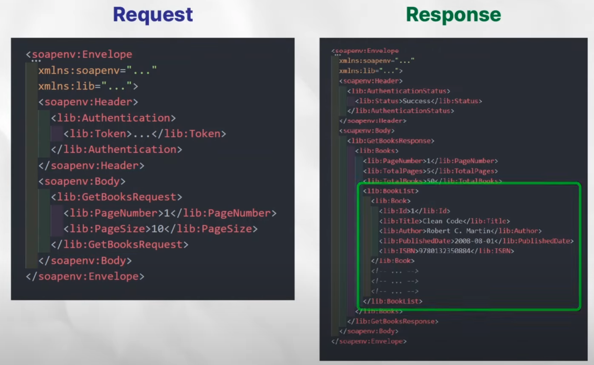

# 🧼 SOAP (Simple Object Access Protocol)

## ✅ 정의

- XML 기반 메시지를 컴퓨터 네트워크 상에서 HTTP, HTTPS, SMTP 등의 프로토콜을 통해 교환하는 통신 프로토콜

- 웹 서비스에서 기본적인 메시지를 전달하는 기반이 되지만, 현재는 REST API가 더 많이 사용됨.

- 플랫폼/언어의 제약 없이 데이터를 주고받을 수 있음.

 

## 🌟 특징

- 모든 요청은 하나의 고정된 URI로 전송됨 (REST는 다양한 URI 사용)

- 주고받는 데이터는 XML 형식으로 표현됨 (REST는 JSON 사용 → 더 가볍고 가독성 좋음)

- 대부분의 요청이 POST 방식으로 전송되며, 이로 인해 캐싱이 어려움

- 브라우저에서의 사용은 드물며, 웹 프론트엔드에서는 거의 사용되지 않음 (CORS 등 문제 때문)

- 메시지는 반드시 `<Envelope>` 태그로 시작하고 끝남

- 요청 메시지에 어떤 함수를 호출할지를 명시하는 Function-driven 방식

- REST처럼 자원 중심(Resource-oriented)이 아닌 동작 중심(Action-oriented) 표현 방식 -> REST API와는 다르게 API 정의 시 동사를 이용함

 

## 📄 WSDL (Web Services Description Language)

> SOAP 서비스에 대한 기계가 읽는 설명서(XML 기반).
>
> 서비스가 어떤 기능을 제공하는지 정의하고, 클라이언트는 이 명세를 바탕으로 코드 자동 생성 가능.
>
> UDDI에 등록되어 서비스 검색 및 호출에 사용됨.

### 💽 UDDI (Universal Description, Discovery and Integration)

> SOAP 기반 웹 서비스를 등록하고 검색하는 저장소 역할
>
> 사용자가 필요한 서비스를 찾아서 연결할 수 있도록 도와줌.

 

### 😊 장점

1. 엄격한 표준화와 계약 기반 통신이 가능함.
2. WSDL을 통해 클라이언트/서버 코드 자동화 가능 → 개발 효율 ↑
3. WS-Security 같은 보안 기능 탑재 → 높은 보안 수준 요구 시스템에 적합.
4. 상태 저장 가능 → 여러 단계로 구성된 트랜잭션 처리에 유리.

### 😡 단점

1. XML 기반으로 구문이 복잡하고 무거움 → 가독성 낮음.
2. REST보다 유연성이 떨어짐.
3. WSDL이 바뀌면 서버와 클라이언트 모두 수정 필요.
4. 캐싱이 어려움 (POST 방식을 사용하므로) -> HTTP는 POST 요청에 캐싱을 지원안함
5. REST처럼 URL을 통해 리소스를 명확히 표현하지 못함.

 

## 🏦 사용 사례

> SOAP은 다음과 같은 고신뢰, 고보안, 고정밀 시스템에서 여전히 사용되고 있음
>
> 금융 거래 시스템 (트랜잭션의 원자성과 보안이 중요)

1. 의료 정보 시스템
2. 정부 서비스
3. 금융 서비스

➡ REST가 가진 유연함 대신, 명확한 규약과 신뢰성이 중요한 경우에는 SOAP이 적합

 

## 퀴즈

- SOAP이 REST와 다른 점과 SOAP의 어떤 부분 때문에 요즘은 SOAP 대신 REST API를 주로 사용하는가?

## 출처

- [출처1](https://www.youtube.com/watch?v=5o1IiHuUxPk)
