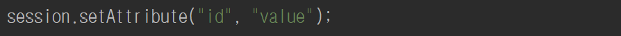
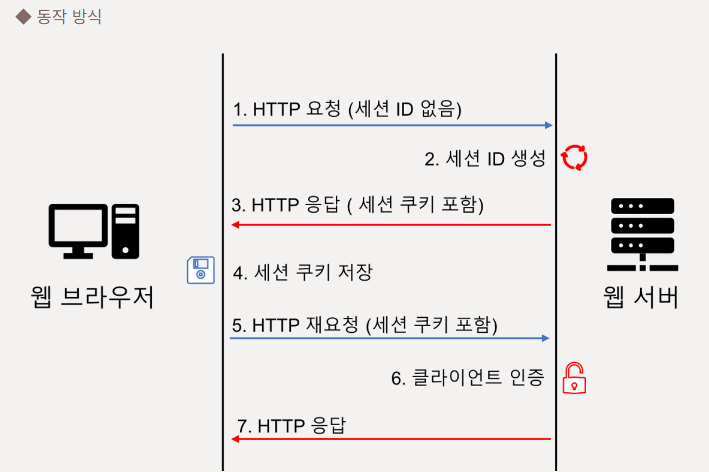

# 쿠키와 세션

## 쿠키

웹 브라우저에 저장되는 작은 데이터 파일 
서버가 클라이언트의 웹 브라우저에 쿠키를 저장하고, 이후 요청 시마다
전송함 
쿠키의 데이터 형태는 Key와 Value로 구성되고 String 형태로 이루어져 있음 

- ### 특징 

  저장위치: 클라이언트(브라우저) 
  유지시간: 쿠키 저장시에 설정하는 기간까지 유지됨 
  용량제한: 한 도메인당 20개, 한 쿠키당 4KB로 제한 
  보안 : 사용자가 쿠키 파일에 직접 접근할 수 있어 보안에 취약함  

- **사용예시** 
  쿠키가 있으면 여러 페이지를 이동할 때마다 로그인을 하지 않고 사용자 정보를 유지할 수 있음 

  - ID 저장, 자동 로그인 
  - 일주일 간 다시 보지 않기 
  - 최근 검색한 상품들을 광고에서 추천 
  - 쇼핑몰 장바구니 

- **단점** 
  방문했던 웹 사이트에 대한 정보가 기록되기 때문에 사생활을 침해할 수 있음
  사용자에게 저장되기 때문에, 임의로 수정이나 삭제가 가능함

 

## 세션  

서버에 저장되는 사용자별 데이터 
각 사용자는 고유한 세션 ID를 가지며, 세션 ID를 통해 서버는 사용자를 식별할 수 있음  로그인한 사용자에 대해서만 세션을 생성하는 것이 아니라
로그아웃 시 새로운 사용자로 인식해 새로운 세션이 생성됨  

- ### 특징 

  저정위치: 서버 
  유지시간: 브라우저 종료 시 또는 일정 시간 후 자동 만료 
  용량제한: 없음 
  보안 : 서버에 저장되므로 상대적으로 안전함 

- **사용예시** 
  결제 
  현재 활성화된 로그인 상태 
  관리자 기능  

- **단점** 
  서버 메모리에 저장하기에 접속하는 사용자가 많아질수록 서버 부담이 증가함  
  세션 ID가 공개적으로 노출 시,
  해커가 피해자의 세션 ID를 활용해
  데이터를 탈취할 수 있음 

   

- 세션 사용하기
  - 세션의 속성 설정하기: session 객체의 setAttribute() 메소드 사용 
    
     
    세션의 속성 지정 시, 계속 상태를 유지하는 기능을 사용할 수 있음  
- 세션의 속성 사용하기:session 객체의 getAttribute() 메소드 
    

   

### 쿠키와 세션을 활용해 사용자를 확인하는 방식 

1. 서버에서는 사용자로부터 요청이 있을 때 사용자를 구분하기 위한 쿠키에 세션 ID를 담아서 보냄 
2. 클라이언트는 세션 쿠키를 웹브라우저에 저장함  
3. 클라이언트 같은 사이트의 서버를 요청할 때, 저장된 쿠키를 요청할 header에 담아 다시 서버로 전송함 
   서버는 전송받은 쿠키와 서버에 저장된 사용자 정보를 비교하여 같은 사용자임을 확인하여 클라이언트에게 응답함  

## 퀴즈

- 쿠키와 세션에 대해 차이점을 말해주세요. 

## ✈️ 출처

- [출처1](https://haryo29.tistory.com/62)
