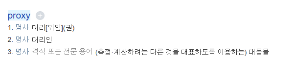
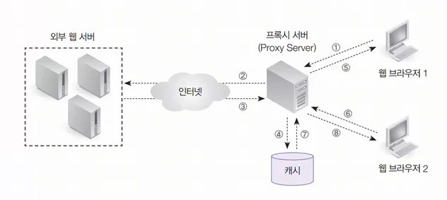
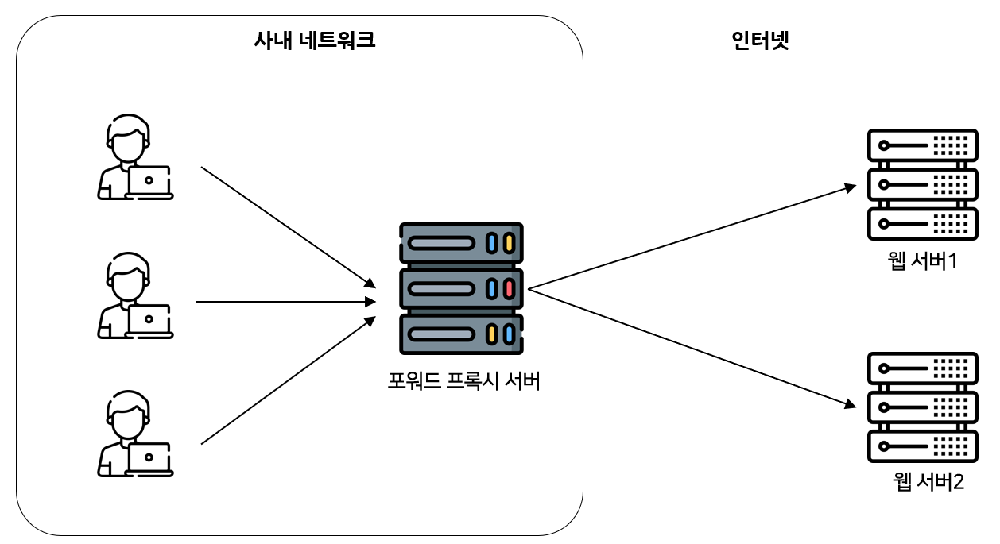
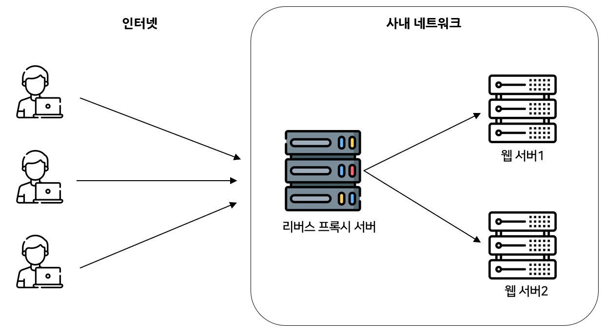

## 프록시 서버의 개념

그림 1. 프록시의 뜻

프록시 서버는 클라이언트(사용자 컴퓨터)와 인터넷 서버(웹 사이트) 사이에 위치하는 중개 서버이다.

우리가 인터넷에 접속할 때 직접 웹 사이트에 연결하는 것이 아니라, 프록시 서버라는 대리인을 거쳐서 접속하는 방식이다.

프록시 서버는 한번 전송한 데이터를 캐시에 저장한 후, 동일한 요청이 다시 들어오면, 실제 웹사이트 서버까지 가지 않고 캐싱된 데이터를 바로 전달하여 응답 속도를 높일 수 있다.

 

## 프록시 서버의 작동 방식

그림 2. 프록시 서버 동작 방식

1. 웹 브라우저 1에서 웹 서핑을 요청한다.
2. 프록시 서버가 웹 서버에 접근한다.
3. 웹 서버에서 데이터를 가져온다.
4. 가져온 데이터를 캐시에 저장한다.
5. 요청한 데이터를 웹 브라우저 1에게 전송한다.
6. 웹 브라우저 2가 웹 서핑을 요청한다. (이때, 요청한 데이터는 웹 브라우저 1이 요청한 데이터와 동일하다고 가정)
7. 프록시 서버는 외부로 나가지 않고 자신의 캐시에 있던 데이터를 가져온다.
8. 그 데이터를 웹 브라우저 2에게 바로 전송한다.

 

## 프록시 서버의 기능 및 장점

- 보안 강화
  - 클라이언트의 실제 IP 주소를 숨겨 외부 공격으로부터 보호할 수 있다.
  - 프록시 서버 자체에서 악성코드나 유해 사이트를 필터링하는 방화벽 역할을 수행할 수도 있다.
- 캐싱을 통한 속도 향상
  - 오리지날 서버에 접속할 필요 없이 가까이에 있는 프록시 서버에만 접속해서 요청한 메시지를 받을 수 있기 때문에 응답 시간을 줄여서 속도를 굉장히 증가시켜주고 네트워크의 트래픽을 줄여준다.
- 접근 제어 및 우회
  - 특정 웹사이트나 서비스에 대한 접근을 차단하거나 허용하는 정책을 적용할 수 있다.
  - 지역 제한 등으로 인해 접속이 불가능한 해외 사이트에 프록시 서버를 통해 우회하여 접속하는 용도로 사용되기도 한다.
  - 요즘은 VPN을 좀 더 많이 쓰는듯?
- 트래픽 분산(로드 밸런싱)
  - 여러 대의 웹 서버를 운영할 때, 프록시 서버가 클라이언트의 요청을 여러 서버로 적절히 분산시켜 특정 서버에 과부하가 걸리는 것을 막는다.

 

## 프록시 서버 종류

### Forward 프록시

그림 3. 포워드 프록시

- 클라이언트 측에서 사용하는 프록시 서버
- 방화벽, 캐싱, 접근 제어 기능을 제공

### Reverse 프록시

그림 4. 리버스 프록시

- 서버 측에서 사용하는 프록시 서버
- 외부 클라이언트들이 내부의 특정 서버에 접속할 때 거쳐가는 프록시 서버
- 로드 밸런싱, 보안 강화 기능을 제공

 

## 출처

[https://losskatsu.github.io/it-infra/reverse-proxy/#3-리버스-프록시reverse-proxy-서버란](https://losskatsu.github.io/it-infra/reverse-proxy/#3-%EB%A6%AC%EB%B2%84%EC%8A%A4-%ED%94%84%EB%A1%9D%EC%8B%9Creverse-proxy-%EC%84%9C%EB%B2%84%EB%9E%80)

 

## 퀴즈

1. 프록시 서버의 작동 방식에 대해 설명하시오.
2. 프록시 서버의 캐싱 기능은 무엇이고, 어떤 이점이 있는지 설명하시오.
