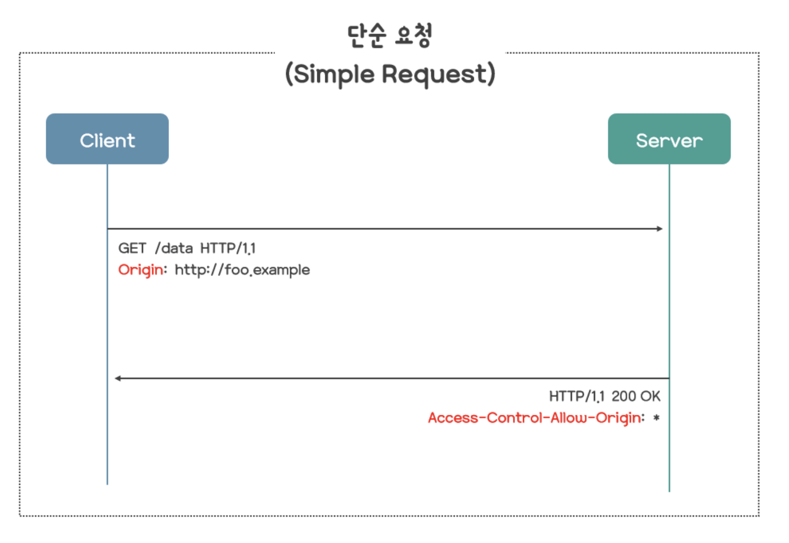
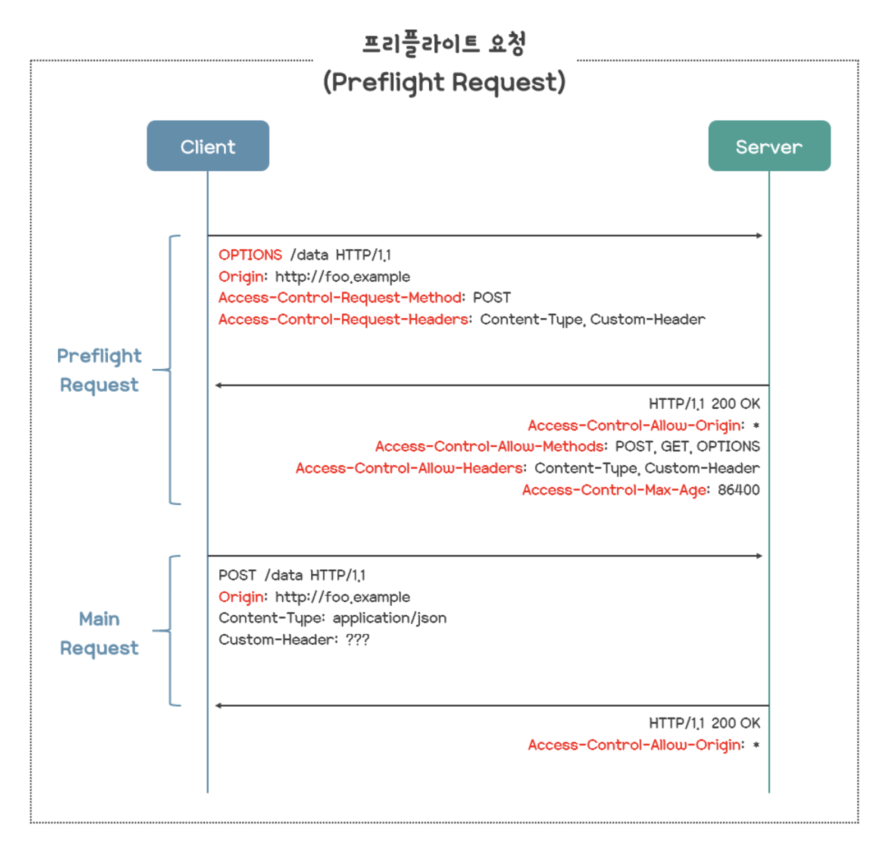
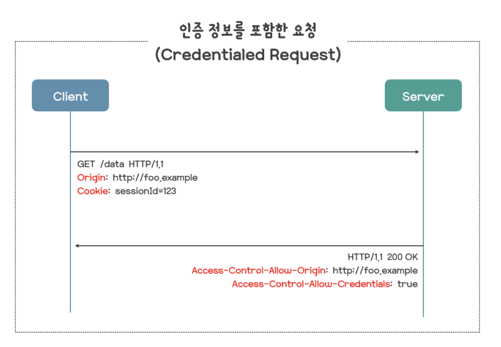

# SOP 와 CORS

## **SOP (Same-Origin Policy, 동일 출처 정책)**

**개념**

- 브라우저에서 보안상으로 도입된 정책
- 다른 출처(Origin)의 리소스에 대한 접근을 제한
- 브라우저 단에서 자동 적용되며, 주로 스크립트 간의 상호작용을 제한함

**출처(Origin)?**

- 다음 세 요소가 모두 같아야 같은 출처로 간주됨:
    1. 프로토콜 (http / https)
    2. 호스트 (도메인, IP 주소)
    3. 포트 번호

| **URL** | **같은 출처?** |
| --- | --- |
| http://example.com | O |
| https://example.com | X (프로토콜 다름) |
| http://sub.example.com | X (서브도메인 다름) |
| http://example.com:8080 | X (포트 다름) |

**SOP가 제한하는 것**

| **리소스 종류** | **SOP 적용 여부** |
| --- | --- |
| DOM 접근 | O |
| 쿠키 | O |
| localStorage | O |
| AJAX 요청 | O |
| script 태그로 외부 JS 로드 | X (허용됨) |
| img src="..." | X (허용됨) |
| link CSS | X (허용됨) |

즉, 보안에 민감한 리소스는 SOP에 의해 보호됨.

## **CORS (Cross-Origin Resource Sharing, 교차 출처 리소스 공유)**

**개념**

- SOP의 제약을 우회하기 위한 메커니즘
- 서버가 HTTP 응답 헤더에 특정 도메인(Origin)을 명시하면, 브라우저가 그 요청을 허용
- CORS는 브라우저 + 서버 간 협력으로 이루어짐

**기본 동작 방식**

- 클라이언트 요청 시 Origin 헤더 포함

  GET /api/data HTTP/1.1

  Origin: https://client.com

- 서버가 응답 시 허용 출처 명시

  HTTP/1.1 200 OK

  Access-Control-Allow-Origin: https://client.com


브라우저는 이 응답을 확인하고, 같은 Origin일 때만 자바스크립트 접근 허용

**CORS 관련 헤더 설명**

| **헤더명** | **설명** |
| --- | --- |
| Access-Control-Allow-Origin | 허용할 Origin (또는 * 전체 허용) |
| Access-Control-Allow-Methods | 허용할 HTTP 메서드 목록 (GET, POST 등) |
| Access-Control-Allow-Headers | 요청에 포함될 수 있는 커스텀 헤더 |
| Access-Control-Allow-Credentials | 쿠키 등 인증정보 허용 여부 (true/false) |

## **CORS 요청의 종류**

### **Simple Request (단순 요청)**

조건을 만족할 경우 브라우저가 바로 요청을 보냄.

**조건**

- HTTP method가 GET, HEAD, POST 중 하나
- Content-Type이 다음 중 하나:
    - application/x-www-form-urlencoded
    - multipart/form-data
    - text/plain
- 커스텀 헤더 사용 안 함

<br>

   

**예시**

```java
fetch("https://api.example.com/data", {

method: "GET"

});

서버 응답 헤더 예시

Access-Control-Allow-Origin: https://your-frontend.com

이 경우, 브라우저는 요청을 그냥 보냄

서버는 Access-Control-Allow-Origin만 설정해주면 됨.
```

---

### **Preflight Request (사전 요청)**

조건을 만족하지 않으면 브라우저는 “먼저 OPTIONS 요청”을 보내 서버에 물어봄.

**언제 발생**

- HTTP method가 GET, HEAD, POST 외의 것일 때 (예: PUT, DELETE 등)
- 또는 커스텀 헤더가 포함될 때 (예: Authorization, X-Custom-Header 등)
- Content-Type이 허용되지 않은 타입일 때

**동작 흐름**

1. 브라우저가 OPTIONS 요청을 먼저 보냄 (프리플라이트)
2. 서버가 허용 여부를 응답
3. 브라우저가 본 요청(actual request)을 보냄
      <br>
      

```java
프리플라이트 요청 예시

OPTIONS /data HTTP/1.1

Origin: https://your-frontend.com

Access-Control-Request-Method: PUT

Access-Control-Request-Headers: Authorization

서버 응답 헤더 예시

Access-Control-Allow-Origin: https://your-frontend.com

Access-Control-Allow-Methods: PUT

Access-Control-Allow-Headers: Authorization
```

---

### **Credentialed Request (인증 정보 포함 요청)**

요청에 쿠키, 세션, 인증 헤더 등을 포함하는 요청

   

**브라우저 설정**

fetch("https://api.example.com/data", {

credentials: "include"

});

**서버 응답에 반드시 있어야 할 것**

Access-Control-Allow-Origin: https://your-frontend.com

Access-Control-Allow-Credentials: true

주의: Access-Control-Allow-Origin: *와 Allow-Credentials: true는 함께 못 씀

## **비교**

| **구분** | **브라우저 사전 요청(OPTIONS)** | **인증정보 포함 가능 여부** | **예시 상황** |
| --- | --- | --- | --- |
| Simple Request | 없음 | 불가능 | 기본 GET/POST API 호출 |
| Preflight Request | 있음 (OPTIONS 후 본 요청) | 가능 (추가 설정 시) | PUT/DELETE, 커스텀 헤더 포함 |
| Credentialed | 필요 시 OPTIONS 포함 | 가능 (credentials: include) | 로그인 상태 API 호출 |

# 퀴즈

- CORS 요청에서 Preflight 요청이 발생하는 조건은?

# 출처
- https://velog.io/@dygreen/%EA%B8%B0%EC%88%A0-CORS%EC%9D%98-%EA%B0%9C%EB%85%90%EA%B3%BC-%EB%8F%99%EC%9E%91%EC%9B%90%EB%A6%AC
- https://velog.io/@jesop/SOP%EC%99%80-CORS