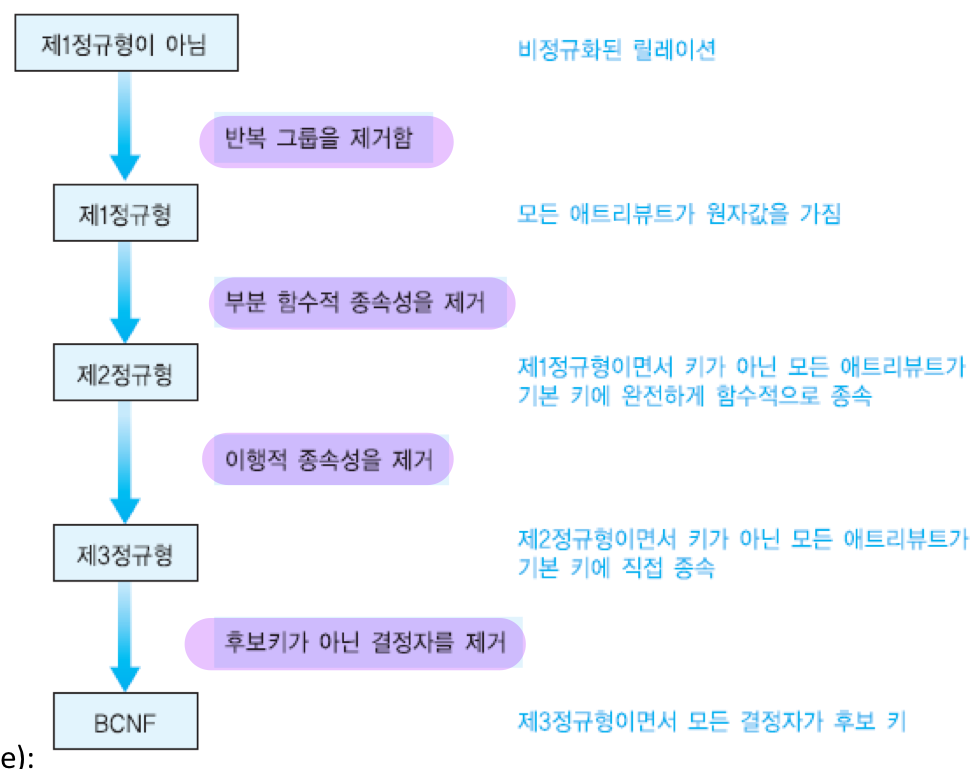

# ERD와 정규화 과정
- [ERD와 정규화 과정](#erd와-정규화-과정)
  - [🔗 ERD(Entity Relationship Diagram)란?](#-erdentity-relationship-diagram란)
    - [✨ 사용처](#-사용처)
  - [🔗 ERD 요소](#-erd-요소)
    - [📍 엔티티(Entity)](#-엔티티entity)
    - [📍 엔티티 속성(Entity Attribute)](#-엔티티-속성entity-attribute)
    - [📍 엔티티 도메인(Entity Domain)](#-엔티티-도메인entity-domain)
  - [🔗 엔티티 분류](#-엔티티-분류)
  - [🔗 엔티티 관계](#-엔티티-관계)
    - [📍 식별자 관계](#-식별자-관계)
    - [📍 비식별자 관계](#-비식별자-관계)
  - [🔗 ERD Notation](#-erd-notation)
    - [1. One](#1-one)
    - [2. Many](#2-many)
    - [3. One(and only One)](#3-oneand-only-one)
    - [4. Zero or one](#4-zero-or-one)
    - [5. One or Many](#5-one-or-many)
    - [6. Zero or Many](#6-zero-or-many)
  - [🔗 ERD 관계 참여도](#-erd-관계-참여도)
  - [🔗 ERD 관계 카디널리티](#-erd-관계-카디널리티)
    - [✨ One-to-One Cardinality(1:1 대응)](#-one-to-one-cardinality11-대응)
    - [✨ One-to-Many Cardinality(1:N 대응)](#-one-to-many-cardinality1n-대응)
    - [✨ Many-to-Many Cardinality(N:M 대응)](#-many-to-many-cardinalitynm-대응)
  - [🔗 정규화](#-정규화)
    - [🫧 갱신 이상](#-갱신-이상)
    - [🫧 함수적 종속성](#-함수적-종속성)
    - [완전 함수적 종속성(FFD: Full Functional Dependency)](#완전-함수적-종속성ffd-full-functional-dependency)
    - [이행적 함수적 종속성(transitive FD)](#이행적-함수적-종속성transitive-fd)
    - [🧩 제1정규형](#-제1정규형)
    - [🧩 제2정규형](#-제2정규형)
    - [🧩 제3정규형](#-제3정규형)
    - [🧩 BCNF](#-bcnf)
  - [🔗 정규화 요약](#-정규화-요약)
    - [✨ 정규화 장점](#정규화-장점)
    - [✨ 정규화 단점](#정규화-단점)
  - [퀴즈](#퀴즈)
  - [출처](#출처)

## 🔗 ERD(Entity Relationship Diagram)란?

- ERD는 요구 분석 사항에서 얻은 엔티티와 속성들의 관계를 그림으로 나타낸 `개체-관계 모델`임

- 테이블과의 관계를 설명하는 다이어그램이며, 이를 통해 프로젝트에서 사용하는 데이터베이스의 구조를 한눈에 파악할 수 있음

- 데이터베이스를 구축 시 `뼈대 역할`을 하며, 서비스 구축 시 `제일 먼저` 신경써야 할 부분임

- 이를 통하여 API를 보다 효율적으로 뽑아낼 수 있음

 

### ✨ 사용처

> [!note]데이터베이스 모델링
>
> 관계형 데이터베이스에서 주로 널리 사용된다
>
> 엔티티와 속성들을 테이블과 컬럼들로 변환할 수 있다
>
> 테이블들과 관계들을 시각화 할 수 있기 때문에 설계 문제점을 파악 가능하다

> [!tip]소프트웨어 엔지니어링
> 소프트웨어 계획 단계에서 사용된다
>
> 서로 다른 시스템 요소와 서로 간의 관계를 식별하는데 도움이 된다
>
> data flow diagram의 기초로써 종종 사용된다

 

## 🔗 ERD 요소

### 📍 엔티티(Entity)

- 엔티티는 정의 가능한 `사물 또는 개념`을 의미
- 사람도 될 수 있으며 프로필, 도서정보와 같은 `무형의 정보`도 데이터화가 가능
- `데이터베이스의 테이블`이 엔티티로 표현된다고 보면 됨

 

### 📍 엔티티 속성(Entity Attribute)

- 엔티티에서는 개체가 가지고 있는 속성을 포함
- 예를 들어 학생 엔티티에는 학번, 이름, 주소, 전공 등이 속성임
- 데이터베이스의 테이블의 각 `필드(컬럼)`들이 엔티티 속성이라고 보면 됨

### 📍 엔티티 도메인(Entity Domain)

- 도메인은 속성의 값, 타입, 제약사항 등에 대한 `값의 범위`를 표현하는 것
- 사용자 기호에 따라 속성 타입만 그릴수도 있고, 가독성을 위해 `생략도 가능`
- 데이터 타입을 명시할 때, 데이터베이스가 지원하는 타입에 맞게 작성해야함

 

## 🔗 엔티티 분류

> #### 엔티티는 저장하는 데이터 정보 주제에 따라 종류가 나뉨

| 구분        | 내용                                                                                                                             |
| ----------- | -------------------------------------------------------------------------------------------------------------------------------- |
| 유형 엔티티 | 물리적인 형태 (예: 고객, 상품, 거래처, 학생, 교수 등)                                                                            |
| 무형 엔티티 | 물리적인 형태가 없고 개념적으로만 존재하는 엔티티 (예: 인터넷 장바구나, 부서 조직 등)                                            |
| 문서 엔티티 | 업무 절차상에서 사용되는 문서나 장부, 전표에 대한 엔티티 (예: 거래명세서, 주문서 등)                                             |
| 이력 엔티티 | 업무상 반복적으로 이루어지는 행위나 사건의 내용을 일자별, 시간별로 저장하기 위한 엔티티 (예: 입고 이력, 출고 이력, 구매 이력 등) |
| 코드 엔티티 | 무형 엔티티의 일종으로 각종 코드를 관리하기 위한 엔티티 (예: 국가코드, 각종 분류 코드)                                           |

 

## 🔗 엔티티 관계

### 📍 식별자 관계

> 실선으로 표현

- `강한` 연결 관계를 표현
- 부모 자식 관계에서 자식이 `부모의 주 식별자(PK)`를 `외래 식별자(FK)`로 참조하여 **자신의 주 식별자**로 설정

### 📍 비식별자 관계

> 점선으로 표현

- `약한` 연결 관계를 표현
- 부모 자식 관계에서 자신이 `부모의 주 식별자(PK)`를 `외래 식별자(FK)`로 참조해서 **일반 속성**으로 사용

 

## 🔗 ERD Notation

### 1. One

- `일대일` 혹은 `일대다` 관계
- 주로 하나의 외래키가 걸린 관계

### 2. Many

- `다대다` 관계
- 중계 테이블을 통하여 여러개의 데이터를 바라보고 있을 때 사용

### 3. One(and only One)

- `일대일` 관계이나, 하나의 row 끼리만 연결된 데이터

### 4. Zero or one

- `일대일` 혹은 `일대다` 관계를 가지고 있으나 필수 조건이 아님을 의미

### 5. One or Many

- 일대일 혹은 다대다 관계를 가지고 있음을 의미
- 관계를 가지고 있으나, 참조되는 row값들이 불명확함을 의미

### 6. Zero or Many

- 참조하는 테이블과의 관계가 불명확한 경우
- 장바구니처럼 row 생성값이 없을수도, 하나일수도, 여러개일수도 있는 경우

 

## 🔗 ERD 관계 참여도

> 관계선 각 측 끝자락에 기호를 표시

- `|` : 필수적으로 존재해야 하는 개체
- `O` : 없어도 되는 개체

 

## 🔗 ERD 관계 카디널리티

### ✨ One-to-One Cardinality(1:1 대응)

### ✨ One-to-Many Cardinality(1:N 대응)

### ✨ Many-to-Many Cardinality(N:M 대응)

> #### 데이터 모델링에서는 M:N 관계를 `완성되지 않은 모델`로 간주하여 두 엔티티의 관계를 `1:N`, `N:1`로 조정하는 `중간 엔티티`를 두는 작업이 필요

 

## 🔗 정규화

- 부주의한 데이터베이스 설계는 제어할 수 없는 `데이터 중복`을 야기하여 여러 가지 `갱신 이상`을 유발함
- 정규화는 주어진 릴레이션 스키마를 `함수적 종속성`과 `기본 키`를 기반으로 분석하여, 원래의 릴레이션을 분해함으로써 중복과 세 가지 갱신 이상을 최소화함

 

### 🫧 갱신 이상

> `수정 이상`
>
> 만일 어떤 부서의 이름이 바뀔 때 이 부서에 근무하는 일부 사원 투플에서만 부서이름을 변경하면 데이터베이스가 불일치 상태에 빠짐

> `삽입 이상`
>
> 만일 어떤 부서를 신설했는데 아직 사원을 한 명도 배정하지 않았다면 이 부서에 관한 정보를 입력할 수 없음

> `삭제 이상`
>
> 만일 어떤 부서에 속한 사원이 단 한 명이 있는데, 이 사원에 관한 투플을 삭제하면 이 사원이 속한 부서에 관한 정보도 릴레이션에서 삭제됨

 

### 🫧 함수적 종속성

- `정규화 이론의 핵심`
- 실세계에 대한 지식과 응용의 의미를 기반으로 어떤 함수적 종속성들이 존재하는가를 파악해야 함
- 함수적 종속성은 `제2정규형`부터 `BCNF`까지 적용됨

> ### ✨ 결정자(determinant)
>
> 
>
> 어떤 애트리뷰트의 값은 다른 애트리뷰트의 값을 `고유하게 결정`할 수 있음
>
> 결정자는 주어진 릴레이션에서 다른 애트리뷰트(또는 애트리뷰트들의 집합)를 고유하게 결정하는 하나 이상의 애트리뷰트를 의미
>
> 결정자를 아래와 같이 표기하고, 이를 “A가 B를 결정한다” (또는 “A는 B의 결정자이다”)라고 함: A→B

 

### 완전 함수적 종속성(FFD: Full Functional Dependency)

- 주어진 릴레이션 R에서 애트리뷰트 B가 애트리뷰트 A에 함수적으로 종속하면서 애트리뷰트 A의 어떠한 `진부분 집합`에도 함수적으로 종속하지 않으면 애트리뷰트 B가 애트리뷰트 A에 `완전하게 함수적으로 종속`한다고 말함 → 애트리뷰트 A는 `복합 애트리뷰트`여야 성립함

### 이행적 함수적 종속성(transitive FD)

- 한 릴레이션의 애트리뷰트 A,B,C가 주어졌을 때 애트리뷰트 C가 이행적으로 A에 종속한다(A→C)는 것의 필요 충분 조건은 A→B, B→C가 성립하는 것
- A가 릴레이션의 기본 키라면 키의 정의에 따라 A→B와 A→C가 성립, 만일 C가 A외에 B에도 함수적으로 종속한다면 C는 A에 직접 함수적으로 종속하면서 B를 거쳐서 A에 이행적으로 종속

 

> [!tip] 무손실 분해(lossless decomposition)
> 분해된 두 릴레이션을 조인하면 원래의 릴레이션에 들어 있는 정보를 완전하게 얻을 수 있음

 

### 🧩 제1정규형

- 모든 속성은 원자 값을 가져야 함
- 다중 값을 가질 수 있는 속성은 분리되어야 함

> [!warning] 제1정규형의 문제점
> `부분 함수 종속성`이 존재해 갱신 이상 발생
>
> 
> 부분 함수 종속성을 제거해주는 과정이 `제2정규화`임

 

### 🧩 제2정규형

- 제1정규형을 만족하고, 어떤 후보 키에도 속하지 않는 모든 애트리뷰트들이 릴레이션의 기본 키에 대해 완전 함수 종속성을 만족
- 기본 키에 종속적이지 않거나 기본 키 일부 컬럼(들)에만 종속적인 컬럼은 분리되어야 함
- 기본 키가 하나면 고려할 필요없이 `제2정규형`임

> [!warning] 제2정규형의 문제점
> `이행적 함수 종속성`이 존재해 갱신 이상 발생
>
> 
> 이행적 함수 종속성을 제거해주는 과정이 `제3정규화`임

 

### 🧩 제3정규형

- 제2정규형을 만족하면서, 키가 아닌 모든 애트리뷰트가 릴레이션 R의 `기본 키에 이행적으로 종속하지 않는 것`

> [!warning] 제3정규형의 문제점
> 수강 릴레이션에서 키가 아닌 애트리뷰트가 다른 애트리뷰트를 결정하기 때문에 갱신 이상 발생
>
> 후보 키 : (학번, 과목), (학번, 강사)

 

### 🧩 BCNF

- 제3정규형을 만족하고, 모든 결정자가 후보 키이어야 함
- 보통 제3정규화까지만 하고, BCNF까지는 잘 다루지 않음

 

## 🔗 정규화 요약

### ✨ 정규화 장점

- 정규화 단계가 진행될수록 `중복이 감소`하고 `갱신 이상도 감소`
- 정규화가 진전될수록 무결성 제약조건을 시행하기 위해 `필요한 코드의 양 감소`

### ✨ 정규화 단점

- 정규화가 데이터베이스 설계의 중요한 요소이지만 성능상의 관점에서만 보면 `높은 정규형을 만족하는 릴레이션 스키마가 최적인 것은 아님`
- 한 정규형에서 다음 정규형으로 진행될 때마다 `하나의 릴레이션이 최소한 두 개의 릴레이션으로 분해됨`
- 분해되기 전의 릴레이션을 대상으로 질의를 할 때는 조인이 필요 없지만 분해된 릴레이션을 대상으로 질의를 할 때는 같은 정보를 얻기 위해서 보다 많은 릴레이션들을 접근해야 하므로 `조인의 필요성이 증가`

 

## 퀴즈

- 각 정규화의 특징과 다음 정규형으로 변경하기 위한 작업에 대해 설명하시오.

## 출처

- [출처1](https://github.com/devSquad-study/2023-CS-Study/blob/main/DB/img/db_non_identifying_relationship.png)
