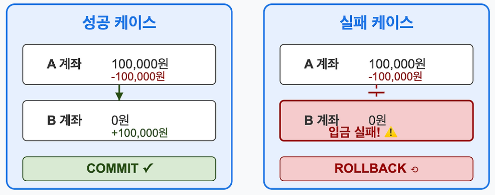

## 트랜잭션 개념과 ACID 속성

트랜잭션은 데이터베이스에서 하나의 논리적 기능을 수행하기 위한 작업의 단위를 말하며 데이터베이스는 쿼리를 통해 접근하므로 즉, 여러 개의 쿼리들을
하나로 묶는 단위를 뜻함 

### 특징 (ACID) 

- **원자성(Atomicity)**: 트랜잭션이 데이터베이스에 완전히 반영되거나 실행되지 않아야 함 

  - A계좌에서 10만원 출금 
    B계좌에서 10만원 입금 
    두 작업은 반드시 함께 성공하거나 함께 실패해야 함 
    만약 1번 작업 후 2번 작업이 실패하면 1번 작업도 취소되어야 함 
     

    

- **일관성(Consistency)**: 트랜잭션 수행이 완료된 데이터베이스는 일관성을
  지님 
  **일관성이란?** 
  데이터베이스의 모든 데이터가 모순되지 않은 상태 
  

- **독립성(Isolation)**: 수행 중인 트랜잭션에 다른 트랜잭션이 끼어들 수 없음 
  
- **영속성(Durability)**:완료한 트랜잭션의 결과가 데이테베이스에 영구적으로 반영됨 
  

   

트랜잭션은 완전히 반영되거나 아예 실행되지 않아야 하는데
이를 제어하기 위해 TCL(Transaction Control Language)이라는 명령어를 사용함 

   

### 종류 

- **COMMIT** 
  트랜잭션이 정상적으로 종료되어 데이터베이스에 변경 사항을 반영하는 명령어 
- **R0LLBACK** 
  트랜잭션이 비정상적으로 종료되어 트랜잭션이 수행한 변경 사항을 취소하고 데이터베이스를 이전 상태로 되돌리는 명령어 
- **SAVEPOINT** 
  트랜잭션에서 특정 지점을 지정하는 명령어로 ROLLBACK과 함께 사용하면 해당 지점까지 되돌릴 수 있음 
   

## 트랜잭션 상태 

   

- 활성화(Begin): 트랜잭션이 시작되어 처리 중인 상태 
- 부분적 완료(partially): 트랜잭션의 마지막 연산까지 처리가 완료되었으나 데이터베이스 트랜잭션 수행 결과가 반영되지 않은 상태 
- 완료(commit): 트랜잭션의 연산 처리가 완료되고 데이터베이스에 결과가 반영된 상태 
- 실패(failed): 트랜잭션 처리 중 오류가 발생해 트랜잭션이 중단된 상태 
- 취소(absorted): 트랜잭션이 중단되어 ROLLBACK을 수행해 데이터베이스를 이전으로 되돌린 상태 

MySQL에서 계좌 이체를 구현하는 간단한 ACID 트랜잭션 예제 

 

### 퀴즈 

- **ACID란 무엇인가요?**

### 출처 

- https://jjibba.tistory.com/151 
- https://readyoun.tistory.com/32
