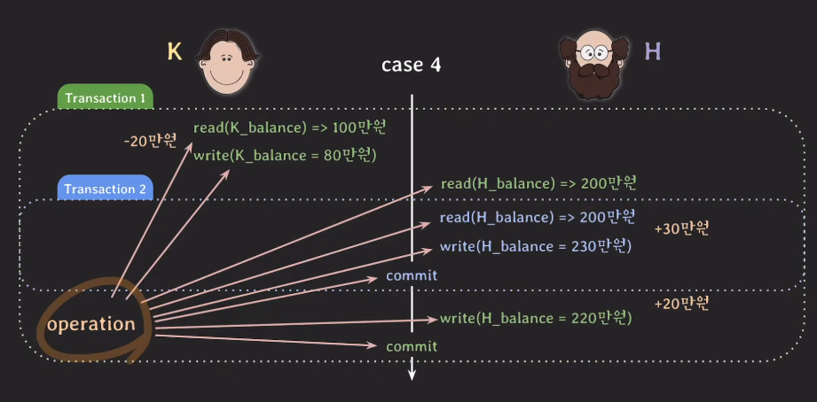
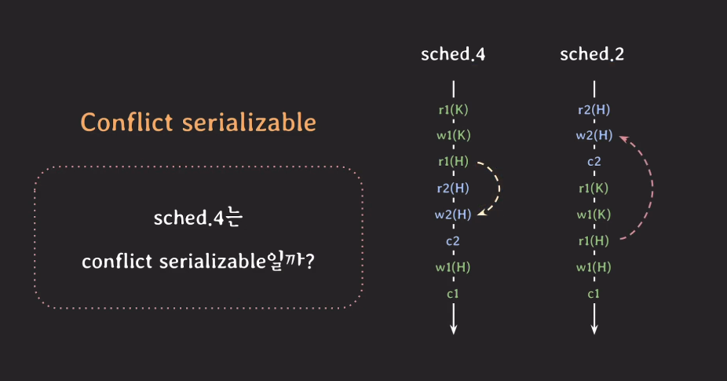

## 동시성 제어(Concurrency Control)

동시성 제어란 여러 트랜잭션이 동시에 데이터베이스에 접근하고 변경하려고 할 때 데이터의 일관성과 무결성을 유지하기 위해 사용되는 기술이다.

동시성 제어가 제공하는 중요한 속성이 2가지 있다.

- Serializability
- Recoverability

## Serializability

여러 트랜잭션이 동시에 실행되더라도, 그 결과가 마치 트랜잭션들이 어떤 특정한 순서대로 하나씩 순차적으로 실행된 것과 동일하게 나타나는 것을 의미한다.

즉, non-serial schedule이 serial schedule과 conflict equivalent 하다 라는 의미이다.

 

### Schedule

석찬이가 은비에게 20만원을 이체할 때, 은비가 본인 계좌에 30만원을 입금한다고 가정해보자.

그림 1. Case 1

첫번째 경우는 석찬이가 먼저 자신의 계좌에서 20만원을 빼고, 은비의 계좌에 20만원을 더하는 트랜잭션을 수행한다. 그리고 은비가 자신의 계좌에 30만원을 더하는 트랜잭션을 수행하는 방식이다.

 

그림 2. Case 2

두 번째 경우는 은비가 자신의 계좌에 30만원을 더하는 트랜잭션을 수행한 다음에, 석찬이가 자신의 계좌에서 20만원을 빼고 은비의 계좌에 20만원을 더하는 트랜잭션을 수행하는 방식이다.

 

그림 3. Case 3

세 번째 경우는 석찬이가 자신의 계좌에서 20만원을 뺀다. 그리고 이체를 해야 하는데 이때, 은비가 30만원을 입금하는 트랜잭션이 실행이 되버리는 것이다. 그러면 은비는 일단 자신의 계좌의 잔액이 얼마인지 읽어와서(200만원) 30만원을 더하고 커밋을 하고 트랜잭션 2을 종료한다. 그리고 원래 트랜잭션 1로 돌아와 자신의 계좌의 잔액을 읽고(230만원) 20만원을 더해서 write하고 커밋을 하고 트랜잭션을 종료한다.

 

그림 4. Case 4

4번째 경우는 석찬이가 자신의 계좌에서 20만원을 빼고 은비가 자신의 계좌의 잔액을 읽는다. 이때, 은비가 30만원을 입금하는 트랜잭션 2가 실행이 된다. 그래서 230만원으로 수정하고 커밋을 한다. 그리고 다시 트랜잭션 1로 돌아와서 수행하는 데, 트랜잭션 1에서 계좌 잔액을 200만원이라고 읽어오고 업데이트가 되지 않았기 때문에 250만원이 아니라 220만원이 write하고 커밋을 해버린다.

즉, 30만원 입금한 것이 사라지게 되버리는 것이다.

이런 경우를 Lost Update 라고 한다.

이렇게 20만원을 이체하는 트랜잭션과 30만원을 입금하는 트랜잭션이 동시에 발생할 때 여러 형태로 실행될 수 있고, 그 중에는 이상한 결과를 초래하는 경우가 있을 수 있다.

 

그림 5. 간소화

실행되는 하나의 액션들을 operation이라고 부르고 5-1 그림을 간소화하면 5-2 그림과 같이 표현할 수 있다.

 

그림 6. 스케줄

스케줄이란 여러 트랜잭션들이 동시에 실행될 때 각 트랜잭션에 속한 operation들의 실행 순서를 의미한다. 즉, case 1, case2, … 들이 각각의 schedule 1, schedule 2 , … 이 되는 것이다.

이 스케줄에는 중요한 특성이 있는데, 각 트랜잭션 내의 operation들의 순서는 바뀌지 않는다는 것이다.

 

그림 7. Serial Schedule

스케줄 1과 스케줄 2 처럼 트랜잭션이 겹치지 않고 한 번에 하나씩 실행되는 스케줄을 Serial Schedule(순차적 스케줄)이라고 부른다.

 

그림 8. Nonserial Schedule

반면에 스케줄 3, 4처럼 트랜잭션이 겹쳐서 실행되는 스케줄을 Nonserial Schedule(비순차적 스케줄)이라고 부른다.

 

### Serial Schedule VS Nonserial Schedule

serial schedule의 경우 한번에 하나의 트랜잭션만 실행을 하기 때문에 이상한 결과를 초래할 가능성은 없다. 하지만 동시성이 없기 때문에 여러 트랜잭션을 빠르게 처리할 수 없어서 성능면에서 떨어진다는 문제가 있다.

Nonserial Schedule의 경우 여러 트랜잭션들이 겹쳐서 실행되기 때문에 동시성이 높아져서 같은 시간 동안 더 많은 트랜잭션들을 처리할 수 있다. 하지만 스케줄 4번처럼 트랜잭션들이 어떤 형태로 겹쳐서 실행되는지에 따라 이상한 결과가 나올 수 있다는 문제가 있다.

성능 때문에 여러 트랜잭션들을 겹쳐서 실행하는 Nonserial schedule 방식으로 실행하고 싶은데, 어떻게 하면 Serial schedule처럼 무결성을 유지할 수 있을까를 고민하기 시작했다.

serial schedule과 동일한(equivalent) nonserial schedule을 실행하면 되겠구나 라는 아이디어로 이어지기 시작했다.

그리고 그 대표적인 방식 중 하나가 Conflict Serializable이다.

 

### Conflict

Conflict Serializable이란 Nonserial schedule이 serial schedule과 conflict equivalent라면 정상적인 결과를 출력할 수 있다는 것이다.

Conflict란 두 개의 operation이 아래 3가지 조건을 모두 만족하면 conflict 하다 라고 한다.

1. 2개의 operation이 서로 다른 트랜잭션 소속
2. 2개의 operation이 같은 데이터에 접근
3. 그 operation 중 최소 하나는 write operation이여야 한다

 

그림 9. Conflict of two operations

예를 들어, 스케줄 3의 w1(H)[”은비 계좌에 20만원 더하기”]와 r2(H)[”입금할 때 은비 계좌 읽기”]는 다른 트랜잭션 소속의 operation이고, 둘 다 은비의 계좌 데이터에 접근하며, 하나는 write operation이다. 이 두 operation이 conflict 한 것이다.

참고로, 하나는 read, 하나는 write 한 conflict면 read-write conflict, 둘 다 write면 write-write conflict 라고 한다.

 

그림 10. Conflict Equivalent

Conflict가 중요한 이유는 conflict operation의 순서가 바뀌면 결과도 바뀌기 때문이다.

예를 들어, r1(H)연산을 한 다음 w2(H)연산을 했을 때, r1(H)은 200만원이지만, w2(H) 연산을 한 다음 r1(H)연산을 하면 r1(H)의 값은 230만원이 된다.

 

### Conflict Equivalent

1. 두 스케줄이 같은 트랜잭션을 가진다.
2. 두 스케줄 내에 conflict operation의 실행 순서가 동일하다.

 

그림 11. Conflict Equivalent 2번 조건

스케줄 2와 스케줄 3을 예시로 봐보자.

먼저 두 스케줄 모두 20만원을 이체하는 트랜잭션과 30만원을 입금하는 트랜잭션 2개를 가지고 있으므로 1번 조건을 만족한다.

그리고 각 conflict operation( r2(H) → w1(H), w2(H)→r1(H), w2(H)→w1(H) )이 모두 동일한 순서로 동작하고 있으므로 2번 조건을 만족하고 있다.

이 스케줄 3번과 스케줄 2번을 conflict equivalent 하다 라고 한다.

그리고 여기서 스케줄 3번은 nonserial schedule인데, serial schedule인 스케줄 2번과 conflict equivalent 일 때, conflict serializable이라고 한다.

즉, Conflict Serializable 하다는 것은 그 스케줄이 Nonserial하게 실행되지만, 그 결과는 Serial하게 실행된 것과 완전히 동일하다는 것을 보장한다는 의미이다.

그래서 스케줄 3번은 Nonserial schedule임에도 정상적인 결과를 출력할 수 있다.

 

그림 12. Not Conflict Equivalent (1)

그럼 잘못된 결과를 출력했던 스케줄 4를 살펴보자.

스케줄 4와 스케줄 2는 둘 다 이체하는 트랜잭션과 입금하는 트랜잭션 2개를 가지고 있어 1번 조건은 만족하고 있다.

그런데 스케줄 4의 경우 r1(H) → w2(H) 순서로 연산이 수행되지만 스케줄 2는 w2(H) → r1(H) 순서로 연산이 수행되고 있다. 즉, 2번 조건을 만족하고 있지 않기 때문에 conflict equivalent하지 않다.

즉, 스케줄 4와 스케줄 2는 동일하지 않은 것이다.

 

그림 12. Not Conflict Equivalent (2)

또 다른 serial schedule인 스케줄 1번과 비교해보자.

마찬가지고 스케줄 4는 r2(H) → w1(H) 순서로 연산이 수행되지만, 스케줄 1은 w1(H) → r2(H) 순서로 연산이 수행된다. 즉, 스케줄 4는 스케줄 1과 비교해도 conflict equivalent 하지 않다.

트랜잭션 2개로 만들 수 있는 serial schedule을 2개(스케줄 1, 스케줄 2) 뿐인데, 이 두 스케줄과 모두 conflict equivalent 하지 않기 때문에 스케줄 4는 conflict serializable 할 수 없다. 그렇기 때문에 이상한 결과를 출력하게 되는 것이다.

 

## Recoverability

Recoverability란 트랜잭션이 실패하더라도 DB가 일관된 상태로 복구될 수 있는 능력을 의미한다. 시스템 장애가 발생했을 때 데이터 손실을 방지하고, 데이터베이스의 무결성을 유지하가 위한 속성이다.

Serializability는 트랜잭션의 실행 순서와 관련된 속성이라면 Recoverability는 트랜잭션의 실패와 복구에 관련된 속성이다.

 

### Unrecoverable schedule

그림 13. Unrecoverability schedule

석찬이가 은비에게 20만원을 보내기 위해서 먼저 자신의 계좌에서 20만원을 뺀다. 이때, 은비가 자신의 계좌에 30만원을 입금하고, 여기에 석찬이가 보낸 20만원을 더하고 트랜잭션 1을 커밋하는 순서로 스케줄이 된다고 해보자.

그런데 여기서 30만원 입금한 트랜잭션 2에 문제가 생겨서 abort를 하게 됬다고 해보자. 그래서 트랜잭션 2를 롤백을 하게 됬기 때문에, 다시 은비의 계좌를 트랜잭션 2의 이전 상태인 200만원으로 되돌려야 한다.

그런데, 트랜잭션 1의 read(H_balance) ⇒ 230만원 연산이 write(H_balance)⇒ 230만원을 읽어서 사용했기 때문에 트랜잭션 1 도 롤백을 해줘야 한다. 그런데 트랜잭션 1은 이미 커밋이 된 상태이므로 durability 속성으로 인해 롤백을 할 수가 없다.

이렇게 스케줄 내에서 커밋된 트랜잭션이 롤백된 트랜잭션이 write 했었던 데이터를 읽는 경우의 스케줄을 Unrecoverable schedule이라고 한다.

작업을 하면 이전 상태로 회복 불가능할 수 있기 때문에 Unrecoverable schedule은 DBMS에서 허용해서는 안된다. (그림 13의 예시를 보면 석찬이는 20만원을 보내서 80만원이 됬는데, 은비는 롤백을 해서 200만원이 되었다. 즉, 20만원이 사라지게 된 것이다.)

 

### Recoverable Schedule

그렇다면 어떤 스케줄을 허용해야 하는가 → Recoverable Schedule

그렇다면 어떤 스케줄이 recoverable한 것인가?

자신이 읽은 데이터를 write한 트랜잭션이 먼저 커밋 or 롤백 되기 전까지 커밋하지 않는 스케줄이다.

 

그림 14. Recoverable Schedule

현재 트랜잭션 1이 트랜잭션 2에 의존을 하고 있다(write(H_balance) = 230만원 → read(H_balance) ⇒ 230만원 ).

그렇다면 트랜잭션 2를 먼저 커밋한 다음에 트랜잭션 1을 커밋한다.

롤백도 마찬가지로 만약 트랜잭션 2가 롤백해야 되는 상황이라면 트랜잭션1은 커밋을 하지 않고 기다린 다음에 트랜잭션 2가 abort가 되면 트랜잭션 1도 abort 를 시켜서 롤백이 되도록 만들어준다.

즉, 의존성이 있을 때는 의존성의 대상이 되는 트랜잭션(트랜잭션2)이 종료될 때까지 의존하는 트랜잭션(트랜잭션 1)이 종료해서는 안된다는 것이다.

이런 특성을 만족하는 스케줄을 Recoverable Schedule이라고 한다. 이런 recoverable schdule은 롤백할 때 이전 상태로 온전히 돌아갈 수 있기 때문에 DBMS는 이런 스케줄만 허용해줘야 한다.

 

### Cascading Rollback

그림 15. Cascading rollback

현재 트랜잭션 2가 롤백이 되면 트랜잭션 2의 데이터를 읽었던 트랜잭션 1도 롤백을 해줘야 한다.

이렇게 하나의 트랜잭션이 롤백하게 되면 의존하고 있는 다른 트랜잭션도 연쇄적으로 롤백을 하게 되는 것을 Cascading Rollback이라고 한다.

그런데 여러 트랜잭션의 롤백이 연쇄적으로 일어나게 되면 처리하는 비용이 많이 들게 된다는 문제점이 있다. 이 비용 문제를 해결하기 위해 Cascadeless schedule이 등장하게 된다.

 

### Cascadeless Schedule

cascadeless schedule이란 데이터를 write한 트랜잭션이 커밋 or 롤백 한 뒤에 데이터를 읽는 스케줄만 허용하자는 것이다.

그림 16. Cascadeless Schedule

그림 15번에서 트랜잭션 1이 아직 커밋 or 롤백되지 않은 트랜잭션 2의 write한 데이터를 read하고 있다.

이렇게 하지말고, 그림 16번처럼 내가 읽으려는 데이터가 종료가 된 뒤에 read하자라는 것이다.

이렇게 하면 설령 트랜잭션 2가 롤백이 되어도 트랜잭션 1은 롤백을 하지 않아도 되는 것이다.

그런데 cascadeless schedule도 경우에 따라서 문제가 발생할 수가 있다.

 

### Strict Schedule

그림 17. Strict Schedule 예시

주환이가 피자 가격을 2만원으로 낮추려는 데, 소현이가 실수로 피자 가격을 1만원으로 낮추었다고 해보자.

 

그림 18. Cascadeless Schedule 반례 예시

소현이가 피자 가격을 1만원으로 write 하고, 주환이가 피자 가격을 2만원으로 write하고 커밋을 했다(트랜잭션 2 종료). 그런데 소현이가 write한 트랜잭션 1에 문제가 생겨서 abort가 발생해서 롤백하게 되었다고 해보자.

이 경우, 트랜잭션 1이 발생하기 이전인 3만원으로 돌아가게 된다.

즉, 주환이는 2만원으로 write하고 커밋까지 했는데도 트랜잭션 2 연산은 사라지게 되는 것이다(cascadeless schedule인데도 트랜잭션 1을 롤백했더니, 커밋한 트랜잭션 2가 사라짐).

이 문제를 해결하고자 Strict schedule이 등장하게 되었다.

strict schedule이란 스케줄 내에서 어떤 트랜잭션도 커밋되지 않은 트랜잭션들이 write한 데이터는 읽지도 + 쓰지도 않는 스케줄이다.

그림 19. Strict Schedule

즉, Strict schedule은 그림 19와 같이 트랜잭션 1이 먼저 실행되고 종료가 된 다음에, 트랜잭션 2가 시작되도록 만드는 것이다.

Strict Schedule은 트랜잭션 이전 상태로 돌려놓기만 하면 되기 때문에 롤백할 때 recovery가 매우 쉽다.
