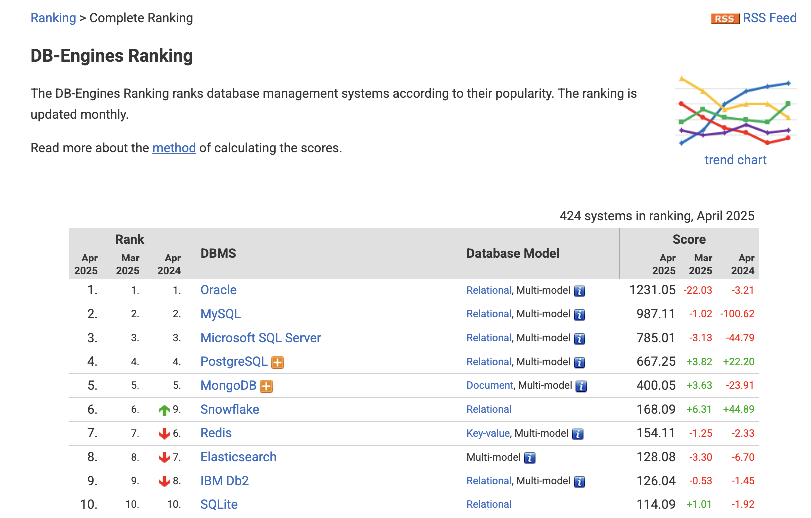

# RDBMS와 NoSQL

---

## 1. RDBMS (Relational Database Management System)

### 정의

- 데이터를 **테이블(행과 열)** 구조로 저장하고 관리하는 시스템.
- 데이터 간 **관계(Relationship)** 를 명확히 설정해 구조적, 일관성 있는 관리를 가능하게 한다.
- 데이터를 조작하고 조회할 때 **SQL(Structured Query Language)** 을 사용한다.

 

### 주요 특징

- **고정된 스키마**: 테이블의 구조를 미리 정의해야 한다.
- **ACID 트랜잭션 지원**:
  - **Atomicity (원자성)**: 작업은 모두 성공하거나 모두 실패해야 한다.
  - **Consistency (일관성)**: 트랜잭션이 끝난 후에도 데이터는 일관성을 유지해야 한다.
  - **Isolation (고립성)**: 동시에 실행되는 트랜잭션은 서로 간섭하지 않는다.
  - **Durability (지속성)**: 트랜잭션 완료 후 데이터는 영구적으로 저장된다.
- **복잡한 쿼리 처리**: 여러 테이블 간 JOIN이나 서브쿼리 등 복잡한 데이터 연산이 가능하다.

 

### 대표 RDBMS 예시

| 제품                     | 특징                                                  | 실제 사용 사례                 |
| :----------------------- | :---------------------------------------------------- | :----------------------------- |
| **MySQL**                | 오픈소스, 널리 사용, 가벼움, 다양한 스토리지엔진 지원 | 블로그, 쇼핑몰 웹사이트        |
| **PostgreSQL**           | 고급 기능, 오픈소스                                   | 금융 분석, GIS(지리정보시스템) |
| **Oracle Database**      | 대규모 트랜잭션 지원, 기업용                          | 은행 시스템, 보험사 백엔드     |
| **Microsoft SQL Server** | 윈도우 친화적, BI 도구 강력                           | 기업 내부 데이터웨어하우스     |

 

### 사용 예시

- **은행 계좌 관리 시스템**: 입금, 출금, 이체 등 트랜잭션 무결성이 필수.
- **대학교 학생 관리 시스템**: 학생, 수강 과목, 교수 테이블 간 관계 필요.

---

 

## 2. NoSQL (Not Only SQL)

### 정의

- **비정형/반정형 데이터**를 자유롭게 저장하고 관리하는 데이터베이스 시스템.
- 전통적인 테이블-행-열 구조를 따르지 않고, 데이터 모델이 다양하다(문서, 키-값, 그래프 등).
- 대규모 데이터 처리와 빠른 확장성에 최적화되어 있다.

 

### 주요 특징

- **유연한 스키마**: 데이터 구조를 미리 정의할 필요 없음.
- **BASE 특성**:
  - **Basically Available (기본 사용 가능)**: 일부 장애가 있어도 서비스는 동작.
  - **Soft state (가변적 상태)**: 데이터가 즉시 일관성을 가지지 않을 수 있음.
  - **Eventually consistent (최종 일관성)**: 시간이 지나면 데이터가 일관성을 이룸.
- **수평적 확장(Scale-Out)**: 서버를 여러 대 추가하여 처리량을 늘릴 수 있다.

 

### NoSQL 유형별 대표 제품

| 유형                 | 대표 제품 | 특징                | 실제 사용 사례                         |
| :------------------- | :-------- | :------------------ | :------------------------------------- |
| **문서형(Document)** | MongoDB   | JSON 형식으로 저장  | 쇼핑몰 상품 목록, 사용자 프로필 저장   |
| **키-값(Key-Value)** | Redis     | 초고속 캐시         | 로그인 세션 관리, 실시간 순위표        |
| **열지향(Column)**   | Cassandra | 분산형, 대규모 처리 | 넷플릭스 추천 시스템, IoT 데이터 수집  |
| **그래프(Graph)**    | Neo4j     | 노드와 관계 저장    | 소셜 네트워크 관계 분석, 추천 알고리즘 |

 

### 사용 예시

- **SNS 서비스(페이스북, 인스타그램)**: 사용자 활동을 빠르게 기록하고 조회.
- **실시간 게임 서버**: 점수판, 게임 진행 상태 빠르게 업데이트.
- **IoT 데이터 수집**: 대량의 센서 데이터 저장 및 분석.

---

 

## 3. RDBMS vs NoSQL 비교

| 항목          | RDBMS                       | NoSQL                           |
| :------------ | :-------------------------- | :------------------------------ |
| 데이터 구조   | 고정된 테이블 (행과 열)     | 문서, 키-값, 그래프, 컬럼 등    |
| 스키마        | 고정 스키마 필요            | 스키마 유연 또는 없음           |
| 트랜잭션 처리 | ACID 보장                   | BASE 모델 (최종 일관성)         |
| 확장 방식     | 주로 수직 확장 (Scale-Up)   | 수평 확장 (Scale-Out)           |
| 데이터 적합성 | 정형 데이터                 | 비정형/대규모 데이터            |
| 사용 예       | 은행, ERP, 병원 기록 시스템 | SNS, 실시간 분석, 빅데이터 수집 |

---

 

## 4. 어떤 경우에 어떤 DB를 사용할까?

### RDBMS를 선택해야 하는 경우

- 데이터 무결성, 일관성이 매우 중요한 경우
- 복잡한 관계를 가진 데이터 모델이 필요한 경우
- 예시: 금융, 병원, 정부 시스템

 

### NoSQL을 선택해야 하는 경우

- 데이터 구조가 자주 바뀌는 경우
- 대용량 데이터 처리와 빠른 쓰기/읽기가 필요한 경우
- 예시: 소셜 네트워크, 실시간 데이터 분석, 모바일 게임 백엔드

---

 

## 질문

### 1. NoSQL이 나오게된 이유에 대해 설명해 주세요.

### 2. MySQL에서 스토리지 엔진의 역할은?

---

## 출처

https://github.com/devSquad-study/2023-CS-Study/blob/main/Interview/db_expected_question.md

https://github.com/devSquad-study/2023-CS-Study/blob/main/Interview/db_expected_question.md
