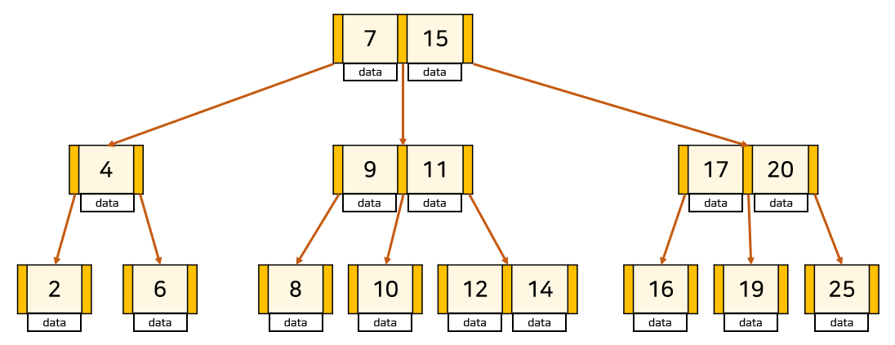
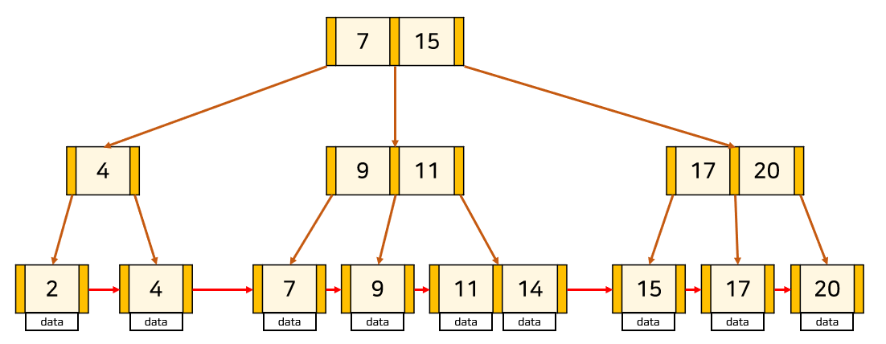

# 인덱스

> [!tip] 추가적인 쓰기 작업과 저장 공간을 활용하여 데이터베이스 테이블의 검색 속도를 향상시키기 위한 자료구조

## 🔗 DB 테이블에 인덱스(index)가 필요한 이유

### 📍 인덱스를 설정하지 않은 경우

> 아래 데이터를 찾긱 위해서는 full scan(O(N))을 해야함
>
> full scan: 테이블의 모든 행을 탐색하는 것

```sql
SELECT *
FROM customer
WHERE first_name = "zoo";
```

### 📍 인덱스를 설정한 경우

> B-Tree based index를 활용하여 O(N) -> O(logN)으로 줄일 수 있음

### 인덱스를 사용하는 이유

1. 조건을 만족하는 튜플을 빠르게 조회
2. 빠르게 정렬(order by)하거나, 그룹핑(group by)

<br/>

## 🔗 인덱스 활용 예시

```sql
-- 아래와 같은 테이블이 생성되었다고 가정
CREATE TABLE PLAYER (
  id INT PRIMARY KEY,
  name VARCHAR(255) NOT NULL,
  team_id INT NOT NULL,
  back_number INT NOT NULL
);
```

```sql
-- 아래 두가지 쿼리문을 수행하고자 함
SELECT * FROM player WHERE name = "Sonny";
SELECT * FROM player WHERE team_id = 105 and back_number = 7;
```

```sql
-- 아래와 같이 인덱스 생성함

-- single column index
CREATE INDEX player_name_idx ON player (name);
-- multi column index
-- WHERE절에서 자주 같이 사용되는 인덱스들을 묶어서 인덱스를 생성해줌
CREATE UNIQUE INDEX team_id_back_number_idx ON player (team_id, back_number);


-- 테이블 생성시 아래와 같이 바로 인덱스를 생성해줄수도 있음
-- 참고: 대부분의 RDBMS는 primary key에는 index가 자동으로 생성됨
CREATE TABLE PLAYER (
  id INT PRIMARY KEY,
  name VARCHAR(255) NOT NULL,
  team_id INT NOT NULL,
  back_number INT NOT NULL,
  INDEX player_name_idx (name),
  UNIQUE INDEX team_id_back_number_idx (team_id, back_number)
);
```

### 🫧 Covering Index

```sql
-- 아래와 같은 쿼리문을 수행하려고 함
SELECT team_id, back_number FROM player WHERE team_id = 5;
```

> team_id, back_number를 묶어 Multi Column Index를 생성해줬기 때문에 해당 인덱스만 조회해주면 됨
>
> 원하는 데이터의 위치를 찾으면 해당 인덱스에 원하는 값이 모두 있으므로 실제 테이블로 가서 조회를 할 필요가 없음

> [!note] 조회하는 attribute(s)를 index가 모두 cover할 때 조회 성능이 더 빠르다.

<br/>

## 🔗 인덱스 구조

### 📍 Single-Level Ordered Indexes

- 각 인덱스 엔트리는 <탐색 키, 레코드에 대한 포인터> 형태
- 탐색 키 값 기준 오름차순으로 정렬되어 있음

#### 1) Primary Index (기본 인덱스) | Sparse Index

- 탐색 키가 테이블의 기본 키(Primary Key) 인 인덱스
- 데이터 파일이 탐색 키 순서로 정렬되어 있어야 함

#### 2) Clustering Index (클러스터링 인덱스) | Sparse Index

- Ordering field(정렬 기준 필드)에 대해 인덱스 생성
- 여러 레코드가 같은 탐색 키 값을 가질 수 있다. (중복 허용)

#### 3) Secondary Index (보조 인덱스) | Dense Index

- Primary key가 아닌 다른 컬럼에 대해 생성하는 인덱스
- 테이블이 정렬되어 있지 않아도 상관 없음

### 📍 Multi-Level Indexes

> 단일 인덱스 파일이 너무 클 때 탐색 효율이 떨어질 수 있음
>
> 이 경우, 인덱스 자체를 다시 인덱싱해서 다단계 구조로 만듬

#### 최상위 인덱스를 마스터 인덱스(Master Index) 라고 부른다.

- B+트리 구조를 주로 사용하여 구현
- 탐색 시간: O(log n) 수준으로 줄일 수 있음
- 디스크 I/O 비용 절감

## 🔗 B+Tree 구조

> RDB에서 가장 많이 사용되는 자료 구조

- B+Tree는 B-Tree를 확장 및 개선한 자료 구조
- 데이터의 빠른 접근을 위한 인덱스 역할만 하는 비단말 노드(not Leaf)가 분리되어 있다.

> B-Tree
> 

> B+Tree
> 

<br/>

### 장점

1. leaf node를 제외하고 데이터를 저장하지 않기 때문에 메모리를 더 확보할 수 있다. 따라서 하나의 node에 더 많은 포인터를 가질 수 있기 때문에 트리의 높이가 더 낮아지므로 검색 속도를 높일 수 있다.

2. Full scan을 하는 경우 B+Tree는 leaf node에만 데이터가 저장되어 있고, leaf node끼리 linked list로 연결되어 있기 때문에 선형 시간이 소모된다. 반면 B-Tree는 모든 node를 확인해야 한다.

<br/>

> [!tip] Hash Table은 왜 잘 사용하지 않을까?
> 해시는 등호(=) 연산에만 특화되어 있어 부등호 연산(>, <)이 자주 사용되는 데이터베이스 검색에는 해시 테이블이 부적합
>
> 즉, equality 비교만 가능하고 range 비교는 불가능
>
> multi column index의 경우, 전체 attributes에 대한 조회만 가능
>
> 예를 들어, B-트리 기반의 인덱스에서는 INDEX(team_id, back_number) 는 상황에 따라 team_id 칼럼만으로 조회를 할 수 있음
>
> 하지만 hash index는 무조건 두 칼럼 모두 사용해서 조회해야 함

<br/>

## 🔗 Index를 설정할 때 고려할 사항
### 1. 성능 저하
- 테이블에 write 작업(INSERT, DELETE, UPDATE)을 할 때 index도 추가적인 연산이 발생
- 추가적인 저장 공간 차지
- 이로 인해, 불필요한 index는 만들지 않는 것이 좋음

### 2. Full scan이 성능이 더 좋은 경우
- 테이블에 데이터가 조금 있을 때
- 조회하려는 데이터가 테이블의 상당 부분을 차지할 때
  > 보통 전체 데이터의 5 ~ 10% 정도로 걸러지는 경우 index를 사용했을 때 좋은 효율을 낼 수 있음
  > ```sql
  > SELECT * FROM customer WHERE mobile_carrier = "SK";
  > ```
- 

<br/>

## 🔗  Index 설정 기준

### 1) 카디널리티 (Cardinality)
- 카디널리티가 높을수록 인덱스 설정에 좋은 컬럼 = 한 컬럼이 갖고 있는 값의 중복 정도가 낮을수록 좋음
- 인덱스를 통해 불필요한 데이터의 대부분을 걸러낼 수 있다.

### 2) 선택도 (Selectivity)
- 선택도가 낮을수록 인덱스 설정에 좋은 컬럼 (일반적으로 5~10%가 적당)
- 선택도가 낮다는 의미는 한 칼럼이 갖고 있는 값 하나로 적은 row가 찾아지는 것을 의미함

### 3) 활용도
- 활용도가 높을수록 인덱스 설정에 좋은 칼럼이다.

### 4) 수정 빈도
- 수정 빈도가 낮을수록 인덱스 설정에 좋은 칼럼
- 인덱스 설정된 칼럼이 값이 바뀌게 된다면 인덱스도 새로 갱신해주어야 하기 때문

<br/>

## 🔗 퀴즈

- 인덱스를 사용하는 이유는?

<br/>

## ✈️ 출처

- [출처1](https://rebro.kr/167)
- [출처2](https://github.com/devSquad-study/2023-CS-Study/blob/main/DB/db_index.md)
