## Join

## **조인(Join)이란?**

두 개 이상의 table들에 있는 데이터를 한번에 조회하는 것 
table을 연결하기 위해선 적어도 하나의 컬럼이 서로 공유되고 있어야 함 

 

## Inner Join 

교집합 연산과 유사. 하나로 합칠 두 테이블에 모두 연관된 값이 있는 유효한
레코드만 가져오는 방법 
두 테이블 중 어느 한쪽이라도 비어있는 값이나 연관성이 없는 값은 제외됨

 

### Implicit Inner Join  

FROM 절에는 table들만 나열하고 WHERE절에 join condtion을 명시하는 방식 
` SELECT {columns}
FROM {tableA},{tableB}
WHERE {join condition}
AND {optional conditions};`

 

**사용 예** 
ID가 1인 임직원이 속한 부서 이름은? 
`SELECT D.name
FROM employee AS E,department AS D
WHERE E.id=1 and E.dept_id=D.id;` 
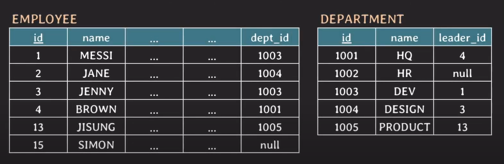 

### Explicit Inner Join  

FROM절에 JOIN 키워드와 함께 join tables들을 명시하는 방식 
FROM절에서 ON 뒤에 join condition이 명시됨 
` SELECT {columns}
FROM {tableA} INNER JOIN {tableB}
ON {join condition}
WHERE {optional conditions};` 

 

**사용 예** 
`SELECT D.name
FROM employee E INNER JOIN department D
ON E.id=1 and E.dept_id=D.id;` 
[그림2. ]
 

 

- **INNER JOIN의 특징** 

두 table에서 join condition을 행(tuple)들로 만족하는 결과 테이블을 만드는 join 
Join condtion에 사용 가능한 연산자(operator): =, >, <, != 등 여러 비교 연산자가 가능함 
Join condition에서 null 값을 가지는 tuple은 결과 테이블에 포함되지 못함 
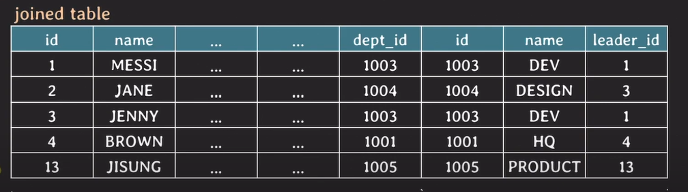

   

## OUTER JOIN 

두 table에서 join condition을 만족하지 않는 행(tuple)들도 result table에 포함하는 join 

- **종류** 
  1.  LEFT OUTER JOIN 
  2.  RIGHT OUTER JOIN 
  3.  FULL OUTER JOIN 

1. **LEFT OUTER JOIN**  

   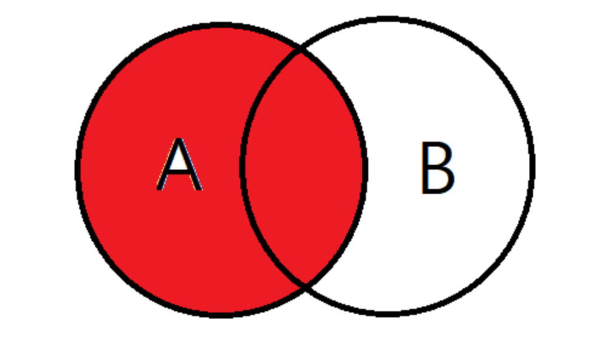
   왼쪽 기준 테이블의 값 + 테이블과 기준테이블의 중복된 값을 보여줌 
   즉 결과값은 A테이블의 모든 데이터와 A테이블과 B테이블의 중복되는 값 

- 사용 예 
  `SELECT D.name
FROM employee E LEFT OUTER JOIN department D
E.dept_id=D.id` 
  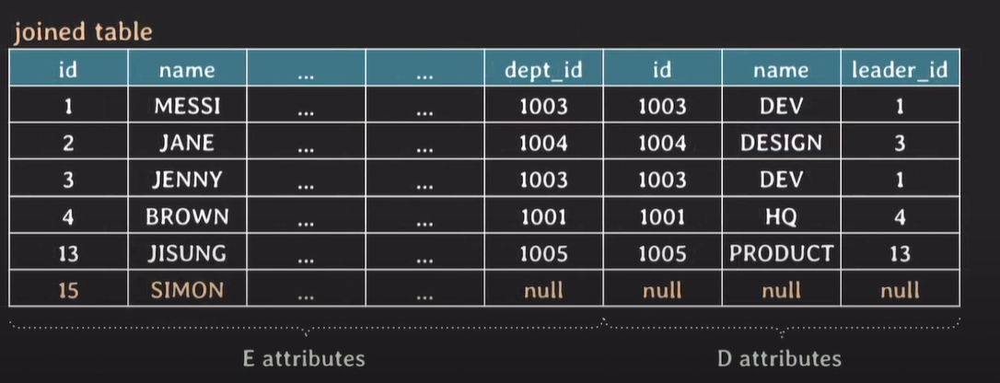
  [그림2. ]에서 employee E 테이블에 있던 SIMON 값을 그대로 표현함 
  대신 department D 테이블은 null값으로 표현함

 

2. **RIGHT OUTER JOIN**  
   오른쪽 기준 테이블의 값 + 테이블과 기준 테이블의 중복된 값 

   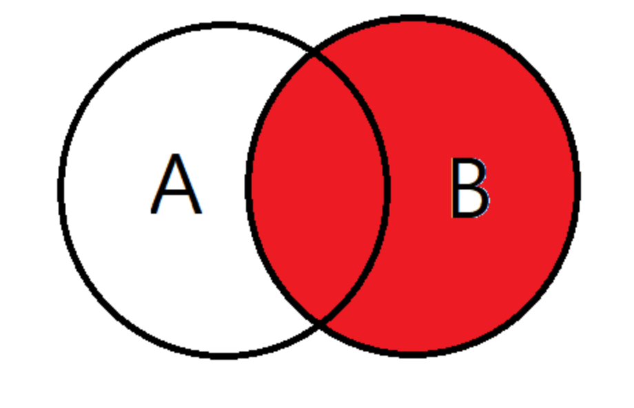

- **사용 예** 
  `SELECT * FROM employee E RIGHT OUTER JOIN department D 
ON E.dept_id=D.id;` 
  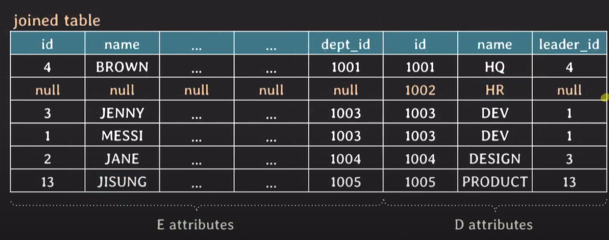
  department D 테이블의 HR의 값을 그대로 가져오고 
  employee E 테이블의 값을 모두 null로 표현함

  

3. **FULL OUTER JOIN**  
   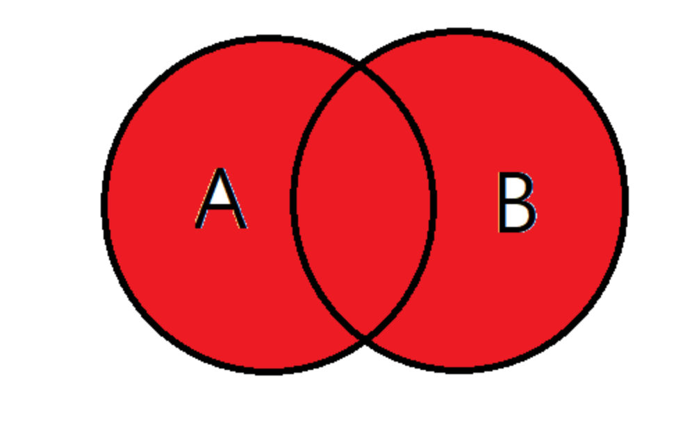
   합집합. A 테이블이 가지고 있는 데이터, B 테이블이 가지고 있는 데이터 모두 검색됨 
   Mysql에서는 지원하지 않고 PostgreSQL에서 지원함 

- **사용 예** 
  `SELECT* FROM employee E FULL OUTER JOIN department D ON E.dept_id=D.id;`
  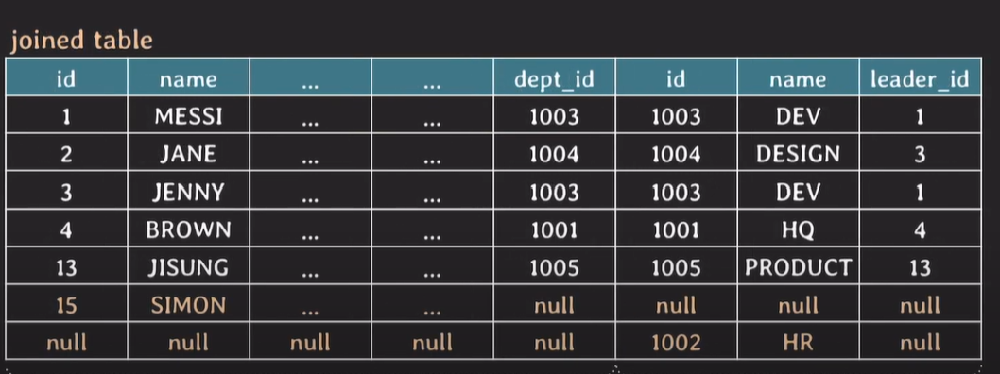
  employee E의 SIMON과 department D의 HR  
  모두 포함이 된 것을 알 수 있음

   

### CROSS JOIN 

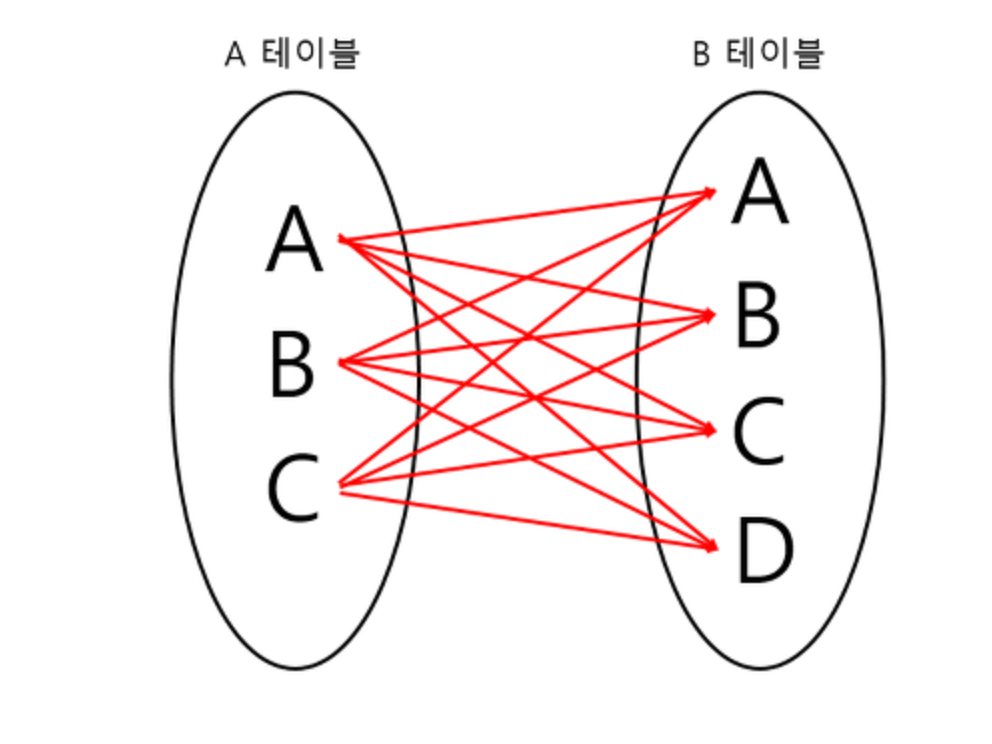
모든 경우의 수를 전부 result table로 표현해주는 join 
join contion이 없음 

- implicit cross join: FROM table1,table2 
- explicit cross join: FROM CROSS JOIN table2

   

**사용 예** 
행(tuple) 하나에 각각의 행들을 매칭시켜줌 
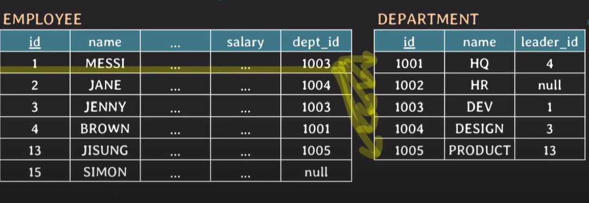
`SELECT * FROM employee CROSS JOIN department;`

- result table 
  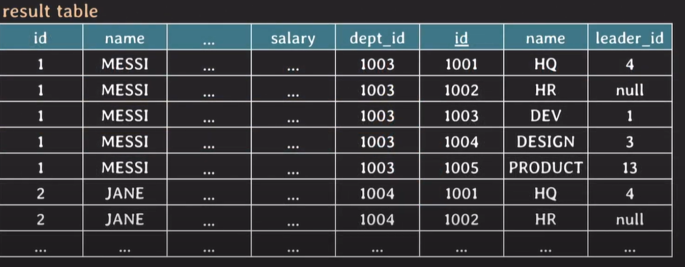
   

### 퀴즈

**INNER JOIN과 OUTER JOIN의 차이점은 무엇인가요?**

---

## 출처

- [쉬운코드] https://www.youtube.com/watch?v=E-khvKjjVv4&t=716s 
- [Mysql JOIN의 종류설명 및 사용법& 예제] https://coding-factory.tistory.com/87 
