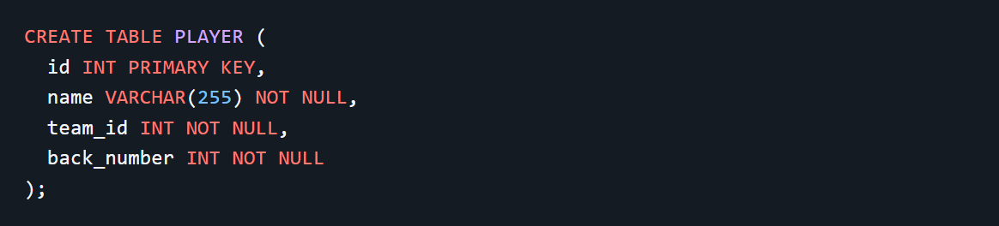
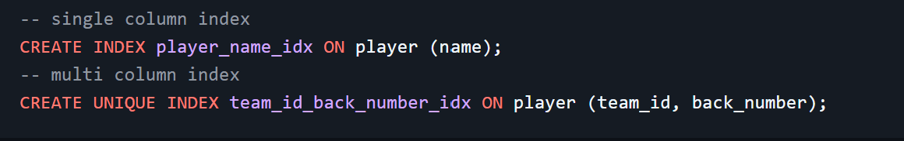
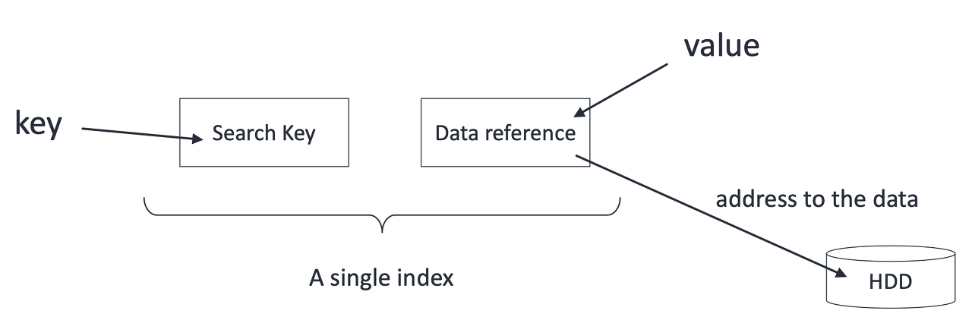
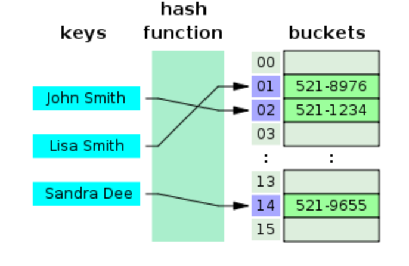
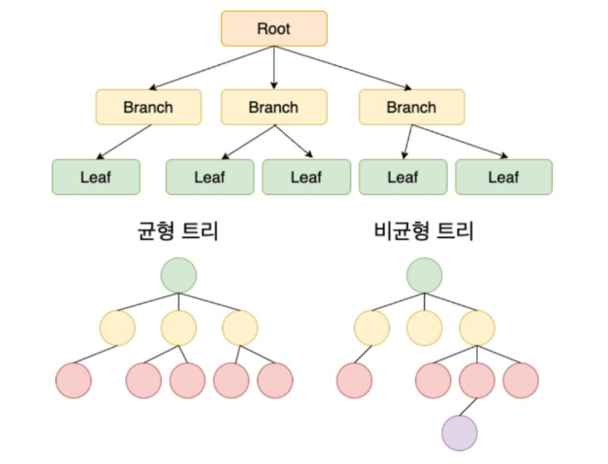
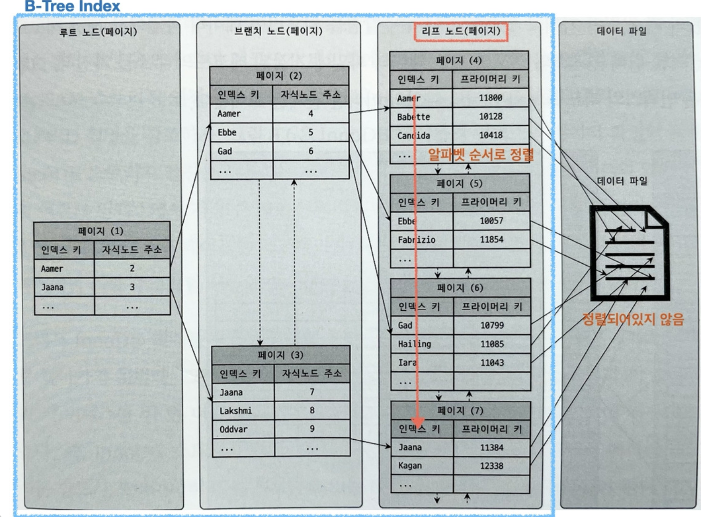
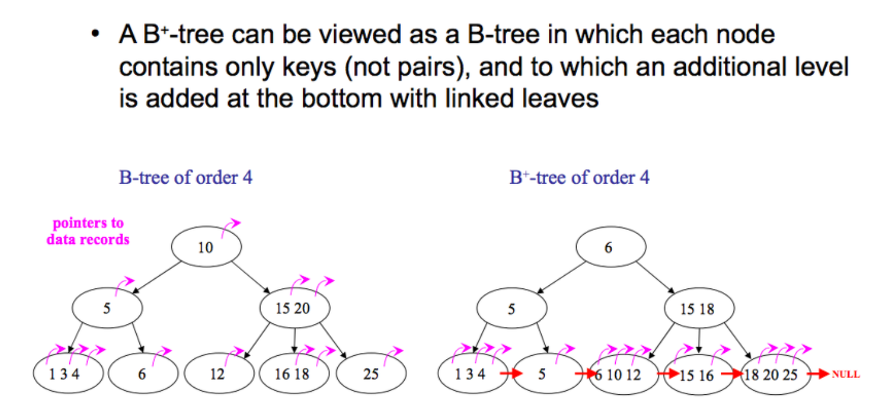

## db_INDEX

## 인덱스<br>

데이터베이스 테이블의 검색 속도를 향상시키기 위한 자료구조<br>
인덱스를 사용하면 최소한의 횟수로 꼭 필요한 데이터만 읽도록 쿼리를 개선할 수 있음

<br>

쉬운 예시로, 책 뒷편에 있는 '색인'이 인덱스를 역할을 한다고 보면 됨<br>
색인을 통해 원하는 키워드에 대한 페이지로 바로 이동할 수 있는 것처럼
데이터베이스에서 키워드는 특정 컬럼(column)의 데이터, 페이지는 데이터가 저장된 주소(address)가 해당됨

<br>

## 인덱스의 특징<br>

- 인덱스는 WHERE 절에서 효과가 있음<br>
  만약 index를 사용하지 않은 컬럼을 조회하려면 전체를 탐색하는 `Full Scan`을
  수행해야 함<br>
  `SELECT * FROM '학생' WHERE '학번'=1;`<BR>
  Full Scan은 전체를 비교하여 탐색하기 때문에 처리속도가 떨어짐<br>

<BR>

### DML(Data Manipulation Language)에 미치는 영향<br>

DBMS는 index를 항상 최신의 정렬 상태로 유지해야 원하는 값을 빠르게 탐색할 수 있음<br>

- INSERT: 새로운 데이터에 대한 인덱스를 추가함<BR>
- DELETE: 삭제하는 데이터의 인덱스를 사용하지 않는다는 작업을 진행함<BR>
- UPDATE: 기존의 인덱스를 사용하지 않음 처리하고, 갱신된 데이터에 대해 인덱스를 추가함

<br>

### 인덱스의 장점<br>

- 테이블을 조회하는 속도와 그에 따른 성능을 향상시킴<br>
- 전반적인 시스템 부하를 줄일 수 있음<br>

### 인덱스의 단점<br>

- 인덱스를 관리하기 위해 DB의 약 10%에 해당하는 저장공간이 필요함<br>
- 인덱스를 관리하기 위해 추가 작업이 필요함<br>
- 인덱스를 잘못 사용할 경우 오히려 성능이 저하될 수 있음<br>

  <BR>

### 인덱스를 선언하는 방법<BR>

- 특정 데이블에 인덱스를 추가<BR>
- 테이블에 존재하는 특정 컬럼을 기준으로 인덱스를 설정함<BR>
  <BR>
  복수 컬럼을 기준으로 인덱스를 설정하려면 다음과 같음<BR>
- 테이블에 존재하는 특정 컬럼들을 쉼표로 구분하여 인덱스를 설정함<BR>
  <BR>

<BR>

- 예시
  <BR>
  <BR>

  INDEX 생성 예시<BR>
  <BR>
  탐색 키(key) 순서에 따라 정렬된 데이터 파일과 데이터 레코드에 대한 포인터 목록을 가짐<br>
  엔트리들은 탐색 키 값의 오름차순으로 정렬<br>

  <BR>

## 인덱스의 자료구조<BR>

### Single-Level Ordered Indexes<br>



1. Primary index(기본 인덱스)<br>
   탐색 키(key) 순서에 따라 정렬된 데이터 파일과 데이터 레코드에 대한 포인터 목록을 가짐<br>
   엔트리들은 탐색 키 값의 오름차순으로 정렬<br>
   <BR>
2. Clustering index (클러스터링 인덱스)<br>
   탐색 키 값에 따라 정렬된 데이터 파일에 대해 정의<br>
   많은 레코드가 ordering field에 대한 공통된 값을 가질 경우 사용할 수 있음<br>
3. Secondary index (보조 인덱스)<br>
   다른 인덱스를 돕는 보조 인덱스이며 레코드가 어디 위치한지만 알려주는 역할<br>
   주키가 아니라 보조 키를 이용하여 추가적인 방법으로 원하는 값을 가져올 수 있음

<br>

### 해시 테이블(Hash Table)<br>

해시 테이블은 key,value로 데이터를 저장하는 자료구조 중 하나로 빠른 데이터 검색이 필요할 때 유용함<br>해시 테이블은 key값을 이용해 고유한 index를 생성하여 그 index에 저장된 값을 꺼내오는 구조임
<br>

<br>

### 단점<br>

- 해시는 등호(=)연산에만 특화되어 있음<br>
  부등호 연산(>,<)을 자주 사용하는 데이터베이스 검색에서는 적합하지 않음<br>
- multi column index의 경우, 전체 attribute에 대한 조회만 가능함<br>
  예를 들어 B-트리 기반의 인덱스에서는 INDEX(team_id,back_number)는 상황에 따라 team_id 컬럼만으로 조회할 수 있음<br>
  하지만 hash index는 무조건 두 칼럼 모두 사용해서 조회해야 함<br>

<br>

### B-Tree<br>

`시간복잡도`:O(logN)<br>
자식 노드가 2개 이상인 트리<br>

- 가장 상단에 위치한 루트 노드(root node)<br>
- 중간에 위치한 브랜치 노드(branch node)<br>
- 마지막에 위치한 리프 노드(leaf node)<br>
  <br>
  <br>
- 균형 트리(Balanced Tree)로서, 최상위 루트 노드에서 리프 노드까지의 깊이가 모두 동일<br>
- 각 노드는 여러 개의 키를 가질 수 있으며 항상 오름차순으로 정렬됨

<BR>

### 단점<br>

- 구현이 복잡함<br>
- 하나의 노드에 키와 데이터가 함께 저장되어 있어 메모리 접근 비용이 존재함(트리 검색 성능이 저하)<br>

### B-Tree의 확장형 B++ Tree

데이터베이스의 인덱스를 위해 자식 노드가 2개 이상인 B-Tree를 개선시킨 자료구조<br>
<br>
[B-Tree 사이트] https://www.cs.usfca.edu/~galles/visualization/BPlusTree.html

- 데이터베이스의 B-Tree는 노드를 구분하는 기준이 페이지(Page)단위임<br>
- 리프노트(데이터 노드)만 인덱스와 함께 데이터(Value)를 가지고 있고, 나머지 노드(인덱스 노드)들은 데이터를 위한 인덱스(Key)만을 가짐<br>
- 리프노드들은 링크드리스트로 연결되어 순차검색을 용이하게 함<br>
- 데이터 노드 크기는 인덱스 노드의 크기와 같지 않아도 됨<br>

### 단점<br>

- 중간(내부) 노드에는 실제 데이터가 없기에 항상 리프 노드까지 내려가야 함<br>
- 삽입과 삭제가 복잡함<br>
- 리프 노드끼리 연결하는 포인터(link)로 인해 메모리 사용량이 늘어남<br>
- 트리 높이 증가

<br>

## 인덱스 설정 기준<br>

1. **카디널리티(Cardinality)**<br>
   카디널리티가 높을수록 인덱스 설정에 좋은 컬럼임<br>
   = 한 컬럼이 갖고 있는 값의 중복 정도가 낮을수록 좋음<br>

   카디널리티란?<br>
   컬럼에 저장된 값들의 다양성 정도를 나타내는 지표<br>
   다양성을 본다는 말은 값이 얼마나 중복 없이 다양한가를 의미함<br>

   - 중복이 적고 고유한 값이 많음 -> 높은 카디널리티<br>
   - 중복이 많고 값이 비슷함 -> 낮은 카디널리티<br>

   ```ex. 10개 rows를 가지는 '학생'테이블에 '학번'과 '이름' 컬럼이 존재<br>

   '학번'은 학생마다 부여받으므로 10개의 고유한 값
     - 중복 정도가 낮고 높은 카디널리티
    '이름'은 동명이인이 있을 수 있으니 1~10개 사이의 값을 가짐
     - 중복 정도가 '학번'에 비해 높고 낮은 카디널리티
   ```

   <br>

2. **선택도(Cardinality)**<br>
   선택도가 낮을수록 인덱스 설정에 좋은 컬럼<br>
   5~10% 정도가 적당<br>

   선택도: 특정 값을 얼마나 잘 선택할 수 있는지에 대한 지표<br>

=컬럼의 특정 값의 row 수/테이블의 총 row 수*100<BR>
=컬럼의 값들의 평균 row수/테이블의 총 row수*100

```
ex.10개 rows를 가지는 '학생'테이블에 '학번'과 '이름' 컬럼이 존재
학번은 고유하고 이름은 2명씩 같고 성별은 남녀 5:5 비율

'학번'의 선택도=1/10*100=10%
 SELECT COUNT(1) FROM '학생' WHERE '학번' = 1; (모두 고유하므로 특정 값 1 )

'이름'의 선택도= 2/10*100=20%
SELECT COUNT(1) FROM '학생' WHERE '이름' = "김철수"; (2명씩 같으므로 특정 값 2)

'성별'의 선택도=5/10*100=50%
SELECT COUNT(1) FROM '학생' WHERE '성별' = F; (5명씩 같으므로 특정 값 5)

```

<br>

3. **활용도**<br>
   활용도가 높을수록 인덱스 설정에 좋은 컬럼<br>
   활용도 : 해당 컬럼이 실제 작업에서 얼마나 활용되는지에 대한 값<br>
   수동 쿼리 조회, 로직과 서비스에서 쿼리를 날릴 때 WHERE 절에 자주 활용되는지를 판단하면 됨

   <BR>

4. **중복도**<br>
   중복도가 없을수록 인덱스 설정에 좋은 컬럼<BR>
   중복도 : 중복 인덱스 여부
   <br>

## 퀴즈<br>

- B- 트리와 B+ 트리에 대해 설명해주세요<br>

## 출처

- [인덱스(index)란?] https://mangkyu.tistory.com/96
- [Database Index and Data Structure] https://junhyunny.github.io/information/data-structure/db-index-data-structure/
- [B트리와 B+ tree] https://wangin9.tistory.com/entry/B-tree-B-tree
- [인덱스를 효과적으로 설정하는 방법] https://yurimkoo.github.io/db/2020/03/14/db-index.html
