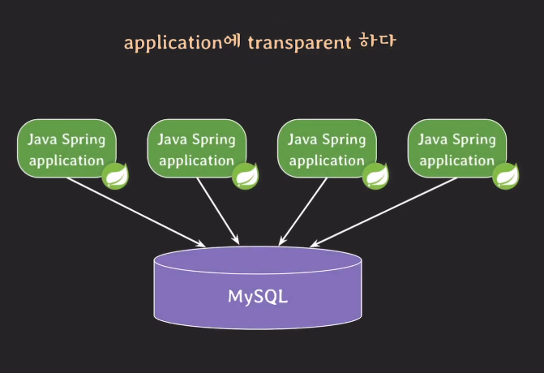
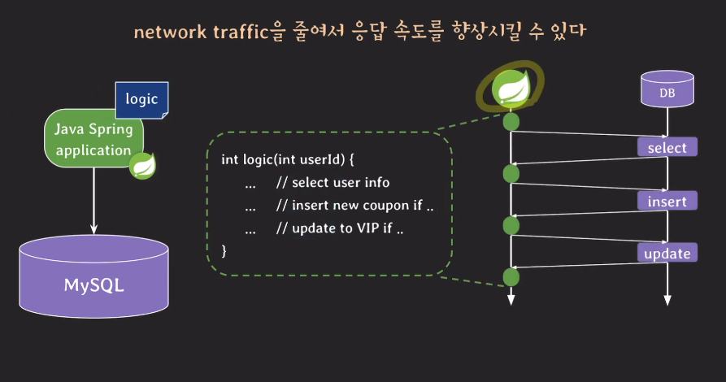
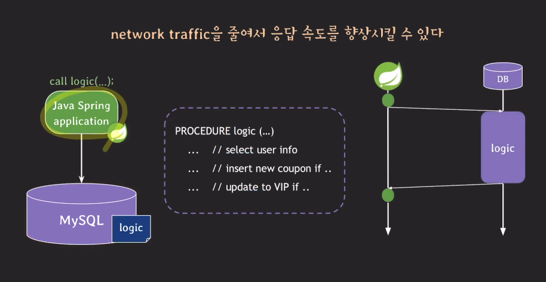
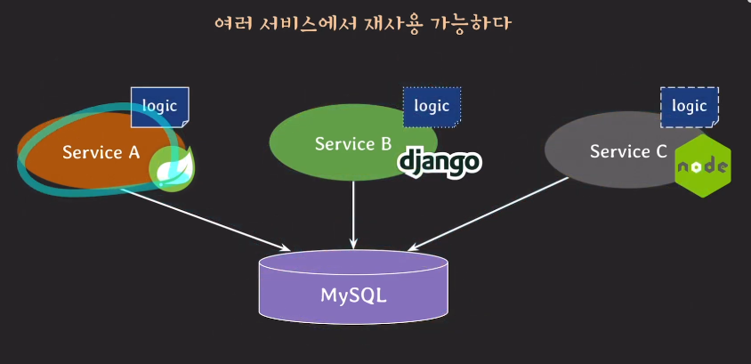
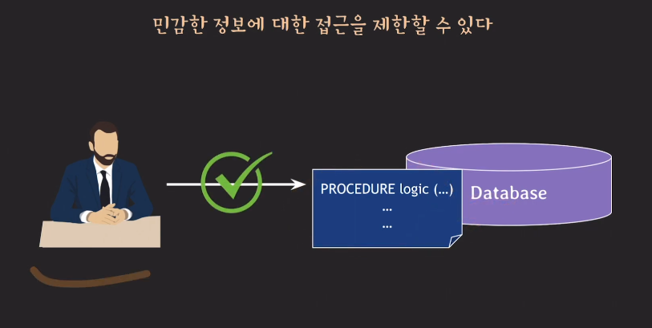
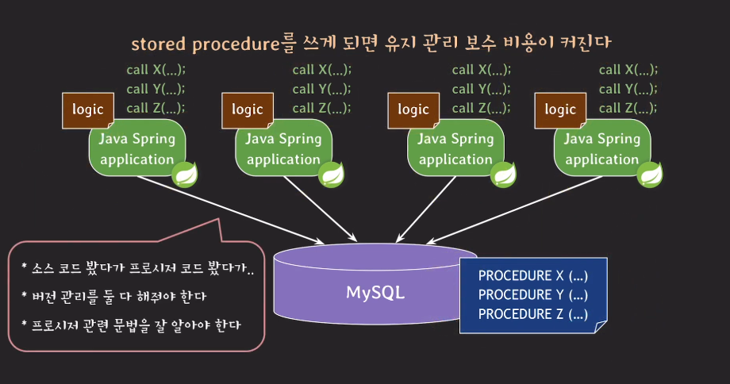
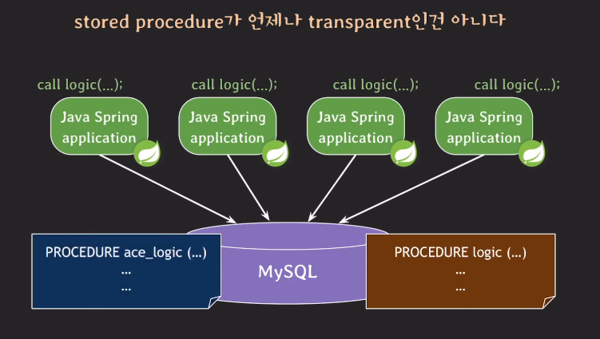
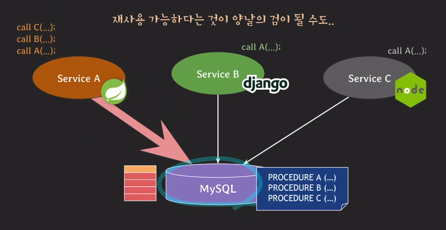

저장 프로시저(Stored Procedure)는 데이터베이스에 미리 저장해 둔 한 개 이상의 SQL 문들의 집합이다. 특정 이름을 부여하고, 그 이름으로 호출하여 실행할 수 있다.

## 저장 프로시저 예시 1

```python
delimiter $$
CREATE PROCEDURE product(IN a int, IN b int, OUT result int)
BEGIN
	SET result = a * b;
END
$$
delimiter;

call product(5, 7, @result);
select @result;
```

위 예시는 a, b라는 integer 타입 정수 2개를 곱한 결과 result를 출력하는 프로시저이다.

먼저 delimiter$ $ 는 SQL 클라이언트에게 지금부터는 명령어의 끝을 나타내는 기호를 ; 대신 $$로 간주해라 라고 지시하는 명령어이다.

일반적으로 SQL 클라리언트는 명령어의 끝을 나타내는 기본 구분자로 세미콜론(;)을 사용한다. 즉, 클라이언트는 세미콜론을 만나면 하나의 명령어가 끝났다고 판단하여 해당 명령어를 서버로 전송하여 실행한다.

하지만 저장 프로시저처럼 여러 SQL 문장을 포함하는 코드 블록을 정의할 때는, 그 코드 블록 내부에서도 세미콜론이 사용된다.

만약 delimiter $$ 명령어가 없으면 SQL 클라이언트는 SET result = a \* b; 줄의 세미콜론을 만나자마자 CREATE PROCEDURE 명령어가 끝났다고 판단하고 불완전한 코드를 서버로 보내게 된다.

정리하자면 delimiter $$ 는 SQL 클라이언트가 저장 프로시저 코드 내부의 세미콜론에 의해 명령어를 중간에 끊지 않고 전체 블록을 하나의 명령어로 인식하도록 돕는 명령어이다.

tip) 여기서 '$$$ 는 임의로 지정한 구분자이고, //나 다른 문자열로 바꿔도 상관없다. 그런데 $$나 //가 가장 흔하게 사용되는 구분자이다.

위 코드에서 파라미터를 보면 3개의 파라미터가 존재한다. input으로 받는 a, b 그리고 반환값인 result.

파라미터 타입은 INPUT값으로 디폴트가 설정되어있기 때문에, a, b 앞에는 타입을 생략해도 정상 동작하지만, result는 OUTPUT이기 때문에 생략해서는 안된다.

result라는 변수에 입력 파라미터 a와 b를 곱한 값을 set(저장)하게 된다.

call 명령어를 통해 해당 함수를 실행시키고 @result select 해서 조회를 한다. 여기서 @변수는 내가 정의한 변수를 사용하겠다는 의미이다.

## 저장 프로시저 예시 2

```python
delimiter $$
CREATE PROCEDURE swap(INOUT a int, INOUT b int)
BEGIN
	set @temp = a;
	set a = b;
	set b = @temp;
END
$$
delimiter ;
```

이번에는 입력받은 값을 swap하는 프로시저를 생각해보자.

파라미터를 보면 INOUT 이라는 타입을 사용하고 있다. 이 타입의 변수는 값을 전달할 수 있음과 동시에 출력할 수도 있는 값이다.

IN 의 경우 값을 전달할 수는 있지만, 해당 값을 바꿀 수는 없다.

OUT의 경우 값을 전달할 필요는 없고, 값을 저장하고 출력하는 용도로만 사용한다.

INOUT을 사용하면 전달할 수도 있고, 저장해서 출력할 수도 있게 된다.

```python
set @a = 5, @b = 7;
call swap(@a, @b)
select @a, @b;
```

위 코드를 실행하면 @a = 7, @b = 5를 출력하게 된다.

## 저장 프로시저 예시 3

```python
delimiter $$
CREATE PROCEDURE get_dept_avg_salary()
BEGIN
	select dept_id, avg(salary)
	from employee
	groub by dept_id;
END
$$
delimiter ;
```

각 부서별 평균 연봉을 가져오는 프로시저를 생각해보자.

위 코드에서는 따로 OUTPUT 파라미터나 리턴을 사용하지 않아도 결과를 반환할 수 있다.

위 예시 말고도 저장 프로시저를 사용하면 조건문을 사용하거나, 반복문을 수행하거나, 에러를 핸들링하거나 의도적으로 에러를 일으키는 등의 다양한 로직을 정의할 수 있다.

## Stored procedure VS Stored function

|                        | Stored Procedure   | Stored function   |
| ---------------------- | ------------------ | ----------------- |
| create 문법            | CREATE PROCEDURE … | CREATE FUNCTION … |
| return 으로 값 반환    | 불가능             | 가능              |
| 파라미터로 값 반환     | 가능               | 일부 가능         |
| 값을 꼭 반환해야 하나  | 필수 아님          | 필수              |
| SQL statement에서 호출 | 불가능             | 가능              |
| transaction 사용       | 가능               | oracle외에 불가능 |
| 주된 사용 목적         | business login     | computation       |

## 저장 프로시저의 장점



그림 1. stored procedure 장점 (1)

1. application에 transparent 하다.
   1. 애플리케이션 입장에서는 프로시저의 이름과 파라미터만 알면 되고, 그 프로시저 내부에서 어떤 SQL 문장들이 어떻게 실행되는지 알 필요가 없다.
   2. 데이터베이스에서 수행하는 어떤 작업의 로직을 변경해야 할 때, stored procedure를 사용하고 있다면 stored procedure 코드 자체만 수정하면 된다. 애플리케이션은 그 변경을 알아채거나 그에 맞게 코드를 수정할 필요가 없게 된다.
   3. 유지 보수성 향상

<br/>





그림 2. stored procedure 장점 (2)

1. 네트워크 트래픽 감소
   1. 웹 서버에서 데이터베이스로 쿼리의 모든 텍스트를 전송할 경우 네트워크에는 큰 부하가 발생한다.
   2. 저장 프로시저를 사용하면 프로시저를 호출만 하고, 로직 처리는 데이터베이스 서버에서 처리를 한 다음, 결과값만 보내게 된다.

<br/>



그림 3. stored procedure 장점 (3)

1. 여러 서비스에서 재사용 가능
   1. 스프링, 장고, node.js 서버에서 동일한 데이터를 활용해 로직을 실행시킨다고 해보자. 스프링에서는 자바를 써서 구현해야하고, 장고는 파이썬을, node.js는 자바스크립트를 써서 구현해야 한다.
   2. 데이터베이스 서버에서 프로시저 형태로 로직을 저장해서 사용하면 각 서비스는 해당 프로시저를 호출만 해주면 된다.

<br/>



그림 4. stored procedure 장점 (4)

1. 보안 강화
   1. 개발자나 사용자가 민감한 정보가 들어있는 테이블 자체에 대한 직접적인 접근을 막고, 미리 정의된 저장 프로시저를 통해서만 제한적으로 데이터에 접근하거나 조작하도록 강제할 수 있다.

<br/>

## 저장 프로시저의 단점



그림 5. stored procedure 단점 (1)

1. 유지 관리 보수 비용 증가
   1. 저장 프로시저 코드는 애플리케이션 코드 베이스와 별개로 DB 서버 내에 저장된다. 그렇기 때문에 애플리케이션 코드와 DB 코드를 함께 효율적으로 버전 관리하기가 까다롭다.
   2. 애플리케이션 개발자가 특정 SQL 언어도 사용해야 한다.

<br/>



그림 6. stored procedure 단점 (2)

1. 저장 프로시저가 언제나 transparent 인 것은 아님
   1. 저장 프로시저의 내부 로직은 그대로 두더라도, 입력 파라미터가 추가되거나, 출력 파라미터의 이름이나 타입이 바뀌거나, 프로시저 이름이 변경되는 등의 변화가 있으면 저장 프로시저를 호출하는 애플리케이션 코드도 변경되어야 한다.
   2. 소스 코드에 로직이 있는 경우보다 오히려 손이 더 많이 갈 수 있다.

<br/>



그림 7. stored procedure 단점 (3)

1. 재사용 가능성이 문제가 될 수 있다.
   1. 저장 프로시저에 과도하게 트래픽이 몰리거나 비효율적인 저장 프로시저가 많이 실행될 경우, 동일한 데이터베이스 서버를 사용하는 다른 모든 서비스에 부정적인 영향을 줄 수 있다.
   2. 많은 수의 복잡한 저장 프로시저가 동시에 실행되면 DB 서버의 CPU 사용률이 100%에 가까워질 수 있다. CPU 리소스가 부족해지면, 새로운 쿼리나 프로시저 실행 요청이 Queue에 쌓이게 되어 응답 시간이 증가하게 된다.

<br/>

## 퀴즈

1. 저장 프로시저의 장점을 설명하시오.

## 참고자료

쉬운코드 : https://www.youtube.com/watch?v=SOLm-GXFzG8&list=PLcXyemr8ZeoREWGhhZi5FZs6cvymjIBVe&index=12
