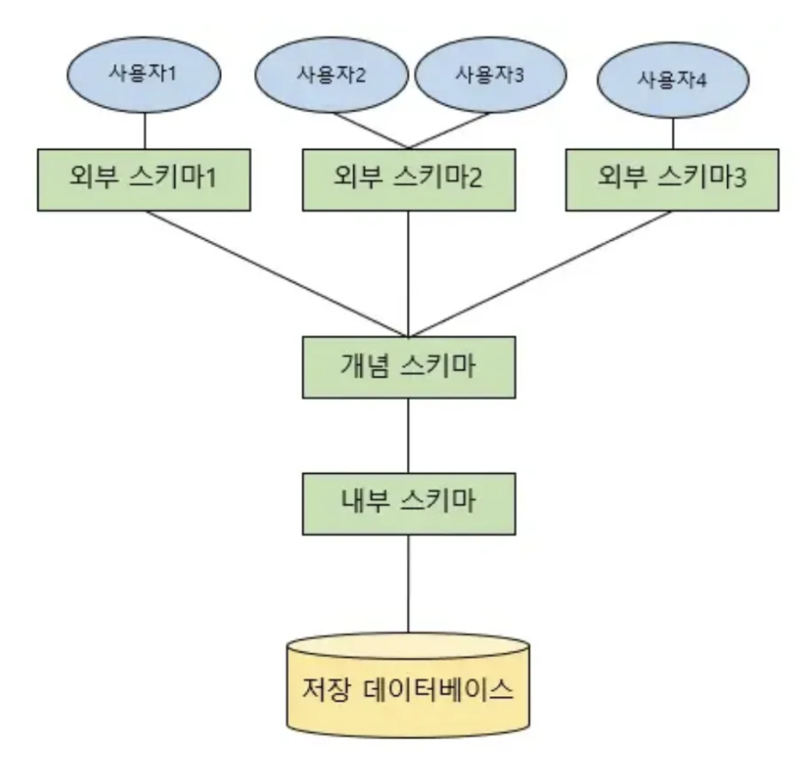

---

## **Schema란**

**Schema** = **데이터베이스 설계도**

- 데이터베이스 안에 **어떤 테이블**이 있고, 각 테이블은 어떤 컬럼(열)을 가지고 있으며, **테이블끼리 어떤 관계**를 가지는지 명세하는 것.

> 즉, "데이터를 어떻게 저장하고 관리할지"에 대한 설명서
> 

---

## **Schema 구성 요소**

| 요소 | 설명 | 예시 |
| --- | --- | --- |
| **Table(테이블)** | 데이터를 저장하는 기본 단위 | `Employee` 테이블 |
| **Column(열)** | 테이블 안의 속성/필드 | `name VARCHAR(50)` |
| **Data Type(데이터 타입)** | 컬럼에 저장할 수 있는 데이터의 종류 | `INT`, `VARCHAR`, `DATE` |
| **Constraint(제약조건)** | 데이터 무결성을 위한 규칙 설정 | `PRIMARY KEY`, `NOT NULL`, `UNIQUE` |
| **Index(인덱스)** | 빠른 검색을 위해 추가하는 자료구조 | `CREATE INDEX idx_name ON Employee(name);` |
| **View(뷰)** | 특정 SELECT 결과를 가상의 테이블로 저장 | `CREATE VIEW active_employees AS SELECT * FROM Employee WHERE status='Active';` |
| **Relationship(관계)** | 테이블끼리 연결 | `FOREIGN KEY (부서ID) REFERENCES 부서테이블(ID)` |

---

## Schema 구조

**사용자 관점에 따라 스키마가 나누어진다.**



### 외부 스키마 (External Schema)

**= 사용자 관점 스키마**

- 사용자, 프로그램이 **필요로 하는 데이터**만 보여줌
- 전체 DB 중 일부만 보여줄 수도 있음
- 같은 DB라도 사용자마다 보는 구조가 다를 수 있음

**예시**

- 직원 관리자는 직원 테이블의 모든 정보를 본다
- 일반 직원은 이름, 부서명만 본다

**(그림으로 표현하면 → DB 전체 중 '보이는 창')**

---

### 개념 스키마 (Conceptual Schema)

**= 조직/시스템 관점 스키마**

- 데이터베이스 전체 구조를 논리적으로 설계한 것
- 테이블, 관계, 제약조건 같은 걸 정의함
- 모든 사용자, 프로그램이 공유하는 "진짜" 데이터 모델
- 물리적 저장 방법은 신경 안 씀 (오직 논리적 구조)

**예시**

- Employee 테이블은 id, name, department_id 컬럼을 갖는다.
- department_id는 Department 테이블의 id를 참조한다.

**(그림으로 표현하면 → '전체 지도')**

---

### 내부 스키마 (Internal Schema)

**= 물리적 저장소 관점 스키마**

- 데이터가 **어떻게 실제 파일**에 저장되는지 설계한 것
- 저장 경로, 인덱스, 압축, 파일 포맷 등을 다룸
- 성능 최적화에 신경 씀

**예시**

- Employee 테이블 데이터는 employee_data_01.dat 파일에 저장한다.
- id 컬럼에 B-tree 인덱스를 추가한다.

**(그림으로 표현하면 → '건물 기초공사 설계도')**

---

## **Schema 예제**

**예제: 회사 데이터베이스 스키마**

```sql
CREATE TABLE Department (
    id INT PRIMARY KEY,
    name VARCHAR(100) NOT NULL
);

CREATE TABLE Employee (
    id INT PRIMARY KEY,
    name VARCHAR(50) NOT NULL,
    age INT,
    department_id INT,
    FOREIGN KEY (department_id) REFERENCES Department(id)
);

```

- `Department` (부서) 테이블
    - 부서 ID (`id`)가 Primary Key
- `Employee` (직원) 테이블
    - 직원 ID (`id`)가 Primary Key
    - 부서 ID (`department_id`)는 `Department(id)`를 참조하는 Foreign Key

→ 부서가 없는 직원은 존재할 수 없음 (데이터 무결성 보장)

---

## 스키마의 장점

### **액세스 및 보안**

- 스키마는 데이터를 별개의 엔티티로 구성해서,

  ➔ 데이터베이스 내에서 단일 스키마 공유가 쉬워진다.

- 관리자는 스키마 단위로 접근 권한 제어가 가능하다.
- 민감 데이터(예: PII - 개인식별정보)는

  ➔ 스키마를 통해 별도 암호화하여 보호할 수 있다.


> 권한 부여(Grant), 접근 제어, 암호화, 개인정보 보호(PII)
>

---

### **조직 및 커뮤니케이션 (Organization & Communicat**ion)

- 스키마 문서화

  ➔ 내부 이해관계자들끼리 명확한 소통이 가능하다.

- 테이블 간의 연관 관계나 집계 방법을 쉽게 이해
- 스키마는 공통 정보 소스(Single Source of Truth) 역할

> ERD(Entity-Relationship Diagram), 데이터 모델링, 커뮤니케이션
>

---

### **무결성 유지 (Data Integrity)**

- 스키마는 데이터 유효성 보장에 도움을 준다.
- ex) 정규화(Normalization) 를 통해 데이터 중복 방지
- 데이터베이스 설계시 설정한 제약조건(Constraints) 을 관리해서

  ➔ ACID 속성(원자성, 일관성, 격리성, 내구성)을 충족할 수 있다.


> 정규화, 무결성 제약조건(Primary Key, Foreign Key), ACID
>

---

# 퀴즈

**스키마란? 스키마를 사용해서 얻는 장점**

---

# 출처

https://www.ibm.com/kr-ko/topics/database-schema

https://velog.io/@msung99/%EB%8D%B0%EC%9D%B4%ED%84%B0%EB%B2%A0%EC%9D%B4%EC%8A%A4%EC%99%80-%EC%8A%A4%ED%82%A4%EB%A7%88Schema